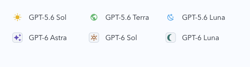
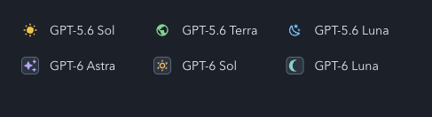
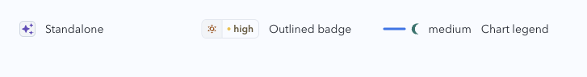
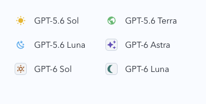

# GPT-5.6 系列定价、缓存写入计费与模型入口支持

Spec ID: 97dds

## Context and Scope

The repo-managed pricing catalog, `/v1/models` preset list, and Settings pricing contract currently stop at the GPT-5.5 generation and only model one cached-input price. GPT-5.6 introduces three first-class model ids (`gpt-5.6-sol`, `gpt-5.6-terra`, `gpt-5.6-luna`) plus an explicit cache write price that is distinct from both uncached input and cache read pricing.

The project needs a compatible upgrade that preserves existing user-defined pricing rows and existing API consumers while making GPT-5.6 cost estimation, Settings editing, and operator-facing model selection accurate.

## GPT-6 同值预设与在线成本修复

The repo-managed catalog also provides direct preset rows for `gpt-6-sol`,
`gpt-6-terra`, and `gpt-6-luna`. These rows intentionally reuse the matching
GPT-5.6 rates as temporary estimation defaults and do not claim an official
GPT-6 price source:

- `gpt-6-sol`: input `5.0`, cache read `0.5`, cache write `6.25`, output `30.0`
- `gpt-6-terra`: input `2.0`, cache read `0.20`, cache write `2.5`, output `12.0`
- `gpt-6-luna`: input `0.20`, cache read `0.02`, cache write `0.25`, output `1.20`

The repo-managed catalog version is `openai-standard-2026-09-20`. Existing
repo-managed catalogs receive missing GPT-6 rows through idempotent insertion;
custom catalogs and user-edited rows are preserved. Exact GPT-6 ids and
calendar-valid `-YYYY-MM-DD` aliases use the existing dated-model resolver.
Invalid dates, unknown variants, and preview variants remain unpriced.

Online cost repair is a bounded, resumable SQLite maintenance operation. It
selects only terminal proxy rows with billable usage and a null persisted cost,
writes only successfully estimated cost fields, and refreshes affected hourly
rollups in the same batch transaction. Existing non-null cost, price-version,
bucket, and payload values are immutable. Unpriced rows remain untouched, and
archive files and archive-derived aggregates are outside this operation.
The existing System Tasks audit records the catalog and attempt versions,
scan/update/skip counters, cursor, and drained-or-continuing state.

## Goals

- Add first-class support for `gpt-5.6-sol`, `gpt-5.6-terra`, and `gpt-5.6-luna` across the default pricing catalog, proxy preset models, Settings model lists, and `/v1/models` hijack payloads.
- Upgrade the pricing contract to support explicit cache read and cache write unit prices with a compatibility bridge for legacy `cacheInputPer1m`.
- Make `estimate_proxy_cost` bill GPT-5.6 cached tokens with read pricing and uncached prompt tokens with write pricing while keeping legacy-model semantics unchanged.
- Persist the exact input, cache-write, cache-read, output, and reasoning cost buckets for new proxy records, then expose a derived cache-write Token count together with model-level usage and cost breakdowns.
- Replace the remaining `unsupported_model:gpt-5.5` UI special-case with generic `unsupported_model:<model>` handling so newer unsupported models behave correctly without new hardcoding.

## Non-goals

- Do not add online pricing sync or import the full `sub2api` pricing payload.
- Do not invent a generic `gpt-5.6` placeholder model id.
- Do not change legacy model pricing rules except where schema plumbing is required for backward compatibility.

## Requirements

- The repo-managed catalog version must advance to `openai-standard-2026-09-20`.
- The repo-managed catalog must contain:
  - `gpt-5.6-sol`: input `5.0`, output `30.0`, cache read `0.5`, cache write `6.25`
  - `gpt-5.6-terra`: input `2.0`, output `12.0`, cache read `0.20`, cache write `2.5`
  - `gpt-5.6-luna`: input `0.20`, output `1.20`, cache read `0.02`, cache write `0.25`
- `PUT /api/settings/pricing` must accept both legacy `cacheInputPer1m` and the new `cacheReadPer1m` / `cacheWritePer1m` fields.
- `GET /api/settings/pricing` must return the new fields and continue mirroring `cacheInputPer1m` from `cacheReadPer1m` during the compatibility window.
- SQLite persistence must preserve existing pricing rows and backfill read pricing from legacy data without overwriting user-defined values. During this catalog revision, only Terra/Luna rows from a repo-managed catalog with `source=official` and all four prior unit prices still intact may be updated in place.
- Model resolution must match exact ids first and also map calendar-valid `gpt-5.6-sol|terra|luna-YYYY-MM-DD` aliases to their base model pricing rows. Invalid dates and preview variants remain unpriced.
- Settings pricing UI must split cached pricing into separate cache read and cache write columns and clearly label the contract as estimation metadata rather than runtime token truth.
- Structured read-only model fields must render `gpt-5.6-sol`, `gpt-5.6-terra`, and `gpt-5.6-luna` as solar, earth, and lunar icons. Exact and date-suffixed IDs share the base icon; tooltips and accessible names retain the complete ID. Editors, filters, selectors, and raw payload viewers keep the original text.
- REQ-GPT6-MODEL-IDENTITY: Structured read-only model fields recognize only `gpt-6-astra`, `gpt-6-sol`, and `gpt-6-luna` plus calendar-valid date suffixes. They use the product-selected general-purpose MDI glyphs Astra `creation`, Sol `weather-sunny`, and Luna `moon-waning-crescent`; these are not OpenAI official model icons. Product identity ink is Astra/Sol/Luna `#6749BA`/`#A95018`/`#04766F` in light theme and `#BBA6F6`/`#FFB16A`/`#64D1C7` in dark theme. Standalone icons use one fixed 20px neutral tile (`#F1F4F7`/`#CDD7E1` in light theme, `#28343F`/`#566879` in dark theme); an existing outlined model badge integrates the glyph into its model segment without adding a border or changing height. Compact chart legends use the series swatch, 16px glyph and identity color, and reasoning effort without a tile. Unknown IDs remain textual.
- New invocation rows must persist exact cost buckets. Historical rows with a known total cost must contribute that full amount to `unknown` instead of being repriced or invalidating exact realtime buckets; rows without a total cost do not fabricate an unknown amount.
- `cacheWriteTokens` must be derived as `max(inputTokens - cacheInputTokens, 0)`; `cacheInputTokens` remains the upstream cache-read count.
- Records-side cost truth remains the persisted `cost`. `/api/invocations` may additionally return a `costAudit` comparison object that recomputes cost from the current pricing catalog, but that local recomputation is advisory only and never rewrites the recorded amount.
- Cost mismatch warnings use an absolute tolerance of `0.000001 USD`. Differences less than or equal to that threshold are treated as matching even if displayed rounding differs.
- When a record only has a persisted total cost and lacks persisted bucket costs, the audit may compare recorded-vs-local totals, but the recorded bucket cells must stay unavailable instead of inventing split amounts.
- Workflow attempt usage audits may expose both recorded and local bucket totals for the final successful attempt, but missing reasoning Tokens stay `null`; only an actually recorded zero may render as `0`.
- Dashboard summary and upstream-account activity APIs must return total and model-plus-reasoning-effort usage breakdowns. Cost breakdowns include input, cache write, cache read, output, reasoning, and unknown cost, and every returned cost row must reconcile to its total.
- Dashboard and account-card cost/Token labels must open the same keyboard-accessible `Usage details` table. Its fixed columns are model, cache write, cache read, cache hit rate, output, and total; cache write/read/output/total show Tokens then amount, while cache hit rate stays a single first-line value with an empty second-line placeholder. Records, live cards, and dashboard call previews must display `CW` and `C` together.

## Interface Contract

### Pricing entry shape

The backend and frontend pricing entry contract supports these unit-price fields in USD per one million tokens:

- `inputPer1m`
- `outputPer1m`
- `cacheReadPer1m`
- `cacheWritePer1m`
- `reasoningPer1m`

Legacy `cacheInputPer1m` remains an accepted write alias and a read mirror for `cacheReadPer1m`.

### Storage

`pricing_settings_models` includes both the legacy compatibility column and the new explicit cache columns:

- `cache_input_per_1m REAL NULL`
- `cache_read_per_1m REAL NULL`
- `cache_write_per_1m REAL NULL`

Rows that only have legacy cached-input pricing treat `cache_input_per_1m` as the cache read price.

### Cost estimation

- For entries with explicit `cacheReadPer1m` and `cacheWritePer1m`:
  - `cached_tokens` bill at `cacheReadPer1m`
  - `input_tokens - cached_tokens` bill at `cacheWritePer1m`
- For entries without explicit cache write pricing:
  - keep the existing behavior where uncached input bills at `inputPer1m`
  - cached input bills at the legacy cache read price when present

## Acceptance Criteria

- Given a legacy pricing payload with only `cacheInputPer1m`, when the backend saves and reloads it, then `cacheReadPer1m` matches that value and `cacheInputPer1m` is still mirrored on response.
- Given an existing SQLite database with legacy pricing rows, when the schema upgrade runs, then read pricing is preserved and no existing user-defined row is overwritten.
- Given a new SQLite database, when the default catalog is loaded, then its version is `openai-standard-2026-09-20` and the Terra/Luna unit prices match the latest Standard short-context table.
- Given a repo-managed catalog at `openai-standard-2026-07-10` with unchanged official Terra or Luna rows, when startup loads the catalog, then all four unit prices are refreshed and the catalog version advances; any changed field, non-official row, or custom catalog version remains unchanged.
- Given a new Terra or Luna invocation, when cost is estimated, then its cache read, cache write, and output buckets use the revised unit prices; existing invocation costs remain persisted truth and are never recomputed or rewritten.
- Given `model=gpt-5.6-sol`, `input_tokens=1000`, `cached_tokens=400`, and `output_tokens=200`, when cost is estimated, then 600 prompt tokens bill at `6.25 / 1M`, 400 cached tokens bill at `0.5 / 1M`, and 200 output tokens bill at `30 / 1M`.
- Given `gpt-5.6-sol-2026-07-08`, `gpt-5.6-terra-2026-07-08`, or `gpt-5.6-luna-2026-07-08`, when cost is estimated, then the base GPT-5.6 pricing row is used rather than `unknown`.
- Given an invalid date suffix such as `gpt-6-terra-2026-99-99` or a preview variant such as `gpt-6-terra-preview`, when cost is estimated, then the model remains unpriced.
- Given a legacy model entry that only has cached-input pricing, when cost is estimated, then existing legacy tests continue to use the pre-upgrade uncached-input semantics.
- Given default proxy model settings, when repo-managed defaults are normalized, then the GPT-5.6 model ids appear in preset lists and are appended only for legacy default enabled-model lists.
- Given account tags containing `unsupported_model:gpt-5.6-sol`, when the roster and routing UI render, then the tag behaves like other system unsupported-model tags without GPT-5.5-specific special casing.
- Given a new GPT-5.6 invocation, when its usage is persisted, then its cost buckets sum to `cost`, cache write Token count is non-negative, and the total/model usage breakdowns remain reconcilable.
- Given a historical invocation without persisted cost buckets but with a known total cost, when it appears with exact realtime records, then Token derivation and exact cost buckets remain visible while the historical total is shown in `unknown`.
- Given a record without a total cost, when usage is aggregated, then it contributes no fabricated unknown cost.
- Given an exact-only range, when the unified usage detail is rendered, then cache-write amount equals input plus cache-write cost, cache-read amount equals cache-read cost, output amount equals output plus reasoning cost, and the total amount includes all known cost buckets.
- Given calls for the same model with different recorded reasoning efforts, when usage is aggregated, then each model-plus-effort pair is returned separately while the total remains reconciled across all pairs.
- Given a missing or blank recorded reasoning effort, when its model row is rendered, then it is labelled as unspecified without inferring a model default.
- Given a historical invocation without cost buckets but with a known total cost, when unified usage detail is rendered, then cache write, cache read, and output amounts are unavailable while the total amount retains the known historical cost.
- Given a range without any cost, when unified usage detail is rendered, then every amount is unavailable without fabricating a cost.
- Given a dashboard or upstream-account cost/Token label, when it is hovered, focused, or clicked, then it opens the same titled table with total first and sorted model-plus-effort rows, readable at desktop and 390px without horizontal scrolling.
- Given a record with both persisted `cost` and a locally recomputed total, when their absolute difference is greater than `0.000001 USD`, then the audit flags `mismatch=true`; if the recorded and local `priceVersion` differ, the reason is `price_version_changed`, otherwise the reason is `total_mismatch`.
- Given a workflow attempt usage audit where `reasoningTokens` were never recorded, when the response audit object is rendered, then reasoning stays `null` / `—`; given a real recorded zero, when the same response audit object is rendered, then reasoning remains `0`.
- Given a structured read-only field for any GPT-5.6 base or date-suffixed model, when it renders, then it shows the mapped icon with the complete model ID in its tooltip and accessible name; given a non-GPT-5.6 or unknown model, then the existing text fallback remains visible.
- Given a structured read-only `gpt-6-astra`, `gpt-6-sol`, or `gpt-6-luna` ID with an optional calendar-valid `-YYYY-MM-DD` suffix, when it renders, then it shows the selected general-purpose MDI glyph and retains the complete ID in its tooltip and accessible name; the glyphs are product fallbacks, not official model artwork. Invalid dates, preview variants, `gpt-6-terra`, and bare `gpt-6` remain textual.
- Given a GPT-6 identity in standalone, outlined-badge, or model chart-legend presentation, when it renders, then standalone uses one 20px neutral tile, the outlined badge uses a single outer border with the glyph integrated into its model segment and unchanged height, and the chart legend retains the series swatch and uses the 16px identity-colored glyph plus reasoning effort without a tile; the full model ID remains available to assistive technology and tooltip. GPT-5.6 legend styling remains unchanged.
- Given a structured read-only GPT-5.6 invocation card with model identity, reasoning effort, and FAST metadata, when it renders, then those three values appear in one reusable grouped cluster with a fixed 20px model segment, one reasoning-effort marker, and 4px spacing between model, marker, effort, and FAST; `max` and `ultra` use the error marker tone while other levels retain their existing tones, internal vertical separators are absent, and non-GPT-5.6, routing-mismatch, editor/filter/selector, and raw payload views retain their existing rendering.
- Given a structured GPT-5.6 invocation with missing, blank, or formatted-em-dash reasoning effort, when its grouped Dashboard context renders, then the reasoning marker and effort text are omitted without displaying a placeholder, while the model identity and FAST accessible semantics remain available.

## Verification

- VER-GPT6-MODEL-IDENTITY: covers: REQ-GPT6-MODEL-IDENTITY; frontend identity tests, performance/long-term integration tests, Storybook states, and light/dark visual evidence verify model matching, accessibility, and each presentation mode.

## Related ADRs

None

## Visual Evidence

### GPT-6 Model Identity

- source_type: storybook_canvas
  target_program: mock-only
  capture_scope: element
  requested_viewport: desktop1660
  viewport_strategy: storybook-viewport
  margin_policy: require_margin
  evidence_surface: component
  surface_selector: `[data-visual-evidence-surface="model-identity-story-surface"]`
  target_selector: `[data-visual-evidence-target="model-identity-story-target"]`
  sensitive_exclusion: N/A
  submission_gate: approved
  story_id_or_title: Components/ModelIdentity Generation Comparison Light
  state: Light theme; GPT-5.6 and GPT-6 standalone identities
  evidence_note: Shows the three selected generic GPT-6 glyphs beside GPT-5.6 identities, with 20px single-outline tiles and light-theme product colors.
  image:
  

- source_type: storybook_canvas
  target_program: mock-only
  capture_scope: element
  requested_viewport: desktop1660
  viewport_strategy: storybook-viewport
  margin_policy: require_margin
  evidence_surface: component
  surface_selector: `[data-visual-evidence-surface="model-identity-story-surface"]`
  target_selector: `[data-visual-evidence-target="model-identity-story-target"]`
  sensitive_exclusion: N/A
  submission_gate: approved
  story_id_or_title: Components/ModelIdentity Generation Comparison Dark
  state: Dark theme; GPT-5.6 and GPT-6 standalone identities
  evidence_note: Shows the same model comparison in dark theme, with distinct Astra/Sol/Luna product inks and neutral GPT-6 tiles.
  image:
  

- source_type: storybook_canvas
  target_program: mock-only
  capture_scope: element
  requested_viewport: desktop1660
  viewport_strategy: storybook-viewport
  margin_policy: require_margin
  evidence_surface: component
  surface_selector: `[data-visual-evidence-surface="model-identity-story-surface"]`
  target_selector: `[data-visual-evidence-target="model-identity-story-target"]`
  sensitive_exclusion: N/A
  submission_gate: approved
  story_id_or_title: Components/ModelIdentity Presentation Modes
  state: Light theme; standalone, outlined badge, and 16px chart legend
  evidence_note: Shows the standalone tile, one existing badge outline around its embedded identity, and the compact legend glyph without a tile or added row height.
  image:
  

- source_type: storybook_canvas
  target_program: mock-only
  capture_scope: element
  requested_viewport: desktop1660
  viewport_strategy: storybook-viewport
  margin_policy: require_margin
  evidence_surface: component
  surface_selector: `[data-visual-evidence-surface="model-identity-story-surface"]`
  target_selector: `[data-visual-evidence-target="model-identity-story-target"]`
  sensitive_exclusion: N/A
  submission_gate: approved
  story_id_or_title: Components/ModelIdentity Presentation Modes Dark
  state: Dark theme; standalone, outlined badge, and 16px chart legend
  evidence_note: Shows the same three container modes in dark theme, including the embedded badge's single outer outline and tile-free compact legend.
  image:
  

- source_type: storybook_canvas
  target_program: mock-only
  capture_scope: element
  requested_viewport: 393x852
  viewport_strategy: storybook-viewport
  margin_policy: require_margin
  evidence_surface: component
  surface_selector: `[data-visual-evidence-surface="model-identity-story-surface"]`
  target_selector: `[data-visual-evidence-target="model-identity-story-target"]`
  sensitive_exclusion: N/A
  submission_gate: approved
  story_id_or_title: Components/ModelIdentity Generation Comparison Mobile 393
  state: Light theme at a 393x852 CSS-pixel viewport
  evidence_note: Shows all GPT-5.6 and GPT-6 identity samples in a two-column mobile layout without clipping or horizontal overflow.
  image:
  

- source_type: storybook_canvas
- target_program: mock-only
- capture_scope: element
- requested_viewport: desktop1660
- viewport_strategy: storybook-viewport
- sensitive_exclusion: N/A
- submission_gate: approved
- story_id_or_title: Settings/SettingsPage Default
- state: default pricing contract editor
- evidence_note: Verifies the Settings pricing table exposes separate cache read and cache write columns, includes the GPT-5.6 trio, and labels the table as estimation contract metadata rather than runtime token truth.

- source_type: storybook_canvas
- target_program: mock-only
- capture_scope: story canvas
- requested_viewport: desktop
- viewport_strategy: Storybook canvas
- sensitive_exclusion: N/A
- submission_gate: approved
- story_id_or_title: Dashboard/UsageBreakdownTooltip Exact Costs
- state: exact bucket costs with total and model-plus-effort rows
- evidence_note: Verifies the shared six-column table maps cache write to input plus cache-write cost, output to output plus reasoning cost, shows Tokens and amount in every applicable cell, places total after output, uses normal-weight body values with the same primary foreground for cache hit rate and Token values, and anchors cache hit rate in the first line with a blank second-line slot.

- source_type: storybook_canvas
- target_program: mock-only
- capture_scope: story canvas
- requested_viewport: 390x844
- viewport_strategy: Storybook viewport
- sensitive_exclusion: N/A
- submission_gate: approved
- story_id_or_title: Dashboard/UsageBreakdownTooltip Mobile 390
- state: exact bucket costs at narrow width
- evidence_note: Verifies the same semantic table remains within the 390px canvas without a horizontal scrollbar; model and effort wrap while Token and amount pairs remain aligned, and cache hit rate retains its first-line alignment through its blank second-line slot.

- source_type: storybook_canvas
- target_program: mock-only
- capture_scope: element
- requested_viewport: desktop
- viewport_strategy: storybook-viewport
- margin_policy: require_margin
- evidence_surface: component
- sensitive_exclusion: N/A
- submission_gate: pending-owner-approval
- story_id_or_title: Components/ModelIdentity Sol Terra Luna
- state: GPT-5.6 Sol, Terra, and Luna base model IDs
- evidence_note: Verifies the shared read-only identity renderer maps the three GPT-5.6 models to solar, earth, and lunar icons while preserving the full model IDs in accessible names and tooltips.

- source_type: storybook_canvas
- target_program: mock-only
- capture_scope: element
- requested_viewport: desktop
- viewport_strategy: storybook-viewport
- margin_policy: require_margin
- evidence_surface: component
- sensitive_exclusion: N/A
- submission_gate: pending-owner-approval
- story_id_or_title: Components/ModelIdentity Dated Variant And Fallback
- state: date-suffixed GPT-5.6 alias and unsupported model fallback
- evidence_note: Verifies a date-suffixed GPT-5.6 model inherits the Sol icon and an unsupported model remains visible as its original text.

- source_type: storybook_canvas
- target_program: mock-only
- capture_scope: element
- requested_viewport: desktop1660
- viewport_strategy: storybook-viewport
- margin_policy: require_margin
- evidence_surface: component
- sensitive_exclusion: N/A
- submission_gate: approved
- story_id_or_title: Dashboard/WorkingConversationsSection GPT56ModelContextCluster
- state: GPT-5.6 Sol `max` reasoning with FAST in the `vibe-dark` theme
- evidence_note: Owner-approved component capture. The component keeps its own low-contrast boundary, one error-tone reasoning marker, 4px sibling spacing, and centered model/FAST icons without an additional presentation frame or excess whitespace.

- source_type: storybook_canvas
- target_program: mock-only
- capture_scope: element
- requested_viewport: desktop1660
- viewport_strategy: storybook-viewport
- margin_policy: require_margin
- evidence_surface: component
- sensitive_exclusion: N/A
- submission_gate: approved
- story_id_or_title: Dashboard/WorkingConversationsSection GPT56ModelContextCluster
- state: GPT-5.6 Sol `max` reasoning with FAST in the `vibe-light` theme
- evidence_note: Owner-approved component capture of the same state as the dark-theme evidence. The light theme preserves the same geometry and semantics without a mobile-only rendering difference.

## References

- OpenAI pricing announcement and API pricing pages published on 2026-07-08.
- [OpenAI API model selection guide](https://developers.openai.com/api/docs/guides/model-selection), which supplies model-specific artwork for Astra, Sol, and Luna without defining compact chart-legend glyphs.
- [OpenAI API model catalog](https://developers.openai.com/api/docs/models).
- `docs/archive/specs/7272y-gpt-5-4-pricing/SPEC.md`
- `docs/archive/specs/47ran-pool-models-override-gpt55-pricing/SPEC.md`
- [OpenAI API Pricing](https://platform.openai.com/docs/pricing)
