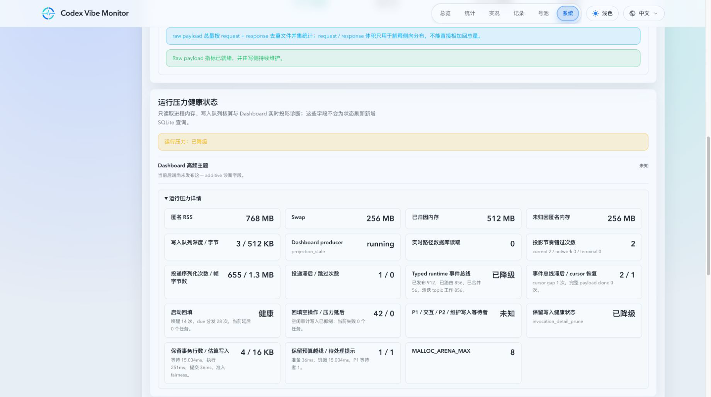

# 数据分层保留、离线归档与长周期汇总（#9aucy）

## 背景 / 问题陈述

- 线上数据库的主要压力来自调用明细里的原始 payload / raw response / raw file 引用，以及持续增长的代理尝试与统计快照表。
- 这些数据主要用于短期排障，但当前主库长期保留了过多不再常用的原始细节，导致 SQLite 主文件膨胀、维护成本上升、首次冷数据清理风险变高。
- 长期趋势统计仍然有价值，因此方案需要在“主库减压”与“全局 totals 不缩水”之间做分层：短期保留可排障明细，长期在线只保留聚合，完整旧明细转入离线归档。

## 目标 / 非目标

### Goals

- 为 `codex_invocations`、`forward_proxy_attempts` 与 `codex_quota_snapshots` 建立按上海自然日 / 自然月切分的冷热分层策略。
- 让 `/api/invocations` 与 `InvocationTable` 在展开详情中明确告知记录当前是 `Full` 还是 `Structured only`，避免误判细节完整性。
- 通过 `invocation_rollup_daily` 承接被归档删除的调用总量，确保初始 rollout 阶段 `/api/stats` 与 `summary?window=all` 在清理前后 totals 一致；后续在线长期统计主来源已升级为 `#h9r2m` 定义的 hourly rollups。
- 固化离线归档格式、运维开关、执行顺序与 101 首次 rollout 验证口径，保证维护任务可重试、可核查、可回滚。

### Non-goals

- 不切换到非 SQLite 存储。
- 不为 archived 明细增加在线查询 UI。
- 不让现有排障接口回读离线归档文件。
- 不在本轮实现异机归档传输或外部归档编目系统。

## 范围（Scope）

### In scope

- SQLite schema 扩展：`codex_invocations.detail_level/detail_pruned_at/detail_prune_reason`、`archive_batches`、`invocation_rollup_daily`。
- retention/archive 运维配置与 CLI：`XY_RETENTION_*` / `XY_ARCHIVE_DIR` / `--retention-run-once` / `--retention-dry-run`。
- retention 主库写入仲裁、可恢复微批与压力期公平调度，确保归档不会长期占用 SQLite 单写者。
- 调用明细 30/90 天分层、月度 `sqlite.gz` 归档、manifest 校验、主库 purge、raw file 删除与 orphan sweep。
- `forward_proxy_attempts` 与 `codex_quota_snapshots` 的在线保留、离线归档与压缩策略。
- `system_task_runs` 的有界在线历史：运行中的行永不删除；每个 `(task_kind, status)` 的最新 200 行始终保留；`success`/`skipped` 保留 30 天且每类最多 5000 行，`failed` 保留 180 天且每类最多 10000 行。
- `summary?window=all` / 总量统计的初始 `invocation_rollup_daily` 承接方案，以及后续迁移到 hourly rollups 前的兼容边界。
- `README.md`、`docs/deployment.md`、`docs/specs/README.md` 与前端 `InvocationTable` 的契约更新。

### Out of scope

- archived 明细在线搜索、筛选、回放。
- 已退役统计源的遗留 SQLite 表不做删除、迁移、读取或归档。
- 任何依赖 archived 明细的新增 API 或页面。

## 数据生命周期与保留策略

### `codex_invocations`

- 成功记录超过 30 个上海自然日后，先把该月完整记录写入离线 archive，再让主库仅保留结构化统计字段；原始 payload、raw response、request/response raw file 引用清空，并写入：
  - `detail_level='structured_only'`
  - `detail_pruned_at=<maintenance timestamp>`
  - `detail_prune_reason='success_over_30d'`
- 任意记录超过 90 个上海自然日时，先归档到 `archives/<table>/<yyyy>/<table>-<yyyy-mm>.sqlite.gz`，校验 `row_count` 与 `sha256` 成功后写入 `archive_batches`，再从主库删除。
- 离线归档前必须先将待删调用折叠进 `invocation_rollup_daily`，确保长期 totals 不缩水。
- 运行时不再维护 `raw_expires_at`；历史 archive `sqlite.gz` 中若仍带该列，不作为新版本的在线契约，也不执行离线回写重做。

### Parallel-work 分层 rollup

- `parallel_work_minute_key_rollup` 与 `parallel_work_upstream_account_minute_key_rollup` 只保存 `(minute, source[, upstream_account_id], prompt_cache_key)`。它们必须保留最近 **30 个完整上海自然日和当前自然日**，不得提供降低该下限的运行配置。
- 过期分钟前必须在同一 SQLite 事务内 materialize 为 `parallel_work_hourly_rollup` 与 `parallel_work_upstream_account_hourly_rollup` 的无 key 标量：`active_minute_count`、`parallel_count_sum`。小时标量永久保留，仅用于精确历史 `avgCount`，不保存请求、Prompt 或 key。
- `parallel_work_hourly_coverage` 只在分钟 key 或小时标量完整、可验证后标记区间可用。查询混入未覆盖区间时，`avgCount` 与 `activeMinuteCount` 返回 `null`；不得回读旧 archive，也不得通过小时 key 的首末时间近似活动分钟。
- 分钟维护独立于原始明细 retention 开关。后台每轮最多处理 24 个已关闭小时，每小时一个短事务；顺序固定为重建分钟 key、写小时标量和覆盖、删除分钟 key。事务失败时不得删除分钟 key。

### `forward_proxy_attempts`

- 主库只保留最近 30 个上海自然日的在线排障明细。
- 超过窗口的数据走与调用明细一致的“按表、按月、先归档后删除”流程，并登记到 `archive_batches`。

### `codex_quota_snapshots`

- 最近 30 个上海自然日保留全量。
- 更老数据在主库内压缩为“每个上海自然日只保留最后一条”；被折叠掉的重复快照先写入离线归档，再从主库删除。
- 压缩后的日级配额快照长期在线保留，`/api/quota/latest` 行为不变。

### 退役统计源遗留表

- 旧数据库可能带有历史统计快照与增量表；当前服务不读取、不创建、不归档也不删除它们。

## 对外接口与契约

### HTTP / SSE / UI

- `/api/invocations` 新增字段：
  - `detailLevel`: `full | structured_only`
  - `detailPrunedAt?: string`
  - `detailPruneReason?: string`
- `/api/invocations` 不再返回 `rawExpiresAt`；这是一次显式 breaking change，调用方应改用 `detailLevel` / `detailPrunedAt` 理解在线细节保留状态。
- `InvocationTable` 仅在展开详情中显示 `Full` / `Structured only` 徽标；若记录已精简，还要在详情中显示精简时间，并提示“离线 archive 保留归档行，超窗 raw file 不保证继续可用”。列表摘要不展示 detail level。orphan sweep 只清理超过宽限期的未引用文件，避免误删进行中的请求落盘文件。
- 旧记录缺少新字段时按 `detailLevel=full` 兼容渲染。

### 查询边界

- `/api/invocations`、`/api/stats/errors`、`/api/stats/failures/summary`、`/api/stats/prompt-cache-conversations`、`/api/stats/forward-proxy` 只查询在线 retention window，不接 archived 明细。
- 初始 rollout 中，`/api/stats` 与 `/api/stats/summary?window=all` 读取“主库在线明细 + invocation_rollup_daily”，归档前后总请求数、成功/失败数、tokens、cost 必须一致；当前实现已由 `#h9r2m` 升级为“hourly rollups + live tail”。
- 任何基于自然日或历史窗口的 summary / usage 读取，只要目标区间可能覆盖已 materialize 的 historical hour，就必须与对应 timeseries 共用同一条“hourly rollup + full-hour live tail replay + uncovered archive fallback”读路径；不能仅因为 `window.start >= 当前 retention cutoff` 就退回 live-only 聚合。retention 配置可能先缩短再放宽，此时名义仍在当前 retention 窗口内的旧自然日也可能已经只剩 rollup / archive。
- `build_raw_response_preview` 的 16KiB 上限保持不变；`raw_response` 明确只承载 preview，完整代理响应原文继续以 `response_raw_path` 为准。长期减压由分层保留与离线归档承担，而不是缩短 preview。

### 运维配置

- 新增环境变量：
  - `XY_RETENTION_ENABLED`
  - `XY_RETENTION_DRY_RUN`
  - `XY_RETENTION_INTERVAL_SECS`
  - `XY_RETENTION_BATCH_ROWS`
  - `XY_ARCHIVE_DIR`
  - `XY_INVOCATION_SUCCESS_FULL_DAYS`
  - `XY_INVOCATION_MAX_DAYS`
  - `XY_FORWARD_PROXY_ATTEMPTS_RETENTION_DAYS`
  - `XY_QUOTA_SNAPSHOT_FULL_DAYS`
- `PROXY_RAW_RETENTION_DAYS` 不再作为公开运行配置；raw file 生命周期由 invocation retention 窗口间接驱动。
- 新增 CLI：
  - `--retention-run-once`
  - `--retention-dry-run`

`XY_RETENTION_BATCH_ROWS` 只限制候选扫描和 archive 准备上限，不得直接决定 SQLite 写事务大小。实际提交使用独立的自适应微批预算，默认从 4 行开始，最大 64 行或 1 MiB 估算写入，以 200ms 为目标、250ms 为告警线。

## 归档与维护约束

- 所有删除动作都必须遵守 `导出成功 -> manifest 成功 -> 删除源数据`。
- `archive_batches` 至少记录：`dataset`、`month_key`、`file_path`、`sha256`、`row_count`、`created_at`、`status`。
- 所有 retention 主库写入必须通过统一写协调器，优先级低于 P1 terminal、同步代理写和 P2 derived。文件压缩、hash 与 archive 准备在主库写 permit 外执行。
- 正常 maintenance 只有在更高优先级无等待且 pressure gate 开放时才可提交；连续饥饿时每 15 秒最多公平提交一个微事务。fairness 不得绕过 pressure cooldown。
- 每个微事务只提交一个已准备 batch 的 manifest、rollup/coverage marker 与对应源行裁剪/删除；失败、取消或重启时源行与 raw owner link 保持，未引用 archive artifact 必须可重试或清理。
- segment batch 的身份由稳定的源行 ID 集合导出，不能在主库事务外依赖“下一个 part”计数。prepared artifact 必须在 source mutation 前完成 file 与父目录同步；已存在但 hash 不同的同一身份必须失败而非覆盖。
- fairness 不得越过已排队的 P1 terminal；pressure 拒绝后必须归还尚未产生提交的 fairness token。维护准入等待必须响应 shutdown，取消时仅丢弃尚未开始的 microtransaction。
- archive expiry backfill 与 upstream-activity manifest rebuild 也必须先取有界候选；manifest 的清理、写入和完成 marker 各自是 coordinator-admitted microtransaction，不能在一次 archive pass 内聚集全表行。
- shared raw blob 的 owner-path replacement 必须按引用分组分批提交；startup backfill wake 和 raw metrics inventory reset 同样经 maintenance admission。多批 reset 期间 inventory 明确处于 preparing，而不是读取半旧基线。
- historical rollup startup backfill uses the durable `startup_backfill_progress.cursor_id` as an `archive_batches.id` keyset cursor. A pass reads at most 32 eligible archive manifests, checks paths only inside that window, and replays at most 16 batches or six seconds of work. It must defer behind the SQLite pressure gate, resume a partially replayed archive from its persisted cursor, advance past an archive whose replay could not begin before the elapsed budget, schedule that safe cursor advance for a short retry without creating a `system_task_runs` row, wrap to retry that archive after exhausting the keyset, and avoid creating `system_task_runs` for a pass that made no materialization progress.
- Normal startup persistent preparation may report a bounded backlog hint from that same 32-candidate window, but must not load all pending manifests or scan all archive paths.
- 被精简或归档的记录，其关联 raw 文件要立即删除；另外执行 orphan sweep，按文件名反查主库引用并清理无引用文件。缺失文件视为可接受且必须幂等。
- live DB 与新创建 archive DB 均不再包含 `raw_expires_at`；历史 archive 文件保持只读兼容，不在本轮做离线 schema 重写。
- 不得更改既有 `prompt_cache_rollup_hourly` 与 `prompt_cache_upstream_account_hourly` 的生命周期或会话查询语义；它们不是 parallel-work 活动分钟日均的分母来源。
- 常驻任务只执行 `PRAGMA wal_checkpoint(PASSIVE)` 与 `PRAGMA optimize`；`VACUUM` 不放进周期任务，由 101 首次 backlog cleanup 完成后的维护窗口人工执行一次。
- `system_task_runs` 只由 retention 主流程清理，不新增或改变 startup backfill 调度。每个删除事务最多 500 行、每个 pass 最多 5000 行，pass 间隔至少 15 秒；SQLite busy/locked 时该清理链退避 5 分钟。禁止对该表执行全量 `DELETE` 或 `VACUUM`。

## 验收标准（Acceptance Criteria）

- 成功调用超过 30 天后，主库在线记录仍可用于结构化排障，但 `detailLevel` 变为 `structured_only`，并明确标出精简时间与原因。
- 超过 90 天的调用明细与超过 30 天的代理尝试，在归档文件与 `archive_batches` 清单成功生成后，才能从主库删除。
- `summary?window=all` 与总量统计在归档前后完全一致；长期 totals 依赖 invocation rollups，而不是 archived 明细在线回查。
- 给定 `previous7d`、`昨天前 7 天`、账号 usage 等跨自然日 summary 窗口，若其中一部分自然日已在更早的 retention 配置下 materialize 到 hourly rollup / archive，而另一部分仍保留在 live DB，读取结果仍必须与对应日粒度 timeseries totals 一致，不能因为当前 retention cutoff 已覆盖 `window.start` 就漏掉较早那几天。
- 最近 30 天的 `codex_quota_snapshots` 逐条保留，更老日期只保留每天最后一条在线记录。
- parallel-work 分钟 key 在达到 30 个完整上海自然日边界后，只有对应小时无 key 标量和覆盖标记都已提交时才能删除；历史小时均值仍可精确计算，缺覆盖历史必须显式不可用。
- `parallel_work_rollup_coverage_state` records the latest unrecoverable-detail watermark transactionally when retention prunes detail. Regular maintenance reads that watermark; the legacy retained-row reverse scan is only allowed once to seed an old database.
- 前端旧 payload 缺失新字段时仍能稳定渲染，并在展开详情中默认按 `Full` 展示。
- 持续 P1 流量下，retention 不得形成固定大事务或周期性锁风暴；正常 maintenance 让位高优先级写，连续饥饿时最多每 15 秒执行一个预算内微事务。超过 250ms 的提交必须降级告警并缩小后续 batch，而不能扩大事务或静默跳过数据。

## 参考

- `README.md`
- `docs/deployment.md`
- `web/src/lib/api.ts`
- `web/src/features/invocations/InvocationTable.tsx`

## Visual Evidence

以下证据由 mock-only `ui_demo` 在真实浏览器视口生成，不依赖生产数据或登录状态。System Status 仅读取 additive 内存诊断字段，不增加状态页 SQL。

- source_type: `ui_demo`
  story_id_or_title: `system/status?demoScene=runtime-pressure-degraded&demoTheme=light`
  scenario: `retention fairness microtransaction exceeds the warning budget`
  capture_scope: `browser-viewport`
  requested_viewport: desktop browser viewport
  viewport_strategy: `ui-demo-source`
  evidence_note: 验证 degraded 状态、fairness 准入、预算越线与 backlog 提示在同一只读压力详情中可判责。
  PR: include

- source_type: `ui_demo`
  story_id_or_title: `system/status?demoScene=runtime-pressure-deferred&demoViewport=mobile393`
  scenario: `pressure cooldown defers retention without a writer retry storm`
  capture_scope: `browser-viewport`
  requested_viewport: `393x852` CSS px
  viewport_strategy: `ui-demo-source`
  evidence_note: 验证 deferred 状态、候选提示与事务行数在移动布局中没有横向溢出。
  PR: include

