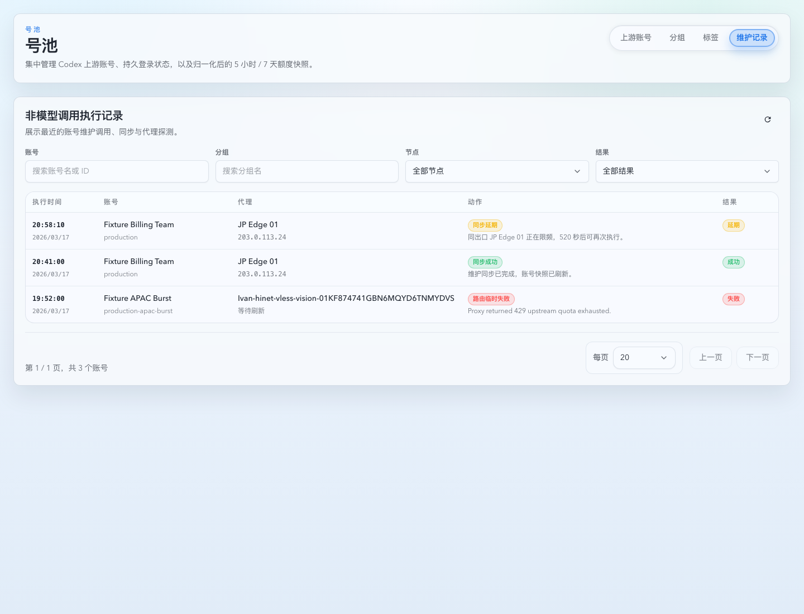

# 账号池维护执行记录与出口限频（#a6k9p）

## 背景 / 问题陈述

- 账号池已有账号详情级最近动作，但缺少跨账号的非模型调用执行记录视图，无法快速观察额度同步、凭据刷新、导入探测、绑定探测等维护请求的执行结果。
- 维护类外呼会复用账号分组与 forward proxy 选路，但当前缺少按最终网络出口的发布频率约束，连续维护请求可能在同一出口上过于密集。
- 这些能力不应影响 `/v1/*` 模型调用热路径的路由、重试或限流语义。

## 目标 / 非目标

### Goals

- 在账号池新增 `维护记录` 独立标签页，展示全局“非模型调用执行记录”列表。
- 列表支持按节点、结果、账号、分组筛选，并展示执行时间、账号、代理、动作、结果。
- 扩展账号维护事件落库字段与全局分页 API，使旧账号详情 `recentActions` 保持兼容。
- 所有账号维护类外呼按最终 forward proxy 出口或 direct 出口执行 10 秒限频；运行期维护任务在有界预算内等待同出口槽位，预算耗尽后写入 deferred/skipped 类执行记录。

### Non-goals

- 不改变 `/v1/*` 模型调用热路径。
- 不改变账号分组、标签、节点分流的选择优先级。
- 不新增用户可配置的限频间隔。
- 不回填历史旧事件的出口 IP；缺字段由 UI 显示历史未记录状态。

## 范围（Scope）

### In scope

- SQLite schema：扩展 `pool_upstream_account_events`，新增维护出口限频表。
- Rust API：新增全局账号维护事件分页查询与筛选。
- Rust runtime：在维护外呼真实发送前按出口预留限频槽位，并维护 forward proxy 出口 IP 元数据。
- Web UI：账号池 `维护记录` 独立页新增列表、筛选、分页、空态/加载/错误态与 i18n。
- Storybook：补稳定 mock story 和视觉证据。

### Out of scope

- 代理节点健康探测算法。
- 模型调用 attempt / invocation 统计口径。
- 用户可配置的出口 IP 元数据 provider 或刷新间隔。

## 需求（Requirements）

### MUST

- 全局列表列为：执行时间、账号、代理、动作、结果。
- 每条记录两行展示：账号列显示账号名与分组，代理列显示代理名与出口 IP，动作列显示动作名与时间/来源，结果列显示结果。
- 结果描述显示在第二行，跨动作列和结果列。
- 执行时间两行展示，时间比日期优先。
- 筛选支持节点、结果、账号、分组。
- 事件数据包含账号名、分组、forward proxy key/display name、出口 IP、动作、结果、结果描述。
- 正向代理出口 IP 元数据通过 ipify 获取，按 proxy/direct 出口每 600 秒最多刷新一次。
- 旧事件缺字段时 API 与 UI 不崩溃。
- 同一出口连续维护真实外呼小于 10 秒时，运行期维护 worker 必须先在有界预算内等待槽位；预算耗尽后才不发出网络请求，写入 deferred 记录并说明剩余等待时间。
- 不同出口互不阻塞；direct 作为单独出口限频。

### SHOULD

- 账号详情 `recentActions` 继续返回旧字段，并可附带新增字段。
- UI 节点筛选使用列表中出现过的 proxy key/display name。
- 维护限频跳过不应把账号长时间留在 `syncing` 状态。

## 功能与行为规格（Functional/Behavior Spec）

### Event model

- `pool_upstream_account_events` 保存账号快照字段，避免账号后续重命名后历史记录失去上下文。
- `result` 由动作与原因推导为 `success | failed | deferred`。
- `result_description` 优先使用维护事件原因描述。

### Global event API

- `GET /api/pool/upstream-account-events`
- Query:
  - `account`
  - `group`
  - `proxyKey`
  - `result`
  - `page`
  - `pageSize`
- Response:
  - `items`
  - `total`
  - `page`
  - `pageSize`

### Egress throttle

- 维护外呼在 forward proxy 选择完成后、真实 HTTP 请求前预留限频槽位。
- 限频 key 使用最终选中 proxy key；无代理时使用 direct 出口 key。
- 预留成功才允许发送真实请求。
- 运行期维护同步遇到同出口未到 10 秒槽位时，必须在有界预算内等待并重试预留，避免 reset due 账号因同代理批量调度长期只产生 `sync_deferred / egress_throttled`。
- 等待预算耗尽后，预留失败返回结构化 throttle error，账号维护同步路径写入 deferred 事件。
- `sync_deferred / egress_throttled` 不代表真实 usage snapshot 已执行；它不得消耗 reset due 账号的 post-reset catch-up 窗口，但仍应作为普通维护间隔的最近一次尝试记录，避免无限重排。

### Forward proxy egress IP metadata

- 选中 forward proxy 后读取出口 IP 元数据；缺失或超过 600 秒时通过 `https://api.ipify.org?format=json` 刷新。
- proxy 节点通过对应代理客户端请求 ipify；direct 节点通过无代理客户端请求 ipify。
- 刷新成功后写入 `forward_proxy_metadata_history` 并在维护事件中快照 `forward_proxy_egress_ip`。
- 刷新失败保留最近成功 IP，只记录失败信息与失败时间，不阻断维护外呼。

### Background scheduler fairness

- 账号维护轮次通过 DB pressure gate 进入后台数据库工作区；遇到唯一后台槽位被短暂占用时，允许在有界预算内等待 `BackgroundBusy` 释放后继续调度 due 账号。
- DB pressure cooldown 表示 SQLite busy/locked 或连接池 acquire timeout 压力窗口；账号维护遇到 cooldown 必须 fail-soft skip，不得消耗等待预算。
- Startup backfill 只能在任务已 due 后占用后台槽位；enabled/due/progress preflight 不得持有唯一后台槽位，避免未到期回填任务饿死账号维护。
- Reset due 的 quota exhausted OAuth 账号只提升维护同步资格；不得仅因 `resets_at` 到点恢复路由，仍需真实 usage snapshot 成功后按 snapshot 状态保持或退出限流。

## 验收标准（Acceptance Criteria）

- Given 多个账号维护事件，When 打开账号池 `维护记录` 标签页，Then 能看到跨账号记录列表与四个筛选项。
- Given 事件有结果描述，When 列表渲染，Then 描述跨动作列与结果列第二行显示。
- Given 旧事件缺账号快照或代理字段，When 列表渲染，Then 显示空态而不是报错。
- Given 同一出口 10 秒内连续维护外呼，When 第二次运行期维护执行且等待预算足够，Then 等待槽位后发送真实网络请求。
- Given 同一出口 10 秒内连续维护外呼，When 第二次运行期维护执行且等待预算耗尽，Then 不发出真实网络请求并写入 deferred 事件。
- Given 不同出口维护外呼，When 间隔小于 10 秒，Then 不互相阻塞。
- Given 当前代理元数据已刷新，When 维护事件写入，Then 事件快照包含可展示出口 IP。
- Given OAuth 账号处于 quota exhausted 且 reset due，When 维护同步排到同出口槽位，Then 能实际拉取后续 usage snapshot，并继续按 snapshot 是否 exhausted 来保持或退出限流。
- Given OAuth 账号处于 quota exhausted 且 reset due，When 本轮维护因 egress throttle 写入 `sync_deferred`，Then 下一轮维护仍视为 reset due，直到真实同步尝试产生 usage snapshot 或真实失败结果。
- Given startup backfill 任务未到期，When scheduler tick 与 upstream account maintenance 同时发生，Then backfill preflight 不得占用唯一后台槽位。
- Given upstream account maintenance 遇到短暂 `BackgroundBusy`，When 槽位在等待预算内释放，Then 本轮维护继续 dispatch due 账号同步。
- Given upstream account maintenance 遇到 DB pressure cooldown，When 维护轮次运行，Then 本轮 fail-soft skip 并由后续 ticker 重试。

## Visual Evidence

- source_type: storybook_canvas
  story_id_or_title: Account Pool/Pages/Upstream Accounts/List - Maintenance Events
  target_program: mock-only
  capture_scope: element
  requested_viewport: 1440x1100
  viewport_strategy: devtools-emulate
  sensitive_exclusion: N/A
  submission_gate: pending-owner-approval
  evidence_note: 验证账号池维护记录独立页新增非模型调用执行记录列表，包含执行时间列、账号/代理/动作/结果列、筛选区与跨列结果描述。

## 风险 / 假设

- 出口 IP 元数据刷新是 best-effort；刷新失败保留最近成功 IP，历史旧事件仍可能显示为未记录。
- OAuth 凭据 refresh 与 usage snapshot 可能原本在同一维护流程内连续外呼；运行期会等待同出口槽位，只有等待预算耗尽时才 deferred，这是预期行为。
