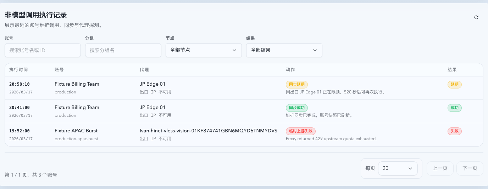

# 账号池维护执行记录与出口限频（#a6k9p）

## 背景 / 问题陈述

- 账号池已有账号详情级最近动作，但缺少跨账号的非模型调用执行记录视图，无法快速观察额度同步、凭据刷新、导入探测、绑定探测等维护请求的执行结果。
- 维护类外呼会复用账号分组与 forward proxy 选路，但当前缺少按最终网络出口的发布频率约束，连续维护请求可能在同一出口上过于密集。
- 这些能力不应影响 `/v1/*` 模型调用热路径的路由、重试或限流语义。

## 目标 / 非目标

### Goals

- 在账号池上游账号页增加全局“非模型调用执行记录”列表。
- 列表支持按节点、结果、账号、分组筛选，并展示执行时间、账号、代理、动作、结果。
- 扩展账号维护事件落库字段与全局分页 API，使旧账号详情 `recentActions` 保持兼容。
- 所有账号维护类外呼按最终 forward proxy 出口或 direct 出口执行 10 秒限频；被限频任务写入 deferred/skipped 类执行记录。

### Non-goals

- 不改变 `/v1/*` 模型调用热路径。
- 不改变账号分组、标签、节点分流的选择优先级。
- 不新增用户可配置的限频间隔。
- 不回填历史旧事件的出口 IP；缺字段由 UI 显示为空态。

## 范围（Scope）

### In scope

- SQLite schema：扩展 `pool_upstream_account_events`，新增维护出口限频表。
- Rust API：新增全局账号维护事件分页查询与筛选。
- Rust runtime：在维护外呼真实发送前按出口预留限频槽位。
- Web UI：账号池上游账号页新增列表、筛选、分页、空态/加载/错误态与 i18n。
- Storybook：补稳定 mock story 和视觉证据。

### Out of scope

- 代理节点健康探测算法。
- 模型调用 attempt / invocation 统计口径。
- 账号详情抽屉之外的新独立页面。

## 需求（Requirements）

### MUST

- 全局列表列为：执行时间、账号、代理、动作、结果。
- 每条记录两行展示：账号列显示账号名与分组，代理列显示代理名与出口 IP，动作列显示动作名与时间/来源，结果列显示结果。
- 结果描述显示在第二行，跨动作列和结果列。
- 执行时间两行展示，时间比日期优先。
- 筛选支持节点、结果、账号、分组。
- 事件数据包含账号名、分组、forward proxy key/display name、出口 IP、动作、结果、结果描述。
- 旧事件缺字段时 API 与 UI 不崩溃。
- 同一出口连续维护真实外呼小于 10 秒时，后一次不发出网络请求，写入 deferred 记录并说明剩余等待时间。
- 不同出口互不阻塞；direct 作为单独出口限频。

### SHOULD

- 账号详情 `recentActions` 继续返回旧字段，并可附带新增字段。
- UI 节点筛选使用列表中出现过的 proxy key/display name。
- 维护限频跳过不应把账号长时间留在 `syncing` 状态。

## 功能与行为规格（Functional/Behavior Spec）

### Event model

- `pool_upstream_account_events` 保存账号快照字段，避免账号后续重命名后历史记录失去上下文。
- `result` 由动作与原因推导为 `success | failed | deferred`。
- `result_description` 优先使用维护事件原因描述。

### Global event API

- `GET /api/pool/upstream-account-events`
- Query:
  - `account`
  - `group`
  - `proxyKey`
  - `result`
  - `page`
  - `pageSize`
- Response:
  - `items`
  - `total`
  - `page`
  - `pageSize`

### Egress throttle

- 维护外呼在 forward proxy 选择完成后、真实 HTTP 请求前预留限频槽位。
- 限频 key 使用最终选中 proxy key；无代理时使用 direct 出口 key。
- 预留成功才允许发送真实请求。
- 预留失败返回结构化 throttle error，账号维护同步路径写入 deferred 事件。

## 验收标准（Acceptance Criteria）

- Given 多个账号维护事件，When 打开账号池上游账号页，Then 能看到跨账号记录列表与四个筛选项。
- Given 事件有结果描述，When 列表渲染，Then 描述跨动作列与结果列第二行显示。
- Given 旧事件缺账号快照或代理字段，When 列表渲染，Then 显示空态而不是报错。
- Given 同一出口 10 秒内连续维护外呼，When 第二次执行，Then 不发出真实网络请求并写入 deferred 事件。
- Given 不同出口维护外呼，When 间隔小于 10 秒，Then 不互相阻塞。

## Visual Evidence

- source_type: storybook_canvas
  story_id_or_title: Account Pool/Pages/Upstream Accounts/List - Maintenance Events
  target_program: mock-only
  capture_scope: element
  requested_viewport: 1440x1100
  viewport_strategy: devtools-emulate
  sensitive_exclusion: N/A
  submission_gate: pending-owner-approval
  evidence_note: 验证账号池上游账号页新增非模型调用执行记录列表，包含执行时间列、账号/代理/动作/结果列、筛选区与跨列结果描述。

## 风险 / 假设

- 当前 forward proxy 节点数据未保证存在可观测出口 IP；实现保留 `forward_proxy_egress_ip` 字段，缺失时显示为空态。
- OAuth 凭据 refresh 与 usage snapshot 可能原本在同一维护流程内连续外呼；新限频会让后续外呼 deferred，这是预期行为。
