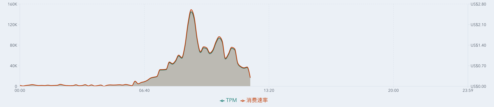
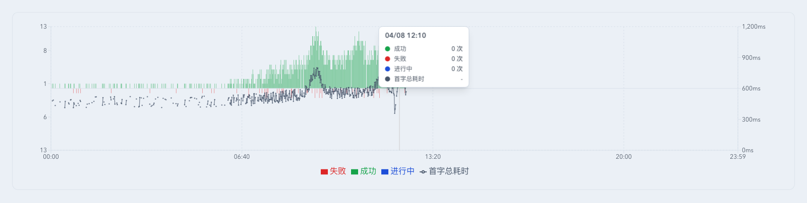
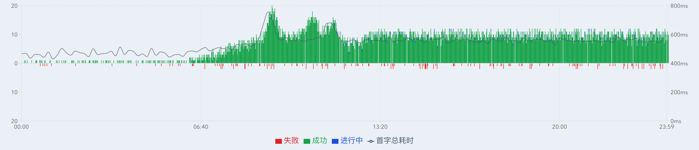
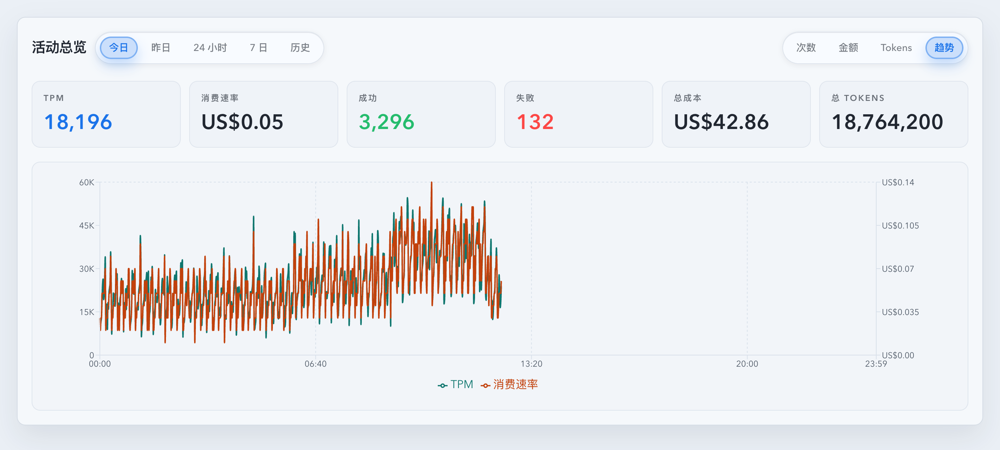
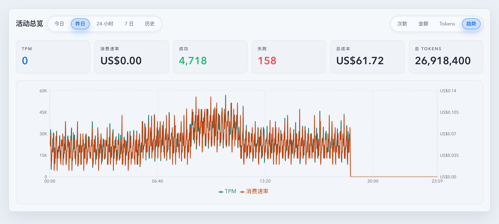
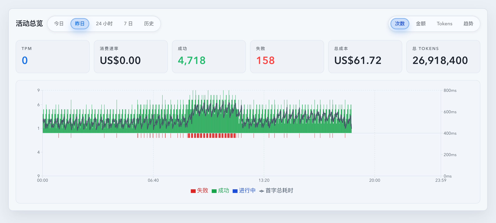

# Dashboard 活动总览趋势图增强（#a6pm6）

> 当前有效规范以本文为准；实现覆盖与当前状态见 `./IMPLEMENTATION.md`，关键演进原因见 `./HISTORY.md`。

## 背景 / 问题陈述

- `活动总览` 的自然日视图已经覆盖 `今日 / 昨日` 的 KPI 与分钟级调用图，但缺少同一时间轴上的吞吐与消费速率趋势。
- 既有 KPI 文案仍残留 `金额/分钟` / `Cost/min` 语义，和主人确认后的 `消费速率` 命名不一致。
- `次数` 图只呈现成功、失败、进行中数量，无法同时观察首字总耗时是否随请求量变化。

## 目标 / 非目标

### Goals

- 在 `今日 / 昨日` 的活动总览图表切换中新增 `趋势`。
- `趋势` 图以 10 分钟桶展示 `TPM` 与 `消费速率` 增量面积，降低分钟级噪声。
- 将 UI、i18n 与测试语义中的 `金额/分钟` / `Cost/min` 统一改成 `消费速率` / `Spend rate`。
- 在 `次数` 图中保留成功、失败、进行中分钟级柱状结构，并叠加分钟级对齐的低权重 `首字总耗时` 曲线。
- 维护 timeseries 数据不变量：调用数为 0 的 bucket 不得携带首字耗时样本、均值或 P95。
- 补齐 Storybook、Vitest 与 mock-only 视觉证据，按 fast-track 收敛到 PR merge-ready。

### Non-goals

- 不新增后端 API、数据库 schema 或统计迁移。
- 不改变 `/api/stats/timeseries` 的既有字段契约；前端只消费已存在的 `firstResponseByteTotalAvgMs` 与 sample count。
- 不给 `24 小时 / 7 日 / 历史` 增加 `趋势` 图表类型。
- 不自动合并 PR。

## 范围（Scope）

### In scope

- `web/src/components/DashboardActivityOverview.tsx`
- `web/src/components/DashboardTodayActivityChart.tsx`
- `web/src/components/dashboardTodayActivityChartData.ts`
- `web/src/components/TodayStatsOverview.tsx`
- `web/src/i18n/translations.ts`
- `web/src/components/*.stories.tsx` 与相关 Vitest

### Out of scope

- 新的 `/api/stats/*` endpoint。
- 历史日历、24h heatmap、7d heatmap 的视觉结构重排。

## 需求（Requirements）

### MUST

- `今日 / 昨日` 的右侧图表切换必须包含 `次数 / 金额 / Tokens / 趋势`。
- `24 小时 / 7 日 / 历史` 的图表切换只能包含 `次数 / 金额 / Tokens`。
- 每个范围继续保持独立图表类型记忆；`今日` 与 `昨日` 可以分别记住 `趋势`。
- `趋势` 图必须同时渲染 `TPM` 与 `消费速率` 两条 10 分钟增量面积系列，桶从本地自然日 00:00 对齐。
- `次数` 图必须叠加分钟级对齐的 `首字总耗时` 曲线，且不得破坏成功 / 失败 / 进行中柱状结构。
- 未来分钟的 TPM、消费速率与首字总耗时图表值必须保持 `null`，不渲染未来曲线。
- tooltip 中不得出现 `金额/分钟`，中文固定使用 `消费速率`，英文使用 `Spend rate`。
- `首字总耗时` 必须跟随原始分钟桶展示；同一分钟存在多个点时按 sample count 加权平均，无 sample count 但有 avg 值时按单样本处理。
- `次数` 图 tooltip 选中 0 次调用的分钟时不得展示邻近分钟或 10 分钟窗口内的 `首字总耗时`。
- `/api/stats/timeseries` 输出、前端 API 归一化与实时增量合并都必须保证：当 bucket 的总调用数、成功、失败、进行中均为 0 时，首字耗时字段清零或置空。

### SHOULD

- 图表数据模型应在同一 `DashboardTodayMinuteDatum` 内提供 count、trend 与 latency 字段，避免组件层重复解析 timeseries。
- Storybook 应提供 today trend、yesterday trend、count + latency、非自然日无 trend 的可复查入口。

## 功能与行为规格（Functional/Behavior Spec）

### Core flows

- 打开活动总览默认 `今日 / 次数`；点击 `趋势` 后，图表切换为 TPM 与消费速率双面积趋势。
- 切到 `昨日` 后，`趋势` 使用上一自然日的 10 分钟 bucket 增量，闭合自然日尾部不受当前时间影响。
- 切到 `24 小时`、`7 日` 或 `历史` 后，metric toggle 移除 `趋势`，并保留这些范围各自的 `次数 / 金额 / Tokens` 记忆。
- 在 `次数` 图中，tooltip 展示图表实际 series：成功、失败、进行中、首字总耗时；当前分钟没有首字耗时样本时显示 `-`。

### Edge cases / errors

- timeseries 缺少 `firstResponseByteTotalAvgMs` 时，`首字总耗时` 曲线按 `null` 断开，不阻断柱状图。
- 同一分钟存在多个点时，`首字总耗时` 以 sample count 加权聚合；无 sample count 但有 avg 值时按单样本处理。
- 若 timeseries 原始点出现 `totalCount=0` 但包含 `firstResponseByteTotalAvgMs` 或 `firstByteAvgMs`，该点应被视为不一致数据，latency 样本必须在数据边界被丢弃。
- 10 分钟 chart-only 聚合只用于 `趋势` 模式的 TPM / 消费速率，不改变普通 `金额` / `Tokens` metric 的累计面积图，也不改变 `次数` 图的成功 / 失败 / 进行中分钟级柱或分钟级首字总耗时线。
- timeseries loading / error / empty 继续沿用现有图表降级语义。

## 接口契约（Interfaces & Contracts）

None

## 验收标准（Acceptance Criteria）

- Given 查看 `今日 / 昨日`，When 打开右侧图表切换，Then 可见 `趋势`。
- Given 查看 `24 小时 / 7 日 / 历史`，When 打开右侧图表切换，Then 不存在 `趋势`。
- Given 选择 `趋势`，When timeseries 返回每分钟 token 与 cost，Then 图表展示 10 分钟聚合后的 `TPM` 与 `消费速率` 面积系列。
- Given 选择 `次数`，When timeseries 返回 `firstResponseByteTotalAvgMs`，Then 图表在柱状结构上叠加分钟级对齐且低权重的 `首字总耗时` 曲线。
- Given 选择 `次数`，When 某个分钟 bucket 调用次数为 0 但同一个 10 分钟窗口内其他分钟存在 latency 样本，Then 该 0 次分钟 tooltip 的 `首字总耗时` 显示为 `-`，且不展示非图表 series 的总次数行。
- Given timeseries 数据源返回 `totalCount=0` 且 latency 字段非空的 bucket，When 数据进入后端响应、前端归一化或实时合并边界，Then latency sample count 为 0，latency 均值与 P95 为 null。
- Given 查看 KPI 与 tooltip，Then 不出现 `金额/分钟`，统一显示 `消费速率` / `Spend rate`。
- Given 运行定向验证、前端 build 与 Storybook build，Then 全部通过。

### UI / Storybook

- Stories to add/update: `DashboardActivityOverview.stories.tsx`、`TodayStatsOverview.stories.tsx`
- Visual evidence source: Storybook canvas / mock-only

### Quality checks

- `cd web && bun run test -- src/components/DashboardActivityOverview.test.tsx src/components/DashboardTodayActivityChart.test.tsx src/components/dashboardTodayRateSnapshot.test.ts src/components/TodayStatsOverview.test.tsx`
- `cd web && bun run build`
- `cd web && bun run build-storybook`

## Visual Evidence

- Storybook覆盖=通过
- 视觉证据目标源=storybook_canvas（mock-only）
- 空白裁剪=已裁剪
- 证据落盘=已落盘
- Validation:
  - `cd web && bun run test -- src/components/DashboardActivityOverview.test.tsx src/components/DashboardTodayActivityChart.test.tsx src/components/dashboardTodayRateSnapshot.test.ts src/components/TodayStatsOverview.test.tsx` ✅
  - `cd web && bun run build` ✅
  - `cd web && bun run build-storybook` ✅
  - `cd web && bun run test-storybook` ✅

- source_type: storybook_canvas
  target_program: mock-only
  capture_scope: browser-viewport
  requested_viewport: desktop-default
  viewport_strategy: storybook-viewport
  story_id_or_title: `dashboard-dashboardtodayactivitychart--trend-area`
  scenario: `今日图表 / 趋势 / 10 分钟面积`
  evidence_note: 证明 `趋势` 使用 10 分钟聚合后的 TPM 与消费速率双面积系列，且不再渲染双折线。
  image:
  

- source_type: storybook_canvas
  target_program: mock-only
  capture_scope: browser-viewport
  requested_viewport: desktop-default
  viewport_strategy: storybook-viewport
  story_id_or_title: `dashboard-dashboardtodayactivitychart--count-bars-latency-minute-alignment`
  scenario: `今日图表 / 次数 / 0 次分钟 tooltip`
  evidence_note: 证明当前分钟 `成功 / 失败 / 进行中` 都为 0 时，即使 mock 数据带有不一致的 latency 字段，tooltip 也只用 `-` 展示无样本的 `首字总耗时`，且不出现非图表 series 的总次数行。
  image:
  

- source_type: storybook_canvas
  target_program: mock-only
  capture_scope: browser-viewport
  requested_viewport: desktop-default
  viewport_strategy: storybook-viewport
  story_id_or_title: `dashboard-dashboardtodayactivitychart--count-bars-dense-pairing`
  scenario: `今日图表 / 次数 / 首字总耗时分钟级对齐`
  evidence_note: 证明成功、失败、进行中柱状结构仍为主层级，并叠加低权重且分钟级对齐的首字总耗时曲线。
  image:
  

- source_type: storybook_canvas
  target_program: mock-only
  capture_scope: browser-viewport
  requested_viewport: desktop1660
  viewport_strategy: storybook-viewport
  story_id_or_title: `dashboard-dashboardactivityoverview--today-trend-view`
  scenario: `活动总览 / 今日 / 趋势`
  evidence_note: 证明 `今日` 自然日可选择 `趋势`，且图表以面积系列同时展示 10 分钟聚合 `TPM` 与 `消费速率`。
  image:
  

- source_type: storybook_canvas
  target_program: mock-only
  capture_scope: browser-viewport
  requested_viewport: desktop1660
  viewport_strategy: storybook-viewport
  story_id_or_title: `dashboard-dashboardactivityoverview--yesterday-trend-view`
  scenario: `活动总览 / 昨日 / 趋势`
  evidence_note: 证明 `昨日` 自然日也可独立选择 `趋势`，并复用同一 10 分钟面积趋势结构。
  image:
  

- source_type: storybook_canvas
  target_program: mock-only
  capture_scope: browser-viewport
  requested_viewport: desktop1660
  viewport_strategy: storybook-viewport
  story_id_or_title: `dashboard-dashboardactivityoverview--yesterday-view`
  scenario: `活动总览 / 昨日 / 次数`
  evidence_note: 证明 `次数` 图仍保留成功、失败、进行中柱状结构，并叠加低权重且分钟级对齐的 `首字总耗时` 曲线。
  image:
  

## Related PRs

- None

## 风险 / 开放问题 / 假设（Risks, Open Questions, Assumptions）

- 风险：双 Y 轴趋势图如果颜色与 legend 不清晰，可能降低可读性；视觉证据需覆盖。
- 风险：`firstResponseByteTotalAvgMs` 若后端未返回，曲线会自然为空，但本任务不扩展后端契约。
- 假设：`/api/stats/timeseries` 已规范化返回 `firstResponseByteTotalAvgMs` 与 sample count。

## 参考（References）

- `docs/specs/r99mz-dashboard-today-activity-overview/SPEC.md`
- `docs/specs/mpgea-dashboard-yesterday-activity-overview/SPEC.md`
- `docs/specs/2qsev-dashboard-tpm-cost-per-minute-kpi/SPEC.md`
