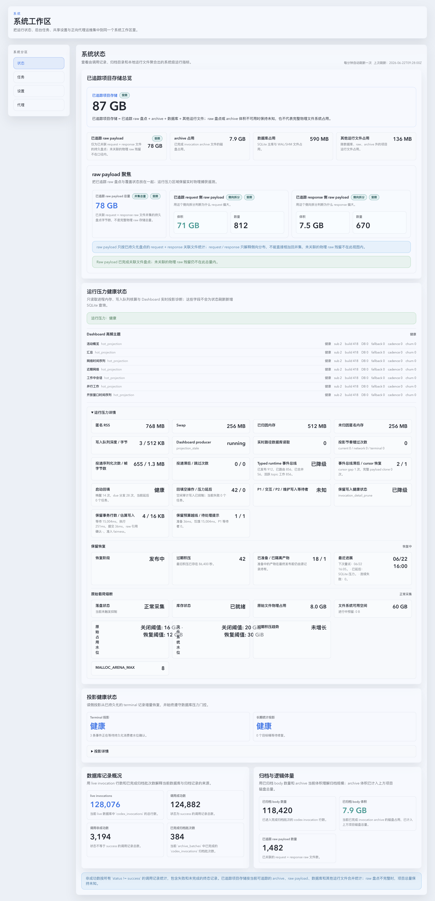
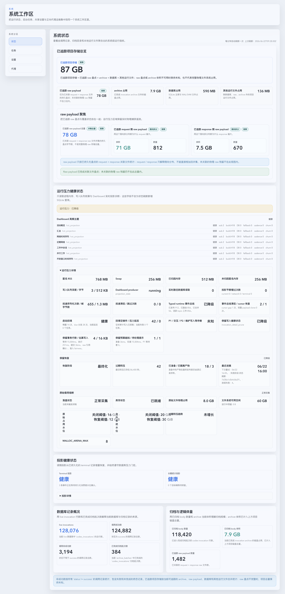

# Autonomous Retention Recovery and Raw Capture Circuit Breaker

> This file is the durable topic requirements contract. Current implementation facts belong in `IMPLEMENTATION.md`; lifecycle and change references belong in `HISTORY.md`.

## Context and Scope

- Context: The retention pipeline can leave expired live details and raw payloads behind when archive preparation succeeds but source publication cannot complete. Repeated failures consume storage and increase SQLite write pressure while manual intervention is unavailable.
- In scope: Autonomous, pressure-aware recovery of expired invocation retention; verified archive publication; raw payload storage protection; and sanitized owner-facing recovery diagnostics.
- Out of scope: Upstream network latency, upstream provider capacity, proxy routing policy, manual maintenance commands, process restarts, and SQLite `VACUUM`.

## Terms and Interfaces

- **Verified Archive**: An immutable archive whose artifact, manifest, Summary proof, and source mutation have committed as one publication. Only it authorizes removal of its corresponding live detail and raw payload files.
- **Prepared Archive**: An immutable artifact with recorded source identity and digest that is eligible for recovery verification but does not authorize source deletion.
- **Physical Raw Inventory**: The incrementally reconciled byte count for raw files physically owned by the configured raw store, including bounded in-flight reservations.
- **Raw Capture Circuit Breaker**: A hysteretic state that suppresses new raw request and response files while preserving proxy delivery and structured invocation facts.
- Interface: Existing retention maintenance lifecycle, raw-capture write path, runtime configuration, and additive `/api/system/status` health fields.

## Requirements

### REQ-ARR-001

- The system MUST release a live invocation detail or its raw-owner link only in the same finalized source transaction that publishes its corresponding Verified Archive.
- Inputs: An expired invocation candidate, archive artifact, manifest, Summary proof, and source rows.
- Outputs: Either an atomically finalized archive plus source transition, or unchanged live source ownership.
- Raw-owner finalization MUST prove the path and its `.bin`/`.bin.gz` storage variant have no remaining links in `proxy_raw_payload_blob_links` within the same source transaction; a committed transaction is required before any physical raw unlink.
- A `live_mirror` detail-prune archive is a prepared, source-identity-verified recovery artifact whose live canonical row remains online; it MUST NOT become a Summary or rollup authority. Its manifest, prepared-ledger removal, structured-field transition, and raw-owner release still commit together.
- Every prepared archive MUST persist its publication kind as `detail_prune` or `invocation_archive`. A legacy row with a null kind MAY be recovered only when its deterministic path proves the kind; otherwise it MUST be quarantined without guessing the source transformation.

### REQ-ARR-002

- The system MUST persist bounded recovery state for every Prepared Archive and resume it automatically after process interruption, archive I/O failure, or SQLite admission deferral.
- A recovery pass MAY reuse an artifact only after exact source-identity and digest verification. Invocation identity covers every archive-column value, including its SQLite storage type; both the live source rows and the rows in the artifact MUST match. An unverified artifact MUST NOT authorize source or raw deletion.
- A legacy or unmatched artifact MUST be handled by a resumable, bounded reconciliation cursor that wraps after exhausting the current tail so files arriving behind the saved cursor are eventually revisited. It is retained as quarantined evidence for 24 hours and may then be removed only when it matches neither a Prepared Archive nor a committed manifest.
- Legacy reconciliation MUST obtain background write admission before traversing the archive directory or performing archive-file I/O. It MUST stream directory entries through a selection structure whose retained allocation, comparison work per entry, and candidate set are bounded by the scan batch rather than materializing and sorting a complete directory. Directory cursors MUST preserve the lexical stream position between same-prefix files and descendants; a truncated directory MUST pause traversal at its selected boundary, and cursor persistence MUST be monotonic with a conditional tail wrap so overlapping passes cannot skip or regress legacy artifacts.
- A raw residual MUST be handled by a separate scheduled worker and durable quarantine ledger. Each slice MUST advance at most 128 direct entries from one in-memory iterator and process at most 32 supported direct regular files under the resolved raw root; it MUST skip subdirectories, symlinks, unknown file names, and paths outside that root. The iterator MUST continue across slices, close at end-of-directory, and restart from the root after process restart; the per-file ledger MUST make repeated observations idempotent.
- A raw residual MAY be physically removed only after its identity is unchanged, no raw link or fallback raw-path resolution can resolve to it, and its durable quarantine period has elapsed. Ownership MUST be queried through the indexed `proxy_raw_payload_blob_links(raw_path)` ledger after verifying the legacy-link seed completion marker; path fallback precedence MUST be preserved without scanning owner tables. The final metadata and indexed reference checks MUST happen immediately before removal. Inventory reset intent MUST be durable before unlink, and the ledger row MUST be cleared only after successful deletion or later proof that the file is absent.

### REQ-ARR-003

- The system MUST make archive finalization, raw-owner release, filesystem-safe inventory reset, Prepared Archive reconciliation, and raw residual reconciliation independently resumable stages of one Retention Recovery lifecycle. Raw reconciliation MUST remain outside the proxy request path and MUST NOT block archive publication or structured invocation persistence. Filesystem availability remains the safety signal for candidates that cannot pass the raw identity, reference, or quarantine gates.
- A failure in one stage MUST report that stage and schedule bounded retry/backoff without preventing a separately safe stage from making progress.
- Prepared-archive reconciliation MUST have its own durable retry deadline, failure count, failure fingerprint, defer reason, and last-progress timestamp. Inventory reset delay or failure MUST NOT cancel or repeat an already committed archive finalization.
- All database mutations in this lifecycle MUST retain maintenance write admission and MUST yield to P1 terminal and interactive proxy writes.
- Raw-owner confirmation MUST use the path index on the link ledger rather than scanning owner tables while maintenance admission is held. Relative database roots MUST be normalized before checking relative/absolute ledger aliases, including both `.bin` and `.bin.gz` variants. If the one-time legacy-link seed is not marked complete, orphan deletion MUST fail closed.

### REQ-ARR-004

- The system MUST suppress new raw request and response files when either physical raw storage reaches `16 GiB` or filesystem free space falls to `20 GiB` or lower.
- It MUST resume raw capture only after physical raw storage is below `12 GiB` and filesystem free space is at least `30 GiB`.
- While suppressed, the system MUST continue proxy delivery and durable structured invocation facts, and MUST record a storage-suppression reason rather than representing the event as a per-payload truncation.
- The circuit-breaker decision MUST use Physical Raw Inventory and bounded write reservations; it MUST NOT perform a full directory scan in the proxy request path.
- A new-format overflow-spool capture MUST be replayed only when its completion marker proves the recorded final segment; a missing or mismatched marker MUST retain the validated segments for a later bounded recovery pass. Each spool recovery pass MUST process at most 32 recovery units and inspect at most 128 directory entries, with all segments of one active capture counted as one unit. A bounded spool inventory overflow MUST remain observable as inventory preparation rather than inventory readiness.

### REQ-ARR-005

- The system MUST autonomously work through all expired historical raw/detail backlog under the existing retention policy until each candidate has either finalized a Verified Archive or remains in an explicit, observable recoverable state.
- Returning to normal raw capture MUST require both the recovery watermarks in REQ-ARR-004 and a non-growing expired backlog. Sustained P1 load may keep recovery and raw capture suppressed; it MUST NOT force a larger or higher-priority retention transaction.

### REQ-ARR-006

- `/api/system/status` and structured logs MUST expose low-cardinality Retention Recovery state: circuit-breaker state and reason, physical raw bytes and watermarks, filesystem free bytes, backlog counts/age, current stage, last successful progress, retry time, and a sanitized failure fingerprint.
- Prepared, quarantined, and expired-backlog counts MUST be null or omitted until a successful status refresh measures them; an unmeasured count MUST NOT appear as zero.
- The additive System Status raw-inventory contract MUST expose nullable tracked raw metric bytes plus `rawMetricsHealth.physicalCoverage=partial|unknown`. When raw inventory is not ready or coverage is unknown, raw metric bytes and any derived project-storage total MUST remain unknown or explicitly restricted; a missing raw value MUST NOT render as `0 B` or as a complete physical-disk claim. Runtime Pressure `rawCapture.rawBytes` remains the separate physical-capture measurement and keeps its own nullable contract.
- These diagnostics MUST NOT expose raw request/response content, SQL text or bindings, account identifiers, or full payload/archive paths.
- Retention write diagnostics MAY include `rawReferenceCheckMs`; it is nullable and MUST remain unknown when no raw-owner confirmation ran.
- The optional `runtimePressureHealth.rawOrphanSweep` object MUST expose `unknown`, `idle`, `scanning`, `deferred`, or `degraded`, per-slice inspected/referenced/quarantined/removed counts, last progress, retry time, defer reason, and sanitized failure fingerprint. Missing fields MUST normalize to `unknown` rather than zero.

### REQ-ARR-007

- Autonomous Retention Recovery MUST NOT invoke maintenance CLI commands, restart the process, run `VACUUM`, or delete database files.
- It MAY release raw-file and orphan/prepared-artifact storage only when the proof requirements in REQ-ARR-001 and REQ-ARR-002 hold. Raw residual release additionally requires the durable identity, reference, and quarantine gates in REQ-ARR-002. SQLite pages made reusable by row deletion are not a promise of immediate database-file shrinkage.

### REQ-ARR-008

- The raw orphan worker MUST be independent of the hourly retention cadence and MUST NOT overlap another raw sweep in the same process.
- Before any raw-root or candidate filesystem inspection, including reconciliation-ledger metadata checks and fallback-path existence checks, the worker MUST obtain maintenance admission. Admission refusal MUST perform no raw filesystem I/O and persist a retry at least five minutes later. For bounded filesystem-only slices, it MUST retain the background pressure slot while releasing the SQLite write-coordinator permit, so another background task cannot enter during filesystem inspection while P1 and interactive writes remain eligible.
- While maintenance admission is held for a candidate release, the raw-directory lock MUST be acquired nonblocking. Lock contention MUST defer that candidate and release admission without waiting on the lock, so later candidates and foreground writes are not held behind cross-process file activity.
- After progress without failure, the worker MUST resume after one second. A failed slice MUST persist a sanitized fingerprint and back off for 5/10/20/40/60 minutes; an item failure MUST NOT prevent later candidates in that slice from being checked. End-of-directory MUST close the iterator and schedule a new pass after five minutes.
- The existing `raw_payload_files` cursor MUST NOT be used as a directory seek position. It MAY be used as a persistent keyset position for bounded missing-ledger cleanup. No new DDL or startup-wide backfill is required.

## Verification

### VER-ARR-001

- Method: Stateful SQLite and archive-file I/O fault-injection tests at each publication boundary.
- covers: `REQ-ARR-001`, `REQ-ARR-002`
- Pass condition: Interruptions before final publication leave live rows and raw-owner links intact; a matching Prepared Archive is reused after exact verification; an unmatched artifact cannot finalize or delete a source row.

### VER-ARR-002

- Method: Scheduler tests that fail archive finalization while allowing orphan sweep and recovery-journal work.
- covers: `REQ-ARR-003`
- Pass condition: Each safe stage remains independently resumable, retry/backoff is bounded, and P1 or interactive writes retain coordinator priority.

### VER-ARR-003

- Method: Raw-capture integration tests using a bounded Physical Raw Inventory and mocked filesystem free-space values.
- covers: `REQ-ARR-004`, `REQ-ARR-005`
- Pass condition: Capture stops at either high condition, resumes only after both low conditions, preserves proxy and structured records, and does not scan the raw directory on a request.

### VER-ARR-004

- Method: System-status serialization and structured-log inspection tests.
- covers: `REQ-ARR-006`
- Pass condition: Required recovery fields are present with stable low-cardinality values and failure output contains no payload, SQL, account, or full-path data.

### VER-ARR-005

- Method: Static behavior tests and maintenance-lifecycle fixtures.
- covers: `REQ-ARR-007`
- Pass condition: Automatic paths never invoke a CLI, restart, `VACUUM`, or database-file deletion; only proven raw/artifact candidates are removed.

### VER-ARR-006

- Method: Archive-file I/O fixtures with restart/reopen, identity replacement, owner-reference, unassociated residual, cursor-boundary, and quarantine-expiry cases.
- covers: `REQ-ARR-002`, `REQ-ARR-003`, `REQ-ARR-007`
- Pass condition: A newly observed residual is durably quarantined before release; crashes resume from the ledger and cursor; wrong-identity and referenced candidates remain; each pass is bounded; only an unchanged, unreferenced candidate whose quarantine period has elapsed is physically removed.

### VER-ARR-007

- Method: Instrumented large-directory slices, restart/reopen fixtures, scheduler clock tests, and concurrent P1/interactive writes on the shared testbox.
- covers: `REQ-ARR-002`, `REQ-ARR-003`, `REQ-ARR-006`, `REQ-ARR-008`
- Pass condition: Every slice advances no more than 128 directory entries and processes no more than 32 supported candidates; restart and directory mutations eventually revisit candidates; pressure refusal performs no directory I/O; legacy-link seed absence retains files; matching indexed references retain files; expired unreferenced fixtures are removed; lock contention releases maintenance admission without waiting; an item failure does not prevent later candidates in the slice; retry cadence and System Status state remain accurate without adding foreground busy/locked events.

## Related ADRs

- [ADR 0004: Summary archive publication proof](../../adr/0004-summary-archive-publication-proof.md)
- [ADR 0015: Coordinated runtime SQLite write admission](../../adr/0015-coordinated-runtime-sqlite-write-admission.md)
- [ADR 0016: Autonomous raw capture circuit breaker](../../adr/0016-autonomous-raw-capture-circuit-breaker.md)
- [ADR 0018: Bounded Raw Orphan Sweep Worker](../../adr/0018-bounded-raw-orphan-sweep-worker.md)

## Visual Evidence

- source_type: ui_demo
  target_program: mock-only
  capture_scope: browser-viewport
  requested_viewport: 1280x577
  viewport_strategy: devtools-emulate
  margin_policy: trim_only
  evidence_surface: page
  state: degraded recovery with `status_refresh` stage and failure
  evidence_note: shows the recovery backlog and sanitized failure fingerprint in System Status
  image:
  
- source_type: ui_demo
  target_program: mock-only
  capture_scope: browser-viewport
  requested_viewport: 393x852
  viewport_strategy: devtools-emulate
  margin_policy: trim_only
  evidence_surface: page
  state: degraded recovery with `status_refresh` stage and failure
  evidence_note: shows the recovery diagnostics within the mobile System Status viewport
  image:
  
- Healthy, recovering, deferred, degraded, and missing-field `unknown` states are covered by System Workspace Storybook interactions. Deferred recovery carries a sanitized `deferReason` and durable `consecutiveFailureCount` when present.
- source_type: storybook_canvas
  target_program: mock-only
  capture_scope: element
  requested_viewport: 1660x900
  viewport_strategy: storybook-viewport
  margin_policy: trim_only
  evidence_surface: page
  state: storage-suppressed raw capture with filesystem-low reason
  evidence_note: shows the raw capture circuit state, inventory, physical raw usage, available space, reservation, and backlog trend in Runtime Pressure.
  image:
  
- source_type: storybook_canvas
  target_program: mock-only
  capture_scope: element
  requested_viewport: 1660x900
  viewport_strategy: storybook-viewport
  margin_policy: trim_only
  evidence_surface: page
  state: missing raw capture diagnostic fields normalized to unknown
  evidence_note: verifies additive compatibility when older backends do not publish the raw capture contract.
  image:
  
- source_type: storybook_canvas
  target_program: mock-only
  capture_scope: element
  requested_viewport: 1660x900
  viewport_strategy: storybook-viewport
  margin_policy: trim_only
  evidence_surface: page
  story_id_or_title: System/SystemWorkspace/StatusRetentionRecoveryHealthy
  state: healthy retention recovery with measured raw reference confirmation
  evidence_note: shows the complete System Status page with retention write health, recovery stage, and raw capture diagnostics.
  image:
  
- source_type: storybook_canvas
  target_program: mock-only
  capture_scope: element
  requested_viewport: 1660x900
  viewport_strategy: storybook-viewport
  margin_policy: trim_only
  evidence_surface: page
  story_id_or_title: System/SystemWorkspace/StatusRetentionRecoveryRecovering
  state: recovering retention with prepared reconciliation deferred by SQLite pressure
  evidence_note: shows the recovery stage, deferred reason, retry schedule, and failure count without exposing sensitive data.
  image:
  
- source_type: storybook_canvas
  target_program: mock-only
  capture_scope: element
  requested_viewport: 1660x900
  viewport_strategy: storybook-viewport
  margin_policy: trim_only
  evidence_surface: page
  story_id_or_title: System/SystemWorkspace/StatusRetentionRecoveryDegraded
  state: degraded retention finalization with sanitized failure fingerprint
  evidence_note: shows the failure stage, bounded retry metadata, and sanitized failure fingerprint in Runtime Pressure.
  image:
  
- source_type: ui_demo
  target_program: mock-only
  capture_scope: element
  requested_viewport: 1440x1100
  viewport_strategy: devtools-emulate
  margin_policy: trim_only
  evidence_surface: page
  state: idle raw orphan sweep with deterministic mock counters
  evidence_note: shows the per-slice directory-entry cap, referenced-file skips, quarantine and release counts; values are fixture data, not production telemetry.
  image:
  

## References

- `./IMPLEMENTATION.md`
- `./HISTORY.md`
- `../9aucy-db-retention-archive/SPEC.md`
- `../../archive/specs/t4v9k-retention-backlog-root-cause-fix/SPEC.md`
