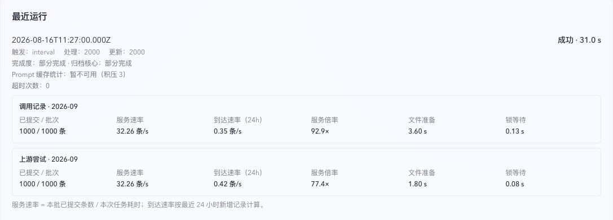
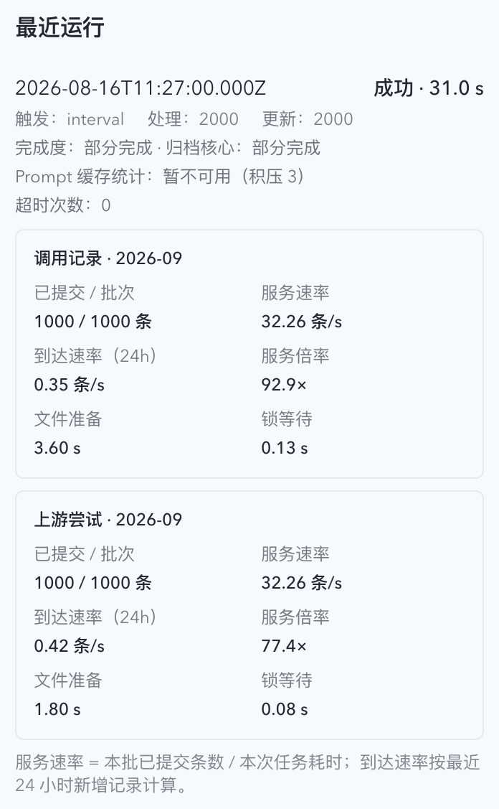

# Retention：实现映射与验证

## Current Status

本轮实现 REQ-BRR-022..023 / VER-BRR-012，开发基线为 `162253adecf9dba913202201041846f9062e713c`，分支为 `th/retention-task-local-monthly-batches`。交付停在唯一直接 PR 的 Step 5C Ready；不包含合并、发布或生产修复。

代码已实现任务内月度文件批次、短事务源记录转换及可选吞吐展示。当前正在完成后端回归和发布构建容量试验，尚未签收 50 倍新增速率、固定存量 24 小时归零或在线延迟不劣验收。旧 PR 的阶段交付授权和容量卡不作为本轮通过证据。

## 任务内批次与月度目标

每轮按数据集选取最多 1000 条符合保留策略的 live 候选，按月份分组，结合实际 payload 字节、现有 gzip 文件大小、可用磁盘和 60 秒设计预算决定是否开始文件批次。正常目标为数百到数千条；尾部、管理员配置或 payload 上限造成不足 512 条时记录原因。规划拒绝不通过缩成单条伪装成果。

同一 dataset/month 继续使用 `archives/<dataset>/<year>/<dataset>-YYYY-MM.sqlite.gz`。迟到记录写入相同路径。月份决定目标文件，不要求任务完成整个月份的全部积压。下一轮重新选择剩余 live rows，不读取上一轮临时文件、累计值或候选游标。

当前任务创建带 PID/唯一序号的临时 SQLite 副本，批量写入已选记录，一次校验内容和身份、一次压缩、一次原子替换目标文件。临时 SQLite、journal/WAL/SHM 和压缩中间文件有任务内清理 guard；进程死亡后仅丢弃准确匹配且已无存活进程的临时文件，不续作它们。

文件发布后按现有 manifest、摘要及 Verified Archive 证明转换源记录。主库写入每次最多 64 条；全部内容证明在事务外准备，短事务复核源身份、证明元数据和 raw 引用后提交。已提交微批次保留其完整事实；失败后未提交源行仍为 live，下一轮重新选择。已发布文件中的 live 副本按身份重新覆盖，不能作为已删除源行的证明替代品。旧目标的恢复备份只保护文件替换异常，不用作下一轮数据 staging。

普通任务将旧 preparing/published prepared 行隔离为现有 `quarantined`，不解析其 source IDs 作为正常归档输入。既有 manifest、completed archive 和 cleanup 事实保留；历史恢复工具仍可读取旧状态。主库不增加表、列或状态枚举值。

## 模块映射

| 需求                | 当前源码                                                                                       | 验证口径                                                                               |
| ------------------- | ---------------------------------------------------------------------------------------------- | -------------------------------------------------------------------------------------- |
| REQ-BRR-002/022     | `src/maintenance/retention/batch_plan.rs`, `task_batches.rs`                                   | 预算参与批次规划；运行超时只作安全兜底，重复超时是缺陷信号                             |
| REQ-BRR-022         | `src/maintenance/archive/writers.rs`, `quota_compaction.rs`, `retention/archive_identity.rs`   | 同月规范路径、任务临时文件清理、身份冲突和内容摘要、未证明源行保留                     |
| REQ-BRR-022         | `src/summary_source_change.rs`, `retention/batch_plan.rs`                                      | 完整 V2 Snapshot 验证在写事务外；短事务比较元数据后发布，Summary 不重复计入 live 副本  |
| REQ-BRR-023         | `src/maintenance/retention.rs`, `src/runtime.rs`                                               | batch rows、已提交行、文件准备、锁等待、整轮有效服务速率、24h 到达速率、倍率及超时次数 |
| REQ-BRR-023         | `web/src/lib/api/core-foundation.ts`, `RetentionRunThroughput.tsx`, `SystemTaskDetailPage.tsx` | 新字段可选；真实零与缺失区分，旧响应显示未知；Prompt 统计仍暂不可用                    |
| REQ-BRR-016..021    | 既有 runtime、maintenance_store、小时 observer 和趋势组件                                      | 单一 owner 自动追赶、禁用控制、准确小时双指标保留；本轮不新增调度器或改动小时观测定义  |
| REQ-BRR-003/005/015 | 既有 Prompt cache 物化所有者                                                                   | 独立持久化队列继续异步处理；不放回归档事务，不改变精确统计读契约                       |

## 观测与 API

维护库原有 run details JSON 可选增加 `archiveBatches` 和 `timeoutCount`，不新增维护库结构。每条批次记录 dataset/month、batchRows/committedRows、filePrepareMs、lockWaitMs、elapsedMs、committedRowsPerSecond、arrivalRowsPerSecond、serviceRateMultiple 和 smallBatchReason。

服务速率使用本数据集实际提交行数除以整轮 elapsed，包含其他阶段、准入和收尾，避免只用压缩的短时速度。到达速率在独占连接上以真实 SQLite progress handler 的 2 秒预算读取最近 24 小时行数；不可观测则为未知，真实零到达时倍率未知。运行结果一经持久化，后台统计刷新不改写它。

主页面继续显示 7 天逐小时待归档 invocation 数量及最长逾期。attempt、Prompt 会话、raw 文件按原单位独立计量。页面读维护库和运行结果，不同步扫描主库或触发物化。

## Compatibility and Migration

本轮没有主库 DDL、历史回填或新状态值。已有月度 gzip SQLite、manifest、V2 Summary Snapshot、raw 链接和完成状态可读；归档文件内部增加查询索引不改变格式。旧 prepared 状态隔离和当前任务源行转换属于运行 DML。历史吞吐缺失保持未知。

新增任务 JSON 字段和 Web 归一化向后兼容。API 与持久化影响分开评估；本轮记录见 [version impact](assets/task-local-version-impact-record.json) 和 [state compatibility](assets/task-local-persistent-state-record.json)。最终分类由当前候选兼容验证决定；旧 PR 的 minor 记录仅作为历史。

## Verification

- 发布构建试验使用 1,270,000 条过期 invocation、1.2 倍 attempt、500,000 行倾斜 key、十个月份、约 3 KB payload、共享 raw 链接和稀疏孤儿，执行真实文件发布及主库转换。
- 普通新增负载采用 30,000 invocation/day 与 36,000 attempt/day；基线与候选使用相同 fixture 和请求序列，各重复三次。要求真实固定 cohort 归零，不能仅按短时速率外推 24 小时。
- 在线探针覆盖聚合、列表、详情和 P1 terminal 写；生产 HTTP 方法比例暂无准确观测，当前 3:1 读写重放是显式保守假设，不能写成生产实测比例。持续峰值、锁释放与磁盘边界另行验证。
- 容量通过要求 invocation >=17.4 rows/s、attempt >=20.8 rows/s、普通负载不频繁超时，以及在线 p95/p99 中位数不劣于基线。
- 当前 full lightweight profile 1292/1292 已通过；stateful 主跑有两项旧 retention 契约断言和一项路由等待失败，更新契约断言后定向重跑。archive-file-io 全量、当前候选容量和最终全部质量检查仍在进行。
- Web 全量测试后已定向复核夹具修复及交互失败；typecheck/lint/build、六个吞吐 Storybook 状态、SystemWorkspace Storybook、桌面/移动任务页 E2E 已有通过结果。最终候选渲染输入须再次核对。
- 正式 Tier 4 四固定 lane + database-migration 只读审查在当前候选全部验证、实测和视觉门禁完成后启动。

## Visual Evidence

本次 Task Evidence Set 是纯前端 Web Demo 的吞吐卡片：桌面 1440×1050 和移动 393×852 viewport。截图保留 invocation/attempt 单位、整轮服务速率、到达速率、倍率、超时、准备和锁等待，并显示 Prompt 暂不可用。图片已裁掉外围空白后通过 owner-facing 快照展示。

同路径基线不存在，比较为 current-only；主人明确确认「截图准确，接受此布局」。此确认只证明布局和模拟状态，不能替代容量实测。旧 retention-task / retention-catchup-trend 图片保留为历史，排除于本轮 Task Evidence Set。

## References

- [长期需求](SPEC.md)
- [历史与此前容量限制](HISTORY.md)
- [ADR 0028](../../adr/0028-retention-task-local-batches-and-monthly-archive-targets.md)
