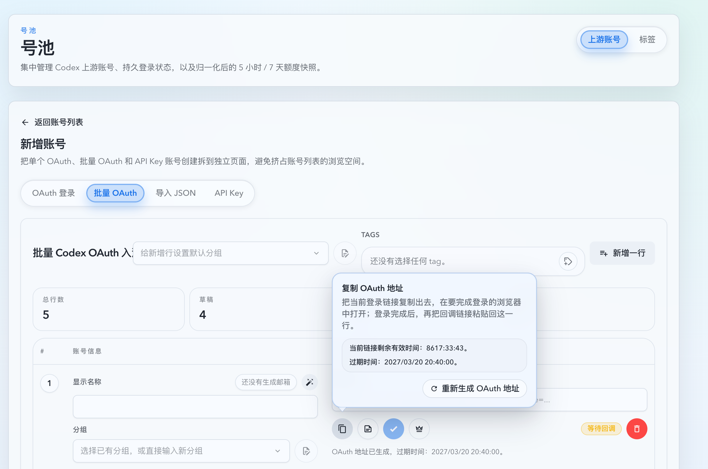
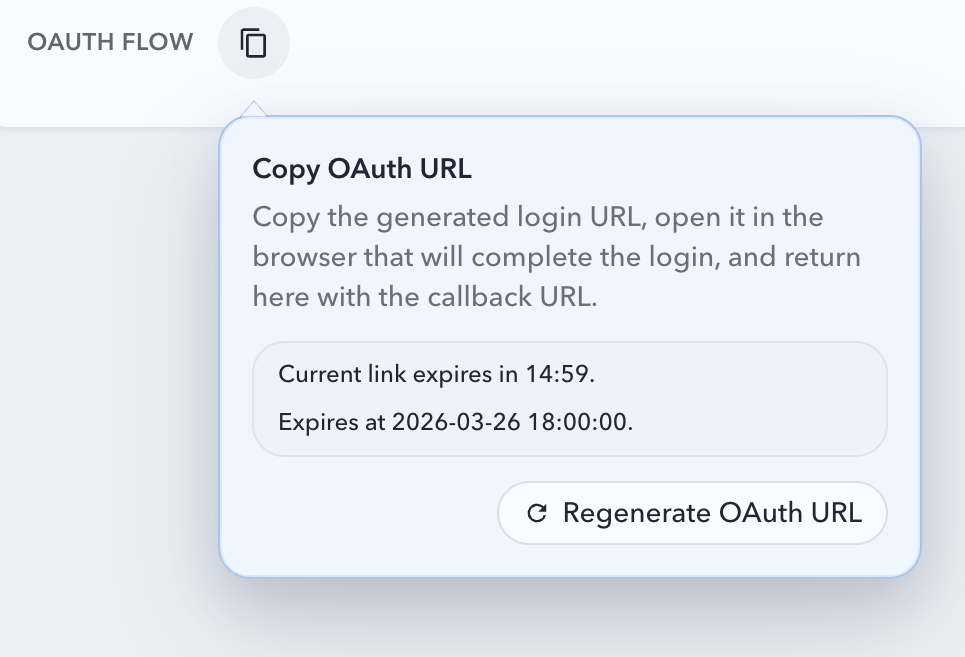
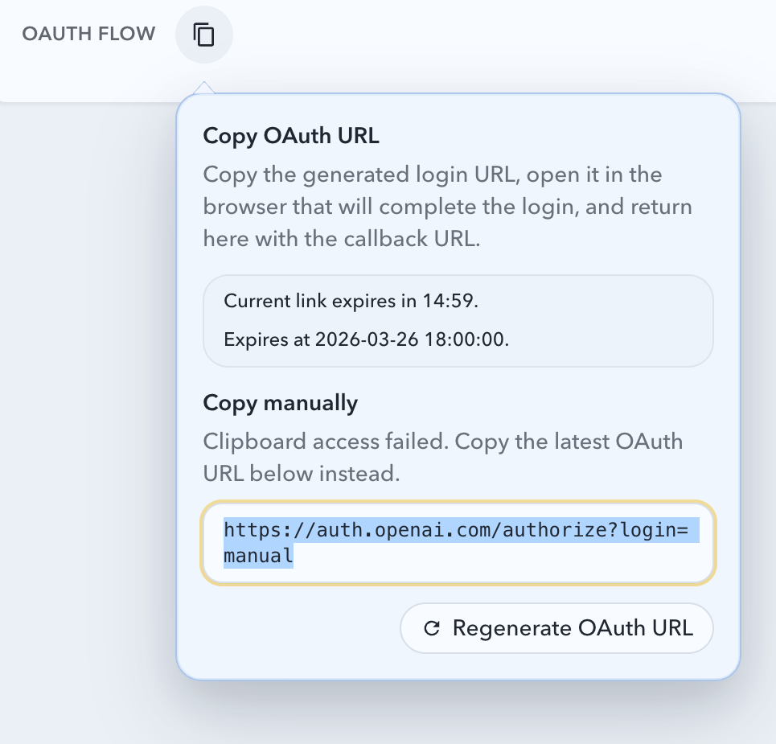

# 批量 OAuth 主动作合并与气泡重生成（#ca7v4）

## 状态

- Status: 已实现
- Created: 2026-03-26
- Last: 2026-03-26

## 背景

- 批量 OAuth 行当前把“生成 OAuth 地址”和“复制 OAuth 地址”拆成两个紧邻按钮，用户需要先判断当前行是否已经存在可用链接，再决定点哪一个，行级动作语义偏碎。
- 复制失败时的手动复制降级已经存在，但它依附于独立复制按钮旁的临时气泡，和“重新生成”“链接还剩多久过期”这类 session 管理信息分散在不同位置。
- 当前邮箱状态刷新前端已经走单次批量 `mailbox-sessions/status` 请求，不是每行各打一条；本次要解决的是行级主动作与气泡交互，不调整刷新节奏或后端削峰逻辑。

## 目标 / 非目标

### Goals

- 把批量 OAuth 行的生成/复制入口收敛成一个状态化主按钮：无有效 pending OAuth URL 时负责生成，有有效 pending OAuth URL 时负责复制。
- 用同一个可交互气泡承载剩余有效时间、绝对过期时间、重新生成入口，以及复制失败后的手动复制降级内容。
- 保持现有 pending session 生命周期规则不变：metadata / mailbox 编辑失效、服务端非 `pending`、本地过期判断命中时，主按钮自动退回生成态。
- 让 hover、focus、右键和长按都能打开同一个气泡，保持鼠标、触屏和键盘用户都能访问重生成入口。

### Non-goals

- 不修改邮箱状态 5 秒轮询策略，不对刷新时间做错峰或后端缓存改造。
- 不新增或修改 HTTP / DB 契约，也不新增 `remainingSeconds` 之类的后端字段。
- 不改单账号 OAuth 页面布局；若有交互复用，仅限批量行级主动作控件。

## 功能规格

### 主按钮模式

- 当行存在 `status === pending`、`authUrl` 非空且 `expiresAt` 未过期的 login session 时，主按钮显示为复制模式；点击主按钮直接复制当前 `authUrl`。
- 当行不存在有效 pending login session 时，主按钮显示为生成模式；点击主按钮调用现有批量 OAuth begin 流程。
- 当生成成功并返回新的 pending session 后，同一按钮立即切换到复制模式，不再显示独立复制按钮。

### 交互气泡

- hover、focus、右键或长按主按钮都应打开同一个可交互 popover。
- 气泡内必须显示：
  - 当前模式说明；
  - 基于现有 `expiresAt` 推导的剩余时间；
  - 绝对过期时间；
  - `Regenerate` 动作；
  - 剪贴板复制失败时的手动复制内容与关闭入口。
- 右键打开气泡时需要阻止浏览器默认菜单；长按打开后不能再额外触发一次主按钮点击。

### 生命周期与失效规则

- 现有 metadata / mailbox 编辑导致 pending session 失效的逻辑保持不变，不新增新的 session 分支。
- 当服务端同步把该行 session 刷成非 `pending`、`authUrl` 丢失，或前端根据 `expiresAt` 判定已过期时，主按钮必须退回生成模式。
- 复制失败后的手动复制降级仍复用现有行级状态源，不引入新的后端 fallback 契约。

## 验收标准

- Given 行还没有有效 OAuth 登录链接，When 点击主按钮，Then 创建 login session，并把主按钮切换为复制当前 OAuth 地址模式。
- Given 行存在有效 pending session，When 点击主按钮，Then 直接复制最新 `authUrl`；若系统剪贴板失败，Then 在同一气泡中展示可手动复制的 URL。
- Given 行存在有效 pending session，When hover、focus、右键或长按主按钮，Then 打开同一个气泡，并显示剩余时间、绝对过期时间和重新生成入口。
- Given 行的 pending session 已过期、被 metadata / mailbox 编辑失效、或服务端返回非 `pending` 状态，When 页面重算该行派生状态，Then 主按钮退回生成模式，不再显示复制态。
- Given 键盘用户聚焦主按钮，When 进入气泡并触发其中的 `Regenerate`，Then 仍可完成重新生成，不依赖鼠标右键。

## 质量门槛

- `cd web && bun run test`
- `cd web && bun run build`
- `cd web && bun run build-storybook`
- Storybook 交互覆盖批量 OAuth 行的“生成后变复制”“复制失败手动降级”“右键/长按打开气泡”和“过期退回生成态”。

## Visual Evidence

- source_type: storybook_canvas
  target_program: mock-only
  capture_scope: browser-viewport
  sensitive_exclusion: N/A
  submission_gate: approved
  story_id_or_title: Account Pool/Pages/Upstream Account Create/Batch OAuth/Action Tooltips
  state: generated row with bubble popover
  evidence_note: 批量 OAuth 表格首行在生成后切换成复制主按钮，并使用项目 bubble 组件展示剩余时间、绝对过期时间与重新生成入口。
  PR: include
  image:
  

- source_type: storybook_canvas
  target_program: mock-only
  capture_scope: browser-viewport
  sensitive_exclusion: N/A
  submission_gate: approved
  story_id_or_title: Account Pool/Pages/Upstream Account Create/Batch OAuth Action/Copy Popover
  state: copy bubble
  evidence_note: 行级主按钮在复制模式下打开紧凑 bubble，保留复制说明、剩余时间与重新生成动作。
  PR: include
  image:
  

- source_type: storybook_canvas
  target_program: mock-only
  capture_scope: browser-viewport
  sensitive_exclusion: N/A
  submission_gate: approved
  story_id_or_title: Account Pool/Pages/Upstream Account Create/Batch OAuth Action/Manual Fallback
  state: manual copy fallback
  evidence_note: 剪贴板失败时，手动复制文本和重新生成动作被收进同一个项目 bubble，而不再依赖独立复制按钮。
  PR: include
  image:
  

## 实现备注

- 前端新增批量 OAuth 行级主动作控件，统一承载生成、复制、重生成与手动复制降级交互。
- 剩余时间与绝对过期时间全部基于现有 `LoginSessionStatusResponse.expiresAt` 派生，不新增后端字段。
- 本增量显式记录：当前客户端邮箱状态同步已经是单次批量请求，因此不包含刷新错峰、后端削峰或 mailbox status API 调度调整。

## 变更记录

- 2026-03-26: 新建 spec，冻结“批量 OAuth 主动作合并 + 行级交互气泡 + 不调整现有批量刷新节奏”的实现边界。
- 2026-03-26: 气泡实现切换到项目 bubble 组件族，补充 Storybook 组件级与页面级视觉证据，并重新通过本地 Vitest / build / build-storybook。
