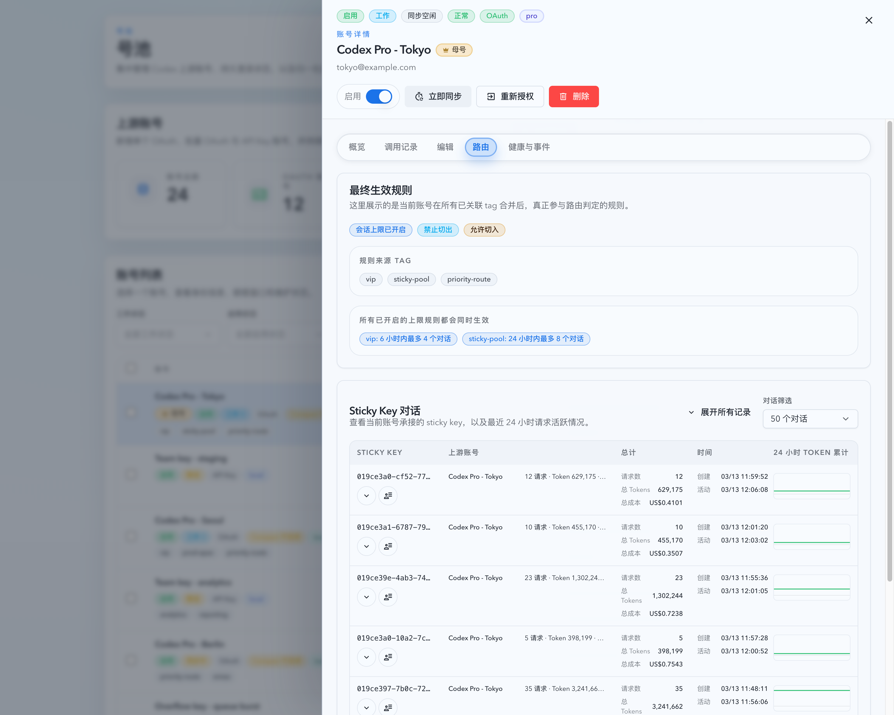
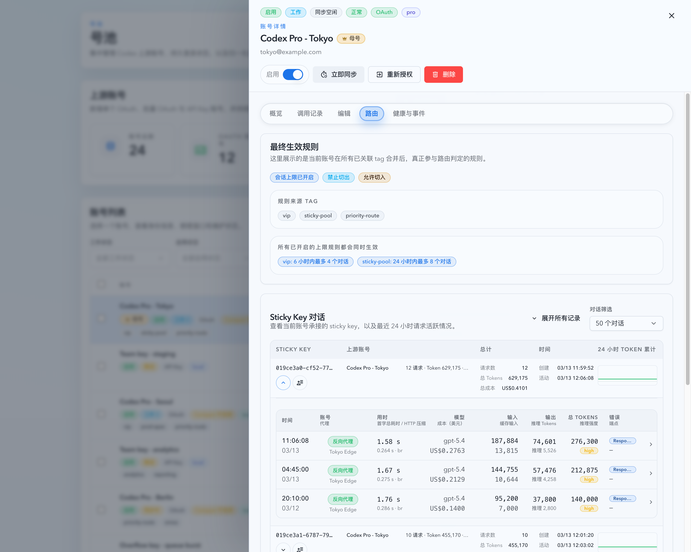

# 上游账号详情调用记录与 Sticky 对话对齐 Live 交互（#cg6um）

## 状态

- Status: 已实现，待 PR 收敛
- Created: 2026-03-30
- Last: 2026-03-31

## 背景 / 问题陈述

- 共享上游账号详情抽屉目前只有 `概览 / 编辑 / 路由 / 健康与事件` 四个页签，缺少与实况“最新记录”同款的调用记录视图，排障时无法直接确认该账号最近到底承接了哪些请求。
- `路由` tab 里的 Sticky Key 对话表仍停留在旧版聚合摘要表，只支持按 `20/50/100` 数量查看，无法像 Live Prompt Cache 对话列表那样按最近若干小时筛选、单行展开 preview、批量展开或查看完整历史。
- 当前 Sticky 对话若想回看 raw 调用，只能离开抽屉去 Records 页再做模糊筛选，既不精确，也和 Prompt Cache 对话已经收敛好的交互不一致。

## 目标 / 非目标

### Goals

- 在共享上游账号详情抽屉中新增 `调用记录` tab，并直接复用现有 `InvocationTable` 展示该账号的最新调用记录。
- 将 `路由` tab 里的 Sticky 对话区升级为与 Live Prompt Cache 对话一致的选择模型：
  - `20 / 50 / 100 个对话`
  - `近 1 / 3 / 6 / 12 / 24 小时活动`
- Sticky 对话支持：
  - 单行展开最近 5 条调用记录；
  - 当前可见结果集批量展开 / 收起；
  - 使用完整历史抽屉查看该 Sticky Key 的全部保留调用记录。
- `GET /api/pool/upstream-accounts/:id/sticky-keys` 与 `GET /api/invocations` 扩展契约，使 Sticky 对话 preview、历史抽屉与账号调用记录 tab 都能精确复用同一套 raw invocation 查询链路。
- 维持共享抽屉默认页签复位为 `概览`，并覆盖账号池页、Live 页、Records 页三个入口。

### Non-goals

- 不重做 Live 页现有 Prompt Cache 对话列表的产品行为。
- 不扩展未使用旧链路 `InvocationAccountDetailDrawer.tsx`。
- 不新增数据库 schema、rollup 表或独立的“账号调用记录”后端路由。
- 不改 Sticky 路由算法、账号同步状态机或 quota 展示逻辑。

## 范围（Scope）

### In scope

- `src/upstream_accounts/mod.rs`：Sticky 对话查询参数、响应元数据、`recentInvocations[]` 与回归测试。
- `src/api/mod.rs`：`/api/invocations` 增加 `stickyKey` / `upstreamAccountId` 过滤，并保持与 Sticky 聚合使用同一提取逻辑。
- `web/src/lib/api.ts`、hooks、相关测试：Sticky 对话与调用记录查询类型、normalize 与 fetch 契约扩展。
- `web/src/pages/account-pool/UpstreamAccounts.tsx`：共享账号详情抽屉新增 `调用记录` tab、Sticky 选择/展开状态与 URL 驱动入口保持一致。
- `web/src/components/StickyKeyConversationTable.tsx`、Storybook、Vitest：Sticky 专用富交互组件。
- `web/src/i18n/translations.ts`、本 spec 与 `docs/specs/README.md`。

### Out of scope

- Prompt Cache 对话 SSE 合并策略、选择记忆或现有批量展开语义调整。
- `InvocationTable` 的列结构或详情字段改版。
- 账号列表页、Dashboard 或 Stats 页面新增额外入口。

## 接口契约（Interfaces & Contracts）

### `GET /api/pool/upstream-accounts/:id/sticky-keys`

- 查询参数采用与 Live Prompt Cache 对话同类的互斥选择模型：
  - `limit=20|50|100`
  - `activityHours=1|3|6|12|24`
- `limit` 与 `activityHours` 同时出现时返回 `400`。
- 若都未提供，默认回退到 `limit=50`。
- 响应新增：
  - `selectionMode: "count" | "activityWindow"`
  - `selectedLimit: number | null`
  - `selectedActivityHours: number | null`
  - `implicitFilter: { kind: "inactiveOutside24h" | "cappedTo50" | null; filteredCount: number }`
- 每条 `conversation` 新增：
  - `recentInvocations: Array<ApiInvocationPreviewLike>`
- `recentInvocations` 固定按 `occurredAt DESC, id DESC` 排序，最多返回 5 条。
- Sticky Key 提取口径统一为：
  - 优先 `payload.stickyKey`
  - 缺失时回退 `payload.promptCacheKey`
  - 最终统一 `TRIM(...)`

### `GET /api/invocations`

- 新增可组合过滤参数：
  - `stickyKey`
  - `upstreamAccountId`
- `stickyKey` 过滤必须与 Sticky 对话聚合链路使用完全相同的 key 提取 SQL。
- `upstreamAccountId` 过滤继续基于 invocation payload 中的账号归因字段。
- 账号详情 `调用记录` tab 直接复用该接口，不新增专用账号记录路由。

## 验收标准（Acceptance Criteria）

- Given 打开任一上游账号详情抽屉，When 初次渲染或切换账号，Then 默认激活 tab 仍为 `概览`。
- Given 用户切换到 `调用记录` tab，When 该账号存在调用记录，Then 抽屉内显示与实况主记录表同款 `InvocationTable`，并只展示该账号过滤后的记录。
- Given `调用记录` tab 为空、加载中或请求失败，When 对应状态渲染，Then 必须分别显示明确的 empty/loading/error 状态，不渲染假表格。
- Given Sticky 对话区处于 `近 3 小时活动` 模式，When 列表渲染完成，Then 只显示该时间窗口内活跃的 Sticky Key。
- Given Sticky 对话区从 `近 3 小时活动` 切回 `50 个对话`，When 数据刷新完成，Then 恢复按数量模式展示结果。
- Given Sticky 对话行存在 `recentInvocations`，When 点击展开按钮，Then 当前行在表内展开最近 5 条调用记录，并复用 `InvocationTable`。
- Given 当前可见 Sticky 对话结果集存在多行，When 点击“展开全部 / 收起全部”，Then 只作用于当前可见结果集；筛选结果变化后，已经不可见的展开 key 会被自动清理。
- Given 用户打开 Sticky 对话“全部调用记录”抽屉，When 历史记录加载完成，Then 按 `occurredAt DESC` 展示该 Sticky Key + 当前账号的全部保留调用记录，而不是模糊 keyword 搜索结果。
- Given 账号池页、Live 页、Records 页任一入口触发共享账号详情抽屉，When 查看 `调用记录` 与 Sticky 对话区，Then 三个入口行为保持一致。

## 非功能性验收 / 质量门槛（Quality Gates）

### Testing

- Rust: `cargo test upstream_account_sticky -- --nocapture`
- Rust: `cargo test invocation_records -- --nocapture`
- Web: `cd web && bun run test -- src/components/StickyKeyConversationTable.test.tsx src/hooks/useUpstreamStickyConversations.test.tsx src/hooks/useUpstreamStickyConversations.test.ts src/pages/account-pool/UpstreamAccounts.test.tsx src/lib/api.test.ts`
- Storybook: `cd web && bun run build-storybook`

### UI / Storybook

- Stories to add/update:
  - `web/src/components/StickyKeyConversationTable.stories.tsx`
  - `web/src/components/UpstreamAccountsPage.overlays.stories.tsx`
- `play` coverage:
  - 账号详情抽屉切换到 `调用记录`
  - Sticky 对话切换到活动窗口模式
  - Sticky 单行展开
  - Sticky 历史抽屉打开

## 文档更新（Docs to Update）

- `docs/specs/README.md`
- `docs/specs/cg6um-upstream-account-detail-records-sticky-conversations/SPEC.md`

## 计划资产（Plan assets）

- Directory: `docs/specs/cg6um-upstream-account-detail-records-sticky-conversations/assets/`
- In-plan references: ``

## Visual Evidence

- source_type: storybook_canvas
  target_program: mock-only
  capture_scope: browser-viewport
  sensitive_exclusion: N/A
  submission_gate: approved
  story_id_or_title: Account Pool/Pages/Upstream Accounts/Overlays / Detail Drawer
  state: detail drawer routing tab list
  evidence_note: 验证共享上游账号详情抽屉的 `路由` tab 内，Sticky 对话列表使用与 Live 一致的列表结构与交互入口。
  

- source_type: storybook_canvas
  target_program: mock-only
  capture_scope: browser-viewport
  sensitive_exclusion: N/A
  submission_gate: approved
  story_id_or_title: Account Pool/Pages/Upstream Accounts/Overlays / Detail Drawer
  state: detail drawer routing tab row expanded
  evidence_note: 验证详情抽屉里的 Sticky 对话行展开后，内嵌预览直接复用 `InvocationTable` 展示最近调用记录。
  

## 实现里程碑（Milestones / Delivery checklist）

- [x] M1: 新建 spec、索引与视觉证据落点。
- [x] M2: 后端 Sticky 对话与 invocation filters 契约扩展完成。
- [x] M3: 共享抽屉 `调用记录` tab 与 Sticky 专用富交互组件完成。
- [x] M4: Vitest、Rust tests、Storybook 与 mock-only 视觉证据完成。
- [ ] M5: fast-track 收敛到 merge-ready。

## 方案概述（Approach, high-level）

- 账号详情 `调用记录` tab 不新增独立后端接口，直接消费现有 `/api/invocations`，通过 `upstreamAccountId` 精确过滤。
- Sticky 对话继续保留专用组件，不把旧 `KeyedConversationTable` 强行扩成超级泛型；只复用 sparkline、tooltip 与 `InvocationTable`。
- Sticky preview 在主响应内直出 `recentInvocations[]`，避免批量展开退化成逐行补请求。
- Sticky 历史抽屉与账号记录 tab 统一走 `/api/invocations`，确保排序、badge、详情展开与账号点击语义一致。

## 风险 / 开放问题 / 假设（Risks, Open Questions, Assumptions）

- 风险：Sticky 活动窗口模式与数量模式混用时，若展开状态不做结果集清理，容易留下悬空展开 key；实现必须在结果集变更后主动收敛。
- 风险：`/api/invocations` 新增过滤若和 Sticky 聚合使用不同 key 提取口径，会导致 preview / 历史结果不一致。
- 假设：数量模式继续保留“按数量看 Sticky 对话”的默认心智，不强制改成 Prompt Cache 的 24 小时隐含活跃口径。
- 假设：若截图资产需要进入 PR 或仓库提交，仍须先得到主人明确授权。

## 变更记录（Change log）

- 2026-03-30: 创建 spec，冻结共享账号详情 `调用记录` tab、Sticky 选择模型、历史抽屉与 visual evidence gate。
- 2026-03-30: 完成后端查询扩展、共享抽屉 `调用记录` tab、Sticky 富交互组件、Storybook/Vitest/Rust 验证，并生成待主人审批的 mock-only 视觉证据。
- 2026-03-31: 主人批准后，将详情抽屉 `路由` tab 的最终 mock-only 截图写入 spec assets，并在 `## Visual Evidence` 中落盘引用。
