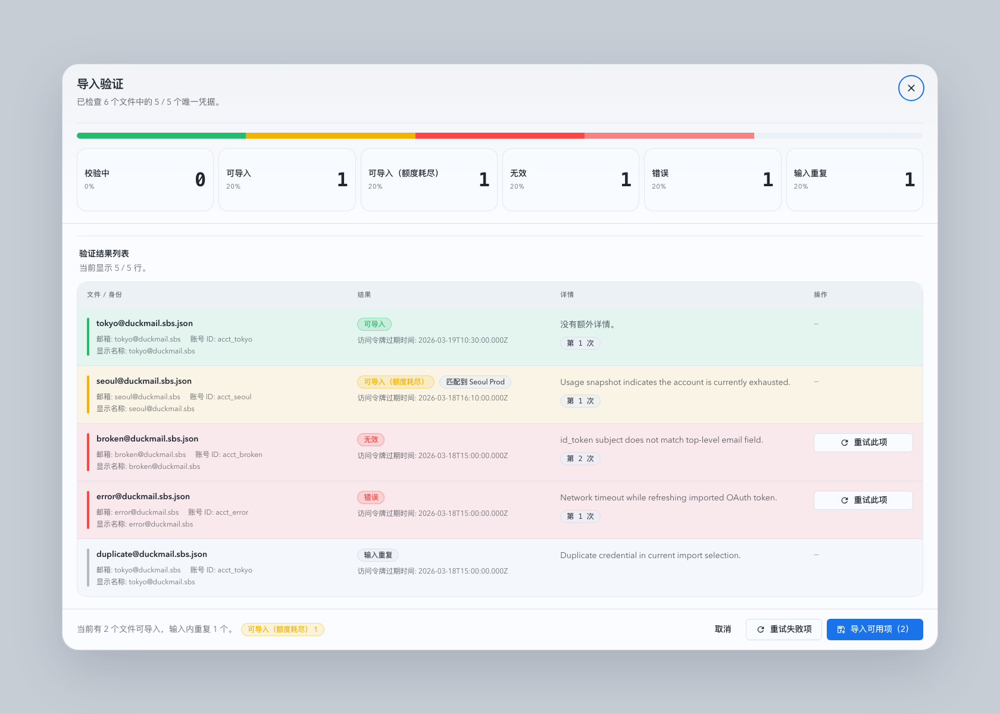

# OAuth 凭据 JSON 批量导入与验活（#cgz7s）

## 状态

- Status: 进行中
- Created: 2026-03-18
- Last: 2026-03-19

## 背景

- 当前号池新增页只支持单账号 OAuth、批量 OAuth 与 API Key 三条创建路径，还不能直接接收已经拿到的 Codex OAuth 凭据 JSON。
- 运营侧手里已有形如 `type/email/account_id/access_token/refresh_token/id_token/expired/last_refresh` 的本地 JSON 文件，需要批量导入并在入库前确认账号是否仍然可用。
- 现有 UI 没有“批量校验混合结果”承载面，无法像参考 `mixed-results` 那样直观看到成功、耗尽、失效、错误与输入内重复。

## 目标 / 非目标

### Goals

- 在上游账号新增页增加 `导入` 模式，支持浏览器一次选择多个 OAuth 凭据 `.json` 文件。
- 新增后端批量 `validate` / `import` 接口，先校验文件结构与凭据可用性，再导入通过项。
- 验证阶段要区分 `ok`、`ok_exhausted`、`invalid`、`error`、`duplicate_in_input`，并回传现有账号匹配信息。
- 导入阶段命中现有账号时更新凭据并重新同步；未命中时创建新的 OAuth 账号。
- 导入结果弹窗对齐 `mixed-results` 交互：顶部统计、结果筛选、逐行状态、重试失败项，以及大结果集分页。

### Non-goals

- 不支持目录扫描、拖拽目录、手填绝对路径或 API Key 文件导入。
- 不在首版里提供逐行自定义 display name / note / mother 标记。
- 不在命中现有账号时覆盖既有分组、标签、备注与母号配置。

## 功能规格

### 输入与匹配

- 每个文件必须是单个 JSON object，且至少包含：`type=codex`、`email`、`account_id`、`access_token`、`refresh_token`、`id_token`、`expired`。
- 服务端会解析 `id_token` claims，并要求它与顶层 `email/account_id` 一致；不一致按 `invalid` 返回。
- 命中现有账号时优先按 `chatgpt_account_id` 匹配；若缺失或旧数据不完整，可回退到归一化 `email` 匹配。

### 验证与导入

- `validate` 只做结构校验、输入内去重、现有账号匹配、refresh / usage 验活与结果分类，不写库。
- `import` 只接受已验证通过的行键，逐行执行“更新现有账号凭据”或“创建新 OAuth 账号”，然后触发一次同步收口。
- 两条导入路由 `POST /api/pool/upstream-accounts/oauth/imports/validate` 与 `POST /api/pool/upstream-accounts/oauth/imports` 使用独立 `32 MiB` body limit，不放大全局 API 限额。
- 前端对验证与导入都采用固定 `100` 条/批的顺序分发；显示分页与网络分批使用同一常量，避免一次性把几百个文件全文拼进单个 JSON 请求。
- 新建账号默认 `displayName=email`、`isMother=false`，并应用导入页默认 `groupName/groupNote/tagIds`。
- 更新现有账号时只更新密文凭据、token 过期时间、身份字段、同步状态，不修改原有业务元数据。

### 前端交互

- 新增页顶部 tab 扩展为四种模式：`OAuth 登录`、`批量 OAuth`、`API Key`、`导入`。
- 导入模式包含文件选择器、已选文件摘要、默认分组 / tags 表单，以及“开始验证”入口。
- 验证成功后弹出结果对话框；对话框内支持状态筛选、单条重试、批量重试失败项、导入通过项，且验证结果按每页 100 条分页展示。
- 导入完成后不展示独立导入报告；已成功导入的行会从当前结果列表中移除，若剩余行为空则关闭弹窗。

## 验收标准

- Given 用户选择多个合法 OAuth JSON 文件，When 点击开始验证，Then 页面展示 mixed-results 风格结果弹窗，并能按状态筛选。
- Given 用户一次选择上百个文件，When 验证或导入触发多批次请求，Then 结果仍聚合为单一列表视图，分页保持每页 100 条，且不会因为单次请求体过大而返回 `413`。
- Given 某些文件已失效或结构错误，When 验证结束，Then 这些行显示 `invalid` 或 `error`，且不会阻塞其它可用行导入。
- Given 两个输入文件指向同一账号，When 验证结束，Then 其中重复行标记为 `duplicate_in_input`，不进入导入通过集合。
- Given 某输入命中现有账号，When 执行导入，Then 原账号凭据被更新并重新同步，既有分组 / tag / note / 母号不变。
- Given 某输入未命中现有账号，When 执行导入，Then 系统创建新的 OAuth 账号，默认名称为导入邮箱，并继承导入页默认分组与 tags。
- Given 某一批验证或导入请求失败，When 其它批次已成功完成，Then 已完成批次结果保留，失败批次仅把对应行标记为 `error`，不会回滚其它批次。

## 质量门槛

- `cargo fmt`
- `cargo check`
- `cargo test`
- `cd web && bun run test`
- `cd web && bun run build`
- Storybook: 导入结果弹窗至少覆盖 `Mixed Results`、`Checking In Progress`、`Paged Results` 三类状态
- HTTP 路由回归：约 `4 MiB` 的导入 `validate` / `import` 请求必须返回业务 JSON，而不是 `413 Failed to buffer the request body`

## 413 Root Cause

- 线上 `413 Failed to buffer the request body: length limit exceeded` 并不是 101 机器异常，也不是 `/v1` 代理链路的 `256 MiB` 请求体限制。
- 根因是导入验证 / 导入接口直接以 `Json(...)` 提取整包文件内容，而路由没有专门放宽 Axum 的请求体缓冲上限。
- 共享测试机源码复现结果：
  - 小请求 `277 B` 命中 `validate` 路由返回 `200`
  - 大请求约 `4.19 MiB` 命中同一路由稳定返回 `413 Failed to buffer the request body: length limit exceeded`
- 修复方式分两层：
  - 后端只对导入相关两条路由提高 body limit 到 `32 MiB`
  - 前端把验证与导入都改为 `100` 条一批顺序发送，避免再构造超大单请求

## Change log

- 2026-03-19：补充导入路由专用 `32 MiB` body limit、前端 `100` 条分批验证/导入、共享测试机 413 复现结论与大请求 HTTP 回归要求。

## 实现备注

- 后端主改动位于 `src/upstream_accounts/mod.rs` 与 `src/main.rs` 的号池路由。
- 前端主改动位于 `web/src/lib/api.ts`、`web/src/hooks/useUpstreamAccounts.ts`、`web/src/pages/account-pool/UpstreamAccountCreate.tsx` 与新导入结果弹窗组件 / stories。
- 该 hotfix 额外补了 HTTP 级大请求测试与前端多批次验证/导入回归，避免 `413` 问题只在部署环境暴露。

## Visual Evidence (PR)

