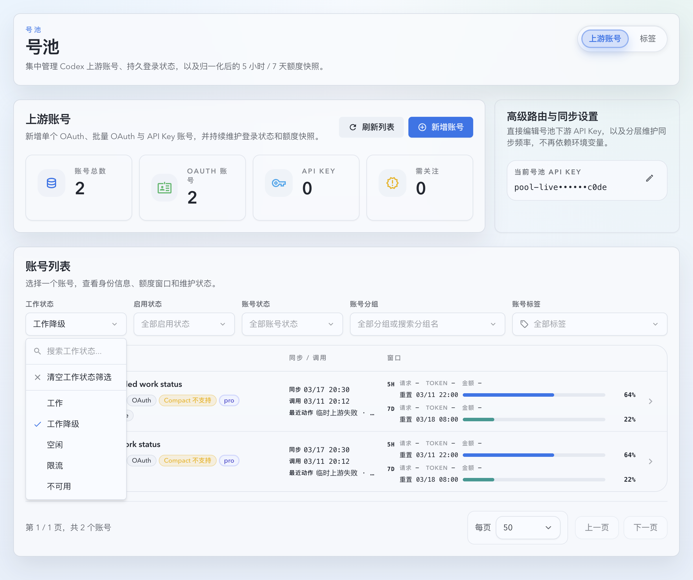
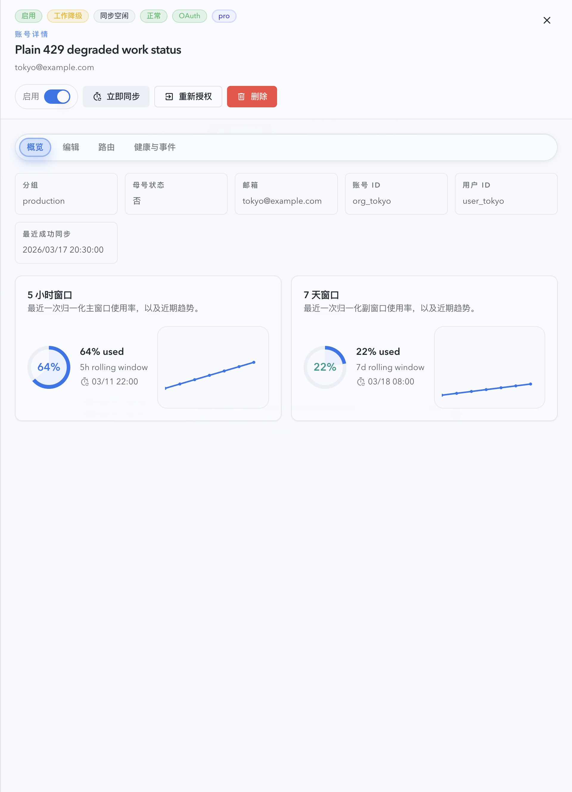
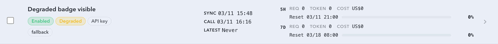

# 号池临时故障“工作降级”与新对话准入收口（#cng8a）

## 状态

- Status: 进行中
- Created: 2026-03-30
- Last: 2026-03-30

## 背景 / 问题陈述

- 当前 route 侧 plain `429`、`5xx`、transport、timeout、stream failure 会在首次命中后直接写入 cooldown，并立即清除 sticky route。
- 这种处理把“暂时抖动但仍可继续服务老 sticky 会话”的账号和“必须完全冷却”的账号混在一起，导致列表观测、fresh assignment 以及池级终态都过于激进。
- 运营诉求是把这类临时故障先收口为“工作降级（degraded）”，只降低新对话亲和力，不立即进入冷却；只有达到明确阈值后才进入内部 cooldown，并且已有 sticky 对话不能仅因 temporary cooldown 被强制拆走。

## 目标 / 非目标

### Goals

- 为 route 侧临时故障引入两阶段状态机：先 `workStatus=degraded`，达到 streak 阈值后才进入 cooldown。
- 保持 quota exhausted / usage-limit `429` 与 `401/402/403` 的既有 hard-stop / rate-limited 语义，不并入 degraded。
- fresh assignment 跳过 degraded 账号；sticky reuse 在账号属于 temporary-failure family 时，即使已进入 temporary cooldown 也允许继续命中原账号。
- 当池内只剩 degraded 账号时，fresh assignment 返回专用 temporary-unavailable 终态 `503`，不再误报成全体 rate limited 或 generic unavailable。
- 列表 / 详情 / 筛选 / Storybook / i18n / 测试统一接受 `workStatus=degraded`。

### Non-goals

- 不改 generic forward proxy 的 `upstream_429_max_retries`。
- 不重做 tag guard 或负载排序算法；仅收口 temporary-failure 场景下 sticky owner 的复用与 cut-out 终态。
- 不把 sync 侧临时失败单独建成新的 degraded streak 来源；degraded 仍由 route failure 驱动。

## 范围（Scope）

### In scope

- `src/upstream_accounts/mod.rs`
- `src/main.rs`
- `web/src/lib/api.ts`
- `web/src/pages/account-pool/UpstreamAccounts.tsx`
- `web/src/components/UpstreamAccountsTable.tsx`
- `web/src/components/UpstreamAccountsTable.stories.tsx`
- `web/src/components/UpstreamAccountsPage.story-helpers.tsx`
- `web/src/components/UpstreamAccountsPage.list.stories.tsx`
- `web/src/components/UpstreamAccountsTable.test.tsx`
- `web/src/pages/account-pool/UpstreamAccounts.test.tsx`
- `web/src/lib/api.test.ts`
- `web/src/i18n/translations.ts`
- `docs/specs/g4ek6-account-pool-upstream-accounts/contracts/http-apis.md`

### Out of scope

- `upstream429RetryEnabled` / `upstream429MaxRetries`
- 新的健康态枚举
- 账号详情布局重做

## 需求（Requirements）

### MUST

- plain 非 quota `429`、`502/503/504/524`、transport、timeout、stream failure、`server_overloaded` 都必须进入 temporary-failure family。
- temporary-failure family 首次命中时不得立即写 `cooldown_until`，而是写入 `workStatus=degraded` 所需的 route failure 读模型，并保留 sticky route。
- 同一 temporary-failure streak 连续达到 `5` 次，或从 streak 首次失败到当前失败已持续 `30s`，下一次 temporary failure 必须升级为 cooldown，但不得仅因进入 temporary cooldown 就清理已有 sticky route。
- 旧对话命中 temporary cooldown owner 时，必须先沿用原账号并消耗既有同账号重试预算；只有健康 cut-out 候选真实存在时才允许切走。
- 旧对话在 temporary-failure owner 之后找不到健康 cut-out 候选时，必须保留最后一次具体 upstream failure，而不是退化成 generic `pool_no_available_account`。
- temporary-failure cooldown 退避上限必须压到 `60s`，避免单账号主力池被长时间冷却放大为持续断流。
- `workStatus=rate_limited` 只保留 quota exhausted / snapshot exhausted / usage-limit 429 语义；plain `429` 不再导出为 `rate_limited`。
- fresh assignment 必须跳过 degraded 账号；sticky reuse 若目标账号仅 degraded 且尚未 cooldown，必须允许继续复用。
- fresh assignment 在池内只剩 degraded 账号时必须返回专用 `503` temporary-unavailable 终态。

### SHOULD

- 服务端回归测试覆盖 first-hit degraded、threshold cooldown、sticky reuse、degraded-only terminal 与 quota-429 non-regression。
- Storybook 和前端回归测试覆盖 degraded badge/filter/detail 以及查询参数透传。

## 接口契约（Interfaces & Contracts）

### `GET /api/pool/upstream-accounts`

- `workStatus` 枚举扩展为 `working | degraded | idle | rate_limited | unavailable`。
- `degraded` 表示账号启用、同步空闲、健康状态仍为 `normal`，但最近 route side 发生 temporary failure，fresh assignment 不应再选择它。
- temporary route failure 期间继续保持 `displayStatus=active` 与 `healthStatus=normal`。

### 号池 request / responses 终态

- 当所有 fresh-routable 候选都只是 degraded，resolver 返回专用 degraded-only terminal。
- degraded-only terminal 对外返回 `503 Service Unavailable`，并使用单独的 `failure_kind` / message，不复用 `pool_all_accounts_rate_limited` 或 generic `pool_no_available_account`。

## 验收标准（Acceptance Criteria）

- Given 一个账号首次命中 plain `429` 或 `502/503/524` / transport / timeout / stream failure，When route failure 落库，Then `cooldown_until` 仍为空，`displayStatus=active`、`healthStatus=normal`、`workStatus=degraded`，且 fresh assignment 不再选它。
- Given 同一账号已有 sticky route 且仅处于 degraded 而非 cooldown，When 该 sticky 对话继续发请求，Then resolver 仍优先回原账号。
- Given 同一 temporary-failure streak 连续达到 `5` 次，或从 streak 首次失败到当前失败已持续 `30s`，When 再次命中 temporary failure，Then 才写 `cooldown_until`，但已有 sticky 绑定仍保留在原 owner 上。
- Given 某个 sticky 对话的 owner 已进入 temporary cooldown，When 新请求继续使用同一 `stickyKey`，Then resolver 仍先回原账号，而不是立刻切到健康备选。
- Given sticky owner 在重试后仍失败且没有健康 cut-out 候选，When 请求结束，Then 调用方收到最后一次具体 upstream failure，而不是 generic `pool_no_available_account`。
- Given temporary cooldown 已经进入指数退避高位，When 下一次 temporary failure 落库，Then `cooldown_until` 与失败时间的间隔不超过 `60s`。
- Given 池内还有至少一个健康账号，When 存在 degraded 账号，Then 新对话仍可正常接纳并只分配到健康账号。
- Given 池内只剩 degraded 账号，When fresh assignment 发生，Then 返回专用 `503` temporary-unavailable 终态。
- Given 上游返回 quota-exhausted / usage-limit `429`，When classifier 处理，Then 继续保持现有 `rate_limited` / hard-stop / resolver terminal 语义。

## 质量门槛（Quality Gates）

- `cargo test pool_route_ -- --test-threads=1`
- `cargo test resolver_ -- --test-threads=1`
- `cd web && bun run test -- src/components/UpstreamAccountsTable.test.tsx src/pages/account-pool/UpstreamAccounts.test.tsx src/lib/api.test.ts`
- `cd web && bun run build-storybook`

## 计划资产（Plan assets）

- Directory: `docs/specs/cng8a-pool-temporary-failure-degraded-admission/assets/`
- In-plan references:
  ``
  ``
  ``

## Visual Evidence

- source_type=storybook_canvas
  target_program=mock-only
  capture_scope=browser-viewport
  sensitive_exclusion=N/A
  submission_gate=pending-owner-approval
  story_id_or_title=Account Pool/Pages/Upstream Accounts/List/DegradedWorkStatusFilter
  state=degraded filter applied
  evidence_note=验证工作状态筛选新增 `degraded` 后，列表只保留临时故障账号且筛选文案显示为“工作降级”。
  

- source_type=storybook_canvas
  target_program=mock-only
  capture_scope=element
  sensitive_exclusion=N/A
  submission_gate=pending-owner-approval
  story_id_or_title=Account Pool/Pages/Upstream Accounts/List/DegradedWorkStatusFilter
  state=degraded detail header
  evidence_note=验证账号详情头部导出 `工作降级` 徽标，同时仍保持启用、同步空闲与正常健康态。
  

- source_type=storybook_canvas
  target_program=mock-only
  capture_scope=element
  sensitive_exclusion=N/A
  submission_gate=pending-owner-approval
  story_id_or_title=Account Pool/Components/Upstream Accounts Table/AvailabilityBadges
  state=degraded roster row
  evidence_note=验证列表行 availability badge 将 `degraded` 渲染为独立 warning badge，而不是复用 `rate_limited`。
  
