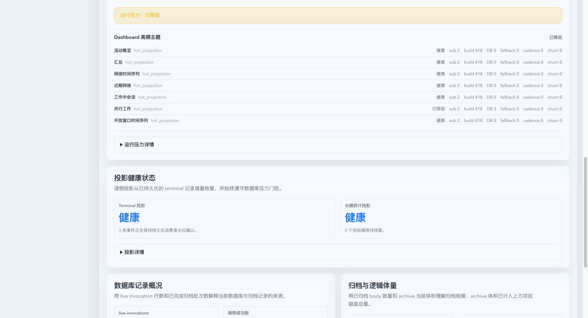
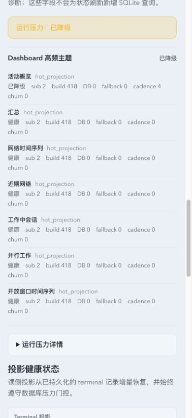
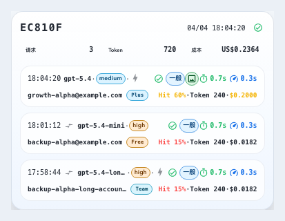
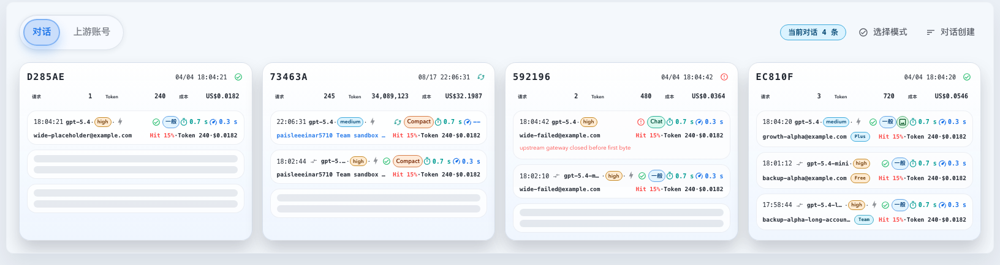
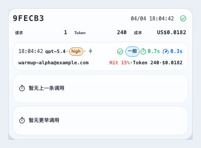
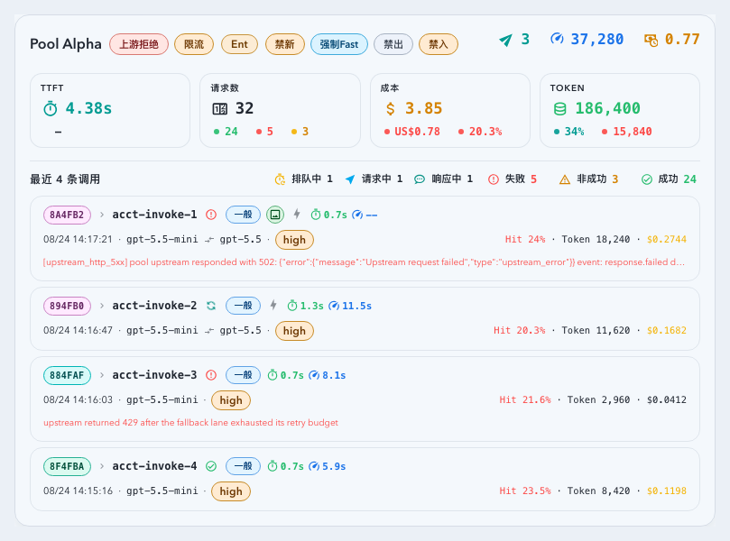
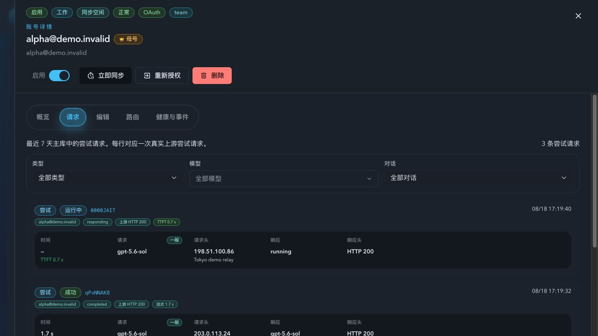
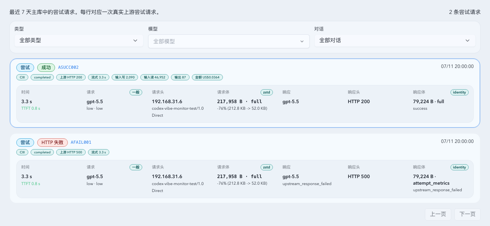
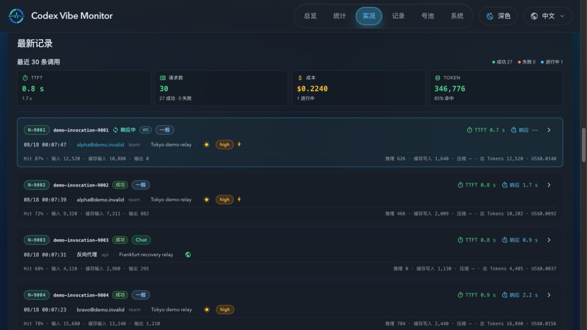

# Dashboard Hot Topic 内存投影与 SSE 稳定性

> 当前有效规范以本文为准；实现覆盖与当前状态见 `./IMPLEMENTATION.md`，关键演进原因见 `./HISTORY.md`。

## 背景 / 问题陈述

Dashboard 已具备 Runtime/Terminal Projection、共享 SSE frame，以及 activity、summary 和 network topic 的 typed materializer。working-conversations、parallel-work 与 open-window timeseries 仍可能由任意 invocation mutation 触发通用 JSON 或 SQLite builder，导致页面活跃时重复执行完整快照构建、序列化和数据库读取。

本规范将这些持续变化的 Dashboard topic 定义为独立的高频数据面，避免“部分 topic 已内存化”被误认为“Dashboard 已全部脱离通用构建链”。

## 目标 / 非目标

### Goals

- 将订阅 topic 强制分类为 `HotProjection`、`ClosedSnapshot` 或 `BoundedColdHydrate`。
- 将 working-conversations、parallel-work open range 与 open-window timeseries 迁入 revision-aware typed projection。
- 保持 Dashboard HTTP/SSE wire shape、topic、排序、range、recent 上限与调用详情/账号跳转交互不变；working-conversations 卡片允许通过客户端投影收紧 owner-facing 信息密度。
- 每个 topic revision 只生成一个共享不可变 serialized frame，订阅者数量不增加 builder、serialization 或数据库读取。
- 通过 additive `runtimePressureHealth.dashboardHotTopics` 准确报告 hot topic 的事实源、负载与退化状态。

### Non-goals

- 不迁移 Live、invocation list、详情或其他非 Dashboard topic。
- 不迁移 SQLite、不扩大连接池、不调高 slow threshold，也不降低统计精度。
- 不新建与既有 Prompt Cache、parallel-work 或 timeseries projection 平行的 rollup 表。
- 不改变 closed-range HTTP 行为或公开 SSE schema epoch。
- 不改变 Dashboard 的既有交互；System Status 可以增加 additive 只读诊断字段和展示。

## 范围（Scope）

### In scope

- working-conversations 的 active-selection projection。
- parallel-work 的 open-range projection 与 closed-window 门控。
- open-window timeseries 的 typed materializer。
- activity topic 的稳定 `recentLimit` selection。
- hot topic health、telemetry、System Status 只读诊断与端到端性能门禁。

### Out of scope

- closed-range exact builder 的替换。
- 非 Dashboard 订阅面和 owner 配置写路径。
- 数据库、连接池、保留策略或 SSE envelope 的迁移。

## 需求（Requirements）

### MUST

- `HotProjection` 必须提供 typed materializer；穷举分派不得落入通用 `build_payload`、通用 JSON overlay 或健康路径 SQL fallback。
- working-conversations 首订阅必须建立同一事务 cursor baseline，后续只应用 compact delta；旧 key 重入、metadata 变化和候选补位只允许按 key 或 identity 有界 hydrate。
- working-conversations 必须保持 5 分钟 working selection、分页排序、blocked binding、账号/owner/sticky metadata、精确 24 小时 points 和每 key 最多 16 条 recent。
- working-conversations 客户端卡片必须从排序后的 recent 预览固定展示 `current`、`previous`、`earlier` 三个槽位；不足三条时保留与普通无方案调用行相同的 `57px` 槽位基线，且该高度不包含相邻槽位的既有间距。缺失历史必须显示明确的静态“暂无上一条调用”或“暂无更早调用”状态，不得使用骨架条、spinner、pulse 或其他加载暗示。该展示数量不改变 HTTP/SSE wire shape、`recentInvocationLimit=16` 或后端 compact 默认值。
- 三个槽位的正常/进行中记录保留两行：第一行按“时间、模型、状态/传输/端点/耗时”排列，第二行按“账号、右端用量”排列；失败记录可以追加无 label 的错误摘要行。缺失槽位使用静态历史说明垂直居中，并保持 `role="group"` 的无交互语义、准确可访问名称和与普通无方案行不超过 1px 的高度差。卡片表面不显示槽位、账号或用量 label，完整值仍须通过 title/aria 与详情抽屉可读。
- 工作对话卡片与上游账号卡片的 recent 调用行使用同一组紧凑延迟合同：秒值最多保留一位小数，数值与 `s` 之间不留空格；按十分之一秒四舍五入后达到 `100s` 时显示整数。TTFT 与响应耗时指标组之间保持 4px 的可见间隔。账号详情调用记录继续使用其既有汇总时长格式。TTFT 使用 `firstTokenMs`，响应耗时始终使用 `tUpstreamStreamMs`；有限且非负的 `firstTokenMs`（包括 `0 ms`）是已测得的合法 TTFT，响应耗时只有有限且严格大于零才是已完成测量，`null`、零、负值或非有限值均显示 `--`。调用级 TTFT 只能归属同一调用的最终真实 upstream attempt，持久化列表与两条工作流 hydration 路径均按 `attempt_index DESC, id DESC` 选择该行，最终 attempt 必须已经进入终态，`budget_exhausted_final` 等伪终态不参与选择，较早 retry 显示 `--`；失败终态的零毫秒 TTFT 只有在最终 attempt 的 first-byte 也为零时保留，正值必须有最终 attempt 的 stream 证据，不能用 earlier retry 的 first-byte 进度冒充完成测量。仅含 `codex_invocations` 的历史归档没有重试明细表，归档聚合必须使用其已存储且经有限值校验的 `firstTokenMs` 与 `tUpstreamStreamMs`，不得引用缺失的重试表或从旧归档推断 attempt 归属。HTTP、SSE、运行时 hydration 叠加与 Demo 数据都必须保留有限的 `0 ms` TTFT，并且只能在该值已测得时声明“响应中”；负值或非有限值不是测量结果，必须按不可用显示且不得采用成功色。格式化、颜色、汇总样本与工作流展示必须分别复用“有限且非负 TTFT”和“有限且为正响应耗时”判定；无效响应耗时不得遮蔽有效 TTFT。持久化 SQL、JSON DTO 与客户端合并都必须在输出前排除负值和非有限测量；hourly `upstreamStream` rollup 也不得计入零时长样本。持久化 SQL 必须在阶段推断、均值、P95、账号汇总和性能汇总中排除非有限测量。不得以 `tUpstreamTtfbMs`、流耗时或 `now - occurredAt` 的经过时长替代。请求或排队中两项未产生时显示 `--`，响应中必须已有并显示 TTFT，而尚未结束或无效的响应耗时显示 `--`；Demo workflow detail 同样不得为其伪造完成流耗时。TTFT 使用与其他成功指标一致的绿色。
- 上述终态要求约束完成态归属；进行中的最终真实 attempt 是唯一例外：只有该 attempt 自身的 phase 已进入 `responding` 或 `streaming_response`，且调用已记录有限非负 `firstTokenMs` 时，实时列表与 workflow hydration 才显示 TTFT。仅为 `running`、`waiting_first_byte` 或缺少当前 attempt 响应阶段证据时不得继承 earlier retry 的 TTFT；响应耗时仍须等待最终 attempt 的有限正 stream 测量。普通调用 summary 的均值/P95、Dashboard 汇总与上游账号 model-performance 必须复用同一最终 attempt timing predicate；终态运行时 delta 必须保留最终 retry 已写回的合法 TTFT，不能继续套用进行中 retry 的屏蔽规则。
- 所有 owner-facing invocation JSON DTO（包括 `ApiInvocation`、Prompt Cache preview 及其嵌套账号 recent 记录）必须在 serde 序列化边界复用有限非负/有限正谓词；不得让原始数据库浮点值绕过该边界进入 HTTP 或 SSE。账号 recent 行的整行调用动作使用独立的原生按钮，账号、错误摘要等子动作保持各自的键盘与点击语义，不得嵌套交互元素。
- parallel-work 必须复用既有 minute-key/hourly rollup baseline，并以 current boundary identities 和 runtime overlay 精确维护 `today`、`1d`、`7d`；`yesterday` 必须作为 `ClosedSnapshot`，不受当前 mutation 触发。
- open-window timeseries 必须复用 `timeseries_minute_projection_v2`，并以 terminal/runtime revisions 更新当前桶；健康发布不得调用通用 timeseries fetch builder。
- minute projection 的后台写入必须以 `P2Derived` 通过共享 SQLite 写协调器和 pressure gate；coverage invalidation 与 key 更新必须是有界事务、片段间让出执行权，并在 P1 terminal 写入等待或持有时保留 delta 以便重试。
- 直接非代理 terminal row replacement 必须通过 durable coverage invalidation 使 `all` selection 回退到 exact；account 的 projection snapshot 失效回退必须替换已载入 aggregate，不得叠加。
- working-conversations 使用固定 `500ms` 合并 deadline；parallel-work 与 timeseries current bucket 使用 `1s`；terminal totals 保持 `5s`；后台精确 reconcile 每 selection 最多 `60s` 一次。
- activity topic descriptor 必须固定 `recentLimit=16`；动态可见数量仅由客户端本地截断，显式 range、分页和筛选操作仍可改变 descriptor。
- 每个依赖 revision tuple 最多 materialize 和 serialize 一次，生成一个 `Arc<SerializedTopicFrame>`；内容未变化时不得推进 cursor。
- 已有 last-good 时，projection 异常不得在订阅请求任务中同步查库或发布部分累计值。

### SHOULD

- 首个 owner subscriber 激活 projection，最后一个 subscriber 离开后停止 payload 构建并释放 active-selection 增量态。
- bounded hydrate、reconcile 和 dirty recovery 应复用现有 pressure gate，并记录明确触发原因和规模。
- 高频健康/no-change 日志应保持 debug；hot fallback、live DB read、持续 cadence miss 和 SSE churn 应进入 warning 或 degraded health。

### COULD

- 在不改变外部合同的前提下，复用现有 projection 的 compact expiry、coverage 和 cursor recovery 辅助结构。

## 功能与行为规格（Functional/Behavior Spec）

### Core flows

- Router 根据 topic class 和 active dependency index 产生轻量 work；HotProjection 只消费 typed fact/revision。
- Materializer 从 typed baseline、compact delta 和 runtime overlay 渲染 payload，并将 immutable frame 交给 cache、replay 和 broadcaster。
- Cold start、dirty recovery 或 bounded candidate refill 可进入 background hydrate；成功后更新 baseline，失败时保留 last-good。
- ClosedSnapshot 通过显式请求建立 exact snapshot，不接收无关 current mutation。

### Edge cases / errors

- Cursor gap、容量触限、coverage 缺口或数据库不可用时进入 `dirty_last_good`；不得静默漏计或伪装 healthy。
- Metadata 变更只影响相关 key/account，不得触发 working full-window hydrate。
- Timezone、DST、account scope、unassigned 和 conversation spans 必须与既有 exact builder 保持精确一致。
- SSE selection 只有显式导航、分页、range 或 filter 变化时才允许触发 `topic-change` reconnect；recent 可见数量变化不得改变连接签名。
- 三槽位选择的 `slotKind` 为 `current | previous | earlier`；第三槽位在详情抽屉、aria 名称和缺失说明中称为“更早调用”，但卡片表面不显示该槽位名称。第三槽位仍参与进行中与 blocked-binding 诊断。

## 接口契约（Interfaces & Contracts）

### 接口清单（Inventory）

| 接口（Name）                               | 类型（Kind） | 范围（Scope） | 变更（Change） | 契约文档（Contract Doc） | 负责人（Owner）              | 使用方（Consumers） | 备注（Notes）                           |
| ------------------------------------------ | ------------ | ------------- | -------------- | ------------------------ | ---------------------------- | ------------------- | --------------------------------------- |
| Dashboard HTTP/SSE contracts               | HTTP/SSE     | external      | None           | None                     | Dashboard runtime data plane | Web App             | Wire shape、topic、排序和 range 不变    |
| `runtimePressureHealth.dashboardHotTopics` | JSON field   | external      | New            | None                     | System Status                | Web App / operators | Additive，只读，字段缺失按 unknown 兼容 |
| Hot topic class/materializer               | Rust types   | internal      | New            | None                     | Subscription runtime         | Dashboard producers | HotProjection 编译期禁止通用 fallback   |

### 契约文档（按 Kind 拆分）

- None；外部变更仅为现有 System Status 响应中的 additive 诊断字段。

## 验收标准（Acceptance Criteria）

- Given baseline 已完成且完整 Dashboard topic bundle 激活，When 处理 10,000 次 runtime mutation，Then 三条 HotProjection 的 live DB read 与 generic fallback build 均为零。
- Given 同一 topic revision，When subscriber 从 1 增至 N，Then builder、serialization、payload clone 和 DB read 次数不增长。
- Given working、parallel-work 与 timeseries 的代表性 live/terminal/metadata 变化，When 对比 exact builder，Then 字段、排序、分页、P95、timezone/DST 和 account/unassigned 语义一致。
- Given recent 可见数量在 4 到 16 之间变化，When 用户没有显式导航或筛选，Then SSE connection signature 不变且 `topic-change` reconnect 为零。
- Given 任一 hot fallback、live DB read、持续 cadence miss 或 SSE churn，When 读取 System Status，Then `dashboardHotTopics` 与总体 runtime health 不得报告 healthy。

## 验收清单（Acceptance checklist）

- [ ] 三条 HotProjection 均具有 typed projection 和 materializer。
- [ ] HotProjection 穷举分派不能落入通用 SQL/JSON builder。
- [ ] Wire shape、排序、range、recent 与 cursor 语义保持兼容。
- [ ] System Status 能准确展示 healthy、deferred、hot-DB-read 与 cadence-miss。
- [ ] 完整 Dashboard topic bundle 的性能门禁通过。

## 非功能性验收 / 质量门槛（Quality Gates）

### Testing

- Rust stateful/contract tests 覆盖 projection delta、cursor baseline、bounded hydrate、closed-window 门控和 dirty recovery。
- Subscription topology benchmark 覆盖完整 Dashboard topic bundle、1 到 N subscriber 以及 10,000 mutation。
- Web tests 覆盖固定 `recentLimit=16`、本地截断和无非预期 SSE reconnect。
- CI 的 Dashboard Playwright producer 必须同时运行 records overlay、demo runtime 与 working-conversations layout 三组回归，并为每组写入独立结果目录和 HTML report；后台服务退出状态必须通过 `dashboard_status` 传递到最终 `exit`，不能被后续命令覆盖。

### UI / Storybook (if applicable)

- System Status mock states 覆盖 healthy、deferred、hot-DB-read 与 cadence-miss。
- working-conversations Storybook states 必须显式初始化 `conversations` workspace view；依赖持久化 workspace view 的 Story 不得因前一条 Story 的 `localStorage` 状态渲染错误的上游账号骨架。
- 使用真实桌面和移动浏览器视口生成 mock-only 视觉证据。

### Quality checks

- `cargo fmt --check`、`cargo check`、相关 targeted tests、`cargo test -q`。
- Web unit tests、TypeScript check 与 Storybook tests。
- 线上受控验证包含 15 分钟 Dashboard 关闭基线和 10 分钟单页对照；额外 Dashboard CPU 不超过 10pp，CPU-seconds/request 相对 `v2.58.6` 至少下降 30%。

## Visual Evidence

source_type: storybook_canvas
target_program: mock-only
capture_scope: browser-viewport
requested_viewport: 1660x900
viewport_strategy: storybook-viewport
margin_policy: trim_only
evidence_surface: page
sensitive_exclusion: N/A
story_id_or_title: System/SystemWorkspace/StatusHotTopicsHotDbRead
state: hot-db-read
evidence_note: System Status renders all seven Dashboard hot topics and marks parallel work degraded when the mock reports three live-path database reads.

source_type: storybook_canvas
target_program: mock-only
capture_scope: browser-viewport
requested_viewport: 393x852
viewport_strategy: storybook-viewport
margin_policy: trim_only
evidence_surface: page
sensitive_exclusion: N/A
story_id_or_title: System/SystemWorkspace/StatusHotTopicsCadenceMiss
state: cadence-miss
evidence_note: The mobile System Status layout keeps every topic and the activity cadence miss readable at the source-managed mobile viewport.

### Dashboard working conversations

source_type: storybook_canvas
target_program: mock-only
capture_scope: element
requested_viewport: 1660x900
viewport_strategy: storybook-viewport
margin_policy: require_margin
evidence_surface: component
sensitive_exclusion: N/A
story_id_or_title: dashboard-workingconversationssection--current-and-previous
state: current invocation with static previous and earlier missing-history slots
evidence_note: Storybook canvas element capture at the desktop1660 viewport shows the three-slot card with shared 57px slot baselines, static history labels, no skeleton treatment, and compact `0.7s`/`0.3s` values separated by 4px.

PR: include

source_type: storybook_canvas
target_program: mock-only
capture_scope: browser-viewport
requested_viewport: 1660x900
viewport_strategy: exact main-line desktop1660 breakpoint
margin_policy: trim_only
evidence_surface: page
sensitive_exclusion: N/A
story_id_or_title: dashboard-workingconversationssection--four-card-parallel-three-slot-proof
state: native four-card row with a current/previous/earlier three-real-invocation card
evidence_note: This capture matches the main application shell maximum and `desktop1660` breakpoint. The 1612px workspace contains four 380.5px cards in one row with 0px horizontal overflow. The fourth card contains three real invocation slots and no placeholders.

PR: include

source_type: storybook_canvas
target_program: mock-only
capture_scope: element
requested_viewport: 393x852
viewport_strategy: storybook-viewport
margin_policy: require_margin
evidence_surface: component
sensitive_exclusion: N/A
story_id_or_title: dashboard-workingconversationssection--current-only-placeholder-mobile-393
state: one invocation with static previous and earlier missing-history labels
evidence_note: Storybook canvas element capture at 393x852 keeps the real invocation and both static history labels readable, with no skeleton, spinner, pulse, aria-live, or horizontal overflow.

PR: include

### Dashboard upstream account recents

source_type: storybook_canvas
target_program: mock-only
capture_scope: element
requested_viewport: 1660x900
viewport_strategy: storybook-viewport
margin_policy: require_margin
evidence_surface: component
sensitive_exclusion: N/A
story_id_or_title: dashboard-workingconversationssection--upstream-account-recent-layout
state: upstream account card with completed, failed, and in-flight recent invocations
evidence_note: Storybook canvas element capture keeps the upstream account recent rows readable while applying the same compact no-space seconds and 4px TTFT/response group spacing; TTFT remains green and an in-flight response duration remains `--`.

PR: include

### Account detail invocations

source_type: ui_demo
target_program: mock-only
capture_scope: browser-viewport
requested_viewport: 1280x720
viewport_strategy: browser-default
margin_policy: trim_only
evidence_surface: page
sensitive_exclusion: N/A
demo_route: /account-pool/upstream-accounts?upstreamAccountId=101&demoScene=operational&demoTheme=dark&demoEmbed=1
state: account request timeline with responding and completed attempts
evidence_note: The deterministic account detail request panel loads without a 501 response, has no horizontal overflow, and keeps in-flight first-token data separate from an unavailable completed stream duration.

PR: include

source_type: storybook_canvas
target_program: mock-only
capture_scope: browser-viewport
requested_viewport: 1280x720
viewport_strategy: storybook-viewport
margin_policy: trim_only
evidence_surface: page
sensitive_exclusion: N/A
story_id_or_title: account-pool-components-upstream-account-attempt-timeline--full-workflow-success-attempt-page
state: focused successful account attempt after request and response body details are closed
evidence_note: The account attempt focus outline is rendered above its full-width detail block, so all four rounded sides remain visible while the inner rail keeps its own clipping behavior.

PR: include

### Live invocation timing

source_type: ui_demo
target_program: mock-only
capture_scope: browser-viewport
requested_viewport: 1280x720
viewport_strategy: browser-default
margin_policy: trim_only
evidence_surface: page
sensitive_exclusion: N/A
demo_route: /live?demoScene=operational&demoTheme=dark&demoEmbed=1
state: responding invocation with measured `firstTokenMs` and no `tUpstreamStreamMs`
evidence_note: The product invocation list shows a green measured TTFT and `响应 --` for an in-flight response, without using elapsed time as a response duration.

PR: include

## Related PRs

- None

## 风险 / 开放问题 / 假设（Risks, Open Questions, Assumptions）

- 风险：基线恢复或 bounded hydrate 不完整会导致 last-good 长时间 deferred；health 必须显示该状态且后台精确恢复。
- 假设：既有 Prompt Cache、parallel-work 与 timeseries projection 足以承载迁移，不新增平行 rollup 表。
- 假设：公开 Dashboard/SSE 合同保持不变，System Status 只增加 additive 诊断。

## 参考（References）

- `../high-frequency-runtime-data-plane/SPEC.md`
- `../5932d-sse-proxy-live-sync/SPEC.md`
- `../z6ysw-dashboard-account-activity-tabs/SPEC.md`
