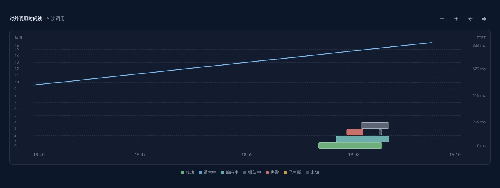
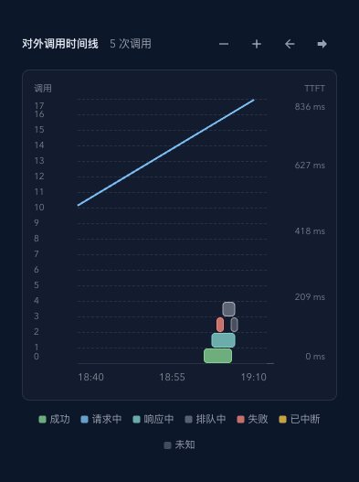

# Dashboard 对外调用时间线

> This file is the durable topic requirements contract. Current implementation facts belong in `IMPLEMENTATION.md`; lifecycle and change references belong in `HISTORY.md`.

## Context and Scope

- Context: Dashboard 的自然日次数视图需要同时表达调用发生时间、并行关系、总耗时、状态和 TTFT。
- In scope: 今日、昨日及账号范围的自然日调用时间线、时间窗口接口、实时更新与明细上限回退。
- Out of scope: 金额、Tokens、网速、24 小时、7 日、历史聚合图表，以及调用计时和数据保留策略。

## Terms and Interfaces

- `Invocation`: 一次对外调用，以 `invokeId` 和 `occurredAt` 标识；同一次调用的上游重试不产生新的时间线横条。
- `Virtual row`: 按开始时间分配给调用的最低空闲并发行，用来表达并发关系。
- Interface: `GET /api/stats/invocation-timeline` accepts UTC `from`, `to`, optional `upstreamAccountId`, and optional `includeLive`; the dashboard sends `includeLive=false` for closed natural days so browser-local yesterday views stay HTTP-only.

## Requirements

### REQ-DIT-001

- The system MUST render one horizontal bar per external invocation, with the bar starting at `occurredAt` and ending at the valid terminal `tTotalMs` endpoint.
- Inputs: terminal records and live runtime records in a requested UTC window.
- Outputs: retries remain folded into the same `invokeId` bar; missing or invalid terminal duration is shown as unknown rather than an invented endpoint.

### REQ-DIT-002

- The system MUST assign each invocation to the lowest virtual lane that is idle at its start time, display at least 4 visual lanes, adapt each lane height between 8px and 16px within the original chart height strategy (`21rem` compact, `20rem` desktop), keep adjacent lanes separated by exactly 1 CSS pixel, and MUST expose parallel, running, and queued counts at the hovered time.
- The calls axis MUST use one linear row-boundary scale for the axis ticks, gridlines, and invocation bars. It MUST reserve the drawable call capacity of the fixed-height plot (and at least 4 values) so sparse windows remain readable; values above the observed concurrency represent empty capacity, not fabricated invocations. The `0` tick MUST share the coordinate origin at the X-axis baseline.
- Each rendered invocation MUST map its assigned virtual row `n` to the positive Y value `n + 1`, with value `1` closest to the zero baseline and larger values above it; the lower edge of the first row MUST meet the zero baseline without a gap.
- The TTFT axis MUST show the maximum, intermediate quartile ticks, and `0 ms` at the same plot baseline, using evenly spaced positions.
- The chart frame MUST retain the original fixed height while the lane body scrolls internally for high concurrency (including 190 simultaneous lanes); the X-axis and TTFT scale remain pinned to the frame.

### REQ-DIT-003

- The system MUST show the existing minute-level average TTFT curve overlaid in the same plot region as the invocation lanes, sharing the invocation time axis. Per-invocation TTFT values remain available through hover and accessible labels without adding an extra visual marker.
- Implementation-only coordinate names MUST NOT appear in the interface; the rendered surface uses the product axis labels `调用` / `Calls` and `TTFT`.
- Invocation bars MUST contain no visible text. Calls shorter than the display resolution, including unknown-duration terminal calls, MUST retain their real timing in the accessible label while receiving an 8px minimum click width so they remain visibly horizontal.

### REQ-DIT-004

- The system MUST provide a bounded overlap query for global and account scopes, return `asOf` and `overLimit`, and return no partial detail when more than 2,000 invocations overlap the requested window.

### REQ-DIT-005

- The system MUST update today's live bars from the authoritative activity revision or a refresh after reconnect, pause local live extension while disconnected, and use HTTP-only data for yesterday.

### REQ-DIT-006

- The system MUST default natural-day views to a 30-minute detail window, support zoom and pan across the full-day bounds, and fall back visibly to the existing aggregate chart when offline or over the detail limit.

## Verification

### VER-DIT-001

- Method: Rust timeline overlap tests and the timeline endpoint contract test fixture.
- covers: `REQ-DIT-001`, `REQ-DIT-004`
- Pass condition: cross-midnight records overlap correctly, retries are represented once, and over-limit responses do not contain incomplete records.

### VER-DIT-002

- Method: frontend lane and API normalization unit tests.
- covers: `REQ-DIT-002`, `REQ-DIT-003`
- Pass condition: lowest idle lane, zero-duration visibility, in-flight extension, account filtering, and valid TTFT-only rendering remain stable.

### VER-DIT-003

- Method: responsive Storybook and dashboard render evidence.
- covers: `REQ-DIT-005`, `REQ-DIT-006`
- Pass condition: desktop and mobile views remain readable, zoom/pan controls work, and offline or over-limit states show the aggregate fallback.

## Related ADRs

None

## Visual Evidence

- source_type: storybook_canvas
  target_program: mock-only
  capture_scope: element
  requested_viewport: desktop1440x1024
  viewport_strategy: storybook-viewport
  margin_policy: require_margin
  evidence_surface: component
  surface_selector: `[data-visual-evidence-surface]`
  target_selector: `[data-visual-evidence-target]`
  sensitive_exclusion: N/A
  submission_gate: approved
  story_id_or_title: Dashboard/DashboardInvocationTimeline/Live Traffic
  state: live traffic with success, responding, queued, failed, and unknown calls
  evidence_note: verifies complete linear calls and TTFT ticks, the zero-origin baseline, state colors, centered status legend, duration bars, overlaid TTFT curve, and the bottom X-axis.
  image: 

- source_type: storybook_canvas
  target_program: mock-only
  capture_scope: element
  requested_viewport: 393x852
  viewport_strategy: storybook-viewport
  margin_policy: require_margin
  evidence_surface: component
  surface_selector: `[data-visual-evidence-surface]`
  target_selector: `[data-visual-evidence-target]`
  sensitive_exclusion: N/A
  submission_gate: approved
  story_id_or_title: Dashboard/DashboardInvocationTimeline/Mobile Traffic
  state: responsive live traffic at the project-defined mobile393 viewport
  evidence_note: verifies mobile readability, complete Y-axis ticks, zero-origin alignment, centered status legend, controls, the overlaid timeline/TTFT plot, and the bottom X-axis.
  image: 

## References

- `./IMPLEMENTATION.md`
- `./HISTORY.md`
