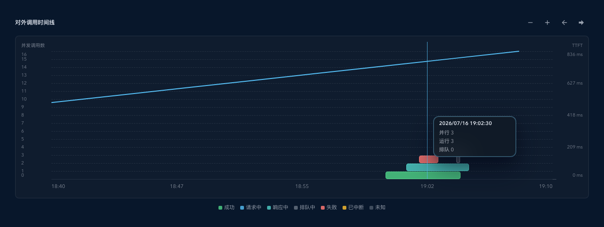
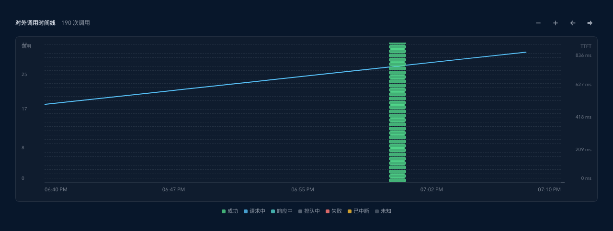
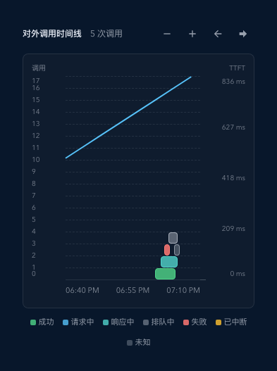

# Dashboard 对外调用时间线

> This file is the durable topic requirements contract. Current implementation facts belong in `IMPLEMENTATION.md`; lifecycle and change references belong in `HISTORY.md`.

## Context and Scope

- Context: 替换截图中的 Dashboard 活动总览图表，让自然日次数视图同时表达调用发生时间、并行关系、总耗时、状态和 TTFT。
- In scope: 截图对应的全局及账号范围“今日/昨日 + 次数”图表、调用时间线、时间窗口接口和实时更新。
- Out of scope: 金额、Tokens、网速、24 小时、7 日、历史聚合图表，以及调用计时和数据保留策略。“昨日 + 金额”不属于本主题。

## Terms and Interfaces

- `Invocation`: 一次对外调用，以 `invokeId` 和 `occurredAt` 标识；同一次调用的上游重试不产生新的时间线横条。
- `Virtual row`: 按开始时间分配给调用的最低空闲并发行，用来表达并发关系。
- Interface: `GET /api/stats/invocation-timeline` accepts UTC `from`, `to`, optional `upstreamAccountId`, optional `includeLive`, `limit`, an opaque cursor, and (after the first page) `asOf`. The response returns `asOf`, `records`, `total`, `hasMore`, and `nextCursor`. The dashboard sends `includeLive=false` for closed natural days so browser-local yesterday views stay HTTP-only. Every page in one read uses the same `asOf` snapshot.

## Requirements

### REQ-DIT-001

- The system MUST render one horizontal bar per external invocation, with the bar starting at `occurredAt` and ending at the valid terminal `tTotalMs` endpoint.
- Inputs: terminal records and live runtime records in a requested UTC window.
- Outputs: retries remain folded into the same `invokeId` bar; missing or invalid terminal duration is shown as unknown rather than an invented endpoint.

### REQ-DIT-002

- The system MUST assign each invocation to the lowest virtual lane that is idle at its start time, display at least 4 visual lanes, adapt each lane height between 8px and 16px within the original chart height strategy (`21rem` compact, `20rem` desktop), keep adjacent lanes separated by exactly 1 CSS pixel, and MUST expose parallel, running, and queued counts at the hovered time.
- The calls axis MUST use one linear row-boundary scale for the axis ticks, gridlines, and invocation bars. It MUST reserve the drawable call capacity of the fixed-height plot (and at least 4 values) so sparse windows remain readable; values above the observed concurrency represent empty capacity, not fabricated invocations. The `0` tick MUST share the coordinate origin at the X-axis baseline.
- Each rendered invocation MUST map its assigned virtual row `n` to the positive Y value `n + 1`, with value `1` closest to the zero baseline and larger values above it; the lower edge of the first row MUST meet the zero baseline without a gap.
- The TTFT axis MUST show the maximum, intermediate quartile ticks, and `0 ms` at the same plot baseline, using evenly spaced positions.
- The chart frame MUST retain the original fixed height while the lane body scrolls internally for high concurrency (including 190 simultaneous lanes); the X-axis and TTFT scale remain pinned to the frame.

### REQ-DIT-003

- The system MUST show the existing minute-level average TTFT curve overlaid in the same plot region as the invocation lanes, sharing the invocation time axis. Per-invocation TTFT values remain available through hover and accessible labels without adding an extra visual marker.
- Implementation-only coordinate names MUST NOT appear in the interface; the rendered surface uses the product axis labels `调用` / `Calls` and `TTFT`.
- Invocation bars MUST contain no visible text. Calls shorter than the display resolution, including unknown-duration terminal calls, MUST retain their real timing in the accessible label while receiving an 8px minimum click width so they remain visibly horizontal.

### REQ-DIT-004

- The system MUST provide a bounded overlap query for global and account scopes, return `asOf`, and return stable pages that can cover every overlapping invocation without returning an incomplete page as a successful complete result.
- The server MUST preserve one `asOf` snapshot across pages. The client MUST merge pages by `(invokeId, occurredAt)` and MUST retain at most one bar per invocation.
- A page-size limit MUST bound each response, but the limit MUST NOT cause the target chart to switch to the old aggregate chart or silently omit calls.
- The snapshot MUST bind both invocation rows and upstream-attempt fallback rows to watermarks captured on the first page. The server MUST keep unexpired cursors valid; when the bounded snapshot cache is full, a new first-page request MUST fail explicitly rather than evicting an existing cursor.
- Snapshot materialization MUST use a bounded durable representation. If its row or serialized-payload budget is exhausted, the endpoint MUST fail explicitly inside the new chart surface and roll back the partial snapshot; it MUST NOT silently truncate, sample, or fall back to the legacy aggregate chart.

### REQ-DIT-005

- The system MUST update today's live bars from the authoritative activity revision or a refresh after reconnect, pause local live extension while disconnected, and use HTTP-only data for yesterday.
- Live revisions MUST be coalesced while a snapshot request is in flight. A completed request MUST be followed by at most one refresh for the newest revision observed during that request.
- A page traversal MUST use one immutable `asOf` snapshot. New records observed after that point MUST appear in the next refresh, not be mixed into later pages of the current traversal.

### REQ-DIT-006

- The system MUST default the in-scope natural-day count views to a 30-minute detail window and support zoom and pan across the full-day bounds.
- Once the timeline data is available, the invocation timeline MUST be the only chart rendered in the target activity-overview area for the in-scope views. The existing aggregate chart MUST NOT be rendered there as an error, offline, invalid-bounds, disconnected, or over-limit fallback.
- Error, offline, invalid-bounds, disconnected, and over-limit states MUST remain inside the new chart surface and explain that invocation detail is unavailable; they MUST NOT silently replace the new chart with the old aggregate chart.
- There is no data-conversion exception in this design. Generic request failure, transport state, and high volume MUST remain explicit states of the new chart surface.
- If a prior snapshot exists, a failed refresh MUST retain that snapshot and freeze its in-flight bars; the chart MUST expose that the data is stale or unavailable. If no snapshot exists, the new chart surface MUST show an unavailable state without mounting the old chart.

## Verification

### VER-DIT-001

- Method: Rust timeline overlap tests and the timeline endpoint contract test fixture.
- covers: `REQ-DIT-001`, `REQ-DIT-004`
- Pass condition: cross-midnight records overlap correctly, retries are represented once, page traversal covers the full result at one `asOf`, and no page silently truncates the result.

### VER-DIT-002

- Method: frontend lane and API normalization unit tests.
- covers: `REQ-DIT-002`, `REQ-DIT-003`, `REQ-DIT-004`
- Pass condition: lowest idle lane, zero-duration visibility, in-flight extension, account filtering, valid TTFT-only rendering, page merging, and duplicate invocation folding remain stable.

### VER-DIT-003

- Method: responsive Storybook and dashboard render evidence.
- covers: `REQ-DIT-005`, `REQ-DIT-006`
- Pass condition: desktop and mobile views remain readable, zoom/pan controls work, the new timeline remains the only chart in the target area, unavailable/over-limit states do not mount the aggregate chart, and a failed refresh freezes the last good timeline.

## Related ADRs

- [ADR 0019: Dashboard timeline replacement contract](../../adr/0019-dashboard-timeline-replacement-contract.md)

## Visual Evidence

- source_type: storybook_canvas
  target_program: mock-only
  capture_scope: element
  requested_viewport: desktop1440x1024
  viewport_strategy: storybook-viewport
  margin_policy: require_margin
  evidence_surface: component
  surface_selector: `[data-visual-evidence-surface]`
  target_selector: `[data-visual-evidence-target]`
  sensitive_exclusion: N/A
  submission_gate: approved
  story_id_or_title: Dashboard/DashboardInvocationTimeline/Live Traffic
  state: live traffic with success, responding, queued, failed, and unknown calls
  evidence_note: verifies complete linear calls and TTFT ticks, the zero-origin baseline, state colors, centered status legend, duration bars, overlaid TTFT curve, and the bottom X-axis.
  image: 

- source_type: storybook_canvas
  target_program: mock-only
  capture_scope: element
  requested_viewport: desktop1440x1024
  viewport_strategy: storybook-viewport
  margin_policy: require_margin
  evidence_surface: component
  surface_selector: `[data-visual-evidence-surface]`
  target_selector: `[data-visual-evidence-target]`
  sensitive_exclusion: N/A
  submission_gate: approved
  story_id_or_title: Dashboard/DashboardInvocationTimeline/Dense Concurrency 190
  state: dense 190-call pagination sample
  evidence_note: verifies the fixed chart frame, 8px dense bars, 1px row spacing, scrollable content, linear call scale, and the overlaid TTFT curve without mounting the legacy aggregate chart.
  image: 

- source_type: storybook_canvas
  target_program: mock-only
  capture_scope: element
  requested_viewport: 393x852
  viewport_strategy: storybook-viewport
  margin_policy: require_margin
  evidence_surface: component
  surface_selector: `[data-visual-evidence-surface]`
  target_selector: `[data-visual-evidence-target]`
  sensitive_exclusion: N/A
  submission_gate: approved
  story_id_or_title: Dashboard/DashboardInvocationTimeline/Mobile Traffic
  state: responsive live traffic at the project-defined mobile393 viewport
  evidence_note: verifies mobile readability, complete Y-axis ticks, zero-origin alignment, centered status legend, controls, the overlaid timeline/TTFT plot, and the bottom X-axis.
  image: 

## References

- `./IMPLEMENTATION.md`
- `./HISTORY.md`
