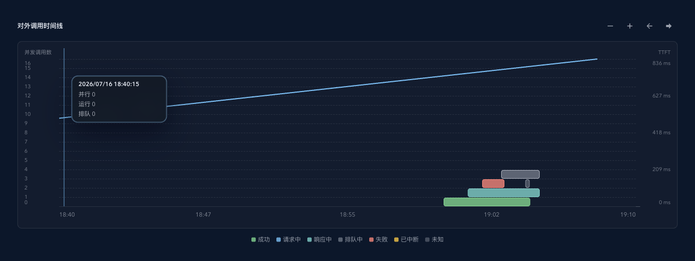
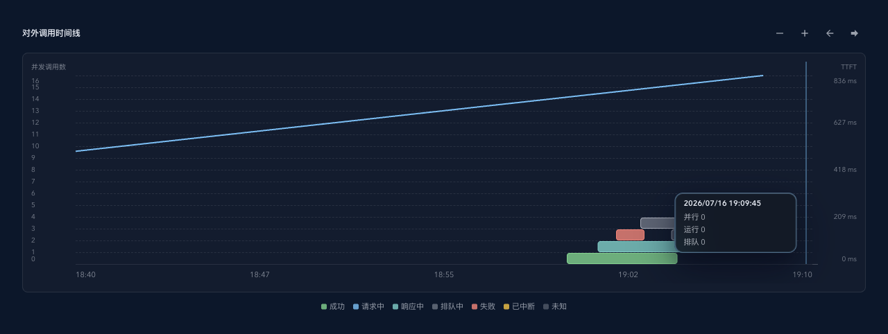

# Dashboard 对外调用时间线

> This file is the durable topic requirements contract. Current implementation facts belong in `IMPLEMENTATION.md`; lifecycle and change references belong in `HISTORY.md`.

## Context and Scope

- Context: 替换截图中的 Dashboard 活动总览图表，让自然日次数视图同时表达调用发生时间、并行关系、总耗时、状态和 TTFT。
- In scope: 截图对应的全局及账号范围“今日/昨日 + 次数”图表、调用时间线、时间窗口接口和实时更新。
- Out of scope: 金额、Tokens、网速、24 小时、7 日、历史聚合图表，以及调用计时和数据保留策略。“昨日 + 金额”不属于本主题。

## Terms and Interfaces

- `Invocation`: 一次对外调用，以 `invokeId` 和 `occurredAt` 标识；同一次调用的上游重试不产生新的时间线横条。
- `Virtual row`: 按开始时间分配给调用的最低空闲并发行，用来表达并发关系。
- `Natural-day data scope`: The selected browser-local today or yesterday interval, sent as UTC `naturalDayStart` and `naturalDayEnd`. It is the hard data boundary for the chart and is at most one day.
- `Timeline viewport`: The visible `from`/`to` interval inside the natural-day data scope. It defaults to 30 minutes and can move or zoom only within that scope.
- `Boundary overlap`: The bounded preceding-day read used only to include an invocation that started before the selected day and ended inside it. It is limited to one day and never expands the displayed scope.
- Interface: `GET /api/stats/invocation-timeline` accepts UTC `naturalDayStart`, `naturalDayEnd`, `from`, `to`, optional `upstreamAccountId`, optional `includeLive`, `limit`, an opaque cursor, and (after the first page) `asOf`. The current dashboard always sends the natural-day fields; older internal callers that omit them are bounded to their viewport. The response returns `asOf`, `records`, `total`, `hasMore`, and `nextCursor`. The dashboard sends `includeLive=false` for closed natural days so browser-local yesterday views stay HTTP-only. Every page in one read uses the same `asOf` snapshot.

## Requirements

### REQ-DIT-001

- The system MUST render one horizontal bar per external invocation, with the bar starting at `occurredAt` and ending at the valid terminal `tTotalMs` endpoint.
- Inputs: terminal records and live runtime records in a requested UTC window.
- Outputs: retries remain folded into the same `invokeId` bar; missing or invalid terminal duration is shown as unknown rather than an invented endpoint.

### REQ-DIT-002

- The system MUST assign each invocation to the lowest virtual lane that is idle at its start time, display at least 4 visual lanes, and adapt each lane height between 8px and 16px within the fixed chart frame (336px compact, 320px desktop). Adjacent lanes MUST always have exactly 1 CSS pixel of gap. When concurrency exceeds the available frame, lane height MUST stop shrinking and the lane body MUST scroll vertically.
- The chart frame MUST remain fixed-height at every concurrency level. High concurrency MAY overflow only inside the invocation lane body, which MUST provide vertical scrolling; the calls axis MUST stay pinned to the frame and synchronize its vertical position with the lane body. The first overflowing snapshot MUST start at the bottom; refreshes of the same view MUST preserve the user's scroll position, clamped to the new content bounds. The chart MUST NOT introduce horizontal scrolling.
- At high concurrency, calls-axis gridlines MUST follow the visible axis tick values rather than drawing one gridline per virtual lane.
- Pointer hover inside the plot MUST show a floating tooltip anchored within the chart with the snapped time and parallel, running, and queued counts. The tooltip MUST not participate in document flow or change chart height, MUST remain within the chart bounds near its edges, and MUST disappear when the pointer leaves the chart. Hover details MUST NOT be rendered as an additional row below the chart.
- The calls axis MUST use one linear row-boundary scale for the axis ticks, gridlines, and invocation bars. It MUST reserve the drawable call capacity of the fixed-height plot (and at least 4 values) so sparse windows remain readable; values above the observed concurrency represent empty capacity, not fabricated invocations. The `0` tick MUST share the coordinate origin at the X-axis baseline.
- Each rendered invocation MUST map its assigned virtual row `n` to the positive Y value `n + 1`, with value `1` closest to the zero baseline and larger values above it; the lower edge of the first row MUST meet the zero baseline without a gap.
- The TTFT axis MUST show the maximum, intermediate quartile ticks, and `0 ms` at the same plot baseline, using evenly spaced positions.
- The chart frame MUST retain the original fixed height while the lane body scrolls internally for high concurrency (including 190 simultaneous lanes); the X-axis and TTFT scale remain pinned to the frame.

### REQ-DIT-003

- The system MUST show the existing minute-level average TTFT curve overlaid in the same plot region as the invocation lanes, sharing the invocation time axis. Per-invocation TTFT values remain available through hover and accessible labels without adding an extra visual marker.
- Implementation-only coordinate names MUST NOT appear in the interface; the rendered surface uses the product axis labels `并发调用数` / `Concurrent calls` and `TTFT`.
- Invocation bars MUST contain no visible text. Calls shorter than the display resolution, including unknown-duration terminal calls, MUST retain their real timing in the accessible label while receiving an 8px minimum click width so they remain visibly horizontal.

### REQ-DIT-004

- The system MUST provide a bounded overlap query for global and account scopes, return `asOf`, and return stable pages that can cover every overlapping invocation without returning an incomplete page as a successful complete result.
- The server MUST reject a natural-day scope or viewport wider than 24 hours, and MUST reject a viewport that leaves the selected natural-day scope. Boundary overlap MAY read at most the preceding 24 hours to preserve cross-midnight calls; it MUST NOT use the duration safety limit as a query lookback.
- The server MUST preserve one `asOf` snapshot across pages. The client MUST merge pages by `(invokeId, occurredAt)` and MUST retain at most one bar per invocation.
- A page-size limit MUST bound each response, but the limit MUST NOT cause the target chart to switch to the old aggregate chart or silently omit calls.
- The snapshot MUST bind both invocation rows and upstream-attempt fallback rows to watermarks captured on the first page. The server MUST keep unexpired cursors valid; when the bounded snapshot cache is full, a new first-page request MUST fail explicitly rather than evicting an existing cursor.
- Snapshot materialization MUST use a bounded durable representation. If its row or serialized-payload budget is exhausted, the endpoint MUST fail explicitly inside the new chart surface and roll back the partial snapshot; it MUST NOT silently truncate, sample, or fall back to the legacy aggregate chart.
- A successfully materialized snapshot MUST remain pageable until the client releases it or its 30-minute TTL expires. After the client has received and merged every page of one immutable snapshot, it MUST send `DELETE /api/stats/invocation-timeline/{asOf}`. The release endpoint MUST return `204` for active, already released, and expired tokens. It MUST immediately return the token's process-local row/byte reservation and enqueue durable-row deletion for the existing pressure-gated P2 background cleaner; it MUST NOT perform a SQLite write in the HTTP request path. A bounded release queue MAY fall back to the cleaner's periodic token scan when full. Each admitted cleanup pass MUST reserve at least 16 of its maximum 64 candidates for the periodic database scan even while the explicit-release queue is saturated. An incomplete or failed traversal MUST NOT release its cursor and MUST remain recoverable until TTL expiry.

### REQ-DIT-005

- The system MUST update today's live bars from the authoritative activity revision or a refresh after reconnect, pause local live extension while disconnected, and use HTTP-only data for yesterday.
- SSE revisions and the 15-second poll MUST share one per-timeline refresh scheduler. It MUST allow at most one complete page traversal to start in any rolling 15-second interval and at most one traversal in flight. Revisions observed during a traversal MUST coalesce into one dirty signal; after the minimum interval, at most one follow-up traversal MUST read the newest state.
- Failed automatic refreshes MUST retain the last committed snapshot and retry with exponential delays of 15, 30, then 60 seconds, capped at 60 seconds with ±20% jitter. A successful traversal MUST reset the retry delay. A user-requested zoom/pan or natural-day/account context change MUST bypass the automatic throttle and retry delay and load the requested scope immediately.
- A page traversal MUST use one immutable `asOf` snapshot. New records observed after that point MUST appear in the next refresh, not be mixed into later pages of the current traversal.
- When a live update advances the followed viewport, the system MUST keep rendering the last committed timeline snapshot together with the viewport for which it was fetched until the replacement snapshot succeeds. This refresh MUST NOT present the initial-loading state or temporarily remove the chart.
- If that live refresh fails, the last committed snapshot and its matching viewport MUST remain visible, frozen, and marked stale or unavailable. A user-requested zoom/pan or a natural-day/account context change MUST clear the prior snapshot and show loading until data for the requested window is committed.

### REQ-DIT-006

- The system MUST default the in-scope natural-day count views to a 30-minute detail window and support zoom and pan across the full-day bounds.
- The chart MUST display records only inside the selected natural-day data scope. A call that crosses the boundary may be clipped at the visible day edge, but the chart MUST NOT display a second day's data.
- Once the timeline data is available, the invocation timeline MUST be the only chart rendered in the target activity-overview area for the in-scope views. The existing aggregate chart MUST NOT be rendered there as an error, offline, invalid-bounds, disconnected, or over-limit fallback.
- Error, offline, invalid-bounds, disconnected, and over-limit states MUST remain inside the new chart surface and explain that invocation detail is unavailable; they MUST NOT silently replace the new chart with the old aggregate chart.
- There is no data-conversion exception in this design. Generic request failure, transport state, and high volume MUST remain explicit states of the new chart surface.
- If a prior snapshot exists, a failed refresh MUST retain that snapshot and freeze its in-flight bars; the chart MUST expose that the data is stale or unavailable. If no snapshot exists, the new chart surface MUST show an unavailable state without mounting the old chart.

## Verification

### VER-DIT-001

- Method: Rust timeline overlap tests and the timeline endpoint contract test fixture.
- covers: `REQ-DIT-001`, `REQ-DIT-004`
- Pass condition: cross-midnight records overlap correctly for a short viewport inside a distinct natural-day scope, persisted and live records older than the preceding-day bound are excluded, retries are represented once, page traversal covers the full result at one `asOf`, completed traversal release returns `204` and frees active budget immediately, duplicate release is harmless, incomplete traversal remains valid until TTL, durable-row cleanup is deferred to the pressure-gated P2 cleaner, a saturated release queue does not starve database scanning, and no page silently truncates the result.

### VER-DIT-002

- Method: frontend lane and API normalization unit tests.
- covers: `REQ-DIT-002`, `REQ-DIT-003`, `REQ-DIT-004`
- Pass condition: lowest idle lane, zero-duration visibility, in-flight extension, lane height stays within 8–16px with a fixed 1px gap at every concurrency level, fixed frame with internal vertical overflow, no horizontal overflow, synchronized axis scrolling, in-chart hover tooltip behavior, account filtering, valid TTFT-only rendering, page merging, and duplicate invocation folding remain stable.

### VER-DIT-003

- Method: responsive Storybook evidence and production-build dashboard E2E rendering checks.
- covers: `REQ-DIT-005`, `REQ-DIT-006`
- Pass condition: desktop and mobile views remain readable, zoom/pan controls work, the production dashboard visibly loads invocation bars without a legacy Recharts node in the target area, unavailable/over-limit states do not mount the aggregate chart, and a delayed live-window refresh keeps the last committed bars and matching viewport visible until replacement; SSE and polling start no more than one traversal per rolling 15 seconds; failures retain the last good timeline with bounded exponential retry, while a user-requested window change shows loading for the new window and bypasses automatic retry delays.

## Related ADRs

- [ADR 0019: Dashboard timeline replacement contract](../../adr/0019-dashboard-timeline-replacement-contract.md)

## Visual Evidence

- source_type: storybook_canvas
  target_program: mock-only
  capture_scope: element
  requested_viewport: desktop1440x1024
  viewport_strategy: storybook-viewport
  margin_policy: require_margin
  evidence_surface: component
  surface_selector: `[data-visual-evidence-surface]`
  target_selector: `[data-visual-evidence-target]`
  sensitive_exclusion: N/A
  submission_gate: approved
  story_id_or_title: Dashboard/DashboardInvocationTimeline/Live Traffic
  state: live traffic with a centered in-chart hover tooltip
  evidence_note: verifies the concurrent-call and TTFT axes, state colors, duration bars, overlaid TTFT curve, bottom X-axis, and tooltip time and concurrency counts without a separate summary row.
  image: 

- source_type: storybook_canvas
  target_program: mock-only
  capture_scope: element
  requested_viewport: desktop1440x1024
  viewport_strategy: storybook-viewport
  margin_policy: require_margin
  evidence_surface: component
  surface_selector: `[data-visual-evidence-surface]`
  target_selector: `[data-visual-evidence-target]`
  sensitive_exclusion: N/A
  submission_gate: approved
  story_id_or_title: Dashboard/DashboardInvocationTimeline/Live Traffic (left-edge hover)
  state: tooltip placement near the left edge of the plot
  evidence_note: verifies the tooltip flips or shifts within the plot bounds near the left edge without changing chart layout.
  image: 

- source_type: storybook_canvas
  target_program: mock-only
  capture_scope: element
  requested_viewport: desktop1440x1024
  viewport_strategy: storybook-viewport
  margin_policy: require_margin
  evidence_surface: component
  surface_selector: `[data-visual-evidence-surface]`
  target_selector: `[data-visual-evidence-target]`
  sensitive_exclusion: N/A
  submission_gate: approved
  story_id_or_title: Dashboard/DashboardInvocationTimeline/Live Traffic (right-edge hover)
  state: tooltip placement near the right edge of the plot
  evidence_note: verifies the tooltip flips or shifts within the plot bounds near the right edge without changing chart layout.
  image: 

- source_type: storybook_canvas
  target_program: mock-only
  capture_scope: element
  requested_viewport: desktop1440x1024
  viewport_strategy: storybook-viewport
  margin_policy: require_margin
  evidence_surface: component
  surface_selector: `[data-visual-evidence-surface]`
  target_selector: `[data-visual-evidence-target]`
  sensitive_exclusion: N/A
  submission_gate: approved
  story_id_or_title: Dashboard/DashboardInvocationTimeline/OverflowConcurrency360
  state: 360-call dense sample overflowing the fixed desktop frame
  evidence_note: verifies the 320px frame remains fixed, only the lane body scrolls vertically, the calls axis stays synchronized, and no horizontal scrolling appears.
  image: 

- source_type: storybook_canvas
  target_program: mock-only
  capture_scope: element
  requested_viewport: 393x852
  viewport_strategy: storybook-viewport
  margin_policy: require_margin
  evidence_surface: component
  surface_selector: `[data-visual-evidence-surface]`
  target_selector: `[data-visual-evidence-target]`
  sensitive_exclusion: N/A
  submission_gate: approved
  story_id_or_title: Dashboard/DashboardInvocationTimeline/MobileOverflowConcurrency360
  state: responsive 360-call overflow with an in-chart tooltip
  evidence_note: verifies the 336px mobile frame, internal vertical scrolling, no horizontal overflow, synchronized axis, and tooltip containment in the narrow plot.
  image: 

## References

- `./IMPLEMENTATION.md`
- `./HISTORY.md`
