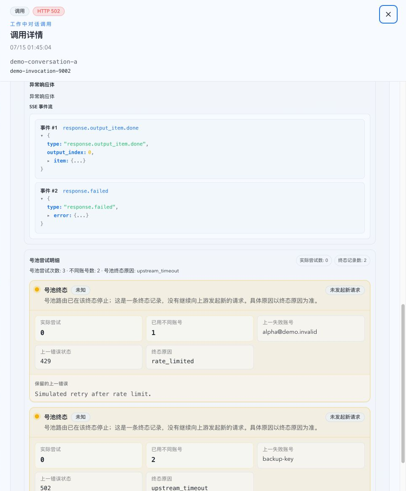
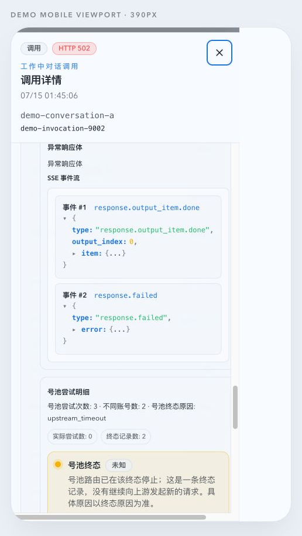

# 调用详情可分享路由与结构化响应体查看器（#dqstf）

> 当前有效规范以本文为准；实现覆盖与当前状态见 `./IMPLEMENTATION.md`，关键演进原因见 `./HISTORY.md`。

## 背景 / 问题陈述

Dashboard 调用详情当前只存在于页面内状态，无法通过 URL 分享或刷新恢复。异常响应体直接放入 `pre` 后，超长 JSON、NDJSON 或 SSE 行还可能扩大 drawer 的内在宽度，造成页面级横向滚动，并缺少结构化排障能力。

## 目标 / 非目标

### Goals

- 为 Dashboard 调用详情提供稳定、可编码、可分享且刷新可恢复的路由。
- 让详情加载只依赖稳定 `invokeId`，不依赖当前 Dashboard 卡片仍在内存中。
- 自动识别 JSON、严格 NDJSON 与 SSE transcript，并提供高亮、折叠和键盘可操作的树视图。
- 让纯文本、损坏内容和超长无空格内容自动换行，不再撑宽 drawer 或页面。
- 为超大 payload 提供显式的手动结构化入口，避免默认重解析阻塞 UI。

### Non-goals

- 不修改后端 invocation、response-body API、SQLite schema 或 raw payload 保留规则。
- 不提供 JSON 编辑、搜索替换、下载或 schema 校验。
- 不重构账号详情、Prompt Cache 或 Records 的现有 URL 契约。

## 范围

- Dashboard route、调用卡片打开行为、详情 drawer 加载与关闭行为。
- 调用详情共享响应体区域及新的结构化 payload viewer。
- 对应 unit、route、Storybook、Web Demo fixture 与视觉证据。

## 功能与接口契约

### 可分享路由

- canonical route 为 `#/dashboard/invocations/:invokeId`，path parameter 必须使用 URI encoding。
- 从 Dashboard 卡片打开详情使用 history push；关闭按钮明确导航到 `#/dashboard`。
- 浏览器后退必须从详情返回 Dashboard；直接打开分享 URL 后关闭不得依赖 history back。
- 未知或不可加载的 `invokeId` 保留 drawer shell、错误说明与关闭动作，不静默跳转。
- `current/previous`、对话序号等卡片上下文可以在同一次打开中显示，但不得成为直达 URL 的恢复依赖。

### Payload 识别与渲染

- 识别顺序固定为完整 JSON、严格 NDJSON、SSE transcript、纯文本回退。
- NDJSON 只有在每个非空行都能独立解析为 JSON 时成立，避免把普通日志误判成结构化内容。
- SSE 以空行分隔 event block；识别 `event`、`id`、`retry` 与 `data` 字段。`data` 合并后若为 JSON，则使用树视图，否则按文本显示。
- 结构化树使用 `react-json-view-lite`，支持键盘展开/折叠，并匹配现有 light/dark semantic tokens。
- 小型 JSON 默认展开两层；较大的 JSON、NDJSON 与 SSE 默认只展开根节点或逐条 event。
- UTF-8 体量超过 `1 MiB` 时默认显示纯文本与手动结构化操作；只有用户触发后才解析。

### 尺寸与滚动

- drawer shell、body、section、flex/grid child 与 payload container 必须具备 `min-width: 0` / `max-width: 100%` 约束。
- 结构化内容限制最大高度，并在自身容器内支持横向和纵向滚动。
- 纯文本使用保留换行的自动换行策略，并允许任意长 token 断行。
- drawer 继续只有一个页面级纵向内容滚动体；内部滚动只用于 payload inspector 的有界内容。

## 验收标准

- 点击调用后 URL 变为 `#/dashboard/invocations/<invokeId>`，刷新和粘贴 URL 均恢复同一详情。
- 关闭按钮回到 `#/dashboard`，浏览器前进/后退行为符合 route history。
- JSON、NDJSON、SSE JSON data 均显示可折叠、高亮、键盘可操作的结构化视图。
- 纯文本、解析失败内容和超长无空格文本保持可读并自动换行。
- 超过 `1 MiB` 的 payload 默认不解析，手动操作后才进入结构化视图。
- 桌面 drawer 与移动 bottom sheet 均无页面级横向溢出。
- Storybook 覆盖主要格式、超大内容与回退状态；整页证据来自 mock-only Web Demo。

## Visual Evidence

绑定场景：mock-only Web Demo `demo-invocation-9002`（`demoScene=attention`）。

- Desktop route: `#/dashboard/invocations/demo-invocation-9002?demoScene=attention`
- Mobile route: `#/dashboard/invocations/demo-invocation-9002?demoScene=attention&demoViewport=mobile390`
- 两张图均滚动到 `异常响应体 / SSE 事件流`，直接证明 share route 下的结构化 payload viewer 与无页面级横向溢出。

PR: include

PR: include

## References

- `docs/specs/hnu7b-mobile-first-navigation-and-overlays/SPEC.md`
- `docs/specs/ykhfu-web-demo/SPEC.md`
- `docs/solutions/workflow/mock-only-web-demo-runtime.md`
