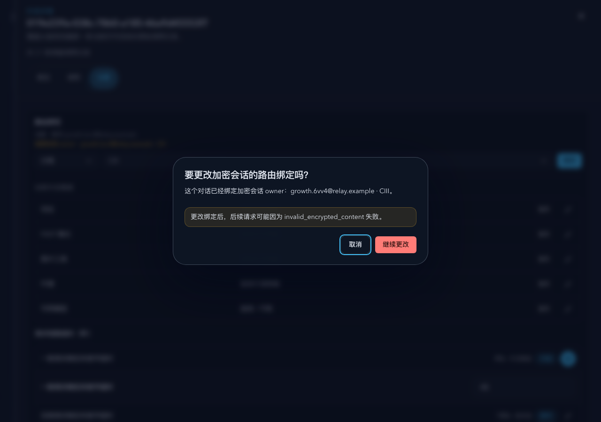
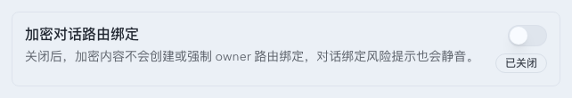

# Encrypted Session Owner Guard

Spec ID: e8n4q

## Background

Prompt Cache conversation binding currently models operator routing intent only. Once a conversation starts carrying `encrypted_content`, the proxy also needs a separate notion of which upstream account has proven ownership of that opaque encrypted session state. Automatic failover must not move such a conversation across owners.

## Goals

- Introduce a dedicated encrypted session owner ledger keyed by `promptCacheKey`.
- Keep manual binding and encrypted session owner as separate state machines.
- Force automatic routing to stay on the current encrypted owner whenever owner state exists.
- Preserve operator rebinding as a dangerous override, with UI confirmation and no PATCH contract change.
- Provide a global operator switch that can pause encrypted owner routing without deleting historical owner state.

## Non-goals

- No local decrypt / re-sign / cross-provider migration of `encrypted_content`.
- No change to ordinary routing for conversations that have never entered encrypted-session state.
- No destructive cleanup of existing encrypted owner rows when the global switch is disabled.

## Requirements

- Encrypted session owner is stored separately from `prompt_cache_conversation_bindings`.
- Owner granularity is exact `upstream_account_id`.
- Owner is confirmed only after a successful request on an account where the request or response contains `encrypted_content`.
- Automatic routing and failover must treat the owner as the hard routing target.
- If the owner cannot be selected automatically, the proxy returns `503` with code `encrypted_session_owner_unavailable`.
- Manual rebinding remains available through the existing binding PATCH endpoint and payload shape.
- Manual rebinding that would route an owned encrypted session away from its current owner must use the product UI dialog system for confirmation; browser-native dialogs are not acceptable.
- Clearing a manual binding on an owned encrypted session removes only the override intent; it does not clear the encrypted-session owner lock.
- Manual rebinding does not move owner state immediately; owner moves only after the newly bound target succeeds.
- Group binding used as a dangerous override must auto-promote to an account binding after the first encrypted-session success on a concrete account.
- Binding read APIs and Prompt Cache conversation detail responses expose read-only owner metadata.
- `proxy_model_settings.encrypted_session_owner_routing_enabled` defaults to disabled and is exposed through `GET /api/settings` and `PUT /api/settings/proxy` as `encryptedSessionOwnerRoutingEnabled`.
- `OPENAI_PROXY_ENCRYPTED_SESSION_OWNER_ROUTING_ENABLED` may override that default only when the SQLite setting has not been initialized yet; once initialized, later restarts keep using the database value.
- When encrypted owner routing is disabled, HTTP and WebSocket proxy paths ignore existing encrypted owner rows, do not write new owner rows after encrypted success, and do not return `encrypted_session_owner_unavailable` solely because an encrypted owner is unavailable.
- When encrypted owner routing is disabled, binding read APIs and Prompt Cache conversation list/detail responses suppress encrypted owner metadata so the product UI behaves like ordinary manual route binding.

## Interface Contract

### Storage

`proxy_model_settings`

- `encrypted_session_owner_routing_enabled INTEGER NOT NULL DEFAULT 0`
- `encrypted_session_owner_routing_initialized INTEGER NOT NULL DEFAULT 0`

`prompt_cache_encrypted_session_owners`

- `prompt_cache_key TEXT PRIMARY KEY`
- `owner_upstream_account_id INTEGER NOT NULL`
- `first_locked_at TEXT NOT NULL`
- `last_confirmed_at TEXT NOT NULL`
- `updated_at TEXT NOT NULL`

### API

- `GET /api/stats/prompt-cache-conversation-bindings/{key}`
  - Returns the existing binding payload plus:
    - `hasEncryptedSessionOwner`
    - `encryptedOwnerAccountId`
    - `encryptedOwnerAccountName`
    - `encryptedOwnerGroupName`
- Prompt Cache conversation detail/list responses also return the same owner metadata fields.

### Runtime

- Request parsing records whether the inbound payload already contains `encrypted_content`.
- Response parsing records whether the upstream response produced `encrypted_content`.
- Automatic routing uses encrypted owner state before ordinary sticky/group/account pool fallback.
- On first startup against a new or missing-field database row, the encrypted owner routing setting is initialized from `OPENAI_PROXY_ENCRYPTED_SESSION_OWNER_ROUTING_ENABLED` when present, otherwise `false`.
- The global encrypted owner routing setting is read at routing/owner-confirmation boundaries. Disabled means pause enforcement and owner persistence while preserving the ledger for possible later re-enable.
- Dangerous override remains an operator action expressed by the manual binding state, not by owner state.

## Acceptance Criteria

- A conversation with owner account `A` never auto-fails over to account `B`.
- When owner `A` is unavailable, the request terminates locally with `503 encrypted_session_owner_unavailable`.
- A successful encrypted-session request on an unowned conversation writes the current account as owner.
- A group override that succeeds on account `B` upgrades the binding to `upstreamAccount=B`.
- Binding read APIs and Prompt Cache conversation detail responses expose encrypted owner metadata.
- The dangerous manual-rebinding confirmation renders as an accessible product `alertdialog` and does not invoke browser-native `confirm` / `alert` / `prompt`.
- Given encrypted owner routing is disabled globally, existing owner rows do not constrain routing, encrypted successes do not create owner rows, owner metadata is hidden from Prompt Cache owner-facing APIs, and the dangerous route-binding confirmation is not shown.
- Given the setting has already been saved in SQLite, changing `OPENAI_PROXY_ENCRYPTED_SESSION_OWNER_ROUTING_ENABLED` and restarting does not override the saved value.

## Visual Evidence

- source_type: storybook_canvas
  target_program: mock-only
  capture_scope: element
  requested_viewport: desktop1280
  viewport_strategy: storybook-viewport
  sensitive_exclusion: N/A
  story_id_or_title: Monitoring/PromptCacheConversationTable/DrawerBindingControls
  state: encrypted owner lock visible next to manual route binding state
  evidence_note: verifies the binding card shows both the current manual account binding and the encrypted session owner for the same conversation
  PR: include
  image:
  

- source_type: storybook_canvas
  target_program: mock-only
  capture_scope: element
  requested_viewport: desktop1280
  viewport_strategy: storybook-viewport
  sensitive_exclusion: N/A
  story_id_or_title: Monitoring/PromptCacheConversationTable/DrawerEncryptedOwnerDangerDialogOpen
  state: dangerous route-binding confirmation dialog
  evidence_note: verifies an encrypted-owner route-binding change uses the project Dialog surface, with localized risk copy and no browser-native confirm dialog
  PR: include
  image:
  

- source_type: storybook_canvas
  target_program: mock-only
  capture_scope: element
  requested_viewport: desktop1280
  viewport_strategy: storybook-viewport
  sensitive_exclusion: N/A
  story_id_or_title: Monitoring/PromptCacheConversationTable/DrawerOwnerLockWithoutManualBinding
  state: owner lock preserved after manual binding is cleared
  evidence_note: verifies clearing manual binding leaves the encrypted owner lock intact and surfaces the explanatory hint in the same binding card
  PR: include
  image:
  

- source_type: storybook_canvas
  target_program: mock-only
  capture_scope: element
  requested_viewport: 1440x1100
  viewport_strategy: browser-resize-fallback
  sensitive_exclusion: N/A
  story_id_or_title: Settings/SettingsPage/EncryptedOwnerRoutingDisabled
  state: encrypted owner routing disabled in system settings
  evidence_note: verifies the System Settings proxy section exposes the encrypted conversation routing switch and renders the disabled state without route-binding warning UI
  PR: include
  image:
  
