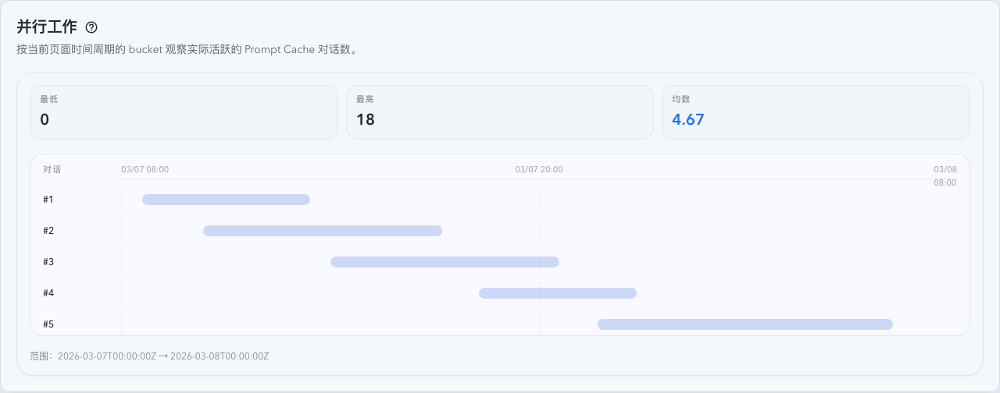
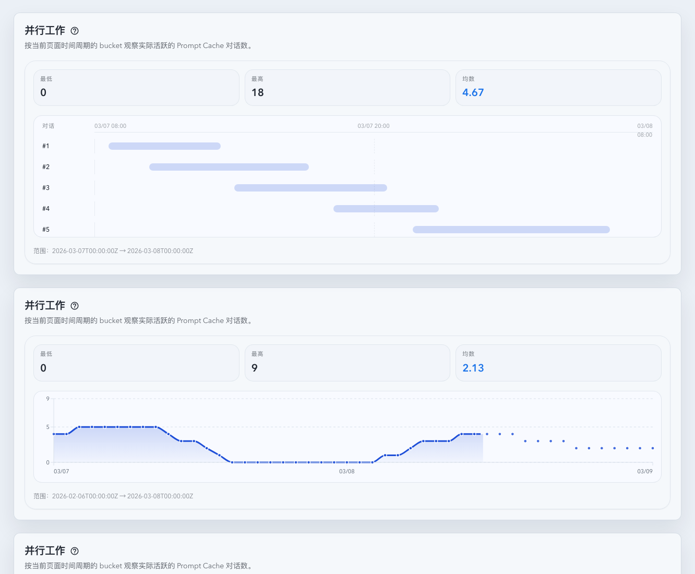
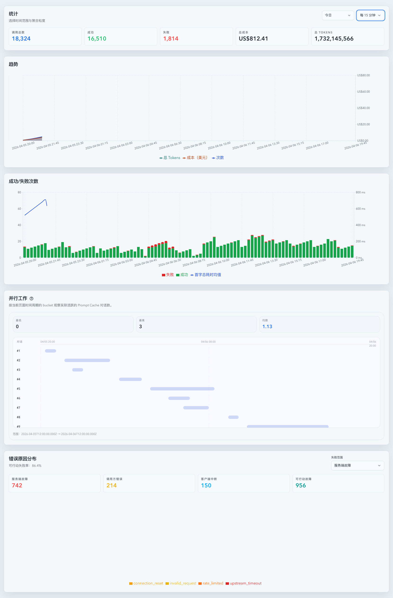

# 并行工作 bucket 统计（#f3dx3）

## 状态

- Status: 已实现，PR 收敛中
- Created: 2026-04-07
- Last: 2026-04-07

## 背景 / 问题陈述

- 统计页当前提供的是请求量、成功失败、错误原因等指标，但缺少“同一时间段内实际有多少个工作对话在推进”的视角。
- Dashboard 已经存在“工作中的对话”语义，真相源来自 `promptCacheKey` 活跃对话；统计页仍缺少一个能跨分钟 / 小时 / 天观察并行工作强度的长期面板。
- 项目已经有 `prompt_cache_rollup_hourly` 这层长期在线 rollup，适合承接小时级与天级聚合；分钟级页面周期继续走 live invocation 精确查询。

## 目标 / 非目标

### Goals

- 新增独立指标面：`并行工作数 = bucket 内发生过请求的 distinct promptCacheKey 数量`。
- 新增 `GET /api/stats/parallel-work?range=&bucket=&timeZone=`，返回与统计页当前 `range / bucket` 对齐的 `current` 窗口。
- 分钟级 bucket 走 `codex_invocations` 精确查询；小时级及以上 bucket 复用 `prompt_cache_rollup_hourly` 并按所选 bucket 重新聚合 distinct `promptCacheKey`。
- 当前窗口返回零填充后的 bucket 序列，以及 `minCount / maxCount / avgCount / completeBucketCount / activeBucketCount`。
- Stats 页新增一个响应式 section，复用页面顶部时间周期与聚合粒度，不再提供 section 内部的窗口切换。
- 并行工作趋势图使用 Recharts `ResponsiveContainer` + `AreaChart` 渲染，避免宽屏下手写 SVG 非等比缩放造成圆点、线条和文字变形。
- 为新 section 补稳定 Storybook 入口，并将 Storybook docs 作为视觉证据真相源。

### Non-goals

- 不把该指标定义为严格瞬时请求重叠并发。
- 不把单条请求按 `t_total_ms` 展开到跨 bucket 的“占用时长”。
- 不新增永久分钟级 rollup 表、额外 retention 规则或 schema 迁移。
- 不为该指标扩展账号 / 模型 / source 维度拆分。
- 不修改现有 `/api/stats/timeseries`、总请求量、cost、token 的口径。
- 不恢复并行工作 section 内部的独立时间窗口选择器。

## 范围（Scope）

### In scope

- `docs/specs/f3dx3-parallel-work-bucket-stats/SPEC.md`
- `docs/specs/README.md`
- `src/api/mod.rs`
- `src/maintenance/hourly_rollups.rs`
- `src/tests/mod.rs`
- `web/src/lib/api.ts`
- `web/src/lib/api.test.ts`
- `web/src/hooks/useParallelWorkStats.ts`
- `web/src/hooks/useParallelWorkStats.test.tsx`
- `web/src/components/ParallelWorkStatsSection.tsx`
- `web/src/components/ParallelWorkStatsSection.test.tsx`
- `web/src/components/ParallelWorkStatsSection.stories.tsx`
- `web/src/pages/Stats.tsx`
- `web/src/pages/Stats.test.tsx`
- `web/src/i18n/translations.ts`

### Out of scope

- Dashboard 或 Live 页新增同类 section。
- CRS 外部汇总源并行工作统计（它没有 `promptCacheKey`）。
- 非整点 UTC offset 时区下的历史 rollup 精确重分桶优化（首版仅做显式降级 / 回退，不做永久 exact query）。

## 接口与数据口径

- 指标定义：bucket 内出现过请求的 `distinct promptCacheKey` 数量。
- `range` 与 `bucket` 跟随统计页全局选择；缺省时沿用统计页默认 range。
- 统计页全局 bucket 选择在不超过 24 小时的页面周期内提供 `1m` 分钟粒度选项，供并行工作与其他趋势图共同复用。
- 主响应字段为 `current`；`minute7d / hour30d / dayAll` 仅保留为前端兼容别名，值与 `current` 一致，不再代表独立固定窗口。
- 响应契约：
  - `rangeStart: string`
  - `rangeEnd: string`
  - `bucketSeconds: number`
  - `completeBucketCount: number`
  - `activeBucketCount: number`
  - `minCount: number | null`
  - `maxCount: number | null`
  - `avgCount: number | null`
  - `points[{ bucketStart, bucketEnd, parallelCount }]`
  - `conversations[{ conversationId, start, end, requestCount }]`：仅用于不超过 24 小时页面周期的对话级时间轴渲染，长周期可为空。
- summary 口径：
  - 基于零填充后的页面周期 bucket 序列计算。
  - `avgCount` 为 bucket 的算术平均值，窗口中的 0 必须计入。
  - 与统计页趋势图一致，当前页面周期内正在进行的 bucket 可进入 points 与 summary。
- 工程取舍：
  - 小时级及以上 bucket 优先复用 `prompt_cache_rollup_hourly`，不新增分钟级持久化。
  - 对非整点 UTC offset 的 reporting time zone，历史 rollup 无法无损重分桶；首版对小时级及以上 bucket 回退到 `Asia/Shanghai` 对齐并在前端给出显式提示，而不是直接让整个接口失败。
  - 对整点 UTC offset 但存在 DST 的 reporting time zone，页面周期以 reporting time zone 的本地墙钟对齐首尾边界，而不是简单用 UTC duration 回退。

## 验收标准（Acceptance Criteria）

- Given 同一个 `promptCacheKey` 在同一 bucket 内出现多次，When 请求 `/api/stats/parallel-work`，Then 该 bucket 只计 1 次并行工作。
- Given 同一个 `promptCacheKey` 跨 bucket 继续活跃，When 请求 `/api/stats/parallel-work`，Then 它会分别计入各自 bucket。
- Given bucket 内没有任何请求，When 返回窗口数据，Then 该 bucket 仍会作为 `parallelCount = 0` 的点出现在结果中。
- Given 打开 Stats 页并行工作 section，When 顶部 `range / bucket` 变化，Then 并行工作 section 请求相同 `range / bucket` 并渲染对应 `current` 窗口。
- Given 统计页选择 `1h / today / 1d` 任一不超过 24 小时周期，When 打开 bucket 下拉，Then 可以选择 `1m` 分钟粒度。
- Given 统计页当前周期不超过 24 小时且并行工作接口返回 `conversations`，When 渲染并行工作 section，Then 图表使用类似甘特图的对话时间轴，Y 轴每行代表一个对话。
- Given 打开 Stats 页并行工作 section，When 数据正常返回，Then section 内不出现独立窗口 segmented toggle，且同一时刻只显示一个当前页面周期卡片。
- Given 宽屏渲染长周期并行工作趋势图，When 查看 Storybook 证据，Then 圆点、线宽、坐标轴文字与 tooltip 目标不被横向拉伸。
- Given section 进入 loading / error / empty / populated 任一状态，When 渲染 Storybook，Then 布局稳定且状态文案清晰。

## 非功能性验收 / 质量门槛

### Testing

- `cargo check`
- `cargo test parallel_work_stats`
- `cd web && bun run test -- ParallelWorkStatsSection useParallelWorkStats api Stats`
- `cd web && bun run test-storybook`
- `cd web && bun run build`

### UI / Storybook

- 新增稳定故事：`web/src/components/ParallelWorkStatsSection.stories.tsx`
- 视觉证据来源：`storybook_docs`

## 文档更新（Docs to Update）

- `docs/specs/README.md`

## Plan assets

- Directory: `docs/specs/f3dx3-parallel-work-bucket-stats/assets/`

## Visual Evidence

- source_type: storybook_canvas
  target_program: mock-only
  capture_scope: element
  requested_viewport: desktop1660
  viewport_strategy: storybook-viewport
  sensitive_exclusion: N/A
  submission_gate: pending-owner-approval
  story_id_or_title: Stats/ParallelWorkStatsSection/Wide Minute Current
  state: wide current page-period populated
  evidence_note: 验证不超过 24 小时的并行工作数据使用对话级时间轴渲染，Y 轴每行代表一个对话，section 内不再出现独立窗口切换。
  image:
  

- source_type: storybook_canvas
  target_program: mock-only
  capture_scope: element
  requested_viewport: desktop1660
  viewport_strategy: storybook-viewport
  sensitive_exclusion: N/A
  submission_gate: pending-owner-approval
  story_id_or_title: Stats/ParallelWorkStatsSection/Gallery
  scenario: gallery
  evidence_note: 验证 Storybook gallery 已覆盖当前分钟周期对话时间轴、当前小时周期趋势图、当前天级空状态、loading 与 error 五类关键状态；空态和错误态保持原有语义，且没有内部窗口切换控件。
  image:
  

- source_type: storybook_canvas
  target_program: mock-only
  capture_scope: browser-viewport
  requested_viewport: desktop1660
  viewport_strategy: storybook-viewport
  sensitive_exclusion: N/A
  submission_gate: pending-owner-approval
  story_id_or_title: Pages/StatsPage/MinuteBucketOptions
  state: stats page bucket menu open
  evidence_note: 验证统计页在不超过 24 小时的默认 today 周期内，bucket 下拉保留原默认 `15m`，同时提供 `1m` 分钟粒度选项；并行工作 section 复用同一个页面 bucket。
  image:
  

## 实现里程碑（Milestones / Delivery checklist）

- [x] M1: 新建 spec 与索引条目，冻结并行工作统计口径与 API 契约。
- [x] M2: 后端新增 `/api/stats/parallel-work`，完成 minute / hour / day 三组窗口聚合与零填充。
- [x] M3: 前端新增 hook、Stats 页 section、紧凑趋势图与 i18n 文案。
- [x] M4: Storybook 覆盖 loading / error / empty / populated，并产出视觉证据。
- [ ] M5: 本地验证、spec-sync、review-loop 与 PR 收敛到 merge-ready。

## 风险 / 假设 / 参考

- 风险：`dayAll` 基于 `prompt_cache_rollup_hourly` 做永久历史聚合，数据量增大后接口耗时可能上升；首版通过只读取必要列并按天流式去重控制内存占用。
- 风险：非整点 UTC offset 时区无法从 hourly rollup 无损重分桶；首版对 `hour30d` / `dayAll` 采用显式 `Asia/Shanghai` 回退并保留提示，而不是切回昂贵的永久 exact query。
- 假设：`promptCacheKey` 为空或缺失的请求不参与并行工作统计。
- 假设：默认 reporting time zone fallback 继续沿用 `Asia/Shanghai`。
- 参考：
  - [#w3t3w](../w3t3w-dashboard-working-conversations-cards/SPEC.md)
  - [#x2s4h](../x2s4h-stats-first-response-byte-total-p95/SPEC.md)

## 变更记录（Change log）

- 2026-04-07: 完成 `GET /api/stats/parallel-work`、固定窗口聚合、Stats 页 section、Storybook docs 与前后端测试；根据主人反馈将并行工作 section 改为按项目既有 segmented toggle 习惯切换窗口显示，同一时刻不再并排展示三个统计。
- 2026-04-07: 按主人反馈把并行工作趋势图改为全宽交互图表，并补上 hover / click 详情浮窗、Storybook 交互覆盖与前端回归验证。
- 2026-04-07: 按主人反馈把窗口选择器移到卡片右上角，并同步刷新 loading / error / empty / populated 布局与 Storybook docs 证据。
- 2026-04-07: 按主人反馈移除卡片内单独的窗口标题与说明，把整段窗口元信息统一折叠进问号气泡提示，并刷新 Storybook docs 证据。
- 2026-04-07: 按主人反馈把问号图标继续移动到右上角选择器旁边，同排显示且不再单独占一行，并刷新 Storybook docs 证据。
- 2026-04-07: 按主人反馈进一步压缩高度，把问号图标与选择器整体上移到 section 标题区右上角，卡片主体直接从指标卡开始渲染，不再浪费额外高度。
- 2026-04-07: 按主人反馈把问号图标改为贴在“并行工作”标题右侧并垂直居中对齐，选择器继续留在标题区右上角。
- 2026-04-07: 按主人反馈去掉 populated 卡片的人工最小高度，收紧底部无意义空白，并刷新 Storybook docs 证据。
- 2026-04-07: 按主人反馈给趋势图补上 X/Y 轴刻度与辅助网格线，并修正首尾时间刻度避免被边界裁切。
- 2026-04-07: review-loop follow-up：对非整点 UTC offset 时区保留请求时区的 `minute7d` 精确统计，同时把历史 `hour30d` / `dayAll` 窗口显式回退到 `Asia/Shanghai` 对齐并补前端提示，避免整个接口 400；同时修正 `useParallelWorkStats` 在 hydration 期间收到 SSE open 后未排队补刷新的 stale 问题。
- 2026-04-07: review-loop follow-up：把固定窗口的起止边界改为按 reporting time zone 的本地墙钟回退，修正 DST 整点时区在最近 30 天窗口上的首尾小时漂移；同时把 `useParallelWorkStats` 的 SSE open 重同步改为排队静默刷新，避免重连抖动时反复打断在途请求。
- 2026-04-07: 刷新 Storybook docs 视觉证据并落盘到 spec 资产目录，当前等待主人确认截图可随提交一起 push 后再进入 PR 收敛。
