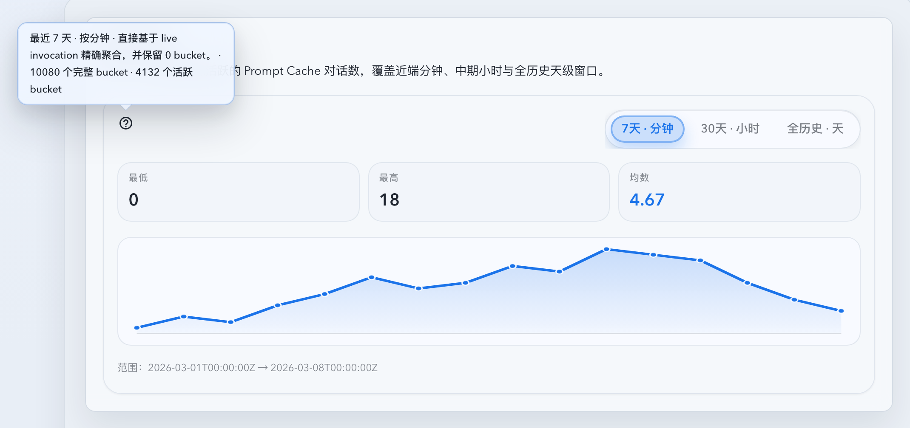
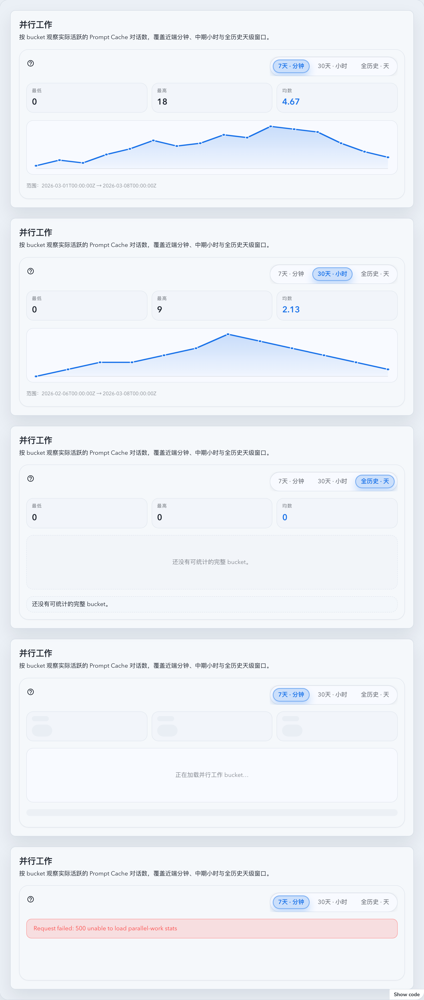

# 并行工作 bucket 统计（分钟 / 小时 / 天）（#f3dx3）

## 状态

- Status: 已实现，待截图提交授权 / PR 收敛
- Created: 2026-04-07
- Last: 2026-04-07

## 背景 / 问题陈述

- 统计页当前提供的是请求量、成功失败、错误原因等指标，但缺少“同一时间段内实际有多少个工作对话在推进”的视角。
- Dashboard 已经存在“工作中的对话”语义，真相源来自 `promptCacheKey` 活跃对话；统计页仍缺少一个能跨分钟 / 小时 / 天观察并行工作强度的长期面板。
- 项目已经有 `prompt_cache_rollup_hourly` 这层长期在线 rollup，适合承接最近一个月按小时与永久按天的聚合，但当前尚无对应 API 与前端展示。

## 目标 / 非目标

### Goals

- 新增独立指标面：`并行工作数 = bucket 内发生过请求的 distinct promptCacheKey 数量`。
- 新增 `GET /api/stats/parallel-work?timeZone=`，固定返回 `minute7d`、`hour30d`、`dayAll` 三组窗口。
- `minute7d` 走 `codex_invocations` 精确查询；`hour30d` 与 `dayAll` 复用 `prompt_cache_rollup_hourly`。
- 每组窗口都返回零填充后的完整 bucket 序列，以及 `minCount / maxCount / avgCount / completeBucketCount / activeBucketCount`。
- Stats 页新增一个响应式 section，按项目既有 segmented toggle 习惯在 `minute7d / hour30d / dayAll` 三个窗口之间切换，每次只显示一个窗口卡片与趋势图。
- 为新 section 补稳定 Storybook 入口，并将 Storybook docs 作为视觉证据真相源。

### Non-goals

- 不把该指标定义为严格瞬时请求重叠并发。
- 不把单条请求按 `t_total_ms` 展开到跨 bucket 的“占用时长”。
- 不新增永久分钟级 rollup 表、额外 retention 规则或 schema 迁移。
- 不为该指标扩展账号 / 模型 / source 维度拆分。
- 不修改现有 `/api/stats/timeseries`、总请求量、cost、token 的口径。

## 范围（Scope）

### In scope

- `docs/specs/f3dx3-parallel-work-bucket-stats/SPEC.md`
- `docs/specs/README.md`
- `src/api/mod.rs`
- `src/maintenance/hourly_rollups.rs`
- `src/tests/mod.rs`
- `web/src/lib/api.ts`
- `web/src/lib/api.test.ts`
- `web/src/hooks/useParallelWorkStats.ts`
- `web/src/hooks/useParallelWorkStats.test.tsx`
- `web/src/components/ParallelWorkStatsSection.tsx`
- `web/src/components/ParallelWorkStatsSection.test.tsx`
- `web/src/components/ParallelWorkStatsSection.stories.tsx`
- `web/src/pages/Stats.tsx`
- `web/src/pages/Stats.test.tsx`
- `web/src/i18n/translations.ts`

### Out of scope

- Dashboard 或 Live 页新增同类 section。
- CRS 外部汇总源并行工作统计（它没有 `promptCacheKey`）。
- 新增自定义 range / bucket 选择器。
- 非整点 UTC offset 时区下的历史 rollup 精确重分桶优化。

## 接口与数据口径

- 指标定义：bucket 内出现过请求的 `distinct promptCacheKey` 数量。
- 固定窗口：
  - `minute7d`：最近 7 天完整分钟 bucket。
  - `hour30d`：最近 30 天完整小时 bucket。
  - `dayAll`：从首个可完整覆盖的自然日开始，到最近一个完整自然日结束。
- 响应契约：
  - `rangeStart: string`
  - `rangeEnd: string`
  - `bucketSeconds: number`
  - `completeBucketCount: number`
  - `activeBucketCount: number`
  - `minCount: number | null`
  - `maxCount: number | null`
  - `avgCount: number | null`
  - `points[{ bucketStart, bucketEnd, parallelCount }]`
- summary 口径：
  - 基于零填充后的完整 bucket 序列计算。
  - `avgCount` 为完整 bucket 的算术平均值，窗口中的 0 必须计入。
  - 当前未结束 bucket 一律不进入 points 与 summary。
- `dayAll` 空历史契约：
  - 若没有任何完整自然日样本，则返回空 `points`，且 `minCount / maxCount / avgCount = null`。
- 工程取舍：
  - `hour30d` / `dayAll` 优先复用 `prompt_cache_rollup_hourly`，不新增分钟级持久化。
  - 对非整点 UTC offset 的 reporting time zone，历史 rollup 无法无损重分桶；首版保持与现有 hourly-rollup 统计约束一致。

## 验收标准（Acceptance Criteria）

- Given 同一个 `promptCacheKey` 在同一 bucket 内出现多次，When 请求 `/api/stats/parallel-work`，Then 该 bucket 只计 1 次并行工作。
- Given 同一个 `promptCacheKey` 跨 bucket 继续活跃，When 请求 `/api/stats/parallel-work`，Then 它会分别计入各自 bucket。
- Given bucket 内没有任何请求，When 返回窗口数据，Then 该 bucket 仍会作为 `parallelCount = 0` 的点出现在结果中。
- Given 当前分钟 / 小时 / 自然日尚未结束，When 请求统计，Then 当前未结束 bucket 不会进入 points 与 summary。
- Given `dayAll` 还没有任何完整自然日样本，When 请求统计，Then `dayAll.points = []` 且 `minCount / maxCount / avgCount = null`。
- Given 打开 Stats 页并行工作 section，When 数据正常返回，Then 页面通过 segmented toggle 在最近 7 天按分钟、最近 30 天按小时、全历史按天三个窗口之间切换，且同一时刻只显示一个窗口卡片。
- Given section 进入 loading / error / empty / populated 任一状态，When 渲染 Storybook，Then 布局稳定且状态文案清晰。

## 非功能性验收 / 质量门槛

### Testing

- `cargo check --tests`
- `cargo test parallel_work -- --nocapture`
- `cd web && bun run test`
- `cd web && bun run build`
- `cd web && bun run build-storybook`

### UI / Storybook

- 新增稳定故事：`web/src/components/ParallelWorkStatsSection.stories.tsx`
- 视觉证据来源：`storybook_docs`

## 文档更新（Docs to Update）

- `docs/specs/README.md`

## Plan assets

- Directory: `docs/specs/f3dx3-parallel-work-bucket-stats/assets/`

## Visual Evidence

- source_type: storybook_docs
  target_program: mock-only
  capture_scope: element
  sensitive_exclusion: N/A
  submission_gate: pending-owner-approval
  docs_entry_or_title: Stats/ParallelWorkStatsSection
  state: populated
  evidence_note: 验证 Stats 页并行工作 section 已按项目既有 segmented toggle 习惯切换显示 `minute7d / hour30d / dayAll` 三个窗口，选择器位于卡片右上角，当前激活窗口不再单独展示窗口标题或说明，而是把整段窗口元信息都收进问号气泡，并保留全宽趋势图。
  image:
  

- source_type: storybook_docs
  target_program: mock-only
  capture_scope: element
  sensitive_exclusion: N/A
  submission_gate: pending-owner-approval
  docs_entry_or_title: Stats/ParallelWorkStatsSection
  scenario: gallery
  evidence_note: 验证同一 docs 入口已覆盖分钟窗口默认态、切换到小时窗口、`dayAll` 空历史、loading 与 error 五类关键状态，且选择器在各卡片头部右上角、窗口元信息统一收敛到问号气泡、每次只显示一个激活窗口。
  image:
  

## 实现里程碑（Milestones / Delivery checklist）

- [x] M1: 新建 spec 与索引条目，冻结并行工作统计口径与 API 契约。
- [x] M2: 后端新增 `/api/stats/parallel-work`，完成 minute / hour / day 三组窗口聚合与零填充。
- [x] M3: 前端新增 hook、Stats 页 section、紧凑趋势图与 i18n 文案。
- [x] M4: Storybook 覆盖 loading / error / empty / populated，并产出视觉证据。
- [ ] M5: 本地验证、spec-sync、review-loop 与 PR 收敛到 merge-ready。

## 风险 / 假设 / 参考

- 风险：`dayAll` 基于 `prompt_cache_rollup_hourly` 做永久历史聚合，数据量增大后接口耗时可能上升；首版通过只读取必要列并按天流式去重控制内存占用。
- 风险：非整点 UTC offset 时区无法从 hourly rollup 无损重分桶；首版保持现有限制，而不是切回昂贵的永久 exact query。
- 假设：`promptCacheKey` 为空或缺失的请求不参与并行工作统计。
- 假设：默认 reporting time zone fallback 继续沿用 `Asia/Shanghai`。
- 参考：
  - [#w3t3w](../w3t3w-dashboard-working-conversations-cards/SPEC.md)
  - [#x2s4h](../x2s4h-stats-first-response-byte-total-p95/SPEC.md)

## 变更记录（Change log）

- 2026-04-07: 完成 `GET /api/stats/parallel-work`、固定窗口聚合、Stats 页 section、Storybook docs 与前后端测试；根据主人反馈将并行工作 section 改为按项目既有 segmented toggle 习惯切换窗口显示，同一时刻不再并排展示三个统计。
- 2026-04-07: 按主人反馈把并行工作趋势图改为全宽交互图表，并补上 hover / click 详情浮窗、Storybook 交互覆盖与前端回归验证。
- 2026-04-07: 按主人反馈把窗口选择器移到卡片右上角，并同步刷新 loading / error / empty / populated 布局与 Storybook docs 证据。
- 2026-04-07: 按主人反馈移除卡片内单独的窗口标题与说明，把整段窗口元信息统一折叠进问号气泡提示，并刷新 Storybook docs 证据。
- 2026-04-07: 刷新 Storybook docs 视觉证据并落盘到 spec 资产目录，当前等待主人确认截图可随提交一起 push 后再进入 PR 收敛。
