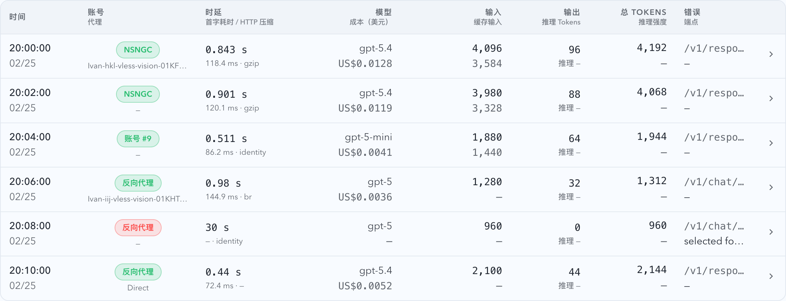

# InvocationTable 代理节点展示热修（#f7nqn)

## 状态

- Status: 已完成
- Created: 2026-03-17

## 背景 / 问题陈述

- 生产 `Dashboard / Live` 的 InvocationTable 已经切成“账号 / 代理”双行摘要，但 2026-03-17 的新请求出现了两类错误：
  - 一部分 live 新记录缺少 `routeMode`、`upstreamAccountName`、`responseContentEncoding` 等上下文字段，导致账号错误地回退成 `反向代理`。
  - 另一部分 pool 路由记录把号池账号的 `upstream_base_url` host 填进了 `proxyDisplayName`，把上游站点误显示成“代理节点”。
- 生产数据库里的 invocation payload 已经持久化了正确的 `routeMode=pool` 和 `upstreamAccountName`，说明问题不在前端布局，而在新记录广播投影与 `proxyDisplayName` 语义。

## 目标 / 非目标

### Goals

- 恢复未来新产生 invocation 的 live 展示一致性，让账号列与详情中的账号/代理含义重新正确。
- 保持 `/api/invocations` 与前端 `ApiInvocation` 契约不变，只修 payload 语义与新记录广播投影。
- 为 pool 路由与 forward proxy 路由补回归保护，避免再次把上游 host 误当成代理节点，或让 live 新记录丢上下文字段。

### Non-goals

- 不回填历史空值或错误语义记录；旧数据允许继续显示 `—` 或旧值。
- 不回滚账号列、时延列或当前页账号抽屉功能。
- 不新增新的公开 API 字段或数据库迁移。

## 范围（Scope）

### In scope

- `src/main.rs` 的 invocation payload 构造、`proxyDisplayName` 解析策略与 broadcast 回读投影。
- `src/tests/mod.rs` 的后端回归测试。
- `web/src/components/InvocationTable.test.tsx` 的前端展示回归验证。
- `web/src/components/InvocationTable.stories.tsx` 的 Storybook 语义矩阵与 docs 展示。
- `docs/specs/README.md` 与本热修 spec 的同步。

### Out of scope

- 历史记录 backfill。
- 其它业务表格与号池页面布局调整。
- 生产代理配置本身的修改。

## 功能与行为规格（Functional/Behavior Spec）

### Core flows

- forward proxy 路由继续使用 `SelectedForwardProxy.display_name` 作为 `proxyDisplayName`。
- pool 路由在没有 `SelectedForwardProxy` 时，不再伪造 `proxyDisplayName`；该字段保持为空，由前端按既有规则降级显示 `—`。
- `persist_and_broadcast_proxy_capture` 回读新插入记录时，必须投影完整的 live 表格上下文：`routeMode`、`upstreamAccountId`、`upstreamAccountName`、`responseContentEncoding`、`proxyDisplayName`。
- 前端保持现有渲染规则：
  - `routeMode=pool` 且有账号信息时，账号显示真实号池账号名。
  - `proxyDisplayName` 非空时显示真实代理节点名。
  - `proxyDisplayName` 为空时显示 `—`，而不是把上游 host 伪装成代理。
- Storybook 必须提供 `Account Proxy Semantics` 展示，用 6 类记录并排说明 `账号 / 代理` 列的支持语义，并明确禁止把 `claude-relay-service.nsngc.org` 这类上游 host 当成代理节点。

### Edge cases / errors

- pool 路由的新记录即使没有代理节点名，也必须通过 `routeMode/upstreamAccountName` 正确显示账号名，不能回退成 `反向代理`。
- forward proxy 错误路径与成功路径都必须保持 `proxyDisplayName` 不丢失。
- live 广播与 `/api/invocations` 首次拉取必须返回同一组账号/代理/压缩上下文，避免页面刷新前后语义不一致。

## 验收标准（Acceptance Criteria）

- Given 一条新的 `routeMode=pool` invocation，When 它被写入并从 live broadcast 或 `/api/invocations` 读回，Then 账号显示真实号池账号名，且 `proxyDisplayName` 为空时前端展示 `—`。
- Given 一条新的 `routeMode=forward_proxy` invocation，When 它被写入并从 live broadcast 或 `/api/invocations` 读回，Then `proxyDisplayName` 保持选中 forward proxy 的 display name。
- Given 前端收到新记录广播，When 渲染摘要与展开详情，Then 账号、代理、HTTP 压缩算法与列表接口返回保持一致。
- Given 生产发布完成后新产生一条 pool invocation，When 在生产页面查看，Then 不再出现“账号=反向代理、代理=上游 host”这种语义错误。

## 非功能性验收 / 质量门槛（Quality Gates）

### Testing

- `cargo check`
- `cargo test proxy_capture_persist_and_broadcast_emits_records_summary_and_quota`
- `cargo test list_invocations_projects_payload_context_fields`
- `cargo test capture_target_pool_route_retries_first_chunk_failure_and_persists_single_invocation`
- `cd web && bunx vitest run src/components/InvocationTable.test.tsx`
- `cd web && bun run build-storybook`

## 文档更新（Docs to Update）

- `docs/specs/README.md`
- `docs/specs/f7nqn-invocation-proxy-display-restore-hotfix/SPEC.md`

## 风险 / 假设

- 风险：pool 路由当前没有稳定的真实代理节点上下文，因此热修选择“宁可为空也不伪造”。
- 假设：主人接受“只修未来，不回填历史”的 hotfix 边界。

## Visual Evidence (PR)

- source_type: storybook_canvas
  target_program: mock-only
  capture_scope: element
  sensitive_exclusion: N/A
  submission_gate: approved
  story_id_or_title: Monitoring / InvocationTable / Account Proxy Semantics
  state: semantic matrix
  evidence_note: Verifies the compact `账号 / 代理` badge and the six supported account-versus-proxy combinations, including pool accounts, reverse-proxy fallback, and empty proxy-node handling.

  

