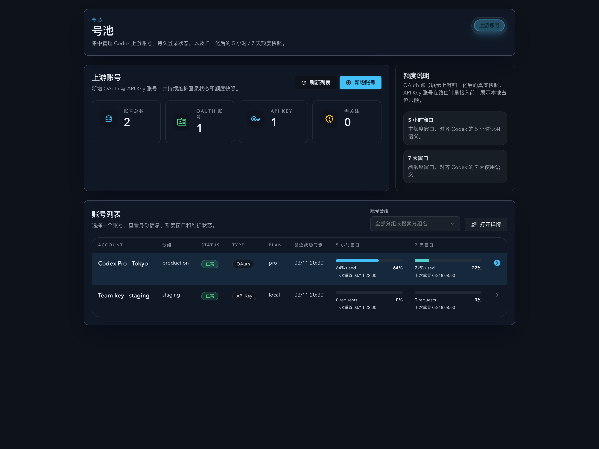
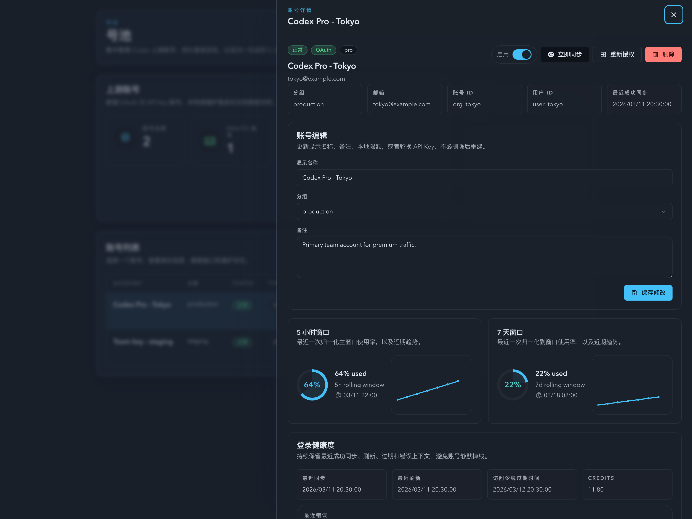
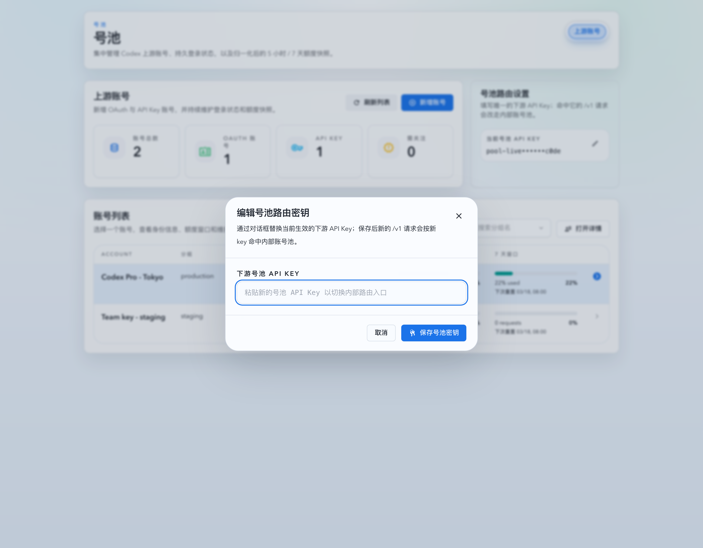
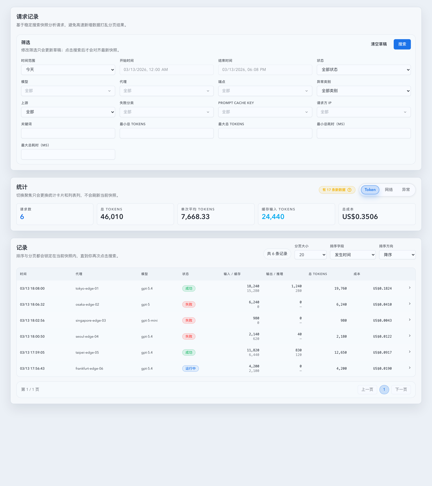
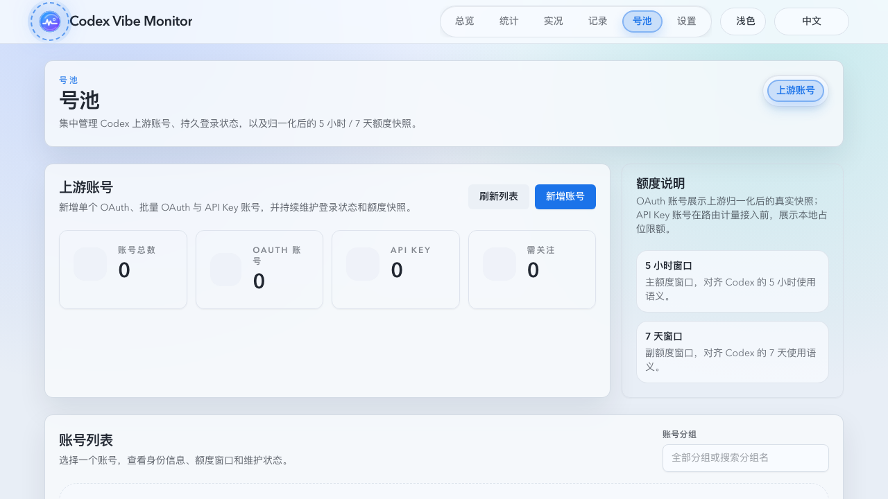
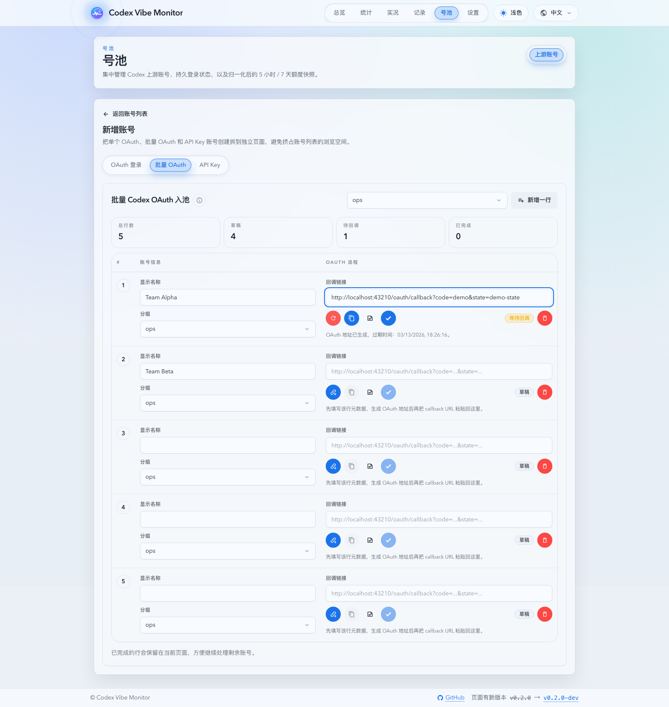
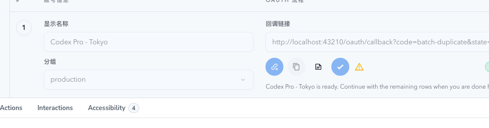
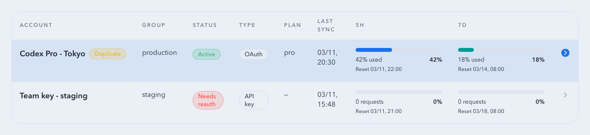
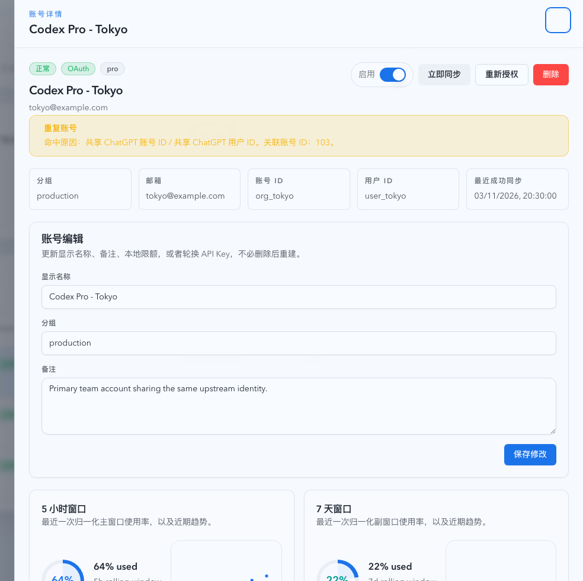

# 号池模块第一阶段：上游账号管理（#g4ek6）

## 状态

- Status: 已实现
- Created: 2026-03-11
- Last: 2026-03-16

## 背景 / 问题陈述

- 当前项目只有 dashboard / stats / live / settings 四个顶级模块，还没有面向号池的控制面，无法管理上游账号、查看配额窗口，也无法为后续账号路由提供持久化基础。
- 现有运行时仅围绕反向代理、forward proxy 与 CRS 统计展开，没有 Codex OAuth 登录、token 持久化、定时保活或账号级限额快照采样能力。
- 用户要求本阶段只做 `号池 -> 上游账号` 管理：既要支持 Codex OAuth 账号，也要支持手动录入的 Codex API Key 账号，并明确展示 `5 小时` 与 `7 天` 配额窗口。
- OAuth 登录需要遵循 Codex CLI 当前的浏览器登录语义：服务端创建一次性登录会话，返回 `loginId + authUrl`，浏览器跳转 OpenAI 授权页，再通过本服务 callback 交换 token 与落库。

## 目标 / 非目标

### Goals

- 新增顶级模块 `号池`，默认子页为 `上游账号`，提供账号列表、详情、状态、操作与 `5 小时 / 7 天` 图形化容量展示。
- 支持两类账号：`oauth_codex` 与 `api_key_codex`；其中 OAuth 使用 Codex CLI 风格的一次性登录会话与 PKCE callback 流程。
- OAuth 新建页必须同时支持 `单账号 OAuth`、`批量 OAuth` 与 `API Key` 三种同页模式；批量模式复用现有单账号 OAuth 接口，不新增后端批量 API。
- 账号元数据必须支持 `isMother`（母号）标记；同一分组最多一个母号，未分组账号视为同一个桶。
- 新增服务端持久化、加密存储、定时刷新与配额同步，确保 OAuth 账号在应用重启后仍可恢复并尽量不掉登录状态。
- 为后续账号路由阶段准备稳定的数据面：账号状态机、身份信息、最新快照与近 7 天历史样本。

### Non-goals

- 不实现 `/v1/*` 的账号选择、sticky、故障转移、速率限制回写与真实号池调度。
- 不引入全站登录系统；除 OAuth callback 外，所有账号管理写接口继续沿用当前 same-origin 写保护与内网信任边界。
- 不为 API Key 账号接入真实上游 usage 计量；第一阶段只支持本地限额配置与占位展示。

## 范围（Scope）

### In scope

- `src/upstream_accounts/mod.rs`：账号模型、SQLite schema、OAuth 会话、token 加密存储、刷新/同步逻辑、HTTP handlers。
- `src/main.rs`：AppConfig / AppState 扩展、schema 接入、后台维护任务注册、号池 API 路由接线。
- `web/src/App.tsx`、`web/src/components/AppLayout.tsx`、`web/src/pages/account-pool/**`、`web/src/components/UpstreamAccounts*.tsx`、`web/src/hooks/useUpstreamAccounts.ts`、`web/src/lib/api.ts`、`web/src/i18n/translations.ts`：新模块 UI、接口对接与图表展示。
- `README.md` 与 `docs/deployment.md`：补充账号管理相关 env 与运维说明。

### Out of scope

- 现有 settings 页面结构重做。
- forward proxy / reverse proxy 数据面改造为“按账号发请求”。
- OpenAI API key usage 实时探测。

## 需求（Requirements）

### MUST

- 顶级导航必须新增 `号池`，默认进入 `上游账号` 页面；桌面端为列表 + 详情面板，移动端退化为垂直堆叠。
- `POST /api/pool/upstream-accounts/oauth/login-sessions` 必须创建一次性登录会话并返回 `loginId`、`authUrl`、`expiresAt`；`authUrl` 必须基于 Codex CLI 当前 OAuth 参数：`audience=https://api.openai.com/v1`、`scope=openid profile email offline_access`、`codex_cli_simplified_flow=true`、`prompt=login`、`code_challenge_method=S256`。
- `GET /api/pool/upstream-accounts/oauth/callback` 必须校验 `state`、TTL、single-use 与 PKCE，再执行 code exchange；任何失败都要把登录会话落为 `failed` 或 `expired`，供前端轮询读取。
- OAuth token 与 API key 必须以服务端加密密文落库；若未配置加密密钥，所有账号管理写接口必须拒绝请求并返回明确错误。
- OAuth 账号持久化后必须保存 `access_token`、`refresh_token`、`id_token`、`token_expires_at`、`chatgpt_account_id`、`chatgpt_user_id`、`email`、`plan_type` 等最小恢复信息；应用重启后必须可以继续刷新与同步。
- 上游账号身份重复（共享 `chatgpt_account_id` 或 `chatgpt_user_id`）只能告警、不得阻止保存；列表与详情必须持续显示重复标记，且 OAuth 新建完成后要给出一次性 warning。
- `displayName` 必须全局唯一，按“忽略大小写 + 去首尾空格”判重；单 OAuth、批量 OAuth、API Key 创建与详情编辑命中重复时必须拒绝提交。
- 服务端必须定期刷新即将过期的 OAuth token，并定期从 Codex / ChatGPT usage 接口采集 `5 小时(primary)` 与 `7 天(secondary)` 窗口，落库为最新快照与历史样本。
- `5 小时` 与 `7 天` 必须在列表和详情中同时以图形化 + 文字展示：列表展示最新进度，详情展示进度条/图 + 趋势图 + 重置时间 + 状态说明。
- API Key 账号必须支持新增、编辑、启停、删除；其 `5 小时` 与 `7 天` 限额来自本地配置，默认 `used=0`，并在 UI 中显式标注“本地占位统计”。
- 号池路由密钥弹窗必须提供“生成密钥”次级动作：前端本地生成 `cvm-` 前缀的高熵 key 并填入输入框，只有用户点击保存后才真正替换当前生效 key。
- 批量 OAuth 模式必须以表格呈现，允许“一个逻辑账号占两行视觉布局”，但每个字段控件都必须保持单行输入，不得在单元格内自动换行；每行 OAuth 生成/完成状态独立，失败不得阻塞其他行。
- 批量 OAuth 行操作区必须在“完成 OAuth 登录”与状态 badge 之间提供母号皇冠按钮，使用 Iconify `mdi:crown` / `mdi:crown-outline`。
- 账号状态至少支持 `active`、`syncing`、`needs_reauth`、`error` 与 `disabled`；授权失效只能转 `needs_reauth`，不得静默删除账号或清空最后一次成功快照。
- 任何导致组内母号归属变化的写操作，都必须触发系统级通知，并提供 10 秒可撤销窗口；同组后续切换应覆盖旧撤销上下文。
- 账号详情页的操作忙碌态必须按账号隔离：当账号 A 正在同步/保存/删除/启停时，切到账号 B 的详情不得继承 A 的 loading/spinning 状态。

### SHOULD

- 列表应支持搜索、状态筛选与一键同步，便于首版管理几十个账号时仍可浏览。
- 详情页应支持行内编辑名称/备注/本地限额，不强制弹出完整编辑页面。
- 后台同步应为同一账号串行，避免重复刷新 token 或并发写入相同快照。

## 功能与行为规格（Functional/Behavior Spec）

### Core flows

- 用户点击 `新增 OAuth 账号` 后，前端创建登录会话、打开授权页并轮询登录状态；callback 成功后列表自动刷新并选中新账号。
- 用户点击 `Batch OAuth` 后，前端在同页表格中维护多行 OAuth 草稿；每行独立生成登录会话、复制授权链接并回填 callback，已完成行必须留在当前页，方便继续处理剩余账号。
- 用户把账号设为母号后，服务端以该分组为边界自动撤销旧母号；前端收到成功响应后立即弹出系统级通知，并允许撤销到操作前的母号归属。
- 服务端在 callback 成功后立即保存账号，并尝试执行一次 usage 同步；同步失败不回滚账号创建，而是把账号标为 `error` 并保留最后错误。
- 新建 OAuth 账号时不得再按 `chatgpt_account_id` 覆盖旧账号；只有显式 `accountId` 的 re-login 才允许覆盖现有 OAuth 账号的凭据与身份字段。
- 服务启动时会扫描所有启用中的 OAuth 账号：对即将过期的账号先 refresh，对到达同步周期的账号拉取 usage 快照并写入样本。
- 用户点击 `重新登录` 会创建绑定到现有账号的登录会话；callback 成功后覆盖旧 token，但账号主键、历史样本和本地备注保持不变。
- 用户点击 `立即同步` 时，OAuth 账号执行 refresh + usage 拉取；API Key 账号仅刷新本地展示状态。
- 用户在账号 A 的异步操作未完成前切换到账号 B 时，晚到的 A 详情响应、同步响应或列表刷新都不得覆盖 B 的 detail 区块，也不得把当前选中账号强行切回 A。

### Edge cases / errors

- 登录会话 TTL 默认 10 分钟；过期后轮询接口返回 `expired`，callback 页面也必须提示会话已过期。
- 若 callback 的 `state` 不匹配、会话已消费、code exchange 失败或 token 缺失 `refresh_token`，则会话进入 `failed`，前端展示错误并允许重新发起登录。
- 若 refresh 返回 `400/401` 或明确 `invalid_grant`，账号转 `needs_reauth`；若只是网络超时或 5xx，账号转 `error`，下个周期继续重试。
- 若 usage 接口返回 401，服务端应先尝试一次 refresh，再重试 usage；仍失败时按授权失效处理。

## 接口契约（Interfaces & Contracts）

| 接口（Name）                          | 类型（Kind）    | 范围（Scope） | 变更（Change） | 契约文档（Contract Doc）   | 负责人（Owner） | 使用方（Consumers） | 备注（Notes）             |
| ------------------------------------- | --------------- | ------------- | -------------- | -------------------------- | --------------- | ------------------- | ------------------------- |
| `/api/pool/upstream-accounts`         | HTTP API        | internal      | New            | `./contracts/http-apis.md` | backend         | web                 | 列表 / 创建 / 更新 / 删除 |
| `/api/pool/upstream-accounts/:id`     | HTTP API        | internal      | New            | `./contracts/http-apis.md` | backend         | web                 | 详情页                    |
| `/api/pool/upstream-accounts/oauth/*` | HTTP API        | internal      | New            | `./contracts/http-apis.md` | backend         | web / browser popup | 登录会话与 callback       |
| `pool_upstream_accounts*`             | SQLite          | internal      | New            | `./contracts/db.md`        | backend         | backend             | 账号 / 会话 / 样本        |
| `UpstreamAccountSummary/Detail`       | TS + Rust types | internal      | New            | `./contracts/http-apis.md` | backend + web   | web                 | 统一页面契约              |

- [contracts/http-apis.md](./contracts/http-apis.md)
- [contracts/db.md](./contracts/db.md)

## 验收标准（Acceptance Criteria）

- Given 用户位于 `dashboard / live / settings` 任意页面，When 点击导航中的 `号池`，Then 页面进入 `号池 -> 上游账号` 且不影响现有四个模块。
- Given 前端创建 OAuth 登录会话，When 打开 `authUrl` 并完成授权，Then callback 会把账号落库，轮询接口变为 `completed`，列表中出现该账号。
- Given 用户进入 `Batch OAuth` 模式，When 在多行里分别生成授权链接、粘贴 callback 并完成其中一行，Then 该行显示 `completed` 且页面保持在批量表格，其他行仍可继续生成或完成。
- Given 两个 OAuth 账号共享相同的 `chatgpt_account_id` 或 `chatgpt_user_id`，When 第二个账号完成入池，Then 系统保留两条账号记录，并在列表/详情中标记为重复身份。
- Given 用户在任一创建/编辑入口提交重复的 `displayName`，When 后端接收请求，Then 请求返回 `409`，前端展示 inline error，并禁止继续提交。
- Given 同组已有母号，When 用户把另一账号设为母号，Then 系统自动切换母号归属、弹出系统级通知，并在通知中提供撤销按钮恢复到切换前状态。
- Given OAuth 登录会话过期、state 错误或重复消费，When callback 被访问，Then 会话标记为 `failed/expired` 且不会创建或覆盖账号。
- Given 已持久化 OAuth 账号且 access token 到期，When 后台维护任务或手动同步运行，Then 系统会自动 refresh 并继续同步 usage，无需用户重新登录。
- Given refresh token 已失效，When 后台维护任务运行，Then 账号进入 `needs_reauth`，但账号记录、历史样本和最后成功同步时间仍然保留。
- Given API Key 账号录入了本地 `5 小时 / 7 天` 限额，When 打开列表或详情，Then 两个窗口都能显示本地限额与 `0` 使用量，并明确标记为占位统计。
- Given OAuth 账号已有 usage 样本，When 打开详情页，Then `5 小时` 与 `7 天` 卡片都能展示最新百分比、重置时间和最近 7 天趋势线。
- Given 用户打开号池路由密钥弹窗，When 点击“生成密钥”后关闭且未保存，Then 新生成的 key 只停留在当前草稿中，再次打开弹窗时输入框恢复为已保存状态。
- Given 账号 A 正在执行手动同步，When 用户切换并打开账号 B 的详情，Then B 的“立即同步”按钮保持空闲 outline 图标，且不会显示 A 的 spinner。
- Given 账号 A 的详情请求或同步响应晚于账号 B 返回，When 当前选中账号已经是 B，Then 页面只接受 B 的 detail 结果，A 的晚到响应不会覆盖详情内容，也不会把选中项切回 A。

## 非功能性验收 / 质量门槛（Quality Gates）

### Testing

- Rust tests：schema 创建 / 迁移、加密 round-trip、OAuth 登录会话生命周期、callback state/TTL/single-use 校验、refresh 分类、usage payload 归一化、母号唯一性与 session 落库。
- Web tests：账号列表与详情渲染、OAuth 轮询流程、API Key 表单、母号皇冠互斥、系统通知撤销、空态/错误态、导航路由。
- Browser smoke：本地打开 `号池 -> 上游账号`，验证新增 OAuth/API Key、同步与详情图表渲染。

### Quality checks

- `cargo fmt`
- `cargo check`
- `cargo test`
- `cd web && npm run test`
- `cd web && npm run build`

## 文档更新（Docs to Update）

- `README.md`：新增账号管理 env、OAuth 配置与使用说明。
- `docs/deployment.md`：新增加密密钥、OAuth callback 与运维保活说明。
- `docs/specs/README.md`：状态与 PR 记录同步。

## 实现里程碑（Milestones / Delivery checklist）

- [x] M1: 新增账号管理 SQLite schema、配置与后端 API。
- [x] M2: OAuth login session / callback / token refresh / usage sync 落地。
- [x] M3: `号池 -> 上游账号` 前端页面、列表、详情、图表与交互完成。
- [x] M4: Rust + Web 自动化验证补齐，并完成本地浏览器 smoke。
- [ ] M5: spec sync、PR、checks、review-loop 收敛。

## Change log

- 2026-03-16：补充账号详情抽屉的异步一致性约束，明确账号级 busy state 隔离、晚到 detail/sync 响应丢弃，以及同步按钮 idle 态改用 outline 图标。

## Visual Evidence (PR)

- source_type: storybook_canvas
  target_program: mock-only
  capture_scope: browser-viewport
  sensitive_exclusion: N/A
  submission_gate: pending-owner-approval
  story_id_or_title: Account Pool / Pages / Upstream Accounts / Operational
  state: default
  evidence_note: 验证号池首页的账号统计、路由设置卡片、分组筛选与 5 小时 / 7 天窗口列表展示。
  image:
  

- source_type: storybook_canvas
  target_program: mock-only
  capture_scope: browser-viewport
  sensitive_exclusion: N/A
  submission_gate: pending-owner-approval
  story_id_or_title: Account Pool / Pages / Upstream Accounts / Detail Drawer
  state: drawer-open
  evidence_note: 验证账号详情抽屉中的身份信息、配额卡片，以及新增的 Sticky Key 对话表格。
  image:
  

- source_type: storybook_canvas
  target_program: mock-only
  capture_scope: browser-viewport
  sensitive_exclusion: N/A
  submission_gate: pending-owner-approval
  story_id_or_title: Account Pool / Pages / Upstream Accounts / Routing Dialog
  state: dialog-open
  evidence_note: 验证号池入口 key 的编辑弹窗，包括标题层级、生成密钥按钮、输入字段、关闭回滚与主次按钮关系。
  image:
  

- source_type: storybook_canvas
  target_program: mock-only
  capture_scope: browser-viewport
  sensitive_exclusion: N/A
  submission_gate: pending-owner-approval
  story_id_or_title: Records / RecordsPage / Default
  state: filtered-list-default
  evidence_note: 验证记录页新增的上游筛选位于筛选区，并与统计卡片和记录表同页联动展示。
  image:
  

- source_type: local_browser
  target_program: codex-vibe-monitor local web app
  capture_scope: browser-viewport
  sensitive_exclusion: browser page only
  submission_gate: approved
  story_id_or_title: 上游账号列表页（真实运行界面）
  state: current-local
  evidence_note: 展示当前上游账号列表页的顶部操作区、统计卡片与列表容器布局，确认新增入口已收敛为单个按钮。
  image:
  

- source_type: local_browser
  target_program: codex-vibe-monitor local web app
  capture_scope: browser-viewport
  sensitive_exclusion: browser page only
  submission_gate: approved
  story_id_or_title: 批量 OAuth 创建页（真实运行界面）
  state: current-local
  evidence_note: 展示批量 OAuth 创建页的真实交互态：顶部默认分组控件、表格化批量录入、已生成 OAuth 链接以及回填 callback 的示例行。
  image:
  

- source_type: storybook_canvas
  target_program: mock-only
  capture_scope: element
  sensitive_exclusion: N/A
  submission_gate: pending-owner-approval
  story_id_or_title: Account Pool / Pages / Upstream Account Create / Batch OAuth Mixed States
  state: duplicate-warning-bubble
  evidence_note: 验证批量 OAuth 行内的重复身份告警已改成贴锚点的小气泡，并使用三角警告图标作为触发器，不再占用公共区域。
  image:
  

- source_type: storybook_canvas
  target_program: mock-only
  capture_scope: element
  sensitive_exclusion: N/A
  submission_gate: pending-owner-approval
  story_id_or_title: Account Pool / Components / Upstream Accounts Table / Duplicate Identity
  state: duplicate-badge-nowrap
  evidence_note: 验证账号列表中的“重复账号”标签保持单行展示，不再在窄列宽下自动换行。
  image:
  

- source_type: storybook_canvas
  target_program: mock-only
  capture_scope: element
  sensitive_exclusion: N/A
  submission_gate: pending-owner-approval
  story_id_or_title: Account Pool / Pages / Upstream Accounts / Duplicate OAuth Detail
  state: detail-drawer-open
  evidence_note: 验证账号列表页的重复账号详情抽屉持续展示重复标记与原因，作为创建页“打开详情”后的承接界面参考。
  image:
  

## 风险 / 假设

- 风险：OpenAI/Codex usage 接口只返回百分比窗口，不提供绝对请求/额度值，因此 OAuth 页面文字展示需围绕“窗口配额百分比 + reset time”展开。
- 风险：若部署在非公开可回调域名或错误的反向代理 Host/Origin 下，OAuth callback 会失败；因此需要把 redirect URI 基于实际请求 origin 生成并在文档中明确部署要求。
- 假设：Codex CLI 当前 OAuth client id 为 `app_EMoamEEZ73f0CkXaXp7hrann`，默认 issuer 为 `https://auth.openai.com`，默认 usage base 为 `https://chatgpt.com/backend-api`。

## 变更记录（Change log）

- 2026-03-11: 创建 spec，冻结账号管理第一阶段的范围、接口、状态机与验收口径。
- 2026-03-11: 完成后端账号管理 / OAuth 会话 / 前端号池页面实现，并通过 Rust + Web 自动化验证与本地浏览器 smoke。
- 2026-03-13: 扩展上游账号创建页为单账号 OAuth / 批量 OAuth / API Key 同页模式，并将批量 OAuth 表格纳入现有手动 OAuth 流程。
- 2026-03-13: 刷新 Storybook 视觉证据，补充路由设置弹窗、Sticky Key 对话与记录页上游筛选展示。
- 2026-03-14: 调整 OAuth 新建语义为“重复身份仅告警不合并”，并补充 `displayName` 全局唯一约束与 UI warning/inline error 验收口径。
