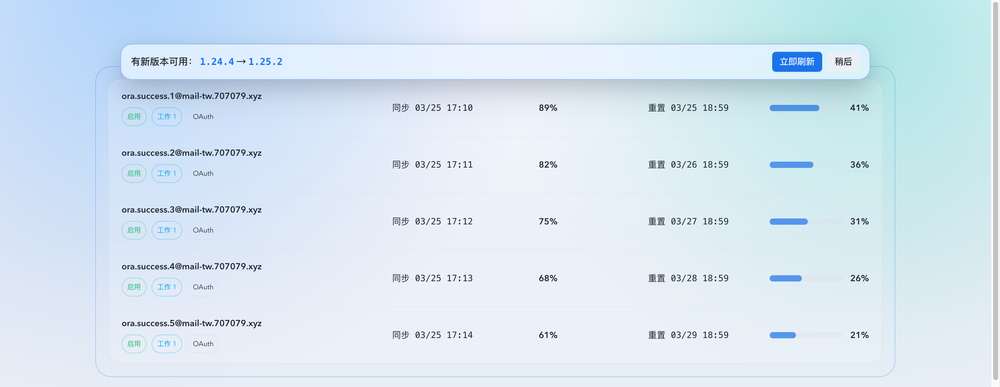
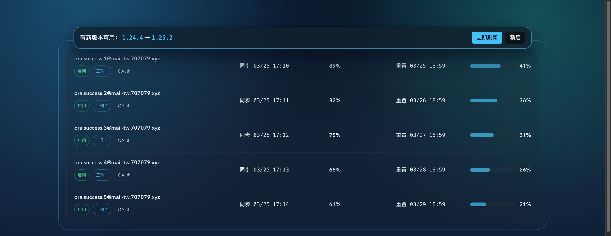
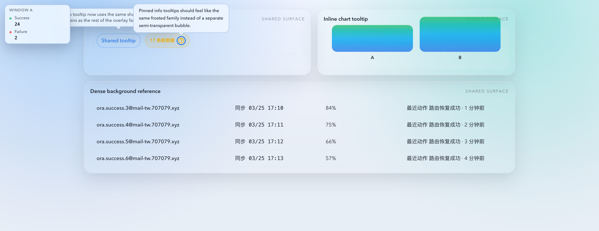
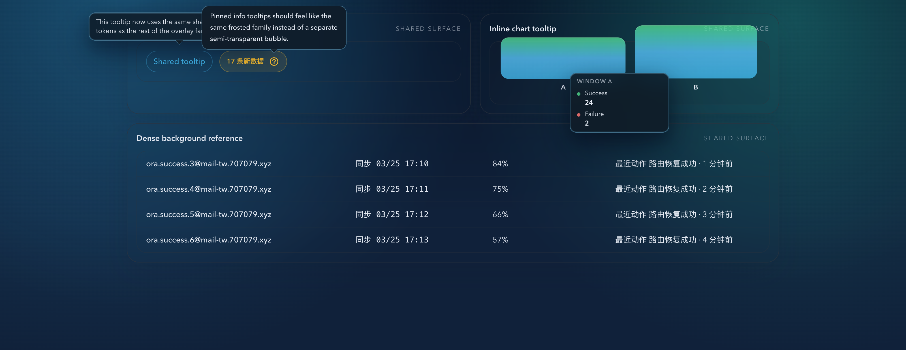

# 浮层提示磨砂隔离一致性修复（#gmycv）

## 状态

- Status: 已实现，待截图提交授权 / PR 收敛
- Created: 2026-03-25
- Last: 2026-03-25

## 背景 / 问题陈述

- `67acu-update-banner-readability` 已经修复过更新横幅的可读性，但后续配色调整把 `UpdateAvailableBanner` 收敛为 `border-primary/35 + bg-primary/10`，没有同步引入高遮罩底面或 blur，导致高密度内容在横幅下方可见时，文本再次被底层表格干扰。
- 仓库内浮层提示类表面语义目前分散在多处：`UpdateAvailableBanner`、`ui/tooltip.tsx`、`ui/inline-chart-tooltip.tsx`、`ui/system-notifications.tsx` 各自维护背景/边框/阴影/blur；`InfoTooltip` 与 `FloatingFieldBubble` 则走 `ui/bubble.ts`。这会让不同提示层在同一页面上出现透明度、阴影和磨砂强度不一致的问题。
- 这次回归属于 UI 隔离语义漂移，而不是交互或接口错误；如果不统一到底层 surface token，后续再调色时仍会重复出现“某一类提示层又变得太透”的问题。

## 目标 / 非目标

### Goals

- 为浮层型提示建立统一的共享 surface token/helper，固定 light/dark 下的底面遮罩、blur、shadow 与 tone accent 语义。
- 修复更新横幅在高信息密度背景上的隔离感，同时让通用 tooltip、图表 tooltip、系统通知与 `InfoTooltip` 的表面语义一致。
- 保持现有角色语义、交互时序和公开组件接口不变，仅收敛视觉层的共享基线。
- 提供 Storybook 稳定预览与 mock-only 视觉证据，作为后续 PR 与 spec 的单一截图来源。

### Non-goals

- 不改动 Rust 后端、SSE、数据库、i18n 文案或版本检测时机。
- 不把本次修复扩大到 `Popover`、`Combobox` 下拉、`Dialog` 或页面内联 `Alert`。
- 不改变 tooltip / toast / banner 的交互契约、出现时机或布局结构。

## 范围（Scope）

### In scope

- `web/src/components/UpdateAvailableBanner.tsx`
- `web/src/components/ui/bubble.ts`
- `web/src/components/ui/tooltip.tsx`
- `web/src/components/ui/inline-chart-tooltip.tsx`
- `web/src/components/ui/system-notifications.tsx`
- `web/src/components/ui/info-tooltip.tsx`
- `web/src/components/ui/floating-field-bubble.tsx`
- 相关 Storybook stories / docs entries / interaction coverage
- 相关前端回归测试
- `docs/specs/gmycv-overlay-prompt-frosting-consistency/SPEC.md`
- `docs/specs/README.md`

### Out of scope

- `web/src/components/ui/popover.tsx`、`filterable-combobox.tsx`、`dialog.tsx`
- 页面内联 `Alert`、表单错误态或非浮层型容器
- 任意后端代码与 API contract

## 需求（Requirements）

### MUST

- 更新横幅不得继续依赖类似 `bg-primary/10` 的低遮罩主色底作为主体背景；主体内容区域必须使用高遮罩 neutral/base 混色底面，并保留可感知的 blur 和柔和 shadow。
- `Tooltip`、`InlineChartTooltipSurface`、`SystemNotificationProvider` 渲染出的浮层表面必须与 `bubble.ts` 共享同一套 surface token/helper，而不是继续各自维护独立的透明度与 blur 值。
- surface token 必须支持至少 `neutral / info / success / warning / error / primary` 这些 tone 映射，允许边框与强调色带语义色，但正文区域仍以高遮罩底面为主。
- Light / dark 主题都必须保持“中等偏稳”的磨砂强度：能明显隔离底层内容，但仍保留少量环境氛围，不做完全不透明实体卡片。
- 迁移过程中不得回退现有可访问性与行为契约：`role` / `aria-live` / `role="tooltip"` / hover/focus/tap / pause-resume / dismiss / reload 行为必须保持。
- Storybook 必须提供至少一组高干扰背景下的稳定预览，能同时复核更新横幅、tooltip 或 toast 的隔离效果。

### SHOULD

- `InfoTooltip` 与 `FloatingFieldBubble` 尽量保留当前 API，只把其 surface 计算重定向到新的共享 helper。
- 新增或更新的 tests 应优先锁定 shared helper contract，而不是把具体 Tailwind class 字符串散落在每个组件里重复断言。

## 功能与行为规格（Functional / Behavior Spec）

### Shared surface semantics

- 新的共享 helper 负责输出 background、border、shadow、backdropFilter 与 tone accent 所需的 class/style 片段。
- tone 影响边框、轻度色偏或强调元素，不直接把主体区域变回高透明纯语义色底。
- `bubble.ts` 基于这层 helper 产出 `InfoTooltip` / `FloatingFieldBubble` 现有 surface style；其它浮层组件改为直接消费同一 helper。

### Component expectations

- `UpdateAvailableBanner`：保持现有 sticky 定位、按钮与文本结构，只提升表面隔离感与 tone accent。
- `Tooltip`：保持 Radix tooltip 的 portal、arrow、动画与 side placement；仅统一表面语义。
- `InlineChartTooltipSurface`：保持 body-root portal、位置计算与辅助技术文案；仅统一表面语义。
- `SystemNotificationProvider`：保持 toast portal、自动消失、hover 暂停和撤销交互；仅统一 toast surface。

## 验收标准（Acceptance Criteria）

- Given 深色或浅色主题下的高密度内容背景，When 更新横幅出现，Then 横幅正文、版本号与按钮不会再被底层表格文本干扰，视觉上明显具备磨砂隔离感。
- Given 通用 tooltip、inline chart tooltip、system notification 与 `InfoTooltip` 同时出现在应用中，When 切换 light/dark 主题，Then 不会出现某一类明显更透明或更浑浊的割裂感。
- Given 既有 tooltip / toast / banner 交互，When 完成本次迁移，Then hover/focus/tap、dismiss、pause-resume、reload 与 portal 行为保持不变。
- Given Storybook overlay gallery 或等价稳定 story，When 在 mock-only 噪声背景中查看这些浮层，Then 能直接复核“共享表面语义 + 中等偏稳磨砂”是否成立。
- Given 执行前端测试与构建，When 本次改动完成，Then 相关 Vitest 与 build 通过，且新增 contract coverage 能防止回退到低遮罩透明表面。

## 质量门槛（Quality Gates）

- `cd web && bun run test`
- `cd web && bun run build`
- Storybook mock-only 预览与浏览器 smoke，确认 light/dark 下的 overlay surface 一致性

## 实现里程碑（Milestones）

- [x] M1: 创建 follow-up spec 并登记索引，冻结范围、视觉目标与证据路径。
- [x] M2: 新增共享 overlay surface helper，并让 `bubble.ts` 建立在该 helper 之上。
- [x] M3: 迁移更新横幅、通用 tooltip、inline chart tooltip、system notification 到共享 surface。
- [x] M4: 补齐 Storybook 预览与前端回归测试。
- [ ] M5: 完成本地验证、视觉证据落盘与快车道 PR 收敛。

## Visual Evidence

- 证据来源：`storybook_canvas`
- 资产目录：`./assets/`
- 证据绑定要求：所有图片对应当前实现 `HEAD=86fe472dbd5d5618644816f13e2766da14b81b19`
- 浏览器 smoke：`chrome-devtools` 打开当前租约 Storybook `http://127.0.0.1:30050`

- source_type: storybook_canvas
  target_program: mock-only
  capture_scope: browser-viewport
  sensitive_exclusion: N/A
  submission_gate: pending-owner-approval
  story_id_or_title: Shell/Notifications/Update Available Banner — DenseBackdropLight
  state: light-theme
  evidence_note: 验证亮色主题下更新横幅主体改为高遮罩磨砂底面后，版本号、正文与操作按钮不再被下方高密度列表干扰。
  image:
  PR: include
  

- source_type: storybook_canvas
  target_program: mock-only
  capture_scope: browser-viewport
  sensitive_exclusion: N/A
  submission_gate: pending-owner-approval
  story_id_or_title: Shell/Notifications/Update Available Banner — DenseBackdropDark
  state: dark-theme
  evidence_note: 验证暗色主题下更新横幅仍保留柔和语义色边框与 blur，但主体内容区域不会回退到过透的 `primary` 半透明底。
  image:
  PR: include
  

- source_type: storybook_canvas
  target_program: mock-only
  capture_scope: browser-viewport
  sensitive_exclusion: N/A
  submission_gate: pending-owner-approval
  story_id_or_title: UI/Overlay Surface Gallery — LightTheme
  state: light-theme / tooltip + info tooltip + inline chart tooltip + toast family check
  evidence_note: 验证亮色主题下通用 tooltip、InfoTooltip、inline chart tooltip 与系统通知共享同一套高遮罩 frosted surface 语义，不再各自漂移。
  image:
  PR: include
  

- source_type: storybook_canvas
  target_program: mock-only
  capture_scope: browser-viewport
  sensitive_exclusion: N/A
  submission_gate: pending-owner-approval
  story_id_or_title: UI/Overlay Surface Gallery — DarkTheme
  state: dark-theme / tooltip + info tooltip + inline chart tooltip + toast family check
  evidence_note: 验证暗色主题下所有浮层仍维持一致的磨砂底面、边框和阴影强度，图表 tooltip 不会比其他 overlay 更透明或更浑浊。
  image:
  PR: include
  

## 风险 / 假设

- 假设：本次“所有提示层”限定为浮层型提示，不包含菜单、下拉、Dialog 与内联 Alert。
- 风险：若只修 `UpdateAvailableBanner` 而不统一底层 helper，其它 tooltip/toast 后续调色时仍可能再次漂移。
- 风险：视觉证据需要截图文件入库；若主人不允许提交图片，需要改为仅在对话中回传并在 spec 中记录阻断。

## 变更记录（Change log）

- 2026-03-25: 创建 follow-up spec，冻结浮层提示磨砂隔离一致性修复的范围、验收标准与视觉证据路径。
- 2026-03-25: 新增共享 `floating-surface` helper，并让 `bubble.ts`、更新横幅、通用 tooltip、inline chart tooltip 与系统通知统一消费同一套 overlay surface token。
- 2026-03-25: 补齐 `UpdateAvailableBanner`、`InfoTooltip`、`Overlay Surface Gallery` Storybook 预览，以及 shared surface contract / 组件交互回归测试。
- 2026-03-25: 本地验证通过：`cd web && bun run test`、`cd web && bun run build`、`cd web && bun run build-storybook`；已通过 Storybook + `chrome-devtools` 生成浅/深主题 mock-only 视觉证据。
- 2026-03-25: 快车道远端步骤待继续；因本次 evidence 需要随 spec / PR 一起提交图片文件，push 前仍需主人确认是否允许提交这些截图资源。
