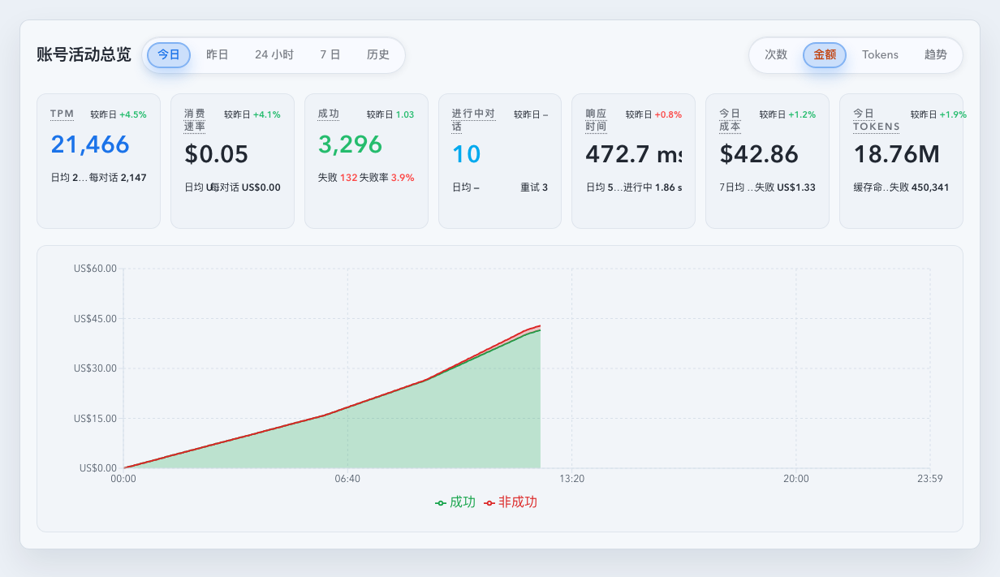
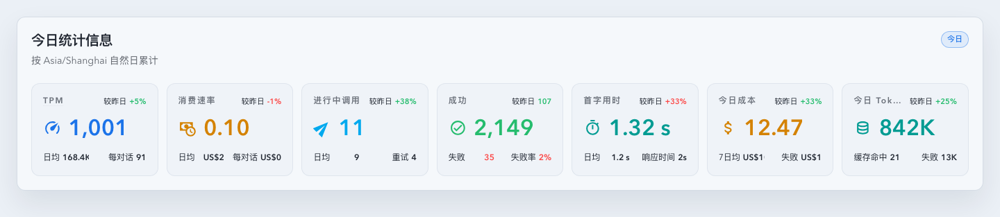
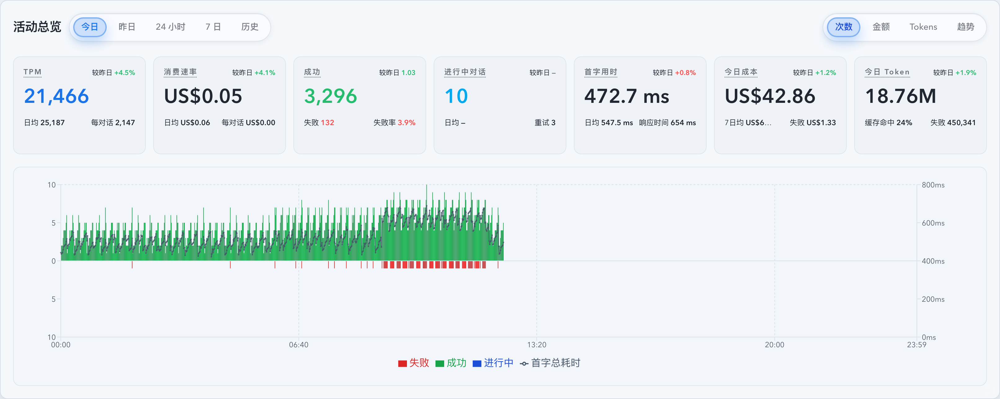
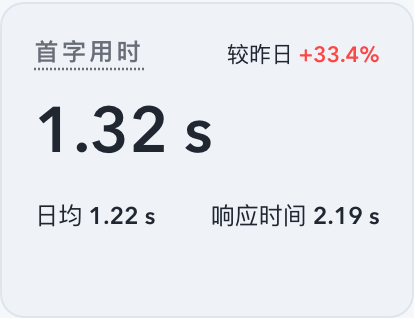
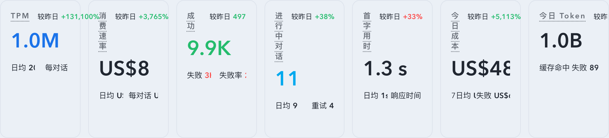
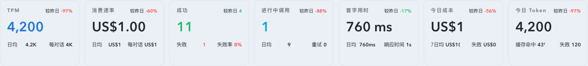
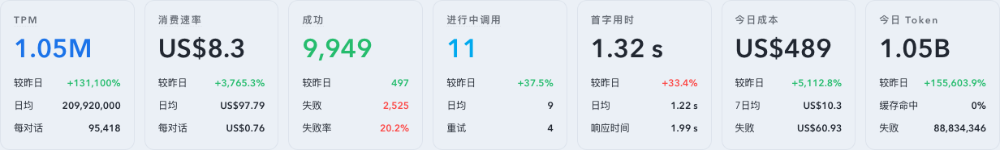

# Dashboard 自然日七卡 KPI 语义与布局重构（#gz5ns）

> 当前有效规范以本文为准；实现覆盖与当前状态见 `./IMPLEMENTATION.md`，关键演进原因见 `./HISTORY.md`。

## 背景 / 问题陈述

- 当前 `TodayStatsOverview` 的 7 张 KPI 卡虽然已经承载 `TPM / 消费速率 / 成功 / 进行中对话 / 首字用时 / 今日成本 / 今日 Tokens`，但二级信息仍采用“label 在上、value 在下”的两层堆叠，且右下语义位长期不完整。
- `较昨日` 目前散落在底部左右位，和日均、失败率、缓存命中等信息混在一起，导致扫读时难以快速分辨“主值”“比较值”“补充解释值”。
- Dashboard 主 `活动总览` 与账号详情 `DashboardActivityOverview` 虽然已经复用同一组件链路，但七卡的自然日语义还没有被 topic-level spec 冻结，后续继续调整时容易把账号作用域、严格进行中语义和失败成本/Token 口径拆散。

## 目标 / 非目标

### Goals

- 把 `TodayStatsOverview` 七卡统一重构为四区布局：左上标签、右上 comparison/meta、中央主值、底部左右两项辅助指标。
- 所有 `较昨日` 都移动到右上角，并改成 `label + value` 同行展示。
- 为每张卡补齐新的右下语义位，且主 Dashboard 与账号详情自然日视图复用同一实现与同一数据契约。
- 后端 summary / SSE `summary` 契约补齐严格进行中 retry、进行中等待均值、失败/中断成本与 Token，前端继续沿用现有 `useSummary` / `summary` SSE 快路径，不新增前端专用 KPI 轮询。

### Non-goals

- 不改 `24 小时 / 7 日 / 历史` 的 `StatsCards`、热力图、日历、metric toggle 或范围切换交互。
- 不改工作中对话卡片、排序、详情抽屉或 prompt-cache 表格的 owner-facing 布局。
- 不把 `成功` 卡左下 `失败` 的既有计数口径改成别的定义；本轮只增加右上同进度比较。
- 不新增 README、入口文档或独立 KPI API。

## 范围（Scope）

### In scope

- `web/src/components/TodayStatsOverview.tsx`：卡片结构、secondary/meta 排布与新 helper 接入。
- `web/src/components/DashboardActivityOverview.tsx`：today/yesterday 两条自然日路径接入增强后的 summary 字段，并保持账号级 `upstreamAccountId` 复用。
- `web/src/components/DashboardTodayActivityChart.tsx` 与 `web/src/components/dashboardTodayActivityChartData.ts`：自然日金额累计图改为 `Success + Non-success` 堆叠面积，并保持 Dashboard / 账号详情共用同一图表语义。
- `web/src/components/dashboardKpiComparisons.ts` 与相关 helper：补齐成功同进度比值和每对话 / 失败 / 重试 / 进行中等待等前端派生。
- `src/api/slices/invocations_and_summary.rs`、`src/api/slices/settings_models_and_cache.rs`、`src/api/slices/prompt_cache_and_timeseries/timeseries.rs`、`web/src/lib/api/core-foundation.ts`：扩展 `StatsResponse`、natural-day timeseries 与 summary/SSE 负载。
- 与 summary augmentation 直接相关的后端测试、前端测试和 Storybook 场景。

### Out of scope

- 新增独立的 working-conversations 前端读路径或 owner-facing 新面板。
- 调整 Dashboard 之外其他页面的 KPI 视觉系统。
- 修改现有 `t6d9r` 账号详情 read-model 的 SLA 目标或切回在线重算路径。

## 需求（Requirements）

### MUST

- 七卡统一采用四区布局：左上标题、右上 comparison/meta、中央主值、底部左右两项辅助值；底部项必须是同行 `label + value`，不再保留上下两行堆叠。
- `较昨日` 统一出现在右上；如果是 today 视图，默认表示与“昨日同一自然日进度下”的比较。
- `TPM` 右下为 `每对话`，公式是 `当前 TPM / strict inProgressConversationCount`；分母为 `0` 或缺失时显示 `—`。
- `消费速率` 右下为 `每对话`，公式是 `当前 spendRate / strict inProgressConversationCount`；分母为 `0` 或缺失时显示 `—`。
- `成功` 右上为 `较昨日`，语义是 `当前成功数 / 昨日同进度成功数` 的比例，不是 delta；底部仍保留 `失败` 与 `失败率`。
- `进行中对话` 右下为 `重试`，定义为当前 strict in-progress 对话里，上一条调用 display status 为 `failed` 且不含 `interrupted` 的唯一对话数。
- `首字用时` 右下为最近 5 分钟完整调用结束的 `t_total_ms` 均值，定义为当前自然日窗口内最近 5 分钟相交 bucket 的 `avgTotalMs` 按 `totalLatencySampleCount` 与相交时长加权后的窗口均值；缺样本显示 `—`，不回退到整日均值。
- `今日成本` / `今日 Tokens` 右下都为 `失败`，聚合 `failed + interrupted` 调用的 cost / tokens。
- 增强后的 summary 字段必须同时在全局 Dashboard 与 `upstreamAccountId` 账号作用域下可用。
- 自然日金额图保留“累计金额”语义，但在 `metric=totalCost` 时必须改为两层堆叠面积：`累计成功金额` + `累计 Non-success 金额`。
- 自然日金额图中的 `Non-success` 固定表示 `failed + interrupted` 成本；图例、tooltip 与 Storybook 证据必须统一使用这一领域术语，并按当前 locale 正确本地化，不再把 `interrupted` 隐含进“失败”一词。
- 共享 `AdaptiveDisplayValue` 的候选切换必须稳定：保留当前候选作为同一容器下的稳定真相源；只有当前候选真实超宽时才允许降级；只有更高信息量候选在真实可用宽度下额外留出 `6px` headroom 时才允许升级。重复 `ResizeObserver` / resize 评估不得让同一数值在两个候选字符串之间来回翻转。
- 货币类候选必须支持共享 profile。`rate` profile 的 full 候选固定从两位小数开始，并按 `2 位小数 -> 1 位小数 -> 0 位小数 -> compact` 的顺序退化；`default` profile 保持累计金额现有的非补零语义，不被强制补 `.00`。
- `TodayStatsOverview` 的 `消费速率` 主值、`日均`、`每对话` 必须统一走 `rate` 货币 profile；`今日成本`、`失败成本`、`StatsCards` 总成本等累计金额继续走 `default` profile。

### SHOULD

- 尽量把新 KPI 语义收敛在 `TodayStatsOverview` 与 helper 层，不把布局条件散落到 Dashboard 和账号页调用端。
- `成功` 右上 comparison 应复用与 cost/tokens 同类的 same-progress helper，而不是硬编码到组件 JSX。
- 后端 augmentation 保持“主 summary totals + live augmentation”结构，避免重写已有 rollup-backed totals 路径。
- `TodayStatsOverview` 内的主值、右上 comparison/meta、底部 secondary 数值应优先保留完整精度；仅在真实可用宽度不足时，才按“减少小数 -> compact -> compact 邻近单位回退”阶梯退化。
- 对计数、Token、货币类 compact 候选，选择规则必须优先保留更多有效信息；允许 `B` 回退到 `M`，也允许在必要时保留 `1.0B` 这类最小小数位，禁止在仍可表达更多信息时直接塌成 `1B`。
- `rate` 型货币在仓库支持的 desktop viewport 内应优先保留两位小数，只有真实宽度不足时才允许退到 `1` 位、`0` 位或 compact；空间充足时不允许显示成 `US$1` 这类丢精度主值。

### COULD

- 右上 comparison/meta 可兼容将来扩展成 tooltip 或更长的 label，但本轮不要求新增复杂交互。

## 功能与行为规格（Functional/Behavior Spec）

### Core flows

- 在 Dashboard `活动总览` 的 `今日` 与 `昨日` 页签中，七卡按同一顺序展示：`TPM`、`消费速率`、`进行中对话`、`成功`、`首字用时`、`今日成本`、`今日 Tokens`。
- 账号详情 `调用记录` tab 内复用同一个 `DashboardActivityOverview` / `TodayStatsOverview` 链路，样式与语义不分叉，只按 `upstreamAccountId` 切换数据作用域。
- `TPM` 与 `消费速率` 左下仍展示工作分钟日均，右上展示 `较昨日`，右下展示 `每对话`。
- `成功` 卡主值展示成功数，右上展示当前成功数相对昨日同进度成功数的比例，底部展示 `失败` 与 `失败率`。
- `进行中对话` 主值展示 strict in-progress conversation count，左下展示 `日均`，右上展示 `较昨日`，右下展示 `重试`。
- `首字用时` 主值沿用现有 active-tail 首字总耗时均值，左下展示整日日均，右上展示 `较昨日`，右下展示最近 5 分钟完整调用结束的 `t_total_ms` 均值。
- `今日成本` 左下展示前 7 个完整自然日均值，右上展示与昨日同进度 delta，右下展示失败/中断成本。
- `今日 Tokens` 左下展示缓存命中率，右上展示与昨日同进度 delta，右下展示失败/中断 tokens。
- `今日` / `昨日` 自然日顶部金额图在切到 `金额` metric 时，展示随时间推进的累计堆叠面积：底层为 `Success`，上层为 `Non-success`，两层和始终等于累计总金额。
- 账号详情页复用同一自然日金额图实现，不引入“主 Dashboard 用堆叠、账号详情保留单面积”的作用域分叉。

### Edge cases / errors

- strict in-progress 分母为 `0` 或 `null` 时，`每对话` 必须显示 `—`，不能显示 `0`。
- 当前最近 5 分钟窗口缺少完整调用结束的 `t_total_ms` 样本时，`首字用时 -> 响应时间` 显示 `—`。
- 当前没有昨日同进度成功数或基线为 `0` 时，`成功 -> 较昨日` 显示 `—`。
- summary 主请求失败时，保留现有整体 alert 语义；不把增强字段单独兜底成局部 tile。
- summary 成功但增强字段缺失时，只影响对应辅助位显示 `—`，不阻断主值展示。
- 若某分钟 bucket 没有 `Non-success` 成本，则 `Non-success` 堆叠层保持 `0`，不得改变累计总高度。
- 若某分钟 bucket 只有 `Non-success` 成本，则 `Success` 累计值保持不变，只由 `Non-success` 层把累计总额抬升到新的高度。
- 未来分钟或 closed-natural-day 之后的无效点上，两条累计成本序列都必须保持 `null`，不向后错误延长。

## 接口契约（Interfaces & Contracts）

### 接口清单（Inventory）

| 接口（Name）                                      | 类型（Kind）        | 范围（Scope） | 变更（Change） | 契约文档（Contract Doc） | 负责人（Owner） | 使用方（Consumers）                                         | 备注（Notes）                                       |
| ------------------------------------------------- | ------------------- | ------------- | -------------- | ------------------------ | --------------- | ----------------------------------------------------------- | --------------------------------------------------- |
| `StatsResponse.inProgressRetryConversationCount`  | http-response-field | external      | Modify         | None                     | backend/stats   | Dashboard natural-day KPI, account detail natural-day KPI   | strict in-progress retry 对话数                     |
| `StatsResponse.nonSuccessCost`                    | http-response-field | external      | Modify         | None                     | backend/stats   | Dashboard natural-day KPI, account detail natural-day KPI   | `failed + interrupted` cost                         |
| `StatsResponse.nonSuccessTokens`                  | http-response-field | external      | Modify         | None                     | backend/stats   | Dashboard natural-day KPI, account detail natural-day KPI   | `failed + interrupted` tokens                       |
| `TimeseriesPoint.nonSuccessCost`                  | http-response-field | external      | Add            | None                     | backend/stats   | Dashboard natural-day cost chart, account detail cost chart | bucket-level `failed + interrupted` cost            |
| `TodayStatsOverview` metric tile contract         | ui-component-prop   | internal      | Modify         | None                     | web/dashboard   | DashboardActivityOverview, account detail activity overview | 统一四区布局与 inline secondary                     |
| `DashboardTodayActivityChart` total-cost contract | ui-component-prop   | internal      | Modify         | None                     | web/dashboard   | DashboardActivityOverview, account detail activity overview | `Success + Non-success` cumulative stacked area     |
| same-progress success comparison helper           | ui-helper           | internal      | Add            | None                     | web/dashboard   | TodayStatsOverview                                          | `current success / yesterday same-progress success` |

### 契约文档（按 Kind 拆分）

- `None`

## 验收标准（Acceptance Criteria）

- Given 打开 Dashboard `今日` 或 `昨日` 自然日页签，When 查看七卡，Then 每张卡都展示为“左上标签 + 右上 comparison/meta + 主值 + 底部左右 inline secondary”，右下不再留白。
- Given `成功` 卡有昨日同进度成功基线，When 查看右上比较，Then 显示的是比值语义而不是 delta 百分比。
- Given 当前进行中对话上一条调用是 `failed`，When 该对话仍 in-progress，Then `进行中对话 -> 重试` 会计入；若上一条是 `interrupted`，Then 不计入。
- Given 当前最近 5 分钟窗口没有完整调用结束的 `t_total_ms` 样本，When 查看 `首字用时 -> 响应时间`，Then 显示 `—`。
- Given 今天存在 `failed`、`interrupted` 或二者混合调用，When 查看 `今日成本 -> 失败` 和 `今日 Tokens -> 失败`，Then 两者都包含这些 non-success 调用的累计金额与 Token。
- Given 账号详情页传入 `upstreamAccountId`，When 查看自然日七卡，Then 增强字段与 Dashboard 全局视图一样生效，且作用域不泄露为全局数据。
- Given 自然日金额图切到 `金额` metric，When 某个 bucket 同时包含成功与 `failed/interrupted` 成本，Then tooltip 同时显示累计 `Success`、累计 `Non-success` 与累计总金额，且前两者之和等于总金额。
- Given 自然日金额图切到 `金额` metric，When 查看图例与面积层，Then 固定展示 `Success` 与 `Non-success` 两层堆叠，不再是单条 `累计总金额` 面积图。
- Given 账号详情页传入 `upstreamAccountId`，When 查看自然日金额图，Then 堆叠面积与 tooltip 语义与主 Dashboard 一致，且数据仍严格受账号作用域约束。
- Given `TodayStatsOverview` 任一主值、右上 comparison 或底部 secondary 在仓库支持的桌面 viewport 内接近溢出，When 自适应格式化生效，Then 标签语义保留且 label 保持单行；若同一 tile 的横向空间仍不足，则右上 comparison、左下 secondary、右下 secondary 必须自动下沉到主值下方逐行展示，数值只允许通过降小数、compact 或 compact 邻近单位回退来缩短，不允许出现省略号截断数值。
- Given `Today Token` 等 `B/M` 临界值主值在紧张宽度下渲染，When `1.05B` 放不下但 `1.0B` 仍可放下，Then 应优先显示 `1.0B`；只有更高信息量候选都放不下时，才允许进一步退化到 `1B` 或邻近单位整数值。
- Given 同一 KPI 容器在阈值附近反复收到重复 `ResizeObserver` / resize 回调，When 当前候选仍能在现有可用宽度内放下，Then 共享候选选择器不得在两个不同长度的表示之间来回翻转。
- Given `消费速率` 属于 `rate` 型货币，When 桌面宽度足够，Then 主值、`日均`、`每对话` 都应优先显示两位小数（例如 `US$1.00`、`US$0.10`）；只有真实宽度不足时，才允许按既定梯度退化。
- Given `今日成本`、`失败成本` 等累计金额属于 `default` 货币 profile，When 它们落在整数或一位小数边界，Then 共享防抖仍生效，但显示语义不得被统一强制成固定两位小数。

## 验收清单（Acceptance checklist）

- [x] 核心路径的长期行为已被明确描述。
- [x] 关键边界/错误场景已被覆盖。
- [x] 涉及的接口/契约已写清楚或明确为 `None`。
- [x] 相关验收条件已经可以用于实现与 review 对齐。

## 非功能性验收 / 质量门槛（Quality Gates）

### Testing

- Unit tests: `TodayStatsOverview.test.tsx`、`dashboardKpiComparisons.test.ts`、`DashboardTodayActivityChart.test.tsx`。
- Integration tests: `DashboardActivityOverview.test.tsx`、账号详情 activity overview 相关测试、summary aggregation / natural-day timeseries 后端测试。
- E2E tests (if applicable): None。

### UI / Storybook (if applicable)

- Stories to add/update: `web/src/components/TodayStatsOverview.stories.tsx`、`web/src/components/DashboardActivityOverview.stories.tsx`、`web/src/components/DashboardTodayActivityChart.stories.tsx`。
- Docs pages / state galleries to add/update: `TodayStatsOverview` state gallery / autodocs。
- `play` / interaction coverage to add/update: natural-day populated / account-scoped populated / zero-in-progress。
- Visual regression baseline changes (if any): 以本 spec 的 `## Visual Evidence` 为准。

### Quality checks

- `cargo test`（summary augmentation 相关 targeted tests）
- `cargo check`
- `cd web && bun run test`
- `cd web && bun run build`
- `cd web && bun run build-storybook`

## Visual Evidence

- SHA `753a5bdf`
- source_type: `storybook_canvas`
  story_id_or_title: `dashboard-dashboardactivityoverview--account-today-cost-cumulative`
  scenario: `account activity overview`
  evidence_note: `验证账号活动总览复用共享链路，卡片区与金额图在 account-scoped 场景下同时生效；当前截图为中文 locale。`
  
- SHA `worktree`
- source_type: `storybook_canvas`
  story_id_or_title: `dashboard-todaystatsoverview--desktop-single-row`
  scenario: `desktop single-row swapped cards`
  evidence_note: `验证桌面单行七卡顺序已调整为 TPM、消费速率、进行中调用、成功、首字用时、今日成本、今日 Token。`
  PR: include
  
- SHA `worktree`
- source_type: `storybook_canvas`
  story_id_or_title: `dashboard-dashboardactivityoverview--today-view`
  scenario: `activity overview desktop today`
  evidence_note: `验证活动总览桌面态中的今日七卡与图表整体效果，第五张卡右下“响应时间”已带最近 5 分钟完整调用结束的 mock 值，且主值字号已统一微调。`
  PR: include
  
- SHA `worktree`
- source_type: `storybook_canvas`
  story_id_or_title: `dashboard-dashboardactivityoverview--today-view`
  scenario: `activity overview desktop precision guard`
  evidence_note: `验证集成态 Dashboard 活动总览在支持的 Desktop 1280 viewport 下，窄卡会自动把 comparison/secondary 下沉到主值下方逐行展示，同时保持主值优先精度，不再依赖字符串截断。`
  PR: include
  
- SHA `worktree`
- source_type: `storybook_canvas`
  story_id_or_title: `dashboard-todaystatsoverview--desktop-single-row`
  scenario: `first-byte main value with recent avg total secondary`
  evidence_note: `验证第五张卡主值仍为“首字用时”，右下标签为“响应时间”，其值为最近 5 分钟完整调用结束的 t_total_ms 均值；其余卡片语义不变。截图为中文 locale 的 Storybook 单卡裁切。`
  
- SHA `worktree`
- source_type: `storybook_canvas`
  story_id_or_title: `dashboard-todaystatsoverview--desktop-1280-precision-guard`
  scenario: `desktop 1280 precision guard`
  evidence_note: `验证仓库支持的 Desktop 1280 viewport 下，单卡宽度不足时会自动切到“主值下三行 meta”布局；Today Token 主值仍可保留为 1.05B，而 comparison 与 secondary 不再横向争抢空间，也不依赖字符串截断。`
  
- SHA `worktree`
- source_type: `storybook_canvas`
  story_id_or_title: `dashboard-todaystatsoverview--rate-precision-guard`
  scenario: `rate currency precision guard`
  evidence_note: `验证 TodayStatsOverview 的 rate 型货币在桌面宽度充足时保留两位小数；消费速率主值、日均、每对话统一显示为 US$1.00，而累计金额位仍保持 default profile 语义。`
  
- SHA `worktree`
- source_type: `storybook_canvas`
  story_id_or_title: `dashboard-todaystatsoverview--desktop-1280-precision-guard`
  scenario: `rate candidate antijitter desktop 1280`
  evidence_note: `验证共享候选选择器在 TodayStatsOverview 的桌面 1280 窄态下保持稳定；消费速率主值会按 2 位 -> 1 位的小数梯度退化，不再在同一数值的两种长度之间来回抖动。`
  

## Related PRs

- None

## 风险 / 开放问题 / 假设（Risks, Open Questions, Assumptions）

- 风险：`nonSuccessCost/nonSuccessTokens` 仍是 summary augmentation 字段，如果未来被其他视图重用，可能需要进一步下沉到 rollup totals 契约。
- 风险：natural-day timeseries 新增 `nonSuccessCost` 后，live / hourly-rollup / archive / upstream-account 需要保持同一聚合口径；任一路径遗漏都会让堆叠高度与 tooltip 总额不一致。
- 风险：`首字用时` 主值继续走 active-tail 首字耗时读模型，而右下 `响应时间` 走最近 5 分钟完整调用的 `avgTotalMs`；若未来产品希望两者统一成单一口径，需要同步更新文案、helper 与 spec。
- 假设：`每对话` 的分母固定使用 strict `inProgressConversationCount`，分母为 `0/null` 时显示 `—`。
- 假设：`失败` 成本与 Token 的正式口径为 `failed + interrupted`。

## 参考（References）

- `docs/archive/specs/r99mz-dashboard-today-activity-overview/SPEC.md`
- `docs/archive/specs/2qsev-dashboard-tpm-cost-per-minute-kpi/SPEC.md`
- `docs/specs/t6d9r-account-detail-stats-read-model/SPEC.md`
- `docs/solutions/performance/realtime-dashboard-reconcile-budget.md`
