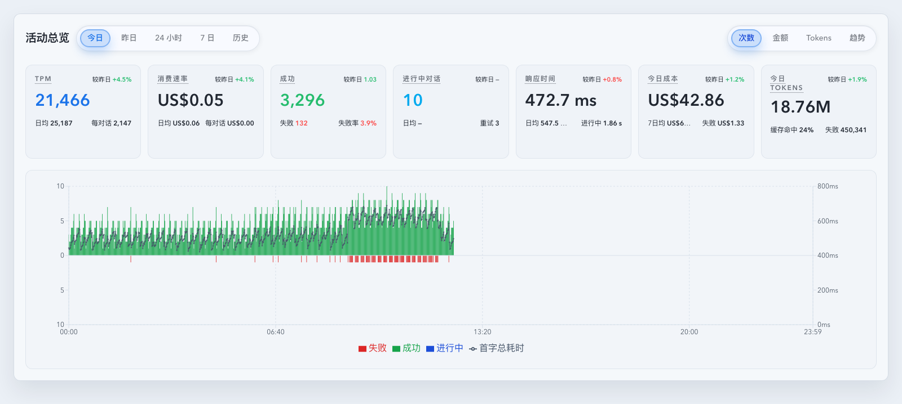
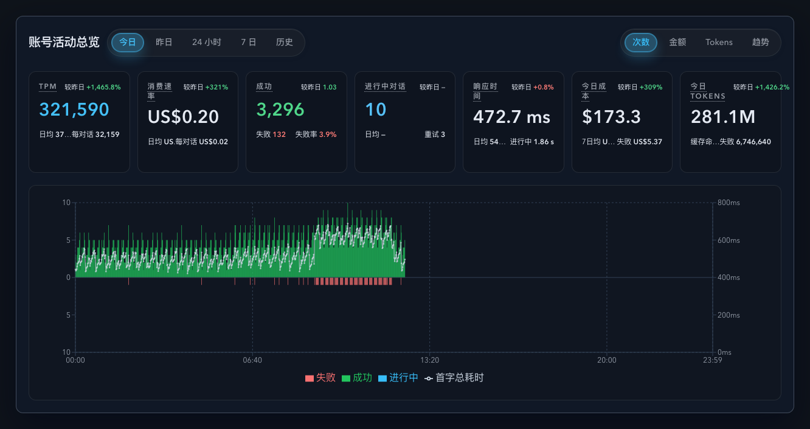

# Dashboard 自然日七卡 KPI 语义与布局重构（#gz5ns）

> 当前有效规范以本文为准；实现覆盖与当前状态见 `./IMPLEMENTATION.md`，关键演进原因见 `./HISTORY.md`。

## 背景 / 问题陈述

- 当前 `TodayStatsOverview` 的 7 张 KPI 卡虽然已经承载 `TPM / 消费速率 / 成功 / 进行中对话 / 响应时间 / 今日成本 / 今日 Tokens`，但二级信息仍采用“label 在上、value 在下”的两层堆叠，且右下语义位长期不完整。
- `较昨日` 目前散落在底部左右位，和日均、失败率、缓存命中等信息混在一起，导致扫读时难以快速分辨“主值”“比较值”“补充解释值”。
- Dashboard 主 `活动总览` 与账号详情 `DashboardActivityOverview` 虽然已经复用同一组件链路，但七卡的自然日语义还没有被 topic-level spec 冻结，后续继续调整时容易把账号作用域、严格进行中语义和失败成本/Token 口径拆散。

## 目标 / 非目标

### Goals

- 把 `TodayStatsOverview` 七卡统一重构为四区布局：左上标签、右上 comparison/meta、中央主值、底部左右两项辅助指标。
- 所有 `较昨日` 都移动到右上角，并改成 `label + value` 同行展示。
- 为每张卡补齐新的右下语义位，且主 Dashboard 与账号详情自然日视图复用同一实现与同一数据契约。
- 后端 summary / SSE `summary` 契约补齐严格进行中 retry、进行中等待均值、失败/中断成本与 Token，前端继续沿用现有 `useSummary` / `summary` SSE 快路径，不新增前端专用 KPI 轮询。

### Non-goals

- 不改 `24 小时 / 7 日 / 历史` 的 `StatsCards`、热力图、日历、metric toggle 或范围切换交互。
- 不改工作中对话卡片、排序、详情抽屉或 prompt-cache 表格的 owner-facing 布局。
- 不把 `成功` 卡左下 `失败` 的既有计数口径改成别的定义；本轮只增加右上同进度比较。
- 不新增 README、入口文档或独立 KPI API。

## 范围（Scope）

### In scope

- `web/src/components/TodayStatsOverview.tsx`：卡片结构、secondary/meta 排布与新 helper 接入。
- `web/src/components/DashboardActivityOverview.tsx`：today/yesterday 两条自然日路径接入增强后的 summary 字段，并保持账号级 `upstreamAccountId` 复用。
- `web/src/components/dashboardKpiComparisons.ts` 与相关 helper：补齐成功同进度比值和每对话 / 失败 / 重试 / 进行中等待等前端派生。
- `src/api/slices/invocations_and_summary.rs`、`src/api/slices/settings_models_and_cache.rs`、`web/src/lib/api/core-foundation.ts`：扩展 `StatsResponse` 与 summary/SSE 负载。
- 与 summary augmentation 直接相关的后端测试、前端测试和 Storybook 场景。

### Out of scope

- 新增独立的 working-conversations 前端读路径或 owner-facing 新面板。
- 调整 Dashboard 之外其他页面的 KPI 视觉系统。
- 修改现有 `t6d9r` 账号详情 read-model 的 SLA 目标或切回在线重算路径。

## 需求（Requirements）

### MUST

- 七卡统一采用四区布局：左上标题、右上 comparison/meta、中央主值、底部左右两项辅助值；底部项必须是同行 `label + value`，不再保留上下两行堆叠。
- `较昨日` 统一出现在右上；如果是 today 视图，默认表示与“昨日同一自然日进度下”的比较。
- `TPM` 右下为 `每对话`，公式是 `当前 TPM / strict inProgressConversationCount`；分母为 `0` 或缺失时显示 `—`。
- `消费速率` 右下为 `每对话`，公式是 `当前 spendRate / strict inProgressConversationCount`；分母为 `0` 或缺失时显示 `—`。
- `成功` 右上为 `较昨日`，语义是 `当前成功数 / 昨日同进度成功数` 的比例，不是 delta；底部仍保留 `失败` 与 `失败率`。
- `进行中对话` 右下为 `重试`，定义为当前 strict in-progress 对话里，上一条调用 display status 为 `failed` 且不含 `interrupted` 的唯一对话数。
- `响应时间` 右下为 `进行中`，定义为当前进行中调用等待时间均值；缺样本显示 `—`，不回退到整日均值。
- `今日成本` / `今日 Tokens` 右下都为 `失败`，聚合 `failed + interrupted` 调用的 cost / tokens。
- 增强后的 summary 字段必须同时在全局 Dashboard 与 `upstreamAccountId` 账号作用域下可用。

### SHOULD

- 尽量把新 KPI 语义收敛在 `TodayStatsOverview` 与 helper 层，不把布局条件散落到 Dashboard 和账号页调用端。
- `成功` 右上 comparison 应复用与 cost/tokens 同类的 same-progress helper，而不是硬编码到组件 JSX。
- 后端 augmentation 保持“主 summary totals + live augmentation”结构，避免重写已有 rollup-backed totals 路径。

### COULD

- 右上 comparison/meta 可兼容将来扩展成 tooltip 或更长的 label，但本轮不要求新增复杂交互。

## 功能与行为规格（Functional/Behavior Spec）

### Core flows

- 在 Dashboard `活动总览` 的 `今日` 与 `昨日` 页签中，七卡按同一顺序展示：`TPM`、`消费速率`、`成功`、`进行中对话`、`响应时间`、`今日成本`、`今日 Tokens`。
- 账号详情 `调用记录` tab 内复用同一个 `DashboardActivityOverview` / `TodayStatsOverview` 链路，样式与语义不分叉，只按 `upstreamAccountId` 切换数据作用域。
- `TPM` 与 `消费速率` 左下仍展示工作分钟日均，右上展示 `较昨日`，右下展示 `每对话`。
- `成功` 卡主值展示成功数，右上展示当前成功数相对昨日同进度成功数的比例，底部展示 `失败` 与 `失败率`。
- `进行中对话` 主值展示 strict in-progress conversation count，左下展示 `日均`，右上展示 `较昨日`，右下展示 `重试`。
- `响应时间` 主值沿用现有 active-tail 响应时间，左下展示整日日均，右上展示 `较昨日`，右下展示 `进行中` 当前等待均值。
- `今日成本` 左下展示前 7 个完整自然日均值，右上展示与昨日同进度 delta，右下展示失败/中断成本。
- `今日 Tokens` 左下展示缓存命中率，右上展示与昨日同进度 delta，右下展示失败/中断 tokens。

### Edge cases / errors

- strict in-progress 分母为 `0` 或 `null` 时，`每对话` 必须显示 `—`，不能显示 `0`。
- 当前没有进行中调用或没有任何 `tUpstreamTtfbMs` 样本时，`响应时间 -> 进行中` 显示 `—`。
- 当前没有昨日同进度成功数或基线为 `0` 时，`成功 -> 较昨日` 显示 `—`。
- summary 主请求失败时，保留现有整体 alert 语义；不把增强字段单独兜底成局部 tile。
- summary 成功但增强字段缺失时，只影响对应辅助位显示 `—`，不阻断主值展示。

## 接口契约（Interfaces & Contracts）

### 接口清单（Inventory）

| 接口（Name）                                     | 类型（Kind）        | 范围（Scope） | 变更（Change） | 契约文档（Contract Doc） | 负责人（Owner） | 使用方（Consumers）                                         | 备注（Notes）                                       |
| ------------------------------------------------ | ------------------- | ------------- | -------------- | ------------------------ | --------------- | ----------------------------------------------------------- | --------------------------------------------------- |
| `StatsResponse.inProgressRetryConversationCount` | http-response-field | external      | Modify         | None                     | backend/stats   | Dashboard natural-day KPI, account detail natural-day KPI   | strict in-progress retry 对话数                     |
| `StatsResponse.inProgressAvgWaitMs`              | http-response-field | external      | Modify         | None                     | backend/stats   | Dashboard natural-day KPI, account detail natural-day KPI   | 当前进行中调用等待时间均值                          |
| `StatsResponse.nonSuccessCost`                   | http-response-field | external      | Modify         | None                     | backend/stats   | Dashboard natural-day KPI, account detail natural-day KPI   | `failed + interrupted` cost                         |
| `StatsResponse.nonSuccessTokens`                 | http-response-field | external      | Modify         | None                     | backend/stats   | Dashboard natural-day KPI, account detail natural-day KPI   | `failed + interrupted` tokens                       |
| `TodayStatsOverview` metric tile contract        | ui-component-prop   | internal      | Modify         | None                     | web/dashboard   | DashboardActivityOverview, account detail activity overview | 统一四区布局与 inline secondary                     |
| same-progress success comparison helper          | ui-helper           | internal      | Add            | None                     | web/dashboard   | TodayStatsOverview                                          | `current success / yesterday same-progress success` |

### 契约文档（按 Kind 拆分）

- `None`

## 验收标准（Acceptance Criteria）

- Given 打开 Dashboard `今日` 或 `昨日` 自然日页签，When 查看七卡，Then 每张卡都展示为“左上标签 + 右上 comparison/meta + 主值 + 底部左右 inline secondary”，右下不再留白。
- Given `成功` 卡有昨日同进度成功基线，When 查看右上比较，Then 显示的是比值语义而不是 delta 百分比。
- Given 当前进行中对话上一条调用是 `failed`，When 该对话仍 in-progress，Then `进行中对话 -> 重试` 会计入；若上一条是 `interrupted`，Then 不计入。
- Given 当前没有进行中调用等待样本，When 查看 `响应时间 -> 进行中`，Then 显示 `—`。
- Given 今天存在 `failed`、`interrupted` 或二者混合调用，When 查看 `今日成本 -> 失败` 和 `今日 Tokens -> 失败`，Then 两者都包含这些 non-success 调用的累计金额与 Token。
- Given 账号详情页传入 `upstreamAccountId`，When 查看自然日七卡，Then 增强字段与 Dashboard 全局视图一样生效，且作用域不泄露为全局数据。

## 验收清单（Acceptance checklist）

- [x] 核心路径的长期行为已被明确描述。
- [x] 关键边界/错误场景已被覆盖。
- [x] 涉及的接口/契约已写清楚或明确为 `None`。
- [x] 相关验收条件已经可以用于实现与 review 对齐。

## 非功能性验收 / 质量门槛（Quality Gates）

### Testing

- Unit tests: `TodayStatsOverview.test.tsx`、`dashboardKpiComparisons.test.ts`。
- Integration tests: `DashboardActivityOverview.test.tsx`、账号详情 activity overview 相关测试、summary aggregation 后端测试。
- E2E tests (if applicable): None。

### UI / Storybook (if applicable)

- Stories to add/update: `web/src/components/TodayStatsOverview.stories.tsx`、`web/src/components/DashboardActivityOverview.stories.tsx`。
- Docs pages / state galleries to add/update: `TodayStatsOverview` state gallery / autodocs。
- `play` / interaction coverage to add/update: natural-day populated / account-scoped populated / zero-in-progress。
- Visual regression baseline changes (if any): 以本 spec 的 `## Visual Evidence` 为准。

### Quality checks

- `cargo test`（summary augmentation 相关 targeted tests）
- `cargo check`
- `cd web && bun run test`
- `cd web && bun run build`
- `cd web && bun run build-storybook`

## Visual Evidence

- SHA `267223fb`
- source_type: `storybook_canvas`
  story_id_or_title: `dashboard-dashboardactivityoverview--today-view`
  scenario: `dashboard populated`
  evidence_note: `验证 Dashboard 自然日七卡的新四区布局、右上较昨日迁移与右下每对话/重试/进行中/失败语义位。`
  
- source_type: `storybook_canvas`
  story_id_or_title: `dashboard-dashboardactivityoverview--account-today-narrow-desktop-overflow-dark`
  scenario: `account-scoped populated`
  evidence_note: `验证账号详情 upstreamAccountId 作用域下，同一套七卡语义与窄桌面溢出处理同时生效。`
  

## Related PRs

- None

## 风险 / 开放问题 / 假设（Risks, Open Questions, Assumptions）

- 风险：`nonSuccessCost/nonSuccessTokens` 仍是 summary augmentation 字段，如果未来被其他视图重用，可能需要进一步下沉到 rollup totals 契约。
- 风险：`进行中等待` 采用当前 in-flight `tUpstreamTtfbMs` 样本均值；若上游未来把等待定义改为别的阶段，需要同步刷新 tooltip 与 spec。
- 假设：`每对话` 的分母固定使用 strict `inProgressConversationCount`，分母为 `0/null` 时显示 `—`。
- 假设：`失败` 成本与 Token 的正式口径为 `failed + interrupted`。

## 参考（References）

- `docs/archive/specs/r99mz-dashboard-today-activity-overview/SPEC.md`
- `docs/archive/specs/2qsev-dashboard-tpm-cost-per-minute-kpi/SPEC.md`
- `docs/specs/t6d9r-account-detail-stats-read-model/SPEC.md`
- `docs/solutions/performance/realtime-dashboard-reconcile-budget.md`
