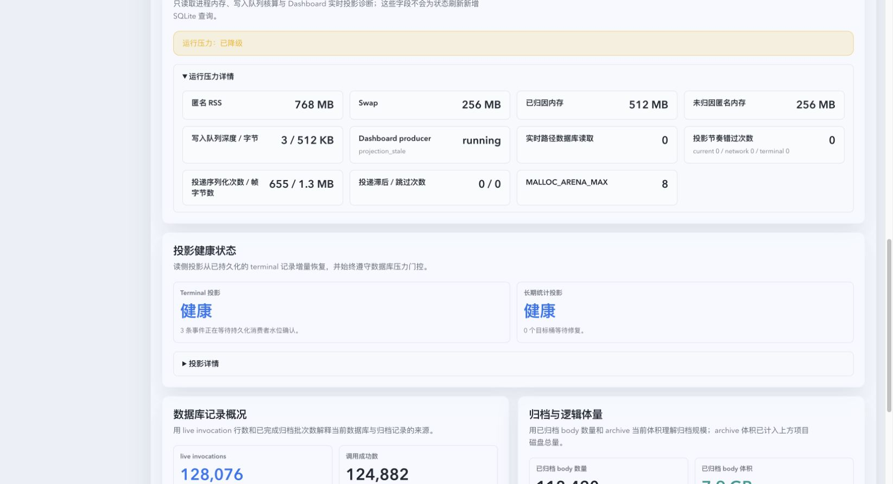
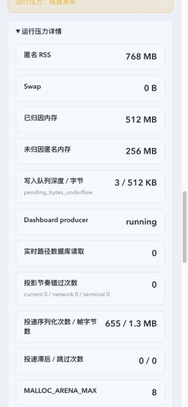

# High-Frequency Runtime Data Plane

> 本文定义代理请求语义、运行态投影、Dashboard 实时快照、SSE 分发与持久化对账之间的跨域边界。实现状态见 `./IMPLEMENTATION.md`，关键决策见 `./HISTORY.md`。

## 背景

项目已经具备 terminal journal、Terminal Projection、Dashboard read model、SQLite rollup 与 SSE topic，但这些能力没有形成一条可执行的统一边界：Dashboard live 构建仍可反向读取 SQLite，订阅分发按消费者重复克隆和序列化 payload，file-backed 大请求会在 dispatch 阶段重新整体物化，writer queue 的跨阶段 accounting 也可能下溢并污染内存归因。

该问题不能继续通过逐条慢 SQL 或延长 TTL 收口。高频数据面必须明确区分 ingress、projection、delivery、persistence/reconcile 五层，并在类型和测试层禁止反向依赖。

## Goals

- 建立 `RuntimeProjectionHub`，统一接收 runtime upsert/remove、phase、network、account metadata 与 terminal delta，并为 Dashboard 当前态提供健康内存快照。
- 每个代理请求只生成一份 replay snapshot 与一份 `RequestSemanticProjection`；超过 `1 MiB` 的 body 始终 file-backed，并保持现有 `256 MiB` 上限、路由、重写、failover 与 raw capture 语义。
- Dashboard 当前态以固定 `250ms` deadline 合并；terminal totals 保持 `5s` 可见；SQLite baseline 仅用于启动、`60s` reconcile、明确冷回退和 closed-range exact 查询。
- 每个 topic revision 只序列化一次，并以共享不可变 frame 进入 cache、replay ring、broadcaster 与 subscriber。
- 修复 writer accounting 的所有权和不变量，使运行健康与内存归因可被验证；生产镜像默认 `MALLOC_ARENA_MAX=8`，同时保留部署环境覆盖能力。
- `GET /api/system/status` additive 暴露 `runtimePressureHealth`，不改变 Dashboard、统计、raw detail 或 SSE 的既有 wire shape。

## Architecture

### Ingress

- 请求入口拥有唯一 `PoolReplayBodySnapshot`，并在单次 visitor pass 中产出不可变 `RequestSemanticProjection`。
- projection 至少包含 model、stream、sticky/prompt-cache key、reasoning、service tier、encrypted/image/compaction 与是否需要 `include_usage` rewrite。
- 小请求可驻留内存；超过 `1 MiB` 的请求必须保留 file-backed snapshot。需要 rewrite 时使用有界流式转换，业务缓冲不得超过 `64 KiB`。
- 语义转换失败保持当前 fail-open 原始 body 行为，并记录明确原因；不得因优化改变转发字节或路由结果。

### Projection

- `RuntimeProjectionHub` 是 current-state 的唯一高频事实层，接收 runtime 与 terminal 事件并维护 Dashboard 所需的全局及账号投影。内部必须按 current/phase、network/rate 与 terminal totals 拆成独立不可变切片和 revision，分别使用 `250ms`、`1s` 与 `5s` 固定 deadline。
- `network_visibility` 只能推进 network 切片，不能重新标记或构建完整 Dashboard activity/summary projection。未变化切片不得推进 revision。
- `DashboardLiveProjection::snapshot()` 不接受 `Pool<Sqlite>`、数据库 repository 或可执行 SQL 的闭包。健康 live render 的数据库查询数必须为零。
- terminal durable 事实继续由 `TerminalProjectionHub` 与 P1 journal 管理；两个 Hub 共享 ingress 事件标识，不共享可变 ownership 或回收 cursor。
- startup warm restore、`60s` reconcile 与 cold fallback 可访问 persistence；已有 last-good 时，订阅请求链不得同步回源数据库。

### Delivery

- `TopicMaterializer` 只接受 typed base 与其依赖切片的 revision tuple，并生成一个 `Arc<SerializedTopicFrame>`。frame 包含 envelope bytes、cursor、schema epoch、fingerprint 与 topic metadata。
- Dashboard activity 与 summary live overlay 的 typed base 必须按 current/network/terminal dependency revision 原地 materialize；network timeseries 与 network recent 也必须使用 typed serializer。生产高频路径不得广播完整 `DashboardActivityLiveSnapshot`、深拷贝 cached topic 或修改通用 `serde_json::Value`。
- Activity 的 terminal typed base 必须保留模型性能与账号延迟聚合输入，并以有界 recent projection 更新已有的 recent 语义；它不得为此重新读取 SQLite 或广播完整调用记录。
- 当 SQLite baseline 已包含 queued terminal 时，Activity typed base 必须继承该 terminal sequence；同一 shared terminal slice 不能在 cold base 上再次累计。
- 活动日历窗口或 activity/summary rolling-duration 窗口的 typed base 到达其 range anchor 边界时，必须由 producer-owned runtime reconcile 在 revision delivery 之外受控重建；duration 复用既有 `60s` reconcile 边界，且 terminal materialization 推进的公开 range 输出不得重置 base 的 rebase anchor。terminal materialization 只隔离陈旧 base，不得读取 SQLite；无 owner 时陈旧 base 保持 dirty 并在 ownership 返回后重建，重建失败时隔离持续到下一次 reconcile，且 byte-identical 重建不得推进 frame cursor。
- cache、replay ring、broadcaster 和 subscriber 只共享 frame 引用；不得接收 `serde_json::Value` 后再次序列化或深拷贝 payload。
- 首个 owner subscriber 激活 producer；后续 subscriber 只增加引用计数。无 owner subscriber 时停止周期 producer，mutation 只标记 dirty。
- projection revision 未变化时不推进 cursor，不发送重复 frame。

### Persistence And Reconcile

- SQLite 是 terminal durable source、projection warm restore、closed-range exact query 与 drift reconcile 的事实源，不是 Dashboard current-state 的请求内查询依赖。
- terminal totals 使用 `5s` 内存发布，baseline reconcile 使用 `60s` cadence。压力或 last-good 状态机沿用既有退避与精确恢复语义。
- `PendingQueueAccounting` 统一拥有 enqueue、coalesce、batch replacement、P1 -> P2 transfer 与 completion 的 byte/depth 变化；业务阶段不得直接执行裸 `fetch_sub`。
- accounting 不变量破坏必须进入 degraded health 并保留证据，不能 wrap 到 `usize::MAX` 或继续报告 healthy。

## Public Contracts

- Dashboard、统计、raw detail HTTP response 不变。
- SSE topic 名称、schema epoch、snapshot/replay/live envelope、排序、recent 与 range 语义不变。
- `GET /api/system/status` 可 additive 增加 `runtimePressureHealth`；旧前端在字段缺失时按 unknown 兼容。
- `DASHBOARD_RUNTIME_PROJECTION_MODE=legacy` 与 `PROXY_REQUEST_SEMANTIC_PIPELINE_MODE=legacy` 是运维 kill switch；默认 `auto`，不得暴露为 owner-facing UI 开关。Dashboard legacy delivery 只保留一个发布版本，并在新链连续 12 小时通过线上门槛后由独立清理变更删除。

## Runtime Pressure Health

`runtimePressureHealth` 只读取内存计数器，至少覆盖：

- Dashboard producer 状态、active topic/subscriber 数、各投影切片 revision/cadence miss、live-path DB read count、materialize/serialize count、frame bytes、subscription lag/skipped 与 last-good age。
- request pipeline snapshot kind、semantic parse count、whole-body materialization count、rewrite buffer peak 与 fallback reason。
- RSS anonymous、Swap、managed/unattributed bytes、allocator arena 配置与 writer accounting health。
- accounting pending depth/bytes、最近 invariant violation、P1 -> P2 transfer 与 degraded reason。

状态数据不得包含 payload、调用 ID、凭据或原始 SQL，也不得为了刷新状态页新增数据库查询。

## Telemetry

- projection: `projection`, `trigger`, `revision`, `render_elapsed_ms`, `live_path_db_read_count`, `snapshot_origin`, `last_good_age_ms`。
- request pipeline: `snapshot_kind`, `body_size_bytes`, `semantic_parse_count`, `whole_body_materialization_count`, `rewrite_buffer_peak_bytes`, `fallback_reason`。
- delivery: `topic_key`, `active_subscriber_count`, `builder_count`, `serialization_count`, `frame_bytes`, `frame_reused`, `cursor_advanced`。
- accounting/memory: `pending_depth`, `pending_bytes`, `accounting_transfer_bytes`, `accounting_invariant`, `rss_anon_bytes`, `swap_bytes`, `managed_bytes`, `unattributed_anon_bytes`。
- healthy/no-change 高频事件降为 debug；DB live read、whole-body materialization、accounting invariant violation、持续 stale 与序列化重复保留 warning。

## Verification

- `16 MiB` 与 `64 MiB` file-backed 请求只进行一次语义解析，业务峰值缓冲不超过 `64 KiB`；转发、编码、failover 与 `include_usage` 结果保持一致。
- 10,000 次 runtime mutation 后健康 live render 的 SQL query count 为 `0`。
- 同 topic 从 1 个增长到 N 个 subscriber 时，builder、serialization 与完整 payload clone 次数不增长；每个 revision 只有一个 frame。
- Dashboard current-state 更新 p95 不超过 `400ms`，terminal totals 在 `5s` 内可见。
- P1 -> P2、coalesce、retry 与 retained batch 后 accounting 与真实队列估算一致，不出现下溢。
- 生产受控 A/B 中新增 Dashboard tab 的 CPU 增量不超过 10 个百分点，subscription lag/skipped 为零；连续 12 小时 RSS p95 不超过 `2 GiB` 且 Swap 不持续增长。该 A/B 是架构完成门槛，不能由“零 SQL”或单 topic Arc 复用测试替代。

## Non-goals

- 不迁移 SQLite，不扩大连接池，不提高 slow threshold，不切换全局 allocator。
- 不降低代理并发、请求体上限、统计精度或 raw/terminal 保留。
- 不把 closed-range exact 查询和非 Dashboard 页面全部迁入 Runtime Projection。
- 不用 telemetry 标签代替类型边界、query-count、parse-count 与 A/B 证据。

## Visual Evidence

以下证据由 mock-only Storybook canvas 在真实浏览器视口生成，不依赖生产数据或登录状态；桌面使用 `1660x900`，移动使用 `393x852` CSS px。

PR: include

PR: include

