# 移动优先导航与浮层收口（#hnu7b）

> 当前有效规范以本文为准；实现覆盖与当前状态见 `./IMPLEMENTATION.md`，关键演进原因见 `./HISTORY.md`。

## 背景 / 问题陈述

桌面工作台在窄纵向视口仍暴露横向导航、居中对话框、右侧详情抽屉和多层 panel，导致主要内容可视宽度不足，且浮层行为与移动设备不匹配。

## 目标 / 非目标

### Goals

- 覆盖 `320px` 至 `768px` 纵向视口，并在 `<=768px` 统一采用紧凑布局；从 `769px` 起恢复桌面导航与浮层形态。
- 将一级路由和 `Account Pool` / `System` 二级路由收进同一汉堡导航层，页面头部只显示当前上下文与关键工具。
- 让桌面 `Dialog` 和自建 modal 在紧凑视口统一成为带 safe-area 的底部 sheet；桌面保持居中 dialog。
- 让桌面 side drawer 在紧凑视口逐项分流：账号详情和 Prompt Cache 会话页页面化，其余详情保留 overlay 但改为全高 bottom sheet。
- 将关键页面的筛选、表格和卡片重排为窄屏优先结构，避免装饰性嵌套与正文横向溢出。
- 用 mock-only Web Demo 作为整页视觉证据源，Storybook 负责可复用表面和交互回归。

### Non-goals

- 不改变桌面视觉语言、业务规则、后端接口或权限模型。
- 不扩展到横屏手机、PWA/offline 或原生手势体系。
- 不将所有 drawer 页面化，仅页面化重型详情工作区。

## 范围（Scope）

### In scope

- `AppLayout` 的共享导航树、`AccountPoolLayout` 与 `SystemLayout` 的紧凑导航收口。
- `Dialog`、自建 Settings modal、账号池批量/路由/说明对话框和 Prompt Cache owner confirm 的 responsive sheet 规则。
- `SharedUpstreamAccountDetailDrawer`、`PromptCacheConversationHistoryDrawer`、Dashboard invocation drawer 和 Records full-details 的响应式呈现。
- Dashboard、Stats、Live、Records、Upstream Accounts、Groups、Maintenance Records、Settings、System Status、System Tasks 的窄屏布局与表格/列表切换。
- 对应的 hooks、unit tests、Storybook story/play coverage、Web Demo 视觉证据和 UI 文档。

### Out of scope

- 新增业务端点、数据模型、鉴权或持久化状态。
- 为没有稳定 mock 的真实生产数据采集截图。

## 功能与行为规格

### 紧凑导航

- `<=768px` 时，顶栏不得渲染横向主导航；只能通过汉堡菜单打开导航。
- 菜单必须直接提供 `/dashboard`、`/stats`、`/live`、`/records` 及 `Account Pool` / `System` 的全部二级路由，并明确当前页状态。
- `AccountPoolLayout` 和 `SystemLayout` 在紧凑视口不得再占用单独的 segmented/sidebar 行。

### Responsive 浮层

- `DialogContent` 在 `<=768px` 必须固定在底部、宽度占满、适配 `100dvh` 与安全区；从 `769px` 起恢复居中 dialog。
- 紧凑浮层必须只有一个内容滚动体；操作区与标题区可保持 sticky，不能因内部 card 再生成嵌套滚动面。
- 现有桌面 drawer 除两项页面化工作区外，紧凑视口保持 backdrop overlay，但改为从底部出现的全高 sheet。

### 页面化详情

- `SharedUpstreamAccountDetailDrawer` 在紧凑视口成为页面表面，保留 `upstreamAccountId` 与 `upstreamAccountTab` URL 契约和桌面 drawer 交互。
- `PromptCacheConversationHistoryDrawer` 在紧凑视口成为由 URL/search state 恢复的页面，覆盖 `overview`、`calls` 与 `settings`；桌面仍为 drawer。

### 页面密度

- Dashboard、Stats、Live、Records、Account Pool、Settings 和 System 的筛选区在窄屏改为纵向或最多两列布局。
- 依赖 `min-w-[44rem]` 及更宽表格的内容在手机视口改为卡片/列表表达；桌面横向表格只在 `md+` 可用。
- 默认页面 surface 不得包裹视觉等价的内部 card；页面 gutter 和控件最小宽度必须让主体内容优先获得可视宽度。
- 在 `<=768px`，页面级 `surface-panel` 只组织文档流，不得再绘制第二层边框、背景、阴影或内边距。页面保留单一 `12px` gutter，真正的 metric、列表项和可独立操作的配置项才可使用紧凑 card。

## 验收标准

- Given `320x568`、`390x844`、`430x932` 和 `768x1024` 纵向视口，When 打开任一路由，Then 主要内容无页面级横向溢出，且主导航只通过汉堡菜单进入。
- Given 桌面 dialog 或自建 modal 打开，When 视口缩小到 `<=768px`，Then 它以底部 sheet 而非居中 modal 呈现，安全区和单一内容滚动体正确。
- Given 打开上游账号详情或 Prompt Cache 会话详情，When 使用紧凑视口，Then 表现为可返回、可用 URL 恢复状态的独立页面；桌面仍保持 drawer。
- Given 打开 dashboard 或 records 调用详情，When 使用紧凑视口，Then 表现为全高 bottom sheet；桌面仍从侧边进入。
- Given 使用无真实后端的完整路由，When 在 Web Demo 中切换移动视口，Then 页面和关键浮层能够用确定性 mock 数据验收。

## 非功能性验收 / 质量门槛

### Testing

- `cd web && bun x tsc --noEmit`
- `cd web && bun run test`
- `cd web && bun run test-storybook`
- `cd web && bun run build`
- `cd web && bun run demo:build`
- `cd web && bun run build-storybook`

### UI / Storybook

- App shell 必须覆盖 `mobile390` 和 `tablet768` 汉堡导航交互。
- 账号详情、Prompt Cache 会话、Settings/表格切换必须具备稳定的移动状态 story 或 play 覆盖。
- 全页视觉证据必须来自 `VITE_APP_RUNTIME=demo` 的 mock-only Web Demo，并绑定最终 source revision。

## Visual Evidence

- source_type: `ui_demo`
  target_program: mock-only Web Demo (`VITE_APP_RUNTIME=demo`)
  source_revision: `f5c4035a`
  sensitive_exclusion: demo fixtures only; no production account, secret, or backend request
  capture_scope: browser viewport

### `320x568` Dashboard

验证最窄纵向视口的顶栏、活动筛选与 KPI 卡片保持单列可读，主体未出现横向溢出。

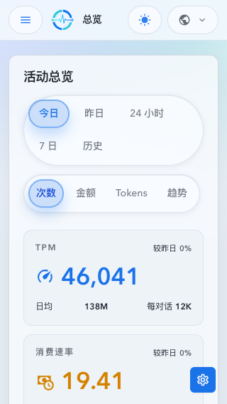

### `390x844` Navigation And Sheet

验证统一汉堡菜单包含一级路由及 Account Pool / System 子路由，当前页状态明确。

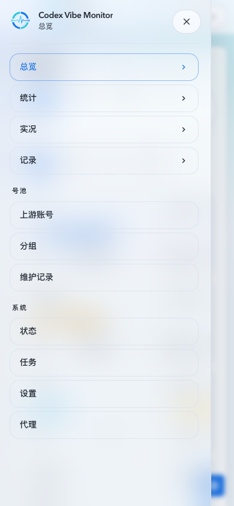

验证 External API Key 创建不再居中显示，而是以带安全区底部操作区的 sheet 呈现。

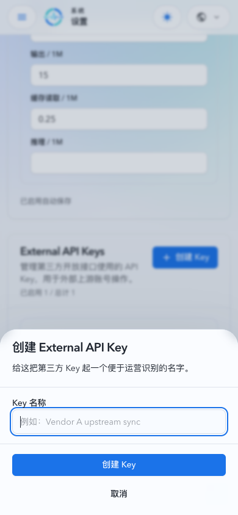

### `390x844` Single-Gutter Stats Surface

验证统计页取消页面级面板嵌套与装饰背景后，筛选控件占满有效宽度，数据卡以两列布局呈现，最后一项指标跨两列，页面无横向溢出。

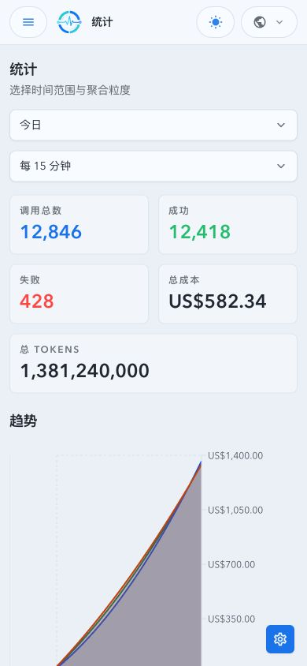

### `390x844` Prompt Cache Page

验证 `promptCacheConversationKey=demo-conversation-a&promptCacheConversationTab=calls` 可恢复会话 calls tab，并呈现为独立页面而不是 drawer。

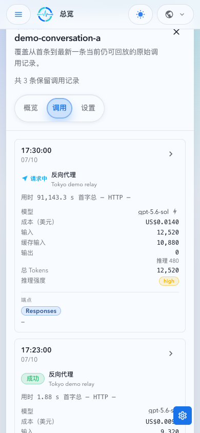

### `430x932` Account Detail Page

验证 `upstreamAccountId=101` 在紧凑视口呈现为全宽账号详情页面，保留 tab 与返回动作。

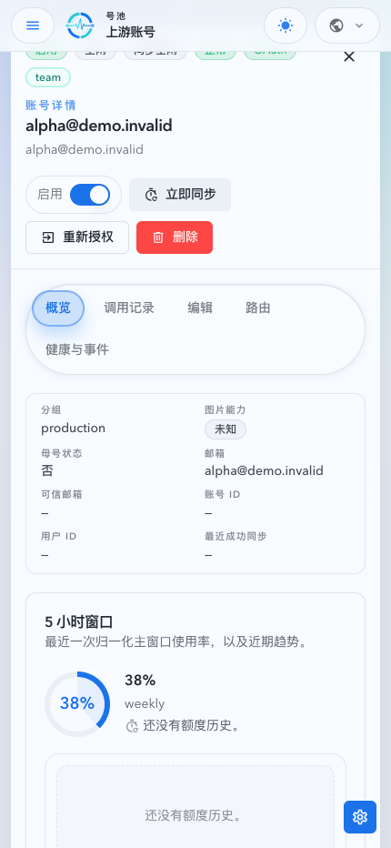

### `768x1024` Tablet Navigation

验证纵向平板仍使用统一汉堡菜单，且 System 子路由在同一层级中可切换。

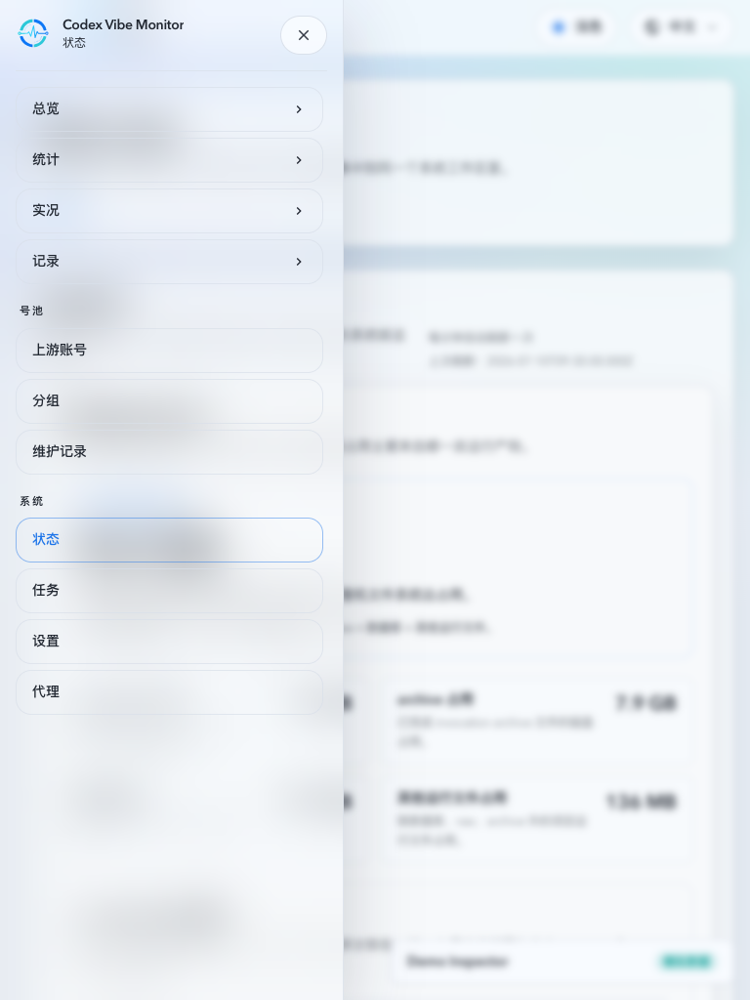

### Records Filter Drawer And Applied Summary

- source_type: `ui_demo`
  source_revision: `abee4d41d77a24a96150d27fb0c5d965772d2b35`
  target_program: mock-only Web Demo (`VITE_APP_RUNTIME=demo`)
  sensitive_exclusion: demo fixtures only; no production account, secret, or backend request

#### `390x844` Records Filter Drawer

验证 Records 的编辑表单只在全高 bottom sheet 中出现，标题与操作区固定，内容区保持单一滚动体。

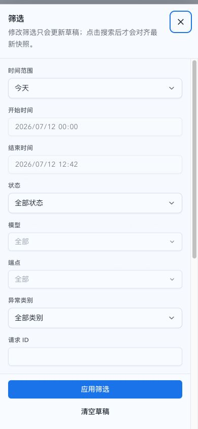

#### `1440x920` Records Filter Drawer

验证宽屏使用右侧筛选抽屉，原列表和统计仅作为遮罩下的上下文，不再在页面内容流中常驻筛选控件。

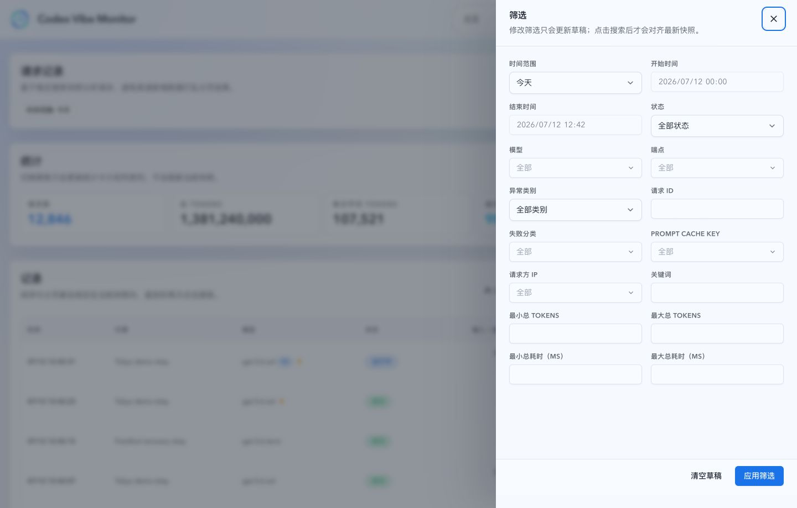

#### `1440x920` Records Applied Filter Summary

验证提交筛选后主页面只保留已应用条件；草稿抽屉关闭，主体不再包含筛选输入。

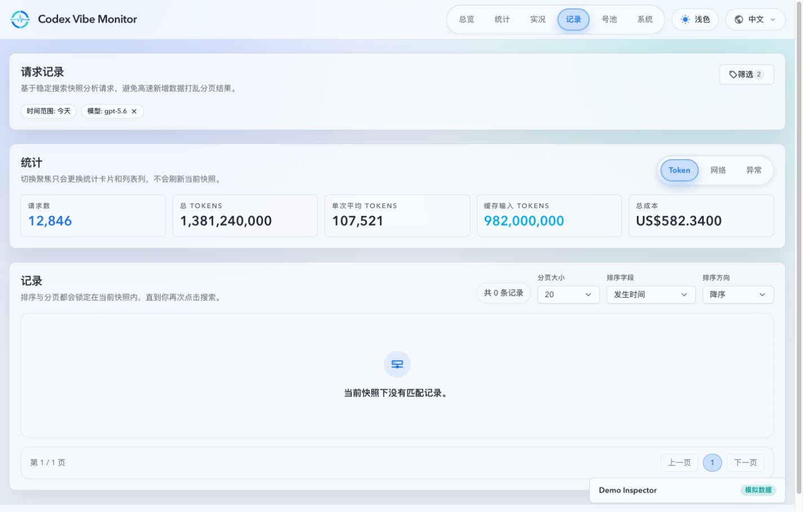

### `390x844` Dashboard Chart Visibility

- source_type: `ui_demo`
  source_revision: `1b4d6b44`
  target_program: mock-only Web Demo (`VITE_APP_RUNTIME=demo`)
  sensitive_exclusion: demo fixtures only; no production account, secret, or backend request

验证今天活动图在手机视口将密集分钟柱聚合为可见宽度，移除挤占绘图区的延迟轴，并以负号区分失败侧；当前对话说明与 workspace 切换控件在窄屏分行，避免文字被压缩成窄列。

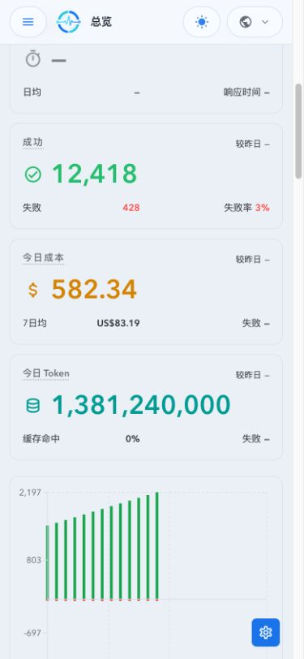

### `430x932` Dashboard KPI Two-Column Grid

- source_type: `ui_demo`
  source_revision: `e703c83d6e9f0b560f3baa5c229770ff25a9860d`
  target_program: mock-only Web Demo (`VITE_APP_RUNTIME=demo`)
  sensitive_exclusion: demo fixtures only; no production account, secret, or backend request

验证大屏手机在 `400px` 起将短 KPI 以两列展示，长 Token 数值保持跨两列完整可读；`390px` 以下继续单列，两个断点都不存在主体横向溢出。

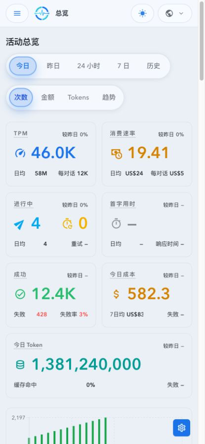

### `390x844` Dashboard Activity Dropdown Controls

- source_type: `ui_demo`
  source_revision: `28bfddead8f0cfb40376ff89f73765658f1be042`
  target_program: mock-only Web Demo (`VITE_APP_RUNTIME=demo`)
  sensitive_exclusion: demo fixtures only; no production account, secret, or backend request

验证 Dashboard 在移动端将时间范围和指标切换收口为左右等宽的两个下拉。截图展示“昨日 / Tokens”切换后的状态；下拉更新对应数据视图，页面无横向溢出。桌面端维持 segmented controls。

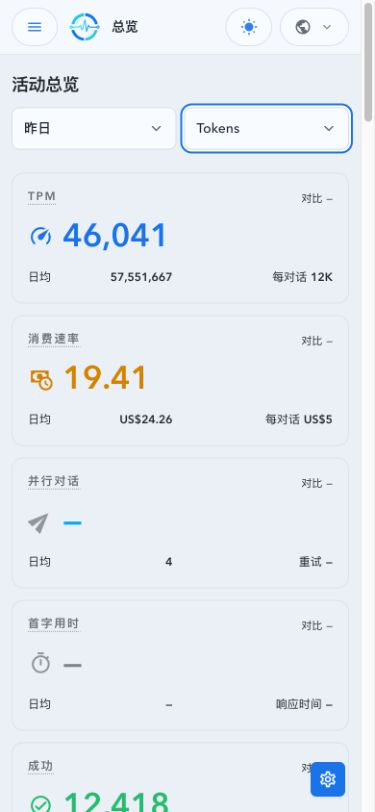

## 风险 / 开放问题 / 假设

- 复杂详情页面在 768px 以下页面化，避免在半宽 drawer 中压缩多标签工作区。
- Storybook 继续作为状态与交互回归面，不得被记录为整页 Web Demo 证据。
- UI 证据仅使用 demo fixtures，不包含真实账号、secret 或生产请求。

## 参考

- `docs/specs/ykhfu-web-demo/SPEC.md`
- `docs/specs/s7m3q-system-workspace/SPEC.md`
- `docs/ui/storybook.md`
