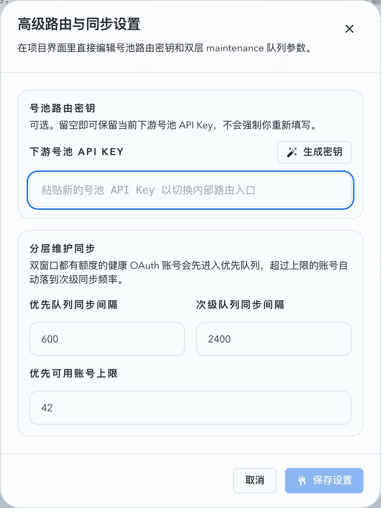
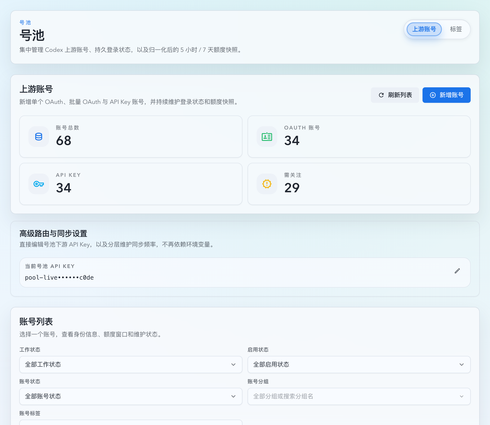

# 号池分层同步高级设置与前 100 溢出低频更新（#jpvwj）

## 状态

- Status: 已完成（5/5，PR#211）
- Created: 2026-03-23
- Last: 2026-03-23

## 背景 / 问题陈述

- 当前号池后台维护只受 `UPSTREAM_ACCOUNTS_SYNC_INTERVAL_SECS` 单一环境变量驱动，所有 OAuth 账号按同一频率进入 usage 同步，没有项目内可视化设置入口。
- 当可路由的 OAuth 账号规模上升到数百个时，统一主频同步会抬高 SQLite 调度成本与上游 usage 压力，而大量“周额度富余但短期不急需”的账号并不需要同等频率刷新。
- 现有账号池页面已经承载路由密钥设置，具备扩展为“高级路由与同步设置”入口的 UI 基础，不需要再新增全局 settings 页面。

## 目标 / 非目标

### Goals

- 将号池维护频率配置迁移到账号池页面内的高级设置，允许在运行期查看并更新主频、次频与主层账号上限。
- 为 OAuth 账号维护引入双层更新队列：健康且双窗口有额度的账号按周额度用量排序，前 `100` 个使用主频，其余账号使用次频。
- 为 `working` / `degraded` 的 OAuth 账号补充固定 `60s` 高频同步，并在主窗口或次窗口跨过 `resetsAt` 后于下一个 maintenance tick 尽快补一次同步。
- 保持恢复路径敏捷：`error`、缺少 usage 样本、或 token 已进入 refresh lead time 的账号不得降到次层。
- 只对真正到期的账号 dispatch 同步任务，避免每轮维护都为所有账号创建 actor 命令。

### Non-goals

- 不改变 `/v1/*` 请求路由、sticky、failover 或账号挑选逻辑。
- 不新增独立设置页，也不把 API Key 占位限额账号接入真实 usage 抓取。
- 不引入新的环境变量控制次频或主层上限；现有 env 只保留为主频默认值回退。

## 范围（Scope）

### In scope

- `src/upstream_accounts/mod.rs`：扩展 `pool_routing_settings` schema 与 settings API；新增维护候选查询、tier resolver、到期过滤与默认值回退。
- `src/main.rs`：将账号维护 loop 调整为固定短 tick + 运行期从 DB 读取维护设置。
- `web/src/pages/account-pool/UpstreamAccounts.tsx`、`web/src/hooks/useUpstreamAccounts.ts`、`web/src/lib/api.ts`、`web/src/i18n/translations.ts`：升级现有 routing 卡片与对话框，新增高级同步设置字段、校验与保存反馈。
- `web/src/components/UpstreamAccountsPage.stories.tsx`：同步 Storybook 中 routing 对话框标题与按钮文案锚点。
- `README.md`、`docs/deployment.md`、`docs/specs/README.md`：同步配置来源、默认值与交付状态。

### Out of scope

- OAuth/account actor 并发模型重写。
- 新增按组、标签或母号维度的分层策略。
- 为 exhausted 账号增加独立于 maintenance tick 的“按 reset 时间精确唤醒”单独定时器。

## 需求（Requirements）

### MUST

- `GET /api/pool/routing-settings` 与 `GET /api/pool/upstream-accounts` 返回的 `routing` 对象都必须包含：
  - `maintenance.primarySyncIntervalSecs`
  - `maintenance.secondarySyncIntervalSecs`
  - `maintenance.priorityAvailableAccountCap`
- `PUT /api/pool/routing-settings` 必须支持部分更新：允许只改 `maintenance`、只改 `apiKey`、或同时修改两者；缺失字段保持原值。
- `primarySyncIntervalSecs` 默认值继续来自 `UPSTREAM_ACCOUNTS_SYNC_INTERVAL_SECS`；`secondarySyncIntervalSecs` 默认 `1800` 秒；`priorityAvailableAccountCap` 默认 `100`。
- 维护分层只针对 `oauth_codex`、`enabled=1`、非 `needs_reauth` 账号。
- 满足以下任一条件的账号必须始终归入主层：
  - 当前状态为 `error`
  - 最近 usage sample 缺失，或主/副窗口任一缺失
  - token 已进入 refresh lead time
- `work_status in {working, degraded}` 的 OAuth 账号必须使用固定 `60` 秒高频同步，不参与主层 available 名额竞争。
- 其余健康账号中，仅当 `primary_used_percent < 100` 且 `secondary_used_percent < 100` 时才参与“主层 available 竞争”；排序键固定为：
  - `secondary_used_percent ASC`
  - `primary_used_percent ASC`
  - `last_synced_at ASC NULLS FIRST`
  - `id ASC`
- 参与 available 竞争的账号里，前 `priorityAvailableAccountCap` 个使用主频，其余账号与已耗尽窗口的健康账号一并使用次频。
- 若主窗口或次窗口的 `resetsAt` 已经跨过当前时间，且该账号最近一次同步尝试仍早于该 `resetsAt`，则该账号必须在下一个 `60s` maintenance tick 立即补一次同步，不等待原主频 / 次频完整到期。
- 手动同步、post-create sync、OAuth callback 首次同步与 relogin 成功后的同步不得受主层/次层限制，仍需立即执行。
- 账号池页现有 routing 对话框必须升级为“高级路由与同步设置”，允许编辑上述三个维护参数，并在保存成功后立即回显。
- 前后端都必须校验：
  - 主频、次频为整数秒且 `>= 60`
  - 次频 `>=` 主频
  - 主层上限为正整数

### SHOULD

- 维护 loop 应使用固定短 tick，以保证运行期改小主频后无需重启即可在合理时延内生效。
- routing 卡片应同时展示当前 API key 与维护设置摘要，避免必须进入对话框才知道当前策略。

## 功能与行为规格（Functional/Behavior Spec）

### Core flows

- 用户进入 `号池 -> 上游账号` 页面时，routing 卡片显示当前号池 API key，并提供进入“高级路由与同步设置”弹窗的编辑入口；maintenance 具体参数在弹窗中查看与修改。
- 用户打开 routing 对话框后，可以同时编辑 API key 与高级维护设置；若只调整维护设置，保存请求不会要求重新输入 API key。
- 后台维护每个 tick 会先读取 `pool_routing_settings` 的有效维护设置，再批量查询候选账号与最近样本，计算每个账号所属层级与本轮是否到期。
- 高频账号按 `60s` 判断是否到期，主层账号按主频判断是否到期，次层账号按次频判断是否到期；未到期账号本轮不得 dispatch maintenance actor。
- 任一账号只要发现主窗口或次窗口跨过了 `resetsAt`，就会在下一个 maintenance tick 补一次同步；补同步消化该 reset 边界后，不得因同一 `resetsAt` 连续重复 dispatch。
- 当健康且双窗口可用的账号数超过主层上限时，只有周用量最小的前 `N` 个保留在主层；下一轮维护必须基于最新样本重新计算，账号可在层级间自动升降。

### Edge cases / errors

- 若 `pool_routing_settings` 尚未写入维护字段或 schema 仍为旧版本，读取接口必须回退到默认值并稳定返回 `maintenance` 对象。
- 若用户提交非法维护参数，后端返回 `400`，前端保留对话框与现有草稿，不得覆盖已保存设置。
- 若 settings 保存失败后，随后账号级操作成功，routing 错误仍需保留，直到 routing 保存成功或新的 routing 结果覆盖。

## 接口契约（Interfaces & Contracts）

| 接口（Name）                  | 类型（Kind）    | 范围（Scope） | 变更（Change） | 负责人（Owner） | 使用方（Consumers） | 备注（Notes）                            |
| ----------------------------- | --------------- | ------------- | -------------- | --------------- | ------------------- | ---------------------------------------- |
| `/api/pool/routing-settings`  | HTTP API        | internal      | Modify         | backend         | web                 | 新增 maintenance 返回与部分更新能力      |
| `pool_routing_settings`       | SQLite          | internal      | Modify         | backend         | backend             | 新增维护配置列，保留 API key 单例语义    |
| `PoolRoutingSettings`         | Rust + TS types | internal      | Modify         | backend + web   | web                 | 新增 `maintenance` 子对象                |
| `maintenance tier resolver`   | backend logic   | internal      | Add            | backend         | backend             | 主层/次层计算与到期过滤，不暴露为独立 API |

## 验收标准（Acceptance Criteria）

- Given 旧库尚未保存过高级维护设置，When 打开账号池页或请求 `/api/pool/routing-settings`，Then 响应稳定包含 `300 / 1800 / 100` 这组默认值。
- Given 用户只修改主频、次频或主层上限，When 保存 routing 设置，Then API 成功、当前 API key 保持不变，重新打开 routing 弹窗时会回显新的维护设置。
- Given 健康且双窗口可用的 OAuth 账号数超过 `100`，When 后台维护运行，Then 周额度用量最小的前 `100` 个账号按主频判定到期，其余健康账号按次频判定到期。
- Given 某账号状态为 `error`、缺少 usage sample，或 token 即将过期，When 后台维护运行，Then 该账号仍留在主层，不会被降到次频队列。
- Given 某健康账号 `5 小时` 或 `7 天` 任一窗口已耗尽，When 后台维护运行，Then 该账号不会占用 available 主层名额，而是按次频刷新以等待 reset 后重新升层。
- Given 某 OAuth 账号当前 `work_status=working` 或 `degraded`，When 后台维护运行，Then 它按固定 `60` 秒高频判定到期，不占用 available 主层名额。
- Given 某账号最近一次同步早于任一窗口的 `resetsAt` 且当前时间已跨过该 `resetsAt`，When 后台维护运行，Then 它会在下一个 maintenance tick 立即补一次同步，即使原主频 / 次频尚未到期。
- Given 用户提交 `secondarySyncIntervalSecs < primarySyncIntervalSecs` 或小于 60 秒的值，When 请求到达前后端，Then 保存被拒绝且 UI 显示明确错误。

## 非功能性验收 / 质量门槛（Quality Gates）

### Testing

- Rust tests：schema migration/default fallback、routing settings partial update、tier resolver 排序与分层、working / degraded 高频、reset 跨点补同步、到期过滤、异常账号主层保留、健康账号超过 `100` 的次频溢出。
- Web tests：routing 对话框维护设置渲染、仅保存 maintenance、非法值禁用/拒绝保存、保存后保持 routing 错误隔离。

### Quality checks

- `cargo fmt`
- `cargo test`
- `cargo check`
- `cd web && bun run test`
- `cd web && bun run build`

## 文档更新（Docs to Update）

- `README.md`：说明主频 env 仅作为默认回退，运行期配置改在账号池高级设置中完成。
- `docs/deployment.md`：说明新的维护设置来源与默认值。
- `docs/specs/README.md`：新增索引并在实现/PR 阶段同步状态。

## 实现里程碑（Milestones / Delivery checklist）

- [x] M1: 新增 spec 与 `docs/specs/README.md` 索引。
- [x] M2: 扩展 `pool_routing_settings` schema、响应体与部分更新接口。
- [x] M3: 完成分层维护候选查询、tier resolver 与到期过滤。
- [x] M4: 完成账号池 routing 对话框高级设置 UI、校验与前端类型更新。
- [x] M5: 补齐 Rust/Web 验证、spec sync、PR 与 review-loop 收敛。

## 方案概述（Approach, high-level）

- 将号池维护配置下沉到 `pool_routing_settings` 单例表，运行期始终从 SQLite 读取；环境变量只作为旧库缺字段时的默认回退。
- 后台维护 loop 改为固定 `60s` tick，每轮先批量拉取 OAuth 候选账号及最近 usage 样本，再根据“强制主层 / 可用健康 / 次层”三类计算真实 dispatch 计划。
- `working` / `degraded` 账号直接进入固定 `60s` 高频层；其余账号继续沿用既有“强制主层 / 可用健康 / 次层”分层。
- 健康且双窗口可用的账号按 `secondary_used_percent`、`primary_used_percent`、`last_synced_at`、`id` 固定排序，只保留前 `N` 个走主频，其余统一降到次频。
- `resetsAt` 只在既有 maintenance tick 内做“跨点补同步”判定，不新增独立 timer；同步成功或失败后都会更新最近一次尝试时间，从而消化该次 reset 边界。
- 前端在现有 routing 卡片和对话框里直接展示并编辑 `maintenance`，保存支持 `apiKey` 与 `maintenance` 的部分更新互不干扰。

## 风险 / 开放问题 / 假设（Risks, Open Questions, Assumptions）

- 风险：维护 loop 从“按主频 tick”改成固定短 tick 后，若过滤逻辑遗漏，会导致次层账号被更频繁 dispatch；已用定向 Rust 回归锁住该场景。
- 风险：旧库没有新增列时若默认值拼装不完整，会让前端 routing 卡片出现 `maintenance` 空对象；后端读取路径已统一回退到 `300 / 1800 / 100`。
- 假设：当前快车道终点仍是 merge-ready，不自动 merge。

## Visual Evidence (PR)

- source_type: storybook_canvas
  target_program: mock-only
  capture_scope: element
  sensitive_exclusion: N/A
  submission_gate: approved
  story_id_or_title: `Account Pool/Pages/Upstream Accounts/RoutingDialogMaintenanceOnlySave`
  state: reopened with persisted maintenance values
  evidence_note: 验证高级路由与同步设置弹窗在仅保存 maintenance 参数后，重新打开仍回显已保存的主频、次频与主层上限。
  image:
  

- source_type: storybook_canvas
  target_program: mock-only
  capture_scope: element
  sensitive_exclusion: N/A
  submission_gate: approved
  story_id_or_title: `Account Pool/Pages/Upstream Accounts/Operational`
  state: routing settings summary card without advanced parameter tiles
  evidence_note: 验证列表页右侧 routing 卡片仅保留当前号池 API Key 与编辑入口，不再展示 maintenance 摘要字段，也不再只读展开 4 项请求路径 timeout。
  image:
  

## 变更记录（Change log）

- 2026-03-23: 创建 spec，冻结号池分层维护配置、队列排序和 UI 入口范围。
- 2026-03-23: 已完成 `pool_routing_settings` 维护字段持久化、部分更新 API、批量 tier resolver、固定短 tick 维护调度，以及 routing UI/文案/Storybook 同步。
- 2026-03-23: 本地验证已通过 `cargo check`、3 个定向 Rust 测试、`cd web && bun x vitest run src/lib/api.test.ts src/hooks/useUpstreamAccounts.test.tsx src/pages/account-pool/UpstreamAccounts.test.tsx`、`cd web && bun run build`。
- 2026-03-23: 已补上 review-loop 修复：`refresh-due` 账号继续遵守主频节奏，queued maintenance 在执行前会重验计划是否仍然到期；新增 Rust 回归覆盖这两类场景。
- 2026-03-23: PR #211 当前已对齐最新 `origin/main`，GitHub PR checks 全绿、`mergeable_state=clean`；fresh `codex review --base origin/main` 未再产出新的代码 finding，期间暴露的一次前端测试超时已本地复跑 `cd web && bun x vitest run src/lib/api.test.ts src/pages/account-pool/UpstreamAccounts.test.tsx` 通过。
- 2026-03-24: 回滚 routing 卡片里误加的 3 项 maintenance 与 4 项 timeout 只读摘要 tiles，恢复为仅显示当前号池 API Key 与编辑入口；同步补上列表页 Storybook 回归与 summary-only 视觉证据。
- 2026-04-04: maintenance 策略扩展为“高频 + 原主层 / 次层 + reset 跨点补同步”；`working` / `degraded` 账号固定 `60s` 高频，主 / 次窗口跨过 `resetsAt` 后会在下个 tick 尽快补同步，并补齐对应 Rust 回归与 UI 文案说明。
