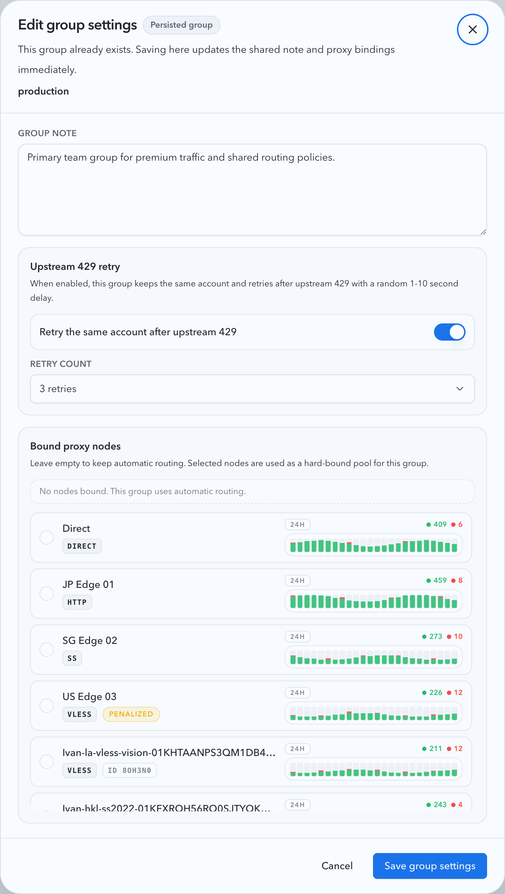
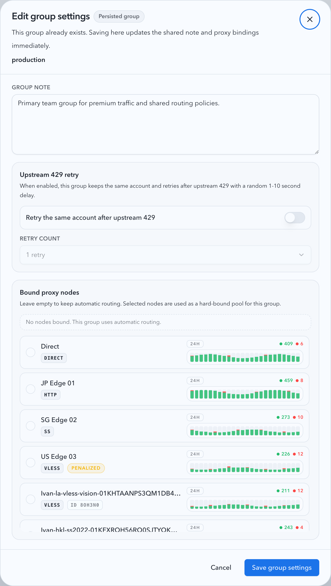

# 号池分组级上游 429 重试与随机回退（#k8a4r）

## 状态

- Status: 已实现，待截图提交授权 / PR 收敛
- Created: 2026-03-30
- Last: 2026-03-30

## 背景

- 当前号池路由在上游账号返回 `429 Too Many Requests` 时会立刻把该账号记为限流并切到下一个账号，不支持“同账号延迟后再试”。
- 全局 `proxy` 设置已经拥有 `upstream429MaxRetries`，但它只作用于反向代理链路，不适用于号池分组。
- 分组 metadata 目前只承载共享备注与 `boundProxyKeys`，缺少“此分组的 429 是否允许同账号重试、最多重试几次”的持久化配置。

## 目标 / 非目标

### Goals

- 为已有账号分组 metadata 新增 `upstream429RetryEnabled` 与 `upstream429MaxRetries`，并通过现有分组设置弹窗与 `GET/PUT /api/pool/upstream-account-groups` 稳定 round-trip。
- 仅对“号池分组内账号”的 pool 上游 `429` 生效；分组开启后，在预算未耗尽前保持当前账号不切走，并以随机 `1..10s` 间隔重试。
- 当重试次数耗尽时，继续沿用当前 `rate_limited / cooldown / failover` 终态与观测语义。
- 保持旧库、旧客户端兼容：新列默认关闭、默认次数为 `0`，缺省字段更新时沿用已持久化值。

### Non-goals

- 不修改 `PUT /api/settings/proxy` 与全局反向代理 `upstream429MaxRetries` 语义。
- 不为非 `429` 的上游错误引入新的号池重试策略。
- 不新增独立的分组管理页面或分组级 retry 观测面板。

## 范围

### In scope

- `src/upstream_accounts/mod.rs`：扩展 `pool_upstream_account_group_notes` schema、group metadata load/save/list/update、`PoolResolvedAccount` 接线。
- `src/main.rs`：pool request loop 对分组级 `429` 同账号重试、随机延迟 helper 与测试 seam。
- `web/src/lib/api.ts`、`web/src/pages/account-pool/UpstreamAccounts.tsx`、`web/src/components/UpstreamAccountGroupNoteDialog*`、`web/src/i18n/translations.ts`：分组设置 UI、类型、文案与测试。
- `docs/specs/README.md` 与本 spec `## Visual Evidence`。

### Out of scope

- 全局 proxy 卡片、generic reverse-proxy `/v1/*` helper、`Retry-After` 解析逻辑。
- 非号池路径、未分组账号路径、非 `429` HTTP 错误路径。

## 功能规格

### 数据与接口

- `pool_upstream_account_group_notes` 新增：
  - `upstream_429_retry_enabled INTEGER NOT NULL DEFAULT 0`
  - `upstream_429_max_retries INTEGER NOT NULL DEFAULT 0`
- `GET /api/pool/upstream-accounts` 的 `groups[]` 每项至少包含：
  - `groupName`
  - `note`
  - `boundProxyKeys`
  - `upstream429RetryEnabled`
  - `upstream429MaxRetries`
- `PUT /api/pool/upstream-account-groups/:groupName` 接受同名字段；若 payload 缺省新字段，后端必须沿用已保存值，不得静默重置。
- `upstream429MaxRetries` 允许值范围固定为 `0..5`；关闭时有效值视为 `0`。

### 运行时语义

- 仅当 pool 当前选中的账号属于某个分组，且该分组 `upstream429RetryEnabled=true`、`upstream429MaxRetries>0` 时，收到上游 `429` 才允许同账号重试。
- 每次分组级 `429` 重试前必须等待随机 `1..10s`；该等待不读取上游 `Retry-After`，也不影响非 `429` 路径现有等待逻辑。
- 分组级 `429` 重试只在同一账号内消耗预算，不提前触发切号；预算耗尽后，继续沿用当前账号 cooldown、状态写入与切换到下一个账号的流程。
- 未分组账号、分组关闭 retry、或 `upstream429MaxRetries=0` 时，首个 `429` 仍保持“立即 cooldown + 切号”。

### 前端交互

- 现有“分组设置”弹窗新增一组 `429` 控件，与备注和代理绑定共存：
  - 开关：是否允许该分组在上游 `429` 时同账号重试
  - 次数：`1..5`，仅在开关开启时可编辑
- 打开已有分组时必须回显服务端值；保存后刷新列表与弹窗状态保持一致。
- 新建分组草稿与已有分组即时保存都必须携带这两个字段，避免保存备注或绑定代理时丢失已有 retry 配置。

## 验收标准

- Given 旧数据库尚未包含新列，When 服务启动执行 migration，Then 现有分组自动补齐新列，默认读取为 `false + 0`。
- Given 某分组已保存 `upstream429RetryEnabled=true`、`upstream429MaxRetries=3`，When 客户端发送缺省新字段的 `PUT /api/pool/upstream-account-groups/:groupName`，Then 后端继续保留 `true + 3`。
- Given 某账号属于开启 retry 的分组且 `upstream429MaxRetries=2`，When 上游连续返回两次 `429` 后第三次成功，Then 请求保持同账号完成，不发生切号，且两次等待都位于 `1..10s`。
- Given 某账号属于关闭 retry 的分组，When 首次遇到上游 `429`，Then 仍立即进入当前 `rate_limited / cooldown / failover` 路径。
- Given 打开号池分组设置弹窗，When 切换开关与次数后保存，Then 刷新后 `groups[]` 与弹窗回显一致，且次数控件在关闭时禁用。

## 质量门槛

- `cargo fmt`
- `cargo test`
- `cd web && bun run test`
- `cd web && bun run build`
- `cd web && bun run storybook:build`

## Visual Evidence

- source_type: storybook_canvas
  target_program: mock-only
  capture_scope: element
  sensitive_exclusion: N/A
  submission_gate: pending-owner-approval
  story_id_or_title: Account Pool/Components/Upstream Account Group Settings Dialog/Upstream 429 Retry Enabled
  state: upstream-429-retry-enabled
  evidence_note: 验证分组设置弹窗已新增 `429` 重试开关与次数控件，且次数在启用时可编辑。
  image:
  

- source_type: storybook_canvas
  target_program: mock-only
  capture_scope: element
  sensitive_exclusion: N/A
  submission_gate: pending-owner-approval
  story_id_or_title: Account Pool/Components/Upstream Account Group Settings Dialog/Upstream 429 Retry Disabled
  state: upstream-429-retry-disabled
  evidence_note: 验证分组关闭 `429` 重试时，次数控件被禁用且其他分组设置仍可编辑。
  image:
  

## 变更记录

- 2026-03-30: 创建 spec，冻结分组级上游 `429` 重试的 schema、接口、运行时与 UI 验收口径。
- 2026-03-30: 完成 schema / API / pool runtime / Storybook UI 实现，补充本地视觉证据，等待主人确认是否允许随代码一并提交并推进 PR。
