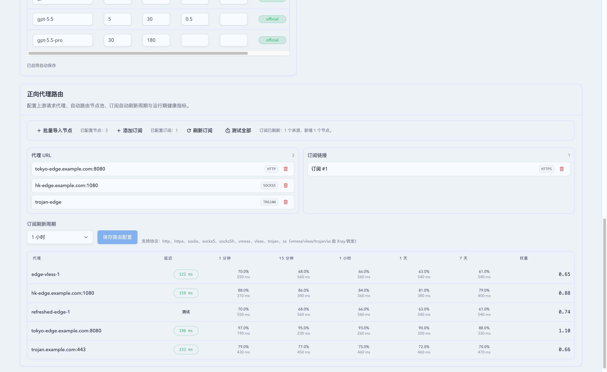
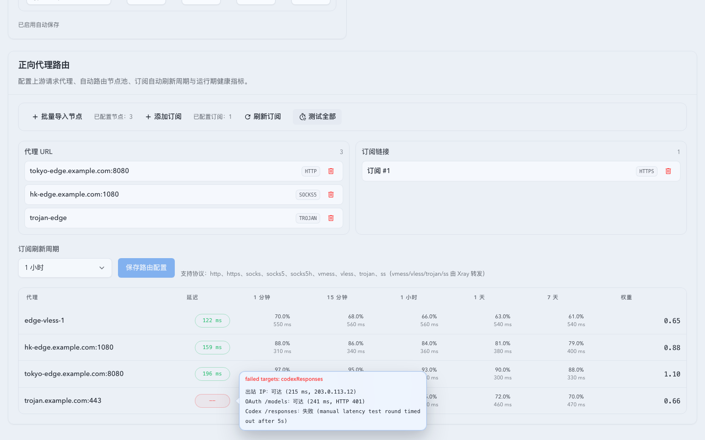

# Forward Proxy 节点延迟与订阅刷新（#kmr5z）

> 当前有效规范以本文为准；实现覆盖与当前状态见 `./IMPLEMENTATION.md`，关键演进原因见 `./HISTORY.md`。

## 背景 / 问题陈述

- Forward proxy 设置页已有节点历史成功率、历史均值延迟和订阅配置，但缺少用户主动确认“当前节点是否可用、当前延迟是多少”的操作入口。
- 订阅节点可能在后台周期刷新前发生变化，用户需要在设置页手动强制刷新订阅并立刻看到新增节点。
- 单节点测速与批量测速需要渐进反馈，避免用户等待全部节点、全部轮次结束后才知道可用节点。

## 目标 / 非目标

### Goals

- 在 forward proxy 节点表新增可点击的延迟列，显示当前手动测速状态与均值延迟。
- 支持单节点重测：最多 5 轮，每轮请求预算 5 秒，单节点总预算 15 秒。
- 支持批量测试：按广度优先调度节点，所有节点先跑第 1 轮，再进入第 2 轮，最多 5 轮。
- 任一节点只要出现一轮有效耗时就立即显示当前均值，后续有效样本继续刷新均值。
- 支持手动刷新订阅，并返回刷新后的节点设置与新增节点数量。

### Non-goals

- 不改变 forward proxy 路由选择、权重计算或惩罚策略。
- 不做后台常驻巡检；测速只由用户点击触发。
- 不把失败或超时样本折算成固定大延迟。

## 范围（Scope）

### In scope

- Rust API：新增订阅刷新、单节点测速、批量测速进度接口。
- Rust runtime：复用现有 proxy client、egress IP provider、OAuth upstream base、attempt/metadata 记录能力。
- Web UI：Settings 页新增延迟列、单节点按钮、批量测试入口、订阅刷新按钮与 i18n。
- Storybook：Settings 页覆盖刷新、测速中、成功、部分失败、全失败状态。

### Out of scope

- 代理节点导入验证流程的轮次数与并发策略。
- 账号池绑定节点选择器的展示逻辑。
- 自定义测速站点配置。

## 需求（Requirements）

### MUST

- 节点表必须新增“延迟”列，内容为可点击 badge/button。
- 未测状态显示 `测试`；测试中显示当前轮次进度；有结果显示整数毫秒；五轮全失败显示 `--` 或“超时”。
- 单节点测速最多执行 5 轮，每轮预算 5 秒，整体预算 15 秒。
- 批量测试必须广度优先，不能让单个节点连续跑完 5 轮后才测试下一个节点。
- 均值只使用成功样本，算法为 `round(sum(successLatencyMs) / successCount)`。
- 每轮测试包含出站 IP、OAuth `/models` 上游和 Codex `/responses` 上游三个目标；三个目标全部可达才算该轮健康。
- 出站 IP 请求使用 `https://api.ipify.org?format=json`。
- OAuth 上游请求使用 `GET {oauth_codex_upstream_base_url()}/models`。
- Codex responses 上游请求使用 `GET {oauth_codex_upstream_base_url()}/responses`；`405`、`401`、`403`、`404` 和其他 `<500` HTTP 状态均视为 endpoint reachable，transport error、超时和 `>=500` 视为不可达。
- 任一目标不可达时，节点进度必须报告异常目标与错误原因；成功延迟样本只能用于展示统计，不能把节点最终状态改成正常。
- 手动刷新订阅必须强制绕过订阅刷新间隔。

### SHOULD

- 延迟 badge 的 tooltip 应显示有效样本数、已完成轮次、出站 IP 状态、OAuth `/models` 状态、Codex `/responses` 状态和失败摘要。
- 测速成功时应刷新出站 IP 元数据；OAuth 上游探测应写入 probe attempt。
- 订阅刷新完成后 Settings 页应刷新节点列表。

## 功能与行为规格（Functional/Behavior Spec）

### Core flows

- 用户点击某节点延迟 badge 后，UI 建立测速进度流并只更新该节点。
- 用户点击“测试全部”后，UI 对当前表格内全部节点建立批量测速进度流。
- 后端每完成一个节点的一轮测试，就推送该节点当前聚合结果。
- 订阅刷新按钮调用强制刷新 API，成功后用响应中的设置替换当前 forward proxy 设置草稿。

### Edge cases / errors

- 节点不存在时返回 404。
- 单轮任一目标失败时，该轮不写入成功 probe attempt，并在进度中保留失败目标；已成功目标的耗时仍可作为展示样本。
- 五轮后任一目标存在失败时，节点进入失败/异常展示状态，即使 `averageLatencyMs` 存在也不能显示为正常延迟。
- 单节点整体 15 秒预算耗尽后，返回已完成样本；无有效样本时显示超时。
- 批量测试中单个节点失败不影响其他节点继续测试。

## 接口契约（Interfaces & Contracts）

### 接口清单（Inventory）

| 接口（Name）                                                  | 类型（Kind） | 范围（Scope） | 变更（Change） | 契约文档（Contract Doc） | 负责人（Owner） | 使用方（Consumers） | 备注（Notes）                                   |
| ------------------------------------------------------------- | ------------ | ------------- | -------------- | ------------------------ | --------------- | ------------------- | ----------------------------------------------- |
| `POST /api/settings/forward-proxy/refresh-subscriptions`      | HTTP JSON    | internal      | New            | None                     | backend         | Settings page       | 强制刷新订阅                                    |
| `GET /api/settings/forward-proxy/nodes/:proxyKey/test-stream` | SSE          | internal      | New            | None                     | backend         | Settings page       | 单节点测速进度                                  |
| `GET /api/settings/forward-proxy/nodes/test-stream`           | SSE          | internal      | New            | None                     | backend         | Settings page       | 批量测速进度，使用重复 `key` query 参数传入节点 |

### 契约文档（按 Kind 拆分）

- None

## 验收标准（Acceptance Criteria）

- Given Settings 页有多个 forward proxy 节点，When 用户点击“测试全部”，Then 每个节点先完成第 1 轮后才进入第 2 轮。
- Given 某节点第 1 轮有有效耗时，When 该轮结束，Then UI 立即显示当前均值。
- Given 某节点后续轮次继续成功，When 新样本到达，Then UI 显示更新后的整数毫秒均值。
- Given 某节点 5 轮全部失败，When 测试结束，Then UI 显示 `--` 或“超时”。
- Given 某节点 `egressIp` 与 OAuth `/models` 成功但 Codex `/responses` 超时，When 测试进度到达前端，Then UI 显示异常并展示 `codexResponses` 失败原因，而不是显示正常延迟。
- Given Codex `/responses` 返回 `405`，When 后端记录该目标结果，Then 该目标视为可达并可贡献成功样本。
- Given 用户点击刷新订阅，When 后端成功解析订阅，Then Settings 页节点列表包含刷新后的节点。

## 非功能性验收 / 质量门槛（Quality Gates）

### Testing

- Unit tests: 均值计算、全失败、部分失败、`/responses` 不可达异常判定、`405` 可达判定、预算裁剪、广度优先调度。
- Integration tests: 订阅刷新强制执行、单节点测速写入 metadata/attempt。
- E2E tests: 不适用。

### UI / Storybook

- Stories to add/update: Settings page forward proxy latency and subscription refresh states.
- Docs pages / state galleries to add/update: 使用现有 SettingsPage story docs/autodocs。
- `play` / interaction coverage to add/update: 点击延迟 badge 与刷新订阅。
- Visual regression baseline changes: Settings 页 forward proxy 卡片。

### Quality checks

- `cargo fmt --check`
- `cargo test`
- `cd web && bun run test`
- `cd web && bun run build`

## Visual Evidence

- source_type: storybook_canvas
  story_id_or_title: Settings/SettingsPage/Forward Proxy Latency And Refresh
  target_program: mock-only
  capture_scope: browser-viewport
  requested_viewport: desktop1660
  viewport_strategy: storybook-viewport
  sensitive_exclusion: N/A
  submission_gate: owner-approved
  evidence_note: 验证 Settings 页 forward proxy 卡片新增延迟列、测试全部、刷新订阅反馈与新增订阅节点展示。

- source_type: storybook_canvas
  story_id_or_title: Settings/SettingsPage/Forward Proxy Latency And Refresh
  target_program: mock-only
  capture_scope: browser-viewport
  requested_viewport: 1440x900
  viewport_strategy: devtools-emulate
  sensitive_exclusion: N/A
  submission_gate: owner-approved
  evidence_note: 验证 `codexResponses` 失败时延迟按钮显示异常，并在 hover/focus 浮层中展示 `Codex /responses` 失败详情。

## Related PRs

- None

## 风险 / 开放问题 / 假设（Risks, Open Questions, Assumptions）

- 风险：批量测速节点很多时会维持较长 SSE 连接；实现必须在每轮预算内释放已超时请求。
- 假设：Direct 节点参与测试，作为当前机器直连基线。
- 假设：OAuth 上游无凭据响应仍可用于网络可达性与延迟诊断，实际 HTTP 状态会返回给 UI。

## 参考（References）

- `src/forward_proxy/`
- `web/src/pages/Settings.tsx`
