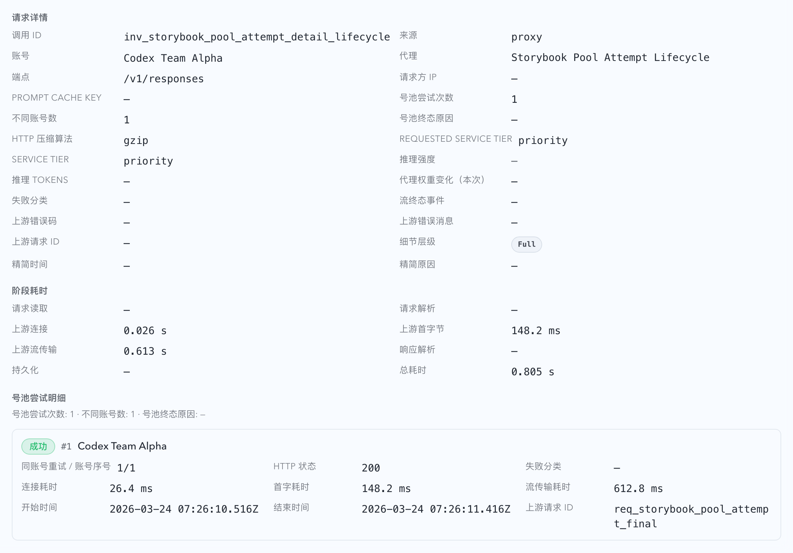

# 号池逐次上游尝试明细、三账号 failover 上限与 7+30 保留（#m2f8k）

## 状态

- Status: 进行中
- Created: 2026-03-22
- Last: 2026-03-25
- Note: 在线历史读取语义已由 `#h9r2m` 接管；本 spec 中涉及 archive 回读的描述仅保留为原始设计背景，不再代表当前契约。

## 背景 / 问题陈述

- 当前 `codex_invocations` 只保留每个客户端调用的最终落定结果，`routeMode=pool` 在一次请求内部换过哪些上游账号、每次失败在什么阶段、是否已经耗尽 failover 预算，都无法从在线记录直接还原。
- 这会让最近出现的“单次 pool 调用挂十几分钟后才成功或 429 失败”只能靠事后推断，无法明确区分“同账号短暂重试”与“跨多个账号长时间 failover”。
- 现有 retention/archive 框架已经覆盖 `codex_invocations`、`forward_proxy_attempts`、`stats_source_snapshots` 等数据集，但 archive 文件一旦生成后缺少 TTL 清理能力，无法支持“在线短保留 + archive 再保留一段时间后删除”的新数据集策略。

## 目标 / 非目标

### Goals

- 为 `routeMode=pool` 新增逐次上游尝试明细表 `pool_upstream_request_attempts`，记录每一次真正发往上游账号的尝试，以及预算耗尽时的终态。
- 把 pool failover 的不同账号预算收紧为“每次客户端请求最多尝试 3 个不同账号，含首个账号”，避免单次请求在池内无限换号拖到十几分钟。
- 让 Dashboard / Live 的 InvocationTable 详情可以按需懒加载同一条 invocation 的 pool attempts，不扩大列表和 SSE 负载。
- 为 pool attempt 明细接入 `7` 个上海自然日在线保留、`30` 个上海自然日 archive TTL，并补齐 archive 文件清理能力。
- 在 invocation 主记录中补充结构化汇总字段，便于列表与详情快速判断“这次 pool 调用用了多少次尝试、换了多少个账号、最终为什么停下”。

### Non-goals

- 不改写 pool 账号排序、stickyKey 语义或 tag 路由规则。
- 不把 pool attempt 明细塞进 `/api/invocations` 列表响应或 SSE `records` 载荷。
- 不在上游账号详情页新增请求明细视图。
- 不为 attempt 明细额外保存 raw request / response 文件。

## 范围（Scope）

### In scope

- `src/main.rs`：pool attempt schema、每次上游尝试落库、3 账号预算、attempt summary payload、retention/archive/archive TTL 清理。
- `src/api/mod.rs`：`GET /api/invocations/{invokeId}/pool-attempts`、主记录 summary 字段投影、live-only 在线读取。
- `web/src/lib/api.ts`、`web/src/components/InvocationTable.tsx`、`web/src/i18n/translations.ts`：详情懒加载 pool attempts 与空态/错误态展示。
- `src/tests/mod.rs`、`web/src/components/InvocationTable.test.tsx`：后端与前端回归覆盖。
- `docs/specs/README.md` 与本 spec：索引与状态同步。

### Out of scope

- 号池页账号详情抽屉上的请求明细。
- 新的 pool attempts 独立页面、筛选器或导出能力。
- 把压缩请求 `/v1/responses/compact` 与非压缩请求 `/v1/responses` 走不同 failover 预算。

## 需求（Requirements）

### MUST

- `pool_upstream_request_attempts` 至少记录：`invoke_id`、`occurred_at`、`endpoint`、`route_mode`、`sticky_key`、`upstream_account_id`、`attempt_index`、`distinct_account_index`、`same_account_retry_index`、`requester_ip`、`started_at`、`finished_at`、`status`、`phase`、`http_status`、`failure_kind`、`error_message`、`connect_latency_ms`、`first_byte_latency_ms`、`stream_latency_ms`、`upstream_request_id`。
- attempt `status` 必须收敛到有限集合：`pending`、`success`、`http_failure`、`transport_failure`、`budget_exhausted_final`。
- attempt `phase` 必须表达过程态推进；当前契约至少包含 `connecting`、`sending_request`、`waiting_first_byte`、`streaming_response`、`completed`、`failed`。其中 `completed` / `failed` 只表示过程收口，最终业务结果仍以 `status` 为准。
- pool failover 最多尝试 `3` 个不同账号；若即将进入第 `4` 个不同账号，必须停止继续 failover，并写一条 `budget_exhausted_final` attempt，`failure_kind=max_distinct_accounts_exhausted`。
- 同账号内的 retry 仍可发生，但只能增加 `same_account_retry_index`，不得额外占用新的 `distinct_account_index`。
- `codex_invocations.payload.upstreamAccountId` 继续表示最终落定账号；新增 `poolAttemptCount`、`poolDistinctAccountCount`、`poolAttemptTerminalReason` 作为汇总字段。
- `GET /api/invocations/{invokeId}/pool-attempts` 只对 `routeMode=pool` 返回记录；非 pool 调用必须稳定返回空数组。
- InvocationTable 只能在展开详情时按需请求 attempts；列表与 SSE 载荷不得内嵌完整 attempts。
- `/events` 继续复用同一条 SSE 连接；attempt 明细必须通过单独的 `pool_attempts` 事件推送完整 attempts 列表，开始尝试与尝试终态更新都要触发推送。
- `pool_upstream_request_attempts` 在线只保留最近 `7` 个上海自然日；更老数据按月归档到 `archives/pool_upstream_request_attempts/<yyyy>/pool_upstream_request_attempts-<yyyy-mm>.sqlite.gz`；archive 超过 `30` 个上海自然日后必须自动删除 archive 文件与对应 manifest 行。

### SHOULD

- attempt 查询只读 live DB；超出在线保留窗时返回空数组，由主记录 summary 与统计层承担长期历史能力。
- UI 详情应同时展示尝试序号、账号、账号内重试序号、终态、HTTP 状态、失败类型、各阶段耗时、上游请求 ID 与时间点。
- UI 在首次拿到空 attempts 后，只要主记录仍在运行中或后续收到 `poolAttemptCount` / `pool_attempts` 增量，就必须能被动刷新，不得把空结果当成最终真相缓存住。
- 历史 invocation 缺少 pool summary 字段时，前端详情仍应稳定渲染，不把它误判成错误态。

## 功能与行为规格（Functional/Behavior Spec）

### Core flows

- 一次 `routeMode=pool` 请求开始后，主 invocation 仍只落一条 `codex_invocations` 记录；所有内部 failover 细节进入 `pool_upstream_request_attempts`。
- 每次真正发往上游账号的请求，在开始尝试时就要先插入一条 `pending` attempt；后续成功或失败必须原地补全同一行，而不是再插入第二条终态行。
- attempt 在生命周期内必须按阶段推进：开始登记后先进入 `connecting`，随后推进到 `sending_request`；拿到响应头后再进入 `waiting_first_byte`；首个响应 chunk 到达后进入 `streaming_response`；最终统一收口到 `completed` 或 `failed`。
- 每次 `pending` attempt 创建后，都要立即推送 `pool_attempts` SSE；主 invocation 的 running snapshot 也要同步补上最新 `poolAttemptCount`、`poolDistinctAccountCount` 与当前尝试账号。
- process phase 只能在阶段切换时更新数据库和 SSE，不得按上传/下载 chunk 高频写库。
- 当同一个账号返回 `5xx` 且仍有同账号 retry 预算时，先记录这次失败 attempt，再按现有策略 sleep 后重试同一账号。
- 当同一个账号返回 `429` 时，必须先记录这次失败 attempt，并立即切到下一个不同账号；若没有可切账号，则对调用方返回 `429` 终态。
- 当一个账号的 retry 预算耗尽且需要换号时，递增 `distinct_account_index` 并继续 `continue 'account_loop`；一旦即将超过 3 个不同账号，终止 failover 并写 `budget_exhausted_final`。
- 最终成功 attempt 在流结束后补全 `stream_latency_ms`；失败 attempt 只要求补全当前已知的连接/HTTP/失败信息。
- retention 任务先 archive 再 purge live rows，并给 `archive_batches` 写入 `coverage_start_at`、`coverage_end_at`、`archive_expires_at`；archive TTL 清理只按 manifest 覆盖窗口判断，不按文件 mtime 猜测。

### Edge cases / errors

- pool 调用在 live DB 中已被清理时，attempt API 返回空数组，不再从 archive 中回读，也不因 archive 文件状态影响在线接口可用性。
- 非 pool 调用或未知 `invokeId` 返回空数组，不把“没有 attempts”误报为服务异常。
- 历史记录尚未带 `poolAttemptCount` / `poolDistinctAccountCount` / `poolAttemptTerminalReason` 时，列表详情按 `—` 降级显示。
- `/v1/responses/compact` 与 `/v1/responses` 共用同一 attempt 记录与 3 账号预算模型，不分叉实现。

## 接口契约（Interfaces & Contracts）

### 接口清单（Inventory）

| 接口（Name） | 类型（Kind） | 范围（Scope） | 变更（Change） | 负责人（Owner） | 使用方（Consumers） | 备注（Notes） |
| --- | --- | --- | --- | --- | --- | --- |
| `pool_upstream_request_attempts` | SQLite table | internal | Add | backend | retention / API / ops | 记录 pool 每次真实上游尝试 |
| `GET /api/invocations/{invokeId}/pool-attempts` | HTTP API | internal | Add | backend | InvocationTable details | 非 pool 返回空数组 |
| `ApiInvocation.poolAttempt*` | Rust + TS fields | internal | Modify | backend + web | Dashboard / Live / records detail | 仅是汇总字段，不内嵌 attempts |
| `BroadcastPayload::pool_attempts` | SSE event | internal | Add | backend + web | InvocationTable details | 同一 SSE 通道内推送单条 invocation 的完整 attempts |
| `archive_batches.coverage_* / archive_expires_at` | SQLite manifest fields | internal | Modify | backend | retention / archive reads | 支持 archive TTL 清理 |

## 验收标准（Acceptance Criteria）

- Given 一个 pool 调用在第 1 或第 2 个账号成功，When 请求完成，Then `codex_invocations` 仍只有一条主记录，且 attempts API 返回完整 attempt 顺序与最终成功 attempt。
- Given 一个正在进行中的 pool 调用，When 第一个上游账号刚开始尝试但请求尚未完成，Then attempts API 与 `pool_attempts` SSE 都已经能看到 1 条 `pending` attempt，且 `started_at` 已有值而 `finished_at` 为空。
- Given 一个成功的 pool 调用，When 流结束，Then 之前那条 `pending` attempt 会被原地更新成 `success`，而不是新增第二条终态 attempt。
- Given 一个 pool 调用连续失败，When 第 3 个不同账号仍失败，Then 服务立即返回失败，不再尝试第 4 个账号，且 attempts 列表最后包含 `budget_exhausted_final` / `max_distinct_accounts_exhausted`。
- Given 同账号内出现 retryable `5xx`，When 读取 attempts，Then `same_account_retry_index` 递增而 `distinct_account_index` 不变。
- Given 任一账号收到 `429`，When 读取 attempts，Then 该 attempt 的 `same_account_retry_index` 固定为 `1`，且后续 failover 必须切到下一个 distinct account 或直接返回 `429`。
- Given 一个非 pool invocation，When 展开 InvocationTable 详情，Then UI 显示明确的“非号池调用无 attempt 明细”空态，且不会发起 attempts 请求。
- Given 一个 pool invocation 的 live attempts 已被 retention 清理，When 调用 attempts API，Then 服务可以从对应 archive 月份回读 attempts。
- Given attempt archive 超过 `30` 个上海自然日，When 运行 retention live 模式，Then 过期 archive 文件与对应 `archive_batches` manifest 行会一起被删除。

## 实现前置条件（Definition of Ready / Preconditions）

- `codex_invocations` 继续作为“每个客户端调用一条”的主表：已确定。
- “最多换三个账号”解释为“一次调用最多尝试 3 个不同账号，含首个账号”：已确定。
- attempt 详情只放 Dashboard / Live 的 InvocationTable 展开详情，不扩展到账号详情页：已确定。
- attempt 明细不新增 raw body 文件：已确定。

## 非功能性验收 / 质量门槛（Quality Gates）

### Testing

- Rust: 覆盖 attempt 落库、3 账号预算、同账号 retry 计数、attempt retention/archive/archive TTL 清理。
- Vitest: 覆盖详情懒加载、非 pool 空态、attempt 列表渲染与错误态。

### Quality checks

- `cargo fmt --check`
- `cargo check`
- `cargo test capture_target_pool_route_ -- --nocapture`
- `cargo test retention_archives_and_cleans_up_pool_upstream_request_attempts -- --nocapture`
- `cargo test app_config_from_sources_reads_renamed_public_envs -- --nocapture`
- `cd web && bun run test --run src/components/InvocationTable.test.tsx`
- `cd web && bun run build`

## Visual Evidence (PR)

- source_type: `storybook_canvas`
- target_program: `mock-only`
- capture_scope: `browser-viewport`
- sensitive_exclusion: `N/A`
- submission_gate: `pending-owner-approval`
- story_id_or_title: `Monitoring/InvocationTable/Pool Attempt Detail Lifecycle`
- state: `expanded detail lifecycle`
- evidence_note: `证明本次任务新增的号池尝试明细在展开详情后可直接看到最终落定的 attempt 行，且同一条 attempt 会原地补齐 HTTP 状态、阶段耗时与 upstream request id，不会出现空明细或重复 attempt 行。`

## 文档更新（Docs to Update）

- `docs/specs/README.md`：登记本 spec 与当前状态。

## 实现里程碑（Milestones / Delivery checklist）

- [x] M1: 新增 `pool_upstream_request_attempts` schema、索引与 attempt summary payload 字段。
- [x] M2: 将 pool failover 不同账号预算收紧为最多 3 个账号，并写入预算耗尽终态。
- [x] M3: 新增 attempts API，并在 InvocationTable 详情中懒加载展示。
- [x] M4: 将 pool attempts 接入 7 天在线 + 30 天 archive TTL 的 retention/archive 清理链路。
- [x] M4.5: 将 attempt 生命周期改成“开始即登记、结束原地更新”，并通过 `pool_attempts` SSE 推送详情增量。
- [ ] M5: 完成 fast-track 交付收口（格式化、review-loop、提交、PR、checks 收敛到 merge-ready）。

## 方案概述（Approach, high-level）

- 复用现有 invocation payload 作为 summary 承载，只把逐次明细单独拆到新表，避免扩大主记录和 SSE 的体积。
- 继续沿用现有 pool failover 主循环，只在关键失败分支补 attempt 落库，并在进入第 4 个账号前插入显式的预算耗尽终态。
- 复用 retention archive 基础设施，同时把 `archive_batches` 从“只记已归档文件”扩展为“还能驱动 archive TTL 清理”的 manifest。

## 风险 / 开放问题 / 假设（Risks, Open Questions, Assumptions）

- 风险：attempt 行数会快速增长，因此必须依赖 7+30 的 retention 策略，不能长期在线保留。
- 风险：若某次 pool 请求在真正发出上游请求前就因为本地校验失败而中断，这类失败不会生成 attempt 行；它们仍只体现在主 invocation 失败结果里。
- 假设：InvocationTable 详情层的按需拉取已足够支撑排障，不需要再把 attempts 暴露到主列表摘要。

## 变更记录（Change log）

- 2026-03-22: 创建 spec，冻结 pool attempts schema、3 账号预算、attempt API、详情懒加载与 7+30 retention 策略。
- 2026-03-23: 更新契约，要求 attempt 在开始时插入 `pending` 行，并通过 `pool_attempts` SSE 实时推送后续状态变化。

## 参考（References）

- `docs/specs/9aucy-db-retention-archive/SPEC.md`
- `docs/specs/7n2ex-invocation-account-latency-drawer/SPEC.md`
- `docs/specs/g4ek6-account-pool-upstream-accounts/SPEC.md`
- `docs/specs/ynr8z-pool-stream-total-timeout/SPEC.md`
