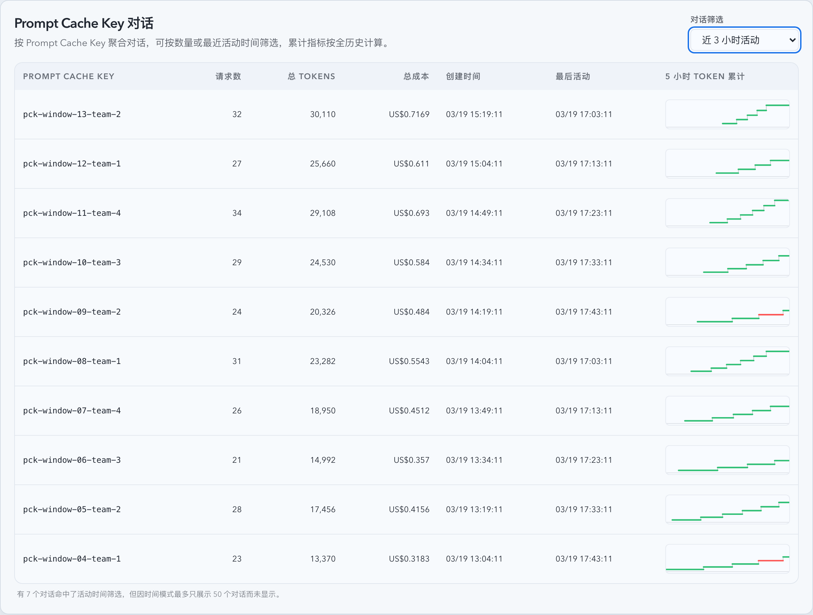
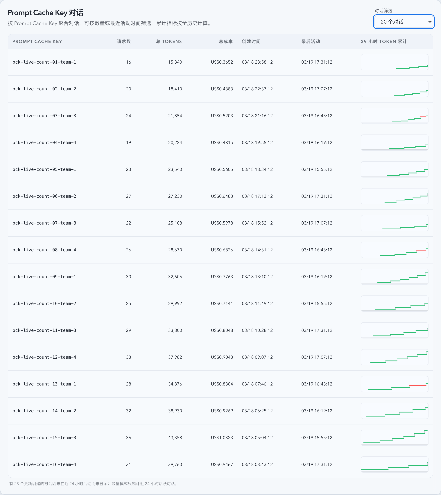

# Prompt Cache Key 对话筛选增强与动态时间轴（#m4c2q）

## 状态

- Status: 进行中
- Created: 2026-03-19
- Last: 2026-03-19

## 背景 / 问题陈述

- Live 页的 Prompt Cache Key 对话区块目前只支持“数量”筛选，且默认绑定“最近 24 小时活跃”这一隐含条件，用户无法直接切到更短的最近活动窗口。
- 表格图表列固定写成 `24h Token 累计`，图表起止时间也跟随后端固定 24 小时窗口，不符合“按表内最早创建时间到当前时间共享时间轴”的新要求。
- 当筛选结果受隐含条件影响时，现有 UI 没有任何提示，用户无法判断数据是“没有”还是“被隐藏了”。

## 目标 / 非目标

### Goals

- 将 Prompt Cache Key 对话筛选扩展为单一互斥选择器，同时支持数量模式（`20/50/100 个对话`）与时间模式（`近 1/3/6/12/24 小时活动`）。
- 保持数量模式的隐含条件为“仅统计近 24 小时活跃对话”，时间模式的隐含条件为“最多展示 50 个对话”，并在触发过滤时显示小字提示。
- 保持服务端按 `createdAt DESC` 排序与全历史累计指标口径不变。
- 将 Prompt Cache Key 表图表改成共享动态时间轴：起点取表内最早 `createdAt`，终点取当前时间，列标题与 aria 改为实际上取整小时数。
- 保持 Prompt Cache Key 表实时更新：数据仍由 SSE 节流刷新与轮询兜底，结束时间额外由前端共享 `now` 时钟推进。

### Non-goals

- 不修改 Sticky Key 对话表的筛选语义或后端接口。
- 不调整 SSE 事件协议、Dashboard/Stats/Records 页面信息架构，或为 Prompt Cache 对话新增统计表。
- 不把 `last24hRequests` 字段重命名为新 API 字段，本轮只修正其实际取数范围与展示语义。

## 范围（Scope）

### In scope

- `src/api/mod.rs` 与 `src/tests/mod.rs`：扩展 Prompt Cache 对话接口参数、缓存 key、隐含过滤元数据与回归测试。
- `web/src/lib/api.ts`、`web/src/hooks/usePromptCacheConversations.ts`、`web/src/pages/Live.tsx`：前端联合筛选状态、请求参数切换与实时刷新。
- `web/src/components/PromptCacheConversationTable.tsx`、`web/src/components/KeyedConversationTable.tsx`：共享动态时间轴、动态小时列名、页脚提示。
- `web/src/i18n/translations.ts`、相关 Vitest/页面测试、以及本 spec 与 `docs/specs/README.md`。

### Out of scope

- Sticky Key 后端查询与展示逻辑。
- 其它页面的筛选器或图表标题同步重构。
- 浏览器截图资产与 Storybook 视觉回归。

## 接口契约（Interfaces & Contracts）

- `GET /api/stats/prompt-cache-conversations`
  - 支持互斥参数：
    - `limit=20|50|100`
    - `activityHours=1|3|6|12|24`
  - 当 `limit` 与 `activityHours` 同时出现时返回 `400 Bad Request`。
  - 当参数缺失或单参数非法时，回退到兼容默认 `limit=50`。
- 响应新增：
  - `selectionMode: 'count' | 'activityWindow'`
  - `selectedLimit: number | null`
  - `selectedActivityHours: number | null`
  - `implicitFilter: { kind: 'inactiveOutside24h' | 'cappedTo50' | null; filteredCount: number }`
- 对话图表点位仍复用 `last24hRequests[]` 字段名，但 Prompt Cache Key 接口的实际取数范围改为“当前表格可见行最早 `createdAt` 到当前查询时刻”。

## 验收标准（Acceptance Criteria）

- Given 选择 `20/50/100 个对话`，When 请求 Prompt Cache Key 对话接口，Then 仅发送 `limit`，结果只包含近 24 小时有活动的对话，并按 `createdAt DESC` 排序。
- Given 选择 `近 1/3/6/12/24 小时活动`，When 请求接口，Then 仅发送 `activityHours`，结果只包含对应窗口内活跃的对话，并按 `createdAt DESC` 排序且最多返回 50 条。
- Given 命中了筛选显式条件但被隐含条件过滤，When 页面渲染，Then 表格下方显示小字提示；若没有触发隐含过滤，则不显示提示。
- Given Prompt Cache Key 表存在至少一行，When 页面持续停留，Then 图表列标题与 aria 按“表内最早创建时间到当前时间”的小时差上取整实时更新，而不是固定写死 `24h`。
- Given 最近活动窗口不变但没有新 SSE 数据，When 前端共享 `now` 时钟推进，Then 图表结束时间与小时列名仍会变化。

## 非功能性验收 / 质量门槛（Quality Gates）

### Testing

- Rust: `cargo test prompt_cache_conversations -- --nocapture`
- Web: `cd web && bunx vitest run src/components/PromptCacheConversationTable.test.tsx src/hooks/usePromptCacheConversations.test.tsx src/hooks/usePromptCacheConversations.test.ts src/pages/Live.test.tsx src/lib/api.test.ts`

### Quality checks

- Rust format: `cargo fmt`
- TypeScript build: `cd web && bunx tsc -b`

## 实现里程碑（Milestones / Delivery checklist）

- [x] M1: 新建 follow-up spec，冻结筛选模式、隐含条件提示与动态时间轴口径。
- [x] M2: 后端完成互斥参数解析、缓存 key 升级、隐含过滤元数据与活动窗口/数量模式查询。
- [x] M3: 前端完成联合筛选状态、动态图表时间轴、小字提示与页面测试。
- [ ] M4: fast-flow 提交、PR、checks、review-loop 收敛到 merge-ready。

## Visual Evidence (PR)

- source_type: `storybook_canvas`
  story_id_or_title: `Monitoring/Live Prompt Cache Section / Interactive Filters`
  state: `activityWindow=3h`
  target_program: `mock-only`
  capture_scope: `element`
  sensitive_exclusion: `N/A`
  submission_gate: `pending-owner-approval`
  evidence_note: 验证时间模式下的互斥筛选、按 `createdAt DESC` 排序、共享动态小时列名，以及命中 50 条上限时的页脚提示。
  image:
  

- source_type: `storybook_canvas`
  story_id_or_title: `Monitoring/Live Prompt Cache Section / Interactive Filters`
  state: `count=20`
  target_program: `mock-only`
  capture_scope: `element`
  sensitive_exclusion: `N/A`
  submission_gate: `pending-owner-approval`
  evidence_note: 验证数量模式下“近 24 小时活跃 + 最多 20 个”的互斥筛选、共享时间轴，以及隐含过滤提示文案。
  image:
  

## 变更记录（Change log）

- 2026-03-19: 新建 spec，冻结 Prompt Cache Key 对话筛选增强、隐含过滤提示与动态共享时间轴方案。
- 2026-03-19: 补充 Storybook canvas 截图作为 PR 视觉凭据，覆盖 `近 3 小时活动` 与 `20 个对话` 两个关键状态。
