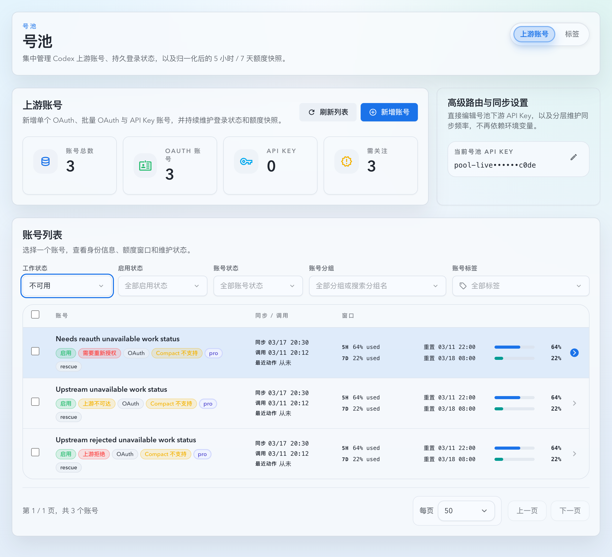
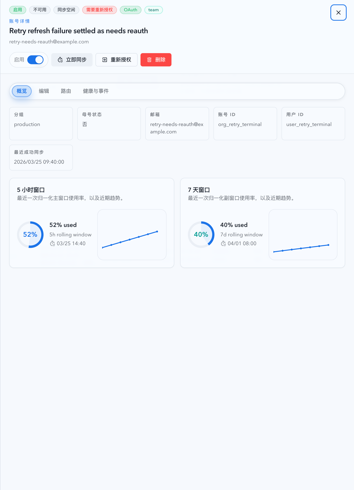
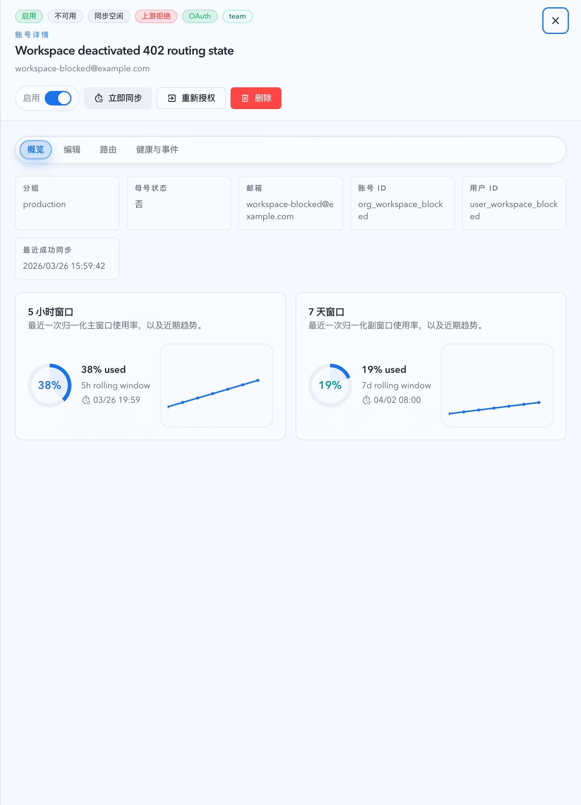

# 号池工作状态新增“不可用（不可调度）”（#m4k2q）

## 状态

- Status: 已实现，待 PR / CI 收敛
- Created: 2026-03-27
- Last: 2026-03-27

## 背景 / 问题陈述

- 当前账号列表已经把 `needs_reauth`、`upstream_unavailable`、`upstream_rejected`、`error_other` 这些异常原因导出为 `healthStatus`，但 `workStatus` 仍只有 `working / idle / rate_limited` 三值。
- 现有读模型会在 `healthStatus != normal` 时强制把 `workStatus` 回收到 `idle`，导致“启用且非同步中，但当前不可调度”的账号在工作状态筛选里完全不可见。
- 实际运营诉求是按“是否可调度”筛选，而不是只按具体异常原因筛选；像上游拒绝这类硬失效，不应继续和真正可调度的空闲账号共用 `idle`。

## 目标 / 非目标

### Goals

- 新增 `workStatus=unavailable`，用于表达“账号启用、同步空闲，但当前不可调度”的统一工作态。
- 保持 `rate_limited` 的独立语义：配额耗尽或 429 cooldown 仍只落到 `rate_limited`，不得并入 `unavailable`。
- 保留 `healthStatus` / `displayStatus` 对具体异常原因的细分，列表行继续优先展示具体健康 badge，详情头部同时展示 `不可用 + 具体健康态`。
- 让 `GET /api/pool/upstream-accounts`、前端筛选、Storybook 与回归测试全部接受并消费 `workStatus=unavailable`。

### Non-goals

- 不新增数据库列、迁移或任何持久化状态字段。
- 不修改 resolver 的路由/故障转移策略，只调整 summary/detail/filter 的读模型导出与 UI 消费。
- 不把 `disabled` 或 `syncing` 折叠进 `unavailable`；这两类状态仍分别由 `enableStatus` 与 `syncState` 独立表达。

## 范围（Scope）

### In scope

- `src/upstream_accounts/mod.rs`
- `web/src/lib/api.ts`
- `web/src/pages/account-pool/UpstreamAccounts.tsx`
- `web/src/components/UpstreamAccountsTable.stories.tsx`
- `web/src/components/UpstreamAccountsPage.story-helpers.tsx`
- `web/src/components/UpstreamAccountsPage.list.stories.tsx`
- `web/src/components/UpstreamAccountsTable.test.tsx`
- `web/src/pages/account-pool/UpstreamAccounts.test.tsx`
- `web/src/i18n/translations.ts`
- `docs/specs/g4ek6-account-pool-upstream-accounts/contracts/http-apis.md`

### Out of scope

- 账号维护动作、同步状态机或路由选路算法改造
- 新的健康态枚举或新的错误文案体系
- 账号列表行新增泛化“不可用” badge

## 需求（Requirements）

### MUST

- 后端读模型必须新增 `UPSTREAM_ACCOUNT_WORK_STATUS_UNAVAILABLE`，并允许列表 query 使用 `workStatus=unavailable`。
- 当账号满足 `enableStatus=enabled`、`syncState=idle`、`healthStatus!=normal` 且当前不属于 `rate_limited` 时，summary/detail 导出的 `workStatus` 必须为 `unavailable`，不再回退为 `idle`。
- `upstream_http_429_quota_exhausted`、`quota_still_exhausted` 与 cooldown 中的 429 账号必须继续导出为 `rate_limited`，不得被这次改动吞成 `unavailable`。
- 前端详情头部必须显示 `不可用` 工作态与具体健康态并存；列表行继续只显示具体健康态，不额外叠加泛化“不可用” badge。
- Storybook 至少覆盖 `needs_reauth`、`upstream_unavailable`、`upstream_rejected` 三类 `unavailable` 示例，并验证工作状态筛选命中它们、不会误收 `rate_limited`。

### SHOULD

- 服务端回归测试同时覆盖 summary 与 detail 导出。
- 前端回归测试同时覆盖筛选参数透传、详情头部状态与异常行展示语义。

## 接口契约（Interfaces & Contracts）

### `GET /api/pool/upstream-accounts`

- `workStatus` 枚举扩展为 `working | idle | rate_limited | unavailable`，继续支持重复 query 参数并按同维度 OR 匹配。
- `unavailable` 只表示“不可调度”，不替代 `healthStatus` 的具体异常原因；调用方若需要区分 `needs_reauth` / `upstream_rejected` 等具体原因，仍应读取 `healthStatus`。
- `enabled=false` 或 `syncState=syncing` 的账号继续导出 `workStatus=idle`，不能落到 `unavailable`。

### 前端状态消费

- `UpstreamAccountSummary.workStatus` TypeScript union 扩展为包含 `unavailable`。
- 工作状态筛选新增“不可用”选项；详情头部的工作状态标签新增“不可用”文案。
- 列表行在 `healthStatus!=normal` 时继续只展示具体健康 badge，不额外渲染 `workStatus=unavailable` 的通用 badge。

## 验收标准（Acceptance Criteria）

- Given 账号最近状态为 `upstream_rejected`、`needs_reauth`、`upstream_unavailable` 或 `error_other`，When summary/detail 导出，Then `workStatus=unavailable`。
- Given quota exhausted / 429 cooldown 账号，When summary/detail 导出，Then `workStatus=rate_limited` 且不出现 `unavailable`。
- Given 用户在账号列表选择 `workStatus=unavailable`，When 请求列表，Then 能命中不可调度账号，并继续与 `enableStatus` / `healthStatus` / `tagIds` / `groupSearch` 共同按 AND 收口。
- Given 列表展示异常账号，When 渲染 roster row，Then 行内仍以具体健康 badge 表达原因，不新增泛化“不可用” badge。
- Given 打开异常账号详情，When 查看头部状态，Then 同时可见“不可用”工作态与具体健康态。

## 质量门槛（Quality Gates）

- `cargo test list_query_deserializes_repeated_status_filters`
- `cargo test route_triggered_402_summary_and_detail_export_as_upstream_rejected`
- `cargo test sync_triggered_402_summary_and_detail_export_as_upstream_rejected`
- `cargo test stale_quota_route_failure_does_not_hide_newer_sync_error`
- `cargo test blocked_api_key_manual_recovery_does_not_export_as_active_rate_limited`
- `cargo test oauth_sync_retry_after_refresh_settles_to_needs_reauth_without_stale_syncing`
- `cd web && bun run test -- src/components/UpstreamAccountsTable.test.tsx src/pages/account-pool/UpstreamAccounts.test.tsx src/lib/api.test.ts`
- `cd web && bun run build-storybook`

## 计划资产（Plan assets）

- Directory: `docs/specs/m4k2q-upstream-account-unavailable-work-status/assets/`
- In-plan references:
  ``
  ``
  ``

## Visual Evidence

- source_type: storybook_canvas
  target_program: mock-only
  capture_scope: browser-viewport
  sensitive_exclusion: N/A
  submission_gate: pending-owner-approval
  story_id_or_title: Account Pool/Pages/Upstream Accounts/List — Unavailable Work Status Filter
  state: zh-CN / unavailable work-status filter applied
  evidence_note: 验证工作状态筛选新增“不可用”后，只保留 `needs_reauth`、`upstream_unavailable`、`upstream_rejected` 三类不可调度账号，`rate_limited` 行不会误收。
  image:
  

- source_type: storybook_canvas
  target_program: mock-only
  capture_scope: element
  sensitive_exclusion: N/A
  submission_gate: pending-owner-approval
  story_id_or_title: Account Pool/Pages/Upstream Accounts/List — Oauth Retry Terminal State
  state: zh-CN / detail drawer header
  evidence_note: 验证详情抽屉头部同时展示通用工作态“不可用”和具体健康态“需要重新授权”。
  image:
  

- source_type: storybook_canvas
  target_program: mock-only
  capture_scope: element
  sensitive_exclusion: N/A
  submission_gate: pending-owner-approval
  story_id_or_title: Account Pool/Pages/Upstream Accounts/List — Upstream Rejected 402
  state: zh-CN / detail drawer header
  evidence_note: 验证上游 402 / rejected 异常在详情抽屉头部仍保留“上游拒绝”具体健康态，同时工作态统一落到“不可用”。
  image:
  

## 里程碑（Milestones）

- [x] M1: 新增 follow-up spec，冻结 `unavailable` 的调度语义与筛选契约。
- [x] M2: 后端读模型与列表 query 支持 `workStatus=unavailable`。
- [x] M3: 前端筛选、详情头部、翻译与 Storybook mock 统一到 `unavailable`。
- [x] M4: Storybook 覆盖 `unavailable` 三类异常并完成视觉证据。
- [ ] M5: 验证、review-loop 与 PR 收敛到 merge-ready。
