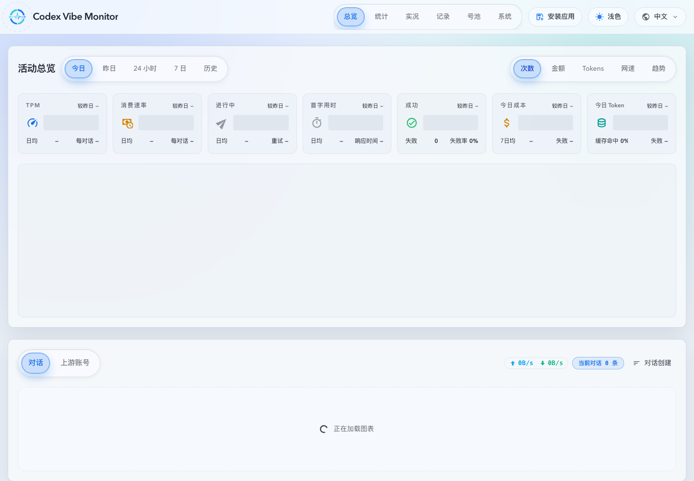
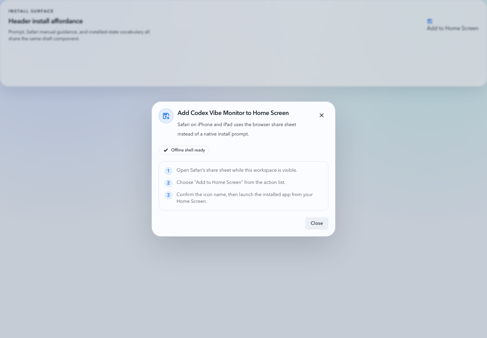
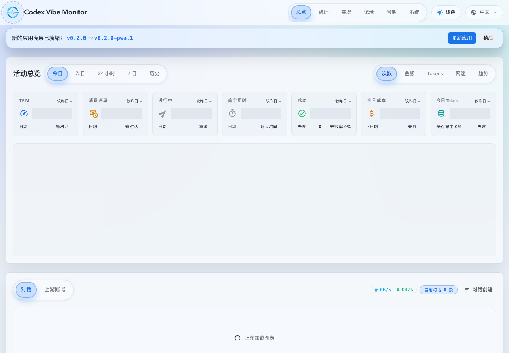
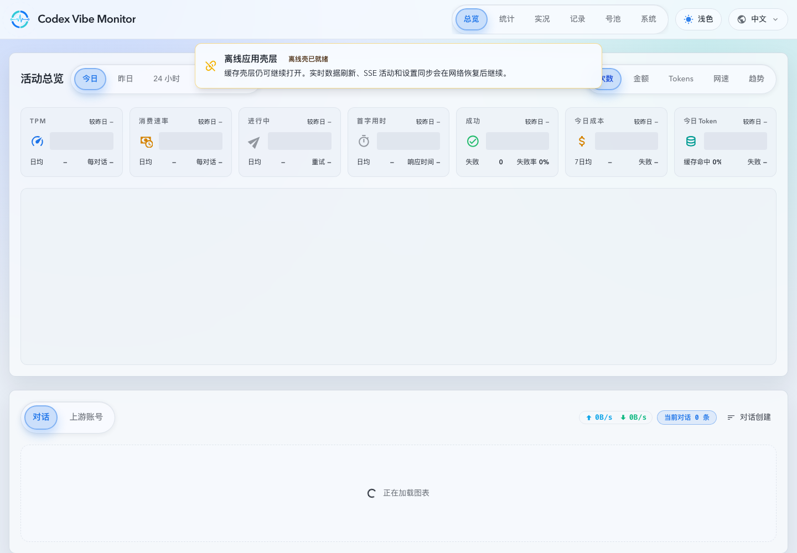
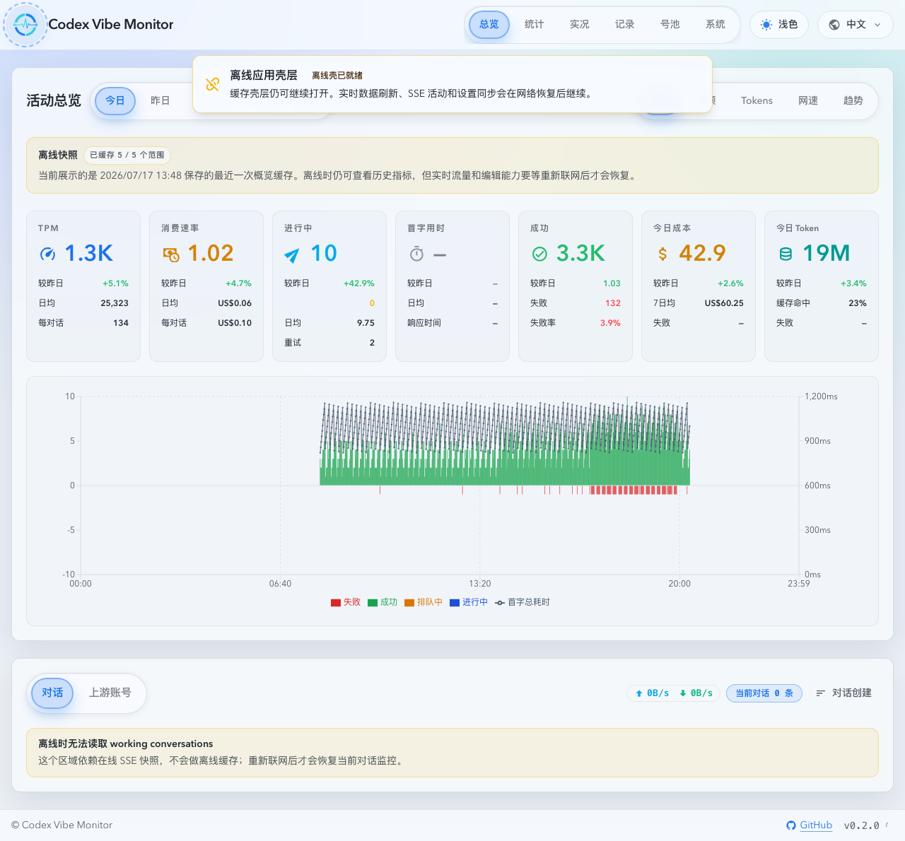
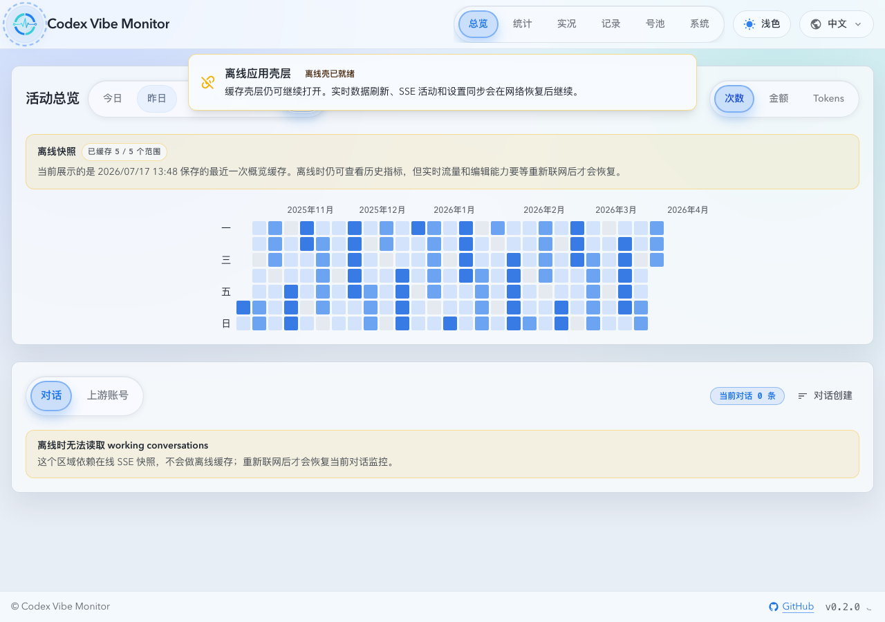

# Installable PWA 运行时与 Dashboard 概览离线快照（#m9p2w）

> 当前有效规范以本文为准；实现覆盖与当前状态见 `./IMPLEMENTATION.md`，关键演进原因见 `./HISTORY.md`。

## 背景 / 问题陈述

- `Codex Vibe Monitor` 已经具备 installable PWA 所需的应用身份，但如果只有 manifest / icon / standalone metadata，而没有正式的 install、update、offline contract，PWA 仍然停留在“能被识别”而不是“可交付”的层级。
- 仅有离线壳层会让安装后的首次断网打开体验过于单薄：用户能进入 dashboard shell，却看不到最近一次概览数据，owner-facing 语义会误伤成“离线时什么都没有”。
- 本次规范把 `#m9p2w` 从“installable runtime + offline shell”升级为“installable runtime + Dashboard overview offline snapshots readable”，同时继续明确这不是完整 offline-capable 数据应用。

## 目标 / 非目标

### Goals

- 维持正式 `installable-runtime` PWA 合同：base-aware manifest、service worker、浏览器原生安装提示、Safari manual guidance、prompt-style update 与离线 app shell 持续有效。
- 在根 Dashboard 概览内支持离线读取最近一次成功同步的五个固定 range 快照：`today`、`yesterday`、`1d`、`7d`、`usage`。
- 对 owner-facing UX 提供统一 snapshot vocabulary：`live`、`cached-offline`、`not-cached-yet`，并显示 `cachedAt`。
- 保持现有 `HashRouter`、REST/SSE、工作台信息架构与安装后默认入口 `/#/dashboard` 不回退。

### Non-goals

- 不把产品升级为完整 `offline-capable` 数据应用；不承诺 `/api/*`、SSE、写操作、详情抽屉、后台同步、working conversations 在离线时继续真实可用。
- 不缓存 `upstreamAccountId` scoped 视图、conversation / invocation / account detail drawer，也不把 SSE event log 变成本地事件仓。
- 不把 API 缓存职责塞进 service worker；`/api/*`、`/events` 仍不得被 SW 拦截成数据缓存层。

## 范围（Scope）

### In scope

- 共享 app shell 的 install prompt、Safari manual guidance、installed vocabulary、waiting-update prompt 与 offline shell banner。
- Dashboard 概览五个固定 range 的 IndexedDB 最新成功快照，及其离线读路径、后台预热、重连刷新和 `not-cached-yet` 空状态。
- PWA 专项 Vitest / Storybook / Playwright 覆盖，以及 `#m9p2w` spec / implementation / history / spec index 的 current truth 同步。

### Out of scope

- working conversations 的离线数据保真、详情页离线回放、离线写入排队、后台同步、推送通知。
- 与 installable PWA 或概览离线快照无关的信息架构重做或大幅视觉重设计。

## 功能与行为规格

### Install surface

- 应用必须生成 base-aware manifest，包含稳定 identity、icons、theme color、`start_url=./#/dashboard`、`scope=./` 与高价值 shortcuts。
- 安装入口必须走浏览器原生合同：Chromium Desktop / Android Chrome 使用 `beforeinstallprompt`；Safari / iOS 仅提供 manual Add to Home Screen guidance，不伪装 native prompt。
- 已安装状态必须切到 installed vocabulary，不再继续显示“可安装”语义。

### Update behavior

- service worker 必须采用 prompt-style update；waiting worker 只能在用户明确确认后接管，禁止 mid-session 自动 takeover。
- update banner 必须使用统一版本 vocabulary，至少展示当前前端版本与待切换版本。
- `version.json` 必须从网络真相读取，不能被旧 worker 的静态 precache 吞掉。

### Offline model

- 离线合同分成两层：
  - Shell cache：首次在线访问成功后，关闭网络仍可打开 app shell 与基础静态资源。
  - Dashboard overview snapshots：五个固定 range 各保留一份最近一次成功快照，离线时可读，但不承诺是实时数据。
- service worker 继续只负责壳层与静态资源；Dashboard 历史概览数据通过前端 IndexedDB 持久化快照恢复。
- `/api/*`、`/events` 与测试控制路径不得被 service worker fallback 误拦截成数据缓存入口。

### Dashboard overview snapshots

- 快照范围固定为 `today`、`yesterday`、`1d`、`7d`、`usage`。
- “多 range 历史”在本规范中的含义固定为：每个 range 只保留最新一份成功快照，不做多版本时间旅行回放。
- 概览 UI 需提供以下三种状态：
  - `live`：在线 live hooks / SSE 语义正常工作，不显示 cached banner。
  - `cached-offline`：显示 cached banner 与 `cachedAt`，并使用本地快照渲染概览 panel。
  - `not-cached-yet`：显示明确空状态，提示需要重新联网并让该 range 出现在视口中完成保存。
- `DashboardActivityOverview` 负责在三种状态之间选择 live / cached / empty；`TodayStatsOverview`、heatmap、usage calendar 与各 range panel 需要能消费注入的 snapshot bundle，而不是只会自拉在线数据。

### Snapshot warming and refresh

- 首次进入 Dashboard 且在线时，先正常渲染当前 range。
- 当前 range 成功写入快照后，后台顺序预热剩余四个 range，避免离线切换出现空白。
- 重新联网后必须重新执行预热队列；在线切到某个 range 时也要刷新该 range 的最新快照。
- `navigator.onLine === false` 时优先读快照；若在线启动但遇到网络类失败且本地已有快照，也允许用缓存兜底。
- 4xx / 5xx 等明确服务端错误不能伪装成“正常离线快照”。

### Dashboard overview query matrix

- `today`
  - `fetchDashboardActivity("today", includeAccounts=false, includeRecent=false)`
  - `fetchTimeseries("today", { bucket: "1m" })`
  - `fetchSummary("yesterday")`
  - `fetchSummary("previous7d")`
  - `fetchTimeseries("yesterday", { bucket: "1m" })`
  - `fetchParallelWorkStats({ range: "today", bucket: "1m" })`
  - `fetchParallelWorkStats({ range: "yesterday", bucket: "1m" })`
  - `fetchDashboardNetworkTimeseries("today")`
- `yesterday`
  - `fetchDashboardActivity("yesterday", includeAccounts=false, includeRecent=false)`
  - `fetchTimeseries("yesterday", { bucket: "1m" })`
  - `fetchSummary("previous7d")`
  - `fetchParallelWorkStats({ range: "yesterday", bucket: "1m" })`
  - `fetchDashboardNetworkTimeseries("yesterday")`
- `1d`
  - `fetchDashboardActivity("1d", includeAccounts=false, includeRecent=false)`
  - `fetchSummary("1d")`
  - `fetchTimeseries("1d", { bucket: "1m" })`
  - `fetchDashboardNetworkTimeseries("1d")`
- `7d`
  - `fetchDashboardActivity("7d", includeAccounts=false, includeRecent=false)`
  - `fetchSummary("7d")`
  - `fetchTimeseries("7d", { bucket: "1h" })`
- `usage`
  - `fetchTimeseries("6mo", { bucket: "1d" })`

## 验收标准

- Given 桌面 Chromium 或 Android Chrome
  When 页面满足安装条件
  Then app shell 显示明确 install affordance，并在用户确认后切换到 installed-state vocabulary。

- Given 新版本前端资源已经部署
  When 当前页面检测到 waiting service worker
  Then 页面显示 prompt-style update banner，且只有用户点击更新后才 reload 到新壳层。

- Given 浏览器已成功在线访问并完成 shell 缓存
  When 网络断开并重新打开 `/#/dashboard`
  Then 应用壳层可继续加载，并显示明确的 offline/data-unavailable 说明。

- Given 浏览器已在线完成 Dashboard 概览预热
  When 用户离线重开 `/#/dashboard` 并在 `today`、`yesterday`、`1d`、`7d`、`usage` 五个 range 间切换
  Then 每个 range 都能显示最近一次成功同步的概览快照、cached banner 与 `cachedAt`，而不是退回空白 loading。

- Given 用户离线切到尚未缓存的 range
  When 本地不存在该 range 快照
  Then UI 显示 `not-cached-yet` 空状态，不伪装成正常 live loading。

- Given working conversations / detail drawers / write actions
  When 浏览器离线
  Then UI 明确说明这些区域依赖在线数据，不把它们伪装成本地离线快照。

- Given Safari / iOS
  When 用户尝试安装
  Then UI 不伪装成存在原生 install prompt，而是提供 manual Add to Home Screen guidance。

## 非功能性验收 / 质量门槛

### Testing

- `cd web && bun run test`
- `cd web && bun run test-storybook`
- `cd web && bun run test:e2e:pwa`
- `cd web && bun run build`

### UI / Storybook

- `Dashboard/DashboardActivityOverview` 必须提供稳定的 `cached-offline` 与 `not-cached-yet` stories。
- 视觉证据至少覆盖：
  - 原生安装入口 / Safari guidance / waiting update
  - 离线 shell banner
  - Dashboard 概览 cached banner
  - 离线状态下切到其他已缓存 range 后仍可读的概览内容

## Visual Evidence

- Evidence source: `storybook-static` + local PWA preview/test server; no login, production account, secret, or live backend payload was used.
- Bound source revision: working tree on branch `th/pwa-installable-runtime` after the validated offline snapshot changes captured on July 17, 2026.
- Viewport: desktop `1440x1000`.

### Install / Update / Shell

### Dashboard Offline Snapshots

## 参考（References）

- `web/vite.config.ts`
- `web/src/pwa/sw.ts`
- `web/src/hooks/usePwaRuntime.ts`
- `web/src/hooks/useDashboardOverviewSnapshotRuntime.ts`
- `web/src/features/dashboard/dashboardOverviewSnapshots.ts`
- `web/src/features/dashboard/DashboardActivityOverview.tsx`
- `web/src/features/dashboard/DashboardWorkingConversationsSection.tsx`
- `web/playwright.pwa.config.ts`
- `web/tests/pwa/installable-runtime.spec.ts`
