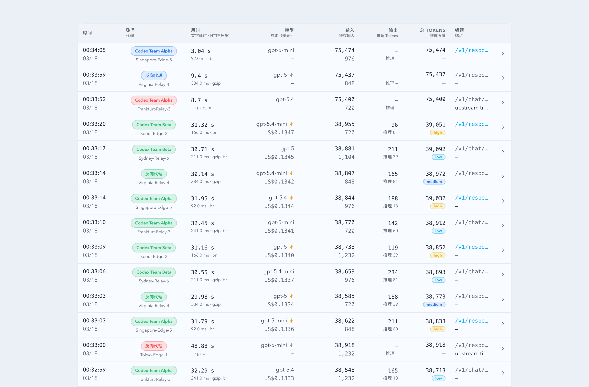

# 请求实况即时展示与“用时”订正（#mj5nt）

## 状态

- Status: 已完成
- Created: 2026-03-17
- Last: 2026-03-17

## 背景 / 问题陈述

- 当前 `Dashboard` 与 `Live` 的请求列表只会在终态落库后收到 `records` SSE，用户无法在请求发起时立即看到一条“进行中”记录。
- 同一请求的后续阶段信息也只能等终态一起出现，导致“刚发起是否命中代理/账号、是否已经拿到首字节”这类排障信号滞后。
- 列表当前把总耗时标成“时延”，与页面真正展示的含义不一致；用户期望看到“用时”，且在请求进行中能按秒自动增长。

## 目标 / 非目标

### Goals

- 请求进入代理 capture 链路后立即通过现有 `records` SSE 推送一条 `running` 临时记录。
- 在请求生命周期中继续推送同一条记录的增量上下文，并在终态落库后用持久化记录原位替换临时记录。
- 保持 `Dashboard` 与 `Live` 的请求表格即时刷新，同时避免临时记录污染统计卡片、汇总统计和图表口径。
- 将 InvocationTable 中指向总耗时的文案统一订正为“用时”，并在前端对进行中记录按秒自动累加显示。

### Non-goals

- 不新增新的 SSE event type、SSE endpoint 或请求列表 HTTP API。
- 不让 `Records` 页面、summary/quota 统计卡片引入进行中请求口径。
- 不做数据库 schema migration，也不把临时 `running` 记录写入 SQLite。

## 范围（Scope）

### In scope

- `src/main.rs` 代理 capture 流程中的临时 `records` SSE 广播与终态广播衔接。
- `web/src/hooks/useInvocations.ts` 的实时合并键、top-N 裁剪与重连补齐逻辑。
- `web/src/components/InvocationTable.tsx` 的“用时”展示、进行中秒级自增与详情文案。
- `web/src/pages/Live.tsx` / `web/src/components/InvocationChart.tsx` 的图表与表格数据分流。
- 对应 Rust / Vitest / E2E 覆盖与文档索引更新。

### Out of scope

- `web/src/hooks/useInvocationRecords.ts` 与 Records 页面行为。
- `summary` / `quota` 在请求进行中的实时广播口径。
- 面向单个前端订阅者按 limit 定制 SSE 推送内容。

## 需求（Requirements）

### MUST

- 继续复用 `BroadcastPayload::Records { records: Vec<ApiInvocation> }`，不得新增新的 SSE 事件类型。
- 临时记录必须沿用 `ApiInvocation` 结构，并使用稳定的 `invokeId + occurredAt` 作为前端合并键。
- 请求刚进入 capture 后，`Dashboard` 最近实况和 `Live` 最新记录都必须在 1 秒内出现一条 `running` 记录。
- 同一请求的后续 SSE 更新必须原位覆盖已有列表项，而不是新增重复行。
- 终态记录仍以现有持久化路径落库并广播，且需要替换前端临时记录，不得闪成两条。
- 当前页面超出显示上限后，被更晚记录挤出的请求后续更新不得重新进入当前可见切片。
- 列表/详情里指向总耗时的文案必须从“时延/Latency”改为“用时/Elapsed”，进行中总用时按秒自增，`TTFB` 继续用毫秒。

### SHOULD

- 临时记录在拿到更多上下文后继续补齐代理节点、账号归因、HTTP 压缩与首字时间。
- 图表应排除 `running/pending` 临时点位，避免出现 0 tokens / 0 cost 伪点。
- 若页面刷新导致前端内存态丢失，行为可降级为只显示终态记录，不额外补做“恢复中的进行中请求”。

### COULD

- 在测试里显式覆盖“先临时、后终态、再被切片裁掉”的组合场景，降低共享列表后续回归风险。

## 功能与行为规格（Functional/Behavior Spec）

### Core flows

- 代理请求进入 capture 目标后，后端立即发送一条 `status=running` 的临时 `records` SSE 快照；该快照只携带当前已知字段，不写库。
- 当请求生命周期内获得新增上下文（例如已拿到首字节、响应头里的压缩算法、选中的账号/代理信息）时，后端继续发送同一 `invokeId + occurredAt` 的 `running` 快照补齐字段。
- 请求成功或失败后，后端按现有路径持久化终态记录，并继续发送终态 `records` 事件；前端使用稳定键把该终态记录覆盖到现有临时行上。
- `Dashboard` 的“最近 20 条实况”和 `Live` 的“最新记录”消费包含临时行的同一实时流；`Live` 图表只消费终态记录或在绘图前过滤进行中状态。
- InvocationTable 对 `running` 行显示“用时”而不是“时延”：若服务端尚未给出终态 `tTotalMs`，前端以 `now - occurredAt` 秒数实时显示；终态后冻结为服务端值。

### Edge cases / errors

- 若后端没有 SSE 订阅者，临时记录广播允许直接跳过，不影响请求主流程。
- 若临时快照缺少 `tUpstreamTtfbMs` / `responseContentEncoding` / 账号归因，则对应字段显示 `—`，直到后续快照补齐或请求终态结束。
- 若某条进行中记录已因更晚记录进入列表而被挤出当前 top-N，可继续保留在内部 merge map 中，但不得重新进入当前可见切片。
- 若请求终态广播先于某次较晚的临时快照到达前端，前端应优先保留更新后的终态记录，不允许被旧的 `running` 快照回写。

## 接口契约（Interfaces & Contracts）

### 接口清单（Inventory）

| 接口（Name） | 类型（Kind） | 范围（Scope） | 变更（Change） | 契约文档（Contract Doc） | 负责人（Owner） | 使用方（Consumers） | 备注（Notes） |
| --- | --- | --- | --- | --- | --- | --- | --- |
| `BroadcastPayload::Records` / `ApiInvocation` | events + internal types | internal | Modify | None | backend + web | `useInvocationStream`, `InvocationTable`, `Live` chart | 不新增事件类型，仅允许发送临时 `running` 快照 |
| `/api/invocations` | HTTP API | internal | None | None | backend | Dashboard / Live / Records | 终态接口形状不变 |

### 契约文档（按 Kind 拆分）

- None

## 验收标准（Acceptance Criteria）

- Given 一个新的代理请求命中 capture 目标，When 请求刚开始处理，Then `Dashboard` 和 `Live` 的请求表都能在 1 秒内看到一条 `running` 记录。
- Given 同一条进行中请求后续拿到新数据，When SSE 到达前端，Then 该行原位更新、不会新增重复行，且“用时”继续按秒递增。
- Given 同一条请求最终完成，When 终态记录落库并广播，Then 前端以相同 `invokeId + occurredAt` 键替换临时记录，并显示终态 `tTotalMs`、最终状态、tokens、cost 与错误信息。
- Given 某条进行中请求已被更晚记录挤出当前页面可见上限，When 它后续再收到更新，Then 它不会重新进入当前页面的可见 top-N 切片。
- Given `Live` 图表和“最新记录”同时渲染，When 临时 `running` 快照进入前端，Then 图表不会出现新的 0 值伪点，而“最新记录”会立即显示该请求。

## 实现前置条件（Definition of Ready / Preconditions）

- 目标、范围、验收标准、非目标已冻结到本规格。
- SSE 继续复用 `records` 事件、SQLite 不落临时记录的口径已确认。
- 可见条数裁剪规则明确由前端 `useInvocationStream` 承担，不引入按订阅者定制的后端 SSE。

## 非功能性验收 / 质量门槛（Quality Gates）

### Testing

- Unit tests: Rust 覆盖临时 SSE 快照与终态替换；Vitest 覆盖 `useInvocationStream`/`InvocationTable` 合并与“用时”展示。
- Integration tests: 代理请求生命周期中 `records` SSE 的 running -> enriched running -> terminal 顺序。
- E2E tests (if applicable): Dashboard / Live 共享 InvocationTable 的即时展示回归。

### UI / Storybook (if applicable)

- Stories to add/update: `web/src/components/InvocationTable.stories.tsx`（如需要补 running 展示态）
- Visual regression baseline changes (if any): InvocationTable “用时”列与 running 态展示

### Quality checks

- `cargo check`
- `cargo test`
- `cd web && bun run test`
- `cd web && bun run build`

## 文档更新（Docs to Update）

- `docs/specs/README.md`: 登记本规格并同步最终状态

## 计划资产（Plan assets）

- Directory: `docs/specs/mj5nt-live-running-elapsed-sse/assets/`
- In-plan references: ``
- PR visual evidence source: maintain `## Visual Evidence (PR)` in this spec when PR screenshots are needed.

## Visual Evidence (PR)

- E2E evidence is covered by `web/tests/e2e/invocation-table-layout.spec.ts` against both `/#/dashboard` and `/#/live`.
- Storybook canvas evidence for the near-20-row live simulation is captured from `Monitoring / InvocationTable / Recent 20 Streaming Simulation`.
- 

## 资产晋升（Asset promotion）

None

## 实现里程碑（Milestones / Delivery checklist）

- [x] M1: 后端代理 capture 路径支持临时 `running` `records` SSE 快照，并在终态广播时与现有落库逻辑对齐。
- [x] M2: 前端 `useInvocationStream` / `InvocationTable` 支持稳定键合并、top-N 裁剪与进行中“用时”秒级自增。
- [x] M3: `Live` 页图表与最新记录分流，避免进行中快照污染图表点位。
- [x] M4: 补齐 Rust / Vitest / E2E 回归，完成验证、提交与 PR 创建。

## 方案概述（Approach, high-level）

- 后端把请求生命周期拆成“临时快照广播”和“终态持久化广播”两条并行语义：临时快照只服务前端即时展示，终态记录继续作为统计与持久化真相源。
- 前端列表从“数组按 `id` 视图”切到“稳定键合并 + 可见切片”模式，保证 running/terminal 两种形态共享同一 UI 行。
- 图表继续维持终态口径，避免把“即时展示”的职责扩散到统计和时间序列上。

## 风险 / 开放问题 / 假设（Risks, Open Questions, Assumptions）

- 风险：临时快照和终态快照乱序到达时，前端若没有终态优先级保护，可能出现终态被旧 running 覆盖。
- 需要决策的问题：None。
- 假设（需主人确认）：除 `Dashboard` / `Live` 的 `useInvocationStream` 外，没有其它前端消费方强依赖 `ApiInvocation.id > 0` 的 SSE 临时记录语义。

## 变更记录（Change log）

- 2026-03-17: 创建规格并冻结“即时实况 + 用时订正 + 图表排除 running 点位”的实现口径。
- 2026-03-17: 完成 running 临时 SSE、稳定键合并、用时秒级自增、图表过滤与验证闭环，PR #170 已创建。

## 参考（References）

- `docs/specs/5932d-sse-proxy-live-sync/SPEC.md`
- `docs/specs/7n2ex-invocation-account-latency-drawer/SPEC.md`
