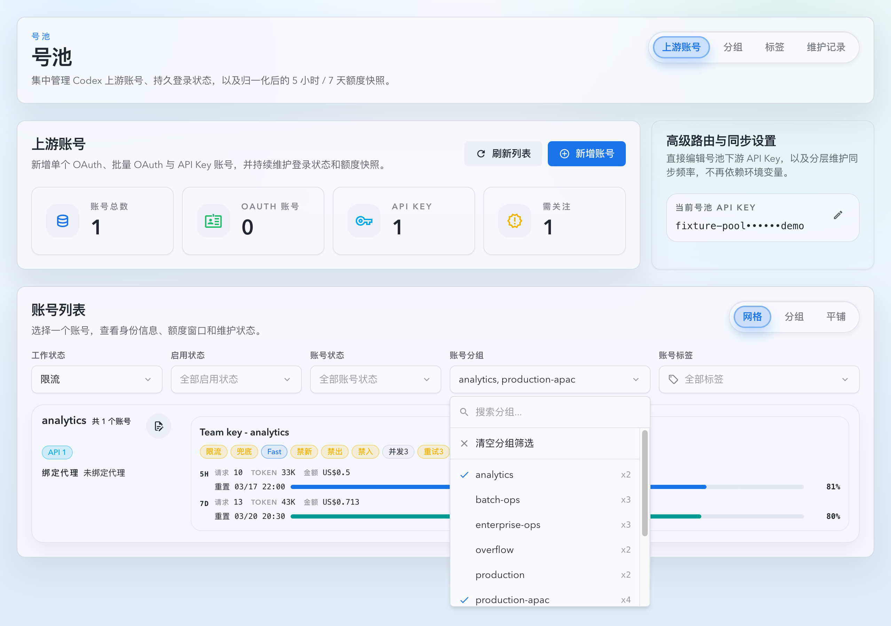

# 上游账号列表分组筛选（#mmdms）

> 当前有效规范以本文为准；实现覆盖与当前状态见 `./IMPLEMENTATION.md`，关键演进原因见 `./HISTORY.md`。

## 背景 / 问题陈述

- 号池上游账号列表需要同时查看多个账号分组，但旧筛选只能单选或自由文本搜索，容易把“候选项”和“筛选条件”混在一起。
- 账号分组下拉曾包含无账号的持久分组备注项，也会被当前列表结果影响，导致可选项不稳定。
- 空 `group_name` 会在 UI 中以伪“未分组”形式出现，长期上会让账号路由、分组设置和列表筛选的语义不一致。

## 目标 / 非目标

### Goals

- 账号列表的分组筛选支持精确多选，多个分组按 OR 匹配。
- 分组筛选候选只包含当前已选项和全量账号池中实际有账号的分组；候选计算不受其它筛选条件影响。
- 空白账号分组统一规范为真实分组名 `未分组`，账号列表筛选不再提供伪未分组选项。
- 前后端保留单个 `groupExact` 与旧本地筛选状态的兼容迁移。

### Non-goals

- 不改变分组设置页中无账号分组备注的管理能力。
- 不改变账号路由、标签规则、forward proxy 绑定或 sticky route 选择规则。
- 不删除后端 `groupSearch` / `groupUngrouped` 兼容入口。

## 范围（Scope）

### In scope

- `/account-pool/upstream-accounts` 列表筛选区的账号分组控件。
- `GET /api/pool/upstream-accounts` 的 `groupExact` 查询参数。
- `pool_upstream_accounts.group_name` 的空白值 schema 归一化与账号写入路径默认归组。
- Storybook 上游账号列表页面场景与视觉证据。

### Out of scope

- 分组总览页排序、备注与路由设置。
- 维护记录页的分组文本筛选。
- 历史请求记录或调用详情中的分组快照回填。

## 需求（Requirements）

### MUST

- 账号列表分组筛选必须是可搜索多选；搜索仅过滤下拉候选，不生成自由文本筛选条件。
- 多个 `groupExact` 必须按 OR 匹配，账号 `groupName` 命中任一已选分组即进入结果。
- `groupExact=prod` 单值请求必须继续可用；`groupExact=prod&groupExact=staging` 必须返回两个分组的并集。
- 分组候选必须基于 `groups[].accountCount > 0` 计算，并额外保留当前已选分组。
- schema 维护必须把 `NULL`、空字符串、空白字符串 `group_name` 更新为 `未分组`。
- 新建、导入、OAuth 回调、外部 API upsert、账号更新和批量设置分组路径不得继续产生空分组。

### SHOULD

- 旧 localStorage `groupFilter` 应迁移为新 `groupFilters` 数组；旧 `ungrouped` 应迁移为 `["未分组"]`。
- 空的仅备注分组可以保留在分组管理页，但不能作为账号列表分组筛选候选。
- 旧后端 `groupSearch` 与 `groupUngrouped` 仅作为兼容入口存在，新 UI 不应主动生成。

### COULD

- 未来可为筛选触发器增加更紧凑的数量摘要，但下拉候选已在右侧展示 `xN` 账号数量。

## 功能与行为规格（Functional/Behavior Spec）

### Core flows

- 用户打开账号列表时，分组下拉展示所有有账号的分组；工作状态、启用状态、账号状态和标签筛选不会改变该候选集。
- 用户选择多个分组后，列表请求发送重复 `groupExact` 参数；返回结果为这些分组账号的并集。
- 当前已选分组即使不在当前候选目录中，也保留在下拉内，用户可以取消它。
- 旧存储中 `groupFilter.mode=search|exact` 的非空 `query` 首次读取后作为一个精确选中项参与查询。
- 旧存储中 `groupFilter.mode=ungrouped` 首次读取后作为真实分组 `未分组` 参与查询。

### Edge cases / errors

- 空 `groupExact`、空白 `groupExact` 和重复分组名在后端归一化后忽略或去重。
- 如果数据库里仍存在空白 `group_name`，下一次 schema 维护必须把它们归到 `未分组`。
- 若请求同时提供 `groupUngrouped=true` 和 `groupExact`，兼容语义仍以 `groupUngrouped` 优先，不影响新 UI。

## 接口契约（Interfaces & Contracts）

### 接口清单（Inventory）

| 接口（Name）                                    | 类型（Kind）       | 范围（Scope） | 变更（Change） | 契约文档（Contract Doc） | 负责人（Owner） | 使用方（Consumers）         | 备注（Notes）               |
| ----------------------------------------------- | ------------------ | ------------- | -------------- | ------------------------ | --------------- | --------------------------- | --------------------------- |
| `GET /api/pool/upstream-accounts` `groupExact`  | HTTP query         | internal      | Modify         | None                     | backend         | web account pool list       | 支持重复参数，OR 匹配       |
| `PersistedUpstreamAccountsFilters.groupFilters` | localStorage shape | internal      | Modify         | None                     | web             | account pool list           | 旧 `groupFilter` 读取时迁移 |
| `pool_upstream_accounts.group_name`             | SQLite field       | internal      | Modify         | None                     | backend         | account pool runtime and UI | 空白值归一化为 `未分组`     |

### 契约文档（按 Kind 拆分）

- None

## 验收标准（Acceptance Criteria）

- Given `groupExact=prod&groupExact=staging`，When 请求上游账号列表，Then 返回 `prod` 或 `staging` 任一分组的账号。
- Given 账号列表还有工作状态、账号状态或标签筛选，When 打开分组下拉，Then 分组候选仍按全量账号池有账号分组计算。
- Given 本地存储仍是旧 `groupFilter`，When 首次打开账号列表，Then 它被读取为新 `groupFilters`，并以精确分组多选语义请求。
- Given 数据库存在空白 `group_name`，When schema 维护运行，Then 该账号 `group_name` 变为 `未分组`。

## 验收清单（Acceptance checklist）

- [x] 多分组 OR 查询已覆盖。
- [x] 空白分组归一化已覆盖。
- [x] 前端候选口径与旧存储迁移已覆盖。
- [x] Storybook 交互场景与视觉证据已覆盖。

## 非功能性验收 / 质量门槛（Quality Gates）

### Testing

- Unit tests: API query serialization、hook query key、filter persistence migration。
- Integration tests: upstream account list repeated `groupExact` and blank group schema normalization。
- E2E tests (if applicable): Not required.

### UI / Storybook (if applicable)

- Stories to add/update: `Account Pool/Pages/Upstream Accounts/List`。
- Docs pages / state galleries to add/update: Existing autodocs story surface.
- `play` / interaction coverage to add/update: multi group filter keeps full-catalog group candidates under other filters.
- Visual regression baseline changes (if any): One Storybook screenshot for group multiselect open state.

### Quality checks

- Lint / typecheck / formatting: `cargo fmt`, `cargo check`, targeted cargo tests, targeted Vitest, Storybook build or screenshot proof.

## Visual Evidence

Storybook canvas `Account Pool/Pages/Upstream Accounts/List / Group Filter Multi Select Catalog` shows the roster narrowed by `工作状态=限流` while the account group dropdown still offers account-backed groups from the full pool. Each candidate displays a right-aligned `xN` account count, including `production-apac x4` even though it has no currently visible rate-limited account.

## Related PRs
