# 模型管理与价格同步

> 本 Spec 定义代理模型候选、预置成员与本地价格的长期行为。当前实现位置和 rollout 信息见 `IMPLEMENTATION.md`。

## Context and Scope

- Context: 模型预置名单与成本估算价格分散维护，更新报价需要人工逐项查找。
- In scope: 系统模型页、持久模型目录、预置成员开关、本地价格编辑与删除、按需从 models.dev 获取并人工选择价格，以及服务实例共享的同步选择与模型发现记忆。
- Out of scope: 自动价格验证、计费真值、定时同步、供应商实时可用性探测、供应商专属运行时路由，以及估算器不支持的价格维度。

## Terms and Interfaces

- `model ID`: 代理请求、价格目录和模型候选共用的稳定键；一个 ID 只对应一个有效本地价格。
- `managed model`: 本地持久模型目录中可由用户设置代理预置状态的模型。
- `price candidate`: models.dev 按供应商提供、尚未应用到本地价格目录的报价。
- `system sync memory`: 服务实例共同维护的模型勾选、供应商筛选及曾出现的模型记录；它不是浏览器本地偏好，也不是已应用价格。
- `quote selection memory`: 按模型 ID 与供应商 ID 共同区分的同步勾选意愿；它与本次价格是否有变化独立。
- `applicable sync changes`: 当前供应商与状态范围中，已勾选且有明确、可导入报价，会新增或改变本地价格的模型集合。
- `first-discovered catalog model`: 初始基线建立后，在完整价格同步候选目录中首次出现的模型 ID；与本地是否有价格、市场发布日期及供应商数量无关。
- `unviewed new model`: 首次发现但其模型行尚未实际进入审阅可视区域的模型。
- `deprecated quote`: models.dev 在供应商模型条目上明确标记为 `status=deprecated` 的报价；状态缺失或未知不代表实时可用或已下架。
- Interface: `/system/models` 页面；`/api/settings`、`/api/settings/proxy`、`/api/settings/pricing` 与模型目录同步、应用和删除 API；代理公开的 `GET /v1/models`。

## Requirements

### REQ-MODEL-MGMT-001

- The system MUST show the union of persistent managed models and locally priced models, keyed by model ID, with all supported token-price fields and `—` when no local price exists.
- Inputs: current model directory and local pricing catalog.
- Outputs: one editable row per model ID; manual price edits are marked `custom`.

### REQ-MODEL-MGMT-002

- The system MUST expose a preset Switch for every row and make enabled model IDs appear in the proxy-generated `GET /v1/models` response.
- Inputs: a managed model ID and its enabled state.
- Outputs: persisted preset membership reflected by the proxy model list; newly synchronized models start disabled.

### REQ-MODEL-MGMT-003

- Deleting a model MUST atomically remove its managed directory entry, local price, and preset membership without rewriting historical non-null invocation costs.
- Inputs: an existing model ID.
- Outputs: the model is absent after restart unless a later source sync adds it again, in which case its preset state is disabled.

### REQ-MODEL-MGMT-004

- The system MUST fetch models.dev only after a user opens synchronization preview; fetch and parse failures MUST leave local state unchanged and allow retry. The retry action MUST be inside the shared Alert component that presents the corresponding error.
- Inputs: a user-triggered preview request.
- Outputs: retrieval state and provider/model price candidates, or a retryable error.

### REQ-MODEL-MGMT-005

- The synchronization preview MUST support multi-select provider groups and search across provider and model names. The provider picker MUST have its own search matching provider IDs and display names, independent of the model-list search; searching MUST NOT itself change provider or model selections. The preview MUST restore a remembered provider selection, including an explicitly empty selection; only when no provider selection has been saved does a preview start with every provider selected.
- Restoring provider selection MUST retain its exact saved provider IDs rather than expand it to newly encountered providers. A temporarily absent provider MUST NOT lose its saved choice. The provider picker's select-all and clear actions MUST state and apply their scope as the current provider-search results, preserving provider choices outside that result set.
- Inputs: current provider groups, remembered provider selection, independent provider/model search text, and candidate catalog.
- Outputs: searchable provider options and the visible candidate set scoped to restored or initial selected groups and the model search text.

### REQ-MODEL-MGMT-006

- The system MUST keep one local price per model ID; when selected providers offer multiple candidates for one ID, the user MUST choose exactly one provider candidate before applying it.
- The preview MUST remember and restore an explicitly chosen quote provider for each model ID. A restored choice MUST still be present and within the selected provider/status scope before it can apply; hiding or losing that provider MUST NOT silently replace it with another provider's quote, even if only one alternative remains. Provider-filter changes MUST NOT erase the remembered quote-provider choice.
- Inputs: candidate quotes grouped by model ID and a remembered explicit quote-provider choice.
- Outputs: a selected candidate whose displayed values are exactly the values written to the local price catalog.

### REQ-MODEL-MGMT-007

- Synchronization MUST import only input, output, cache-read, cache-write, and reasoning token prices; other priced dimensions MUST be identified as unsupported and skipped.
- Inputs: models.dev model cost fields.
- Outputs: only supported token prices become local estimates; unsupported dimensions remain visible in preview metadata.

### REQ-MODEL-MGMT-008

- The preview MUST leave every candidate without a remembered selection unchecked, including locally unpriced models, newly discovered models, newly encountered provider quotes, and changed prices of any source. When a remembered selection exists, the preview MUST restore both selected and explicitly deselected choices; the selection MUST NOT bypass provider conflict resolution or import eligibility. No price is written until the user applies the selected candidates.
- Selection memory MUST be keyed by exact model ID and provider ID together. Switching quote providers MUST restore that provider's own selection or the unchecked default, without copying another provider's choice. Price changes or equality with the current local price MUST NOT erase a saved selection; a resolved importable candidate within scope MUST allow the user to change its remembered selection even when its price currently matches locally.
- Inputs: provider-scoped candidates, remembered explicit selections, and the current local price source/value.
- Outputs: restored explicit choices or an unchecked default; only selected candidates are applied and imported prices use source `models.dev`.

### REQ-MODEL-MGMT-009

- Synchronization MUST change prices and model-directory membership only; it MUST NOT enable proxy presets.
- Inputs: selected price candidates.
- Outputs: new managed models have preset state off; existing preset state remains unchanged.

### REQ-MODEL-MGMT-010

- The preview MUST use an exact official pricing-page URL only when the source supplies one; otherwise it MUST label the provider's supplied documentation URL as `供应商文档` and MUST NOT infer a pricing URL.
- Inputs: provider and model source metadata.
- Outputs: an accurately labeled external link or no link.

### REQ-MODEL-MGMT-011

- Model sync selections, provider-filter selections, explicit quote-provider choices, and previously encountered model records MUST belong to the service instance and be durably persisted by the server. Different browsers and devices connected to that instance MUST read the same saved memory; a browser-local store or current-dialog state MUST NOT be the authority. Successful saves MUST survive page reloads, browser restarts, and service restarts. Saving sync memory MUST NOT itself apply candidate prices or change proxy presets.
- User changes to model sync selections, provider-filter selections, and explicit quote-provider choices MUST be saved immediately, independently of whether price synchronization is attempted or succeeds. Canceling or closing the dialog MUST NOT undo successful memory saves. A failed save MUST be visibly reported and allow retry; it MUST NOT be presented as durable success. The retry action MUST be inside the shared Alert component that presents the save failure.
- Saving one choice or a viewed acknowledgment MUST preserve unrelated sync-memory records. Independent concurrent-client changes to different choices MUST both survive; for the same choice, the last successfully accepted server change wins. A new review MUST read the latest saved memory. An instance without sync-memory records MUST use the documented initial defaults without inferring prior checkbox choices from existing local prices or preset membership; initializing memory and changing unrelated settings MUST preserve existing model, price, preset, and history state.
- Inputs: the service instance's saved sync memory and user selection changes.
- Outputs: shared, persistent sync memory independent of local applied prices.

### REQ-MODEL-MGMT-012

- The first successful complete price-candidate catalog retrieval MUST initialize the service's encountered-model baseline without marking every existing model as new. Later retrievals MUST identify first discoveries by exact model ID against that baseline and the durable encounter history; provider, price, display-name, and local-price-presence changes MUST NOT alone make an existing model ID new. Baseline and discovery detection MUST use the complete normalized candidate catalog before provider selection, search, or status filtering. Failed retrievals or parsing MUST NOT initialize or advance this history; absence from a later catalog MUST NOT erase an encountered-model record.
- An unviewed first-discovered model MUST have a small badge dot at the upper-right of its model name, with an accessible description identifying it as newly discovered. A model is viewed only when its row actually enters the dialog's scroll viewport; mounting an offscreen row or hiding it behind a filter MUST NOT mark it viewed. Persist the viewed acknowledgment in system sync memory. Keep the dot for the remainder of the current review; a subsequent review MUST omit it after a successful acknowledgment. Models that have not been viewed MUST retain their dots in subsequent reviews, including after service restart.
- Inputs: the complete normalized candidate catalog, durable encounter/view history, and actually visible model rows.
- Outputs: a one-time initial baseline, durable first-discovery and viewed records, and pending new-model dots independent of local pricing.

### REQ-MODEL-MGMT-013

- When a candidate quote has been resolved and the model has a local price entry, the preview MUST highlight each supported token-price field whose normalized value differs from the corresponding local value. Comparison MUST cover input, output, cache read, cache write, and reasoning prices, including a value changing to or from missing; unchanged fields MUST NOT receive a change highlight. The preview MUST expose which fields changed without relying on color alone, and price formatting MUST allow the user to understand the displayed difference.
- Models without a local price entry MUST be identified as locally unpriced, independently of the first-discovery badge; unresolved provider conflicts MUST NOT display an inferred candidate-price difference.
- Inputs: a resolved candidate quote and the model's current local price entry.
- Outputs: current and candidate prices with field-specific difference emphasis, or an explicit locally-unpriced state.

### REQ-MODEL-MGMT-014

- The review dialog MUST retain a usable minimum height with zero or few model results rather than shrinking around the result count. At a desktop viewport with at least 720 px available height, its minimum height MUST be 560 px; at shorter viewports the viewport bound takes precedence. The header, search and bulk controls, and action footer MUST remain reachable while model results scroll inside their own region. Opening the provider picker MUST NOT clip its search, selection actions, or scrollable options behind the dialog; short viewports MUST provide a reachable scroll or repositioned picker rather than inaccessible options.
- Inputs: viewport dimensions, zero/few/many model results, and the provider picker open or closed.
- Outputs: a stable review surface and accessible provider/model controls within the available viewport.

### REQ-MODEL-MGMT-015

- The model list MUST provide select-all, invert-selection, and select-none actions. Each action MUST apply to all model rows matching the current provider scope, model search, and status filter, including matching rows outside the scroll viewport; it MUST leave filtered-out selections unchanged. Bulk actions MUST NOT resolve provider conflicts by guessing a quote or select a non-importable candidate. Bulk changes MUST use the same immediate, durable selection-save behavior as an individual checkbox change.
- Inputs: the complete current filtered result set, resolved importable candidates, and remembered selections.
- Outputs: updated choices for eligible matching rows with unrelated and filtered-out choices preserved.

### REQ-MODEL-MGMT-016

- The normalized preview MUST preserve models.dev lifecycle status for each provider quote. Each new review MUST hide quotes explicitly marked `status=deprecated` by default and provide a show-deprecated switch. Missing, unknown, alpha, and beta statuses MUST remain included; the system MUST NOT infer deprecation from model names, release dates, local price presence, or a different provider's status for the same model ID. When deprecated quotes are shown, their source-reported status MUST be identifiable.
- Deprecation filtering MUST operate on provider quotes before model-ID grouping and MUST exclude hidden deprecated quotes from the current price-apply scope. Hiding a quote MUST NOT erase its saved selections, discovery history, local price, or preset state, and MUST NOT silently substitute a different provider quote. Complete-catalog discovery tracking remains independent of this display/apply filter.
- Inputs: provider-scoped model statuses, the show-deprecated switch, and saved selections.
- Outputs: a default review/apply scope excluding explicitly deprecated quotes, with an explicit way to include and inspect them.

### REQ-MODEL-MGMT-017

- The preview MUST distinguish remembered selected choices from applicable price changes. Price application MUST include only selected, resolved, importable quotes within the current provider and deprecation scope that add or change local prices; unchanged prices MUST remain remembered without causing a redundant write. Model-list search MUST remain a display and bulk-action filter: searching does not remove otherwise applicable selected changes from price application. Provider-picker search filters its options only and does not itself change the provider scope.
- The preview MUST make the actual apply count and any applicable selections hidden by model search visible in its selection summary. The apply button MUST reflect that count and be disabled when it is zero. Applying prices MUST NOT clear remembered selections or convert an unresolved/hidden quote-provider choice into another provider's quote.
- Inputs: remembered selections, resolved candidates, local prices, provider/status scope, and model/provider search text.
- Outputs: a truthful apply count and an explicit price-application set, independent of which rows happen to be on screen.

### REQ-MODEL-MGMT-018

- When applying selected price changes fails, the review MUST keep the current applicable selection available for retry and show a localized error without exposing raw transport details. The retry action MUST remain inside the shared Alert component that presents the error.
- Inputs: a failed price-application request and the current selected applicable changes.
- Outputs: a localized retryable error and an in-Alert action that retries the current applicable selection.

## Verification

### VER-MODEL-MGMT-001

- Method: stateful SQLite tests for migration, merged model listing, deletion, restart, and cost preservation.
- covers: `REQ-MODEL-MGMT-001`, `REQ-MODEL-MGMT-002`, `REQ-MODEL-MGMT-003`, `REQ-MODEL-MGMT-009`
- Pass condition: existing candidates and enabled state survive migration/restart; deletion remains deleted; rediscovery starts disabled; historical non-null costs are unchanged.

### VER-MODEL-MGMT-002

- Method: models.dev parser and synchronization API tests with catalog fixtures and failure cases.
- covers: `REQ-MODEL-MGMT-004`, `REQ-MODEL-MGMT-006`, `REQ-MODEL-MGMT-007`, `REQ-MODEL-MGMT-008`, `REQ-MODEL-MGMT-010`
- Pass condition: provider conflicts require an explicit choice; unsupported dimensions are excluded; preview failures write nothing and expose retry inside the corresponding shared Alert; apply writes exactly selected values.

### VER-MODEL-MGMT-003

- Method: web unit tests, TypeScript typecheck, production build, and scenario-bound browser observation.
- covers: `REQ-MODEL-MGMT-001`, `REQ-MODEL-MGMT-002`, `REQ-MODEL-MGMT-004`, `REQ-MODEL-MGMT-005`, `REQ-MODEL-MGMT-006`, `REQ-MODEL-MGMT-008`, `REQ-MODEL-MGMT-010`, `REQ-MODEL-MGMT-018`
- Pass condition: the page and sync dialog support search, provider groups, state feedback, price editing, deletion, and selection at desktop/mobile sizes in light/dark themes without overlap; a failed price application shows a localized retry action inside its shared Alert, hides raw transport details, and keeps the current applicable selection available for retry.

### VER-MODEL-MGMT-004

- Method: web selection-state fixtures for candidates with and without remembered choices.
- covers: `REQ-MODEL-MGMT-006`, `REQ-MODEL-MGMT-008`
- Pass condition: candidates with no remembered choice remain unchecked regardless of local price presence, price changes, or price source; previously selected and explicitly deselected choices restore per model/provider pair; selecting provider B does not copy provider A's checkbox; switching back restores A; an unresolved or out-of-scope remembered quote-provider choice cannot silently use another provider; opening or closing preview writes no prices.

### VER-MODEL-MGMT-005

- Method: server persistence and independent-client fixtures with service restart and an existing local price catalog.
- covers: `REQ-MODEL-MGMT-005`, `REQ-MODEL-MGMT-006`, `REQ-MODEL-MGMT-008`, `REQ-MODEL-MGMT-011`
- Pass condition: two independent clients read the same saved provider/model/quote-provider choices and encountered-model records; explicit deselections and an empty provider selection survive dialog cancellation and restart without applying prices; saving memory changes neither local prices nor preset state; initialization does not infer model sync selections from existing local prices or change existing model/history state; a memory-save failure remains visible and retryable inside its shared Alert; concurrent changes to different choices both persist, and an acknowledgment preserves unrelated choices.

### VER-MODEL-MGMT-006

- Method: provider-picker and model-search interaction fixtures.
- covers: `REQ-MODEL-MGMT-005`
- Pass condition: provider search matches IDs and display names without replacing model search text; changing either search preserves existing selections; provider select-all/clear operate only on matching provider options; a remembered empty provider selection restores as empty rather than selecting every provider; newly encountered providers do not expand a saved selection, and an absent provider retains its saved choice when it reappears.

### VER-MODEL-MGMT-007

- Method: catalog-baseline and viewed-history fixtures, plus model-row viewport interaction scenarios.
- covers: `REQ-MODEL-MGMT-011`, `REQ-MODEL-MGMT-012`
- Pass condition: the initial complete catalog has no new dots; a subsequent new model ID has one; the same ID gaining another provider or changing price has none; filtered and below-viewport rows remain unviewed; viewing a row keeps its dot in the current review but clears it in a later review after acknowledgment; pending dots and encounter history survive restart, absence/reappearance, and failed retrievals.

### VER-MODEL-MGMT-008

- Method: five-field price-comparison fixtures with numeric changes, equal values, missing values, custom prices, locally unpriced models, and unresolved provider conflicts.
- covers: `REQ-MODEL-MGMT-013`
- Pass condition: only changed supported fields receive understandable difference emphasis; numeric-versus-missing values differ; equal fields do not; locally unpriced status and discovery dots remain independent; no candidate quote is guessed for an unresolved conflict.

### VER-MODEL-MGMT-009

- Method: controlled desktop and short/mobile viewport scenarios with zero/few/many results and the provider picker open, in light/dark themes.
- covers: `REQ-MODEL-MGMT-005`, `REQ-MODEL-MGMT-014`
- Pass condition: a desktop viewport with at least 720 px height retains a dialog of at least 560 px even for zero matches; short viewports fit within the screen; provider search, bulk actions, all scrollable provider options, model controls, and the apply/cancel footer remain reachable without clipping.

### VER-MODEL-MGMT-010

- Method: filtered bulk-selection fixtures with offscreen matches, hidden preselected rows, unresolved provider conflicts, and unsupported price candidates.
- covers: `REQ-MODEL-MGMT-011`, `REQ-MODEL-MGMT-015`
- Pass condition: all three bulk actions operate across every matching eligible row regardless of scroll position, preserve filtered-out choices, skip unresolved/non-importable candidates, and persist the resulting selections even when the dialog is canceled.

### VER-MODEL-MGMT-011

- Method: lifecycle parser fixtures and preview/apply-scope scenarios for deprecated, missing, unknown, alpha, and beta statuses, including a model ID shared by deprecated and non-deprecated providers.
- covers: `REQ-MODEL-MGMT-005`, `REQ-MODEL-MGMT-012`, `REQ-MODEL-MGMT-015`, `REQ-MODEL-MGMT-016`
- Pass condition: source status survives normalization; only explicitly deprecated quotes are hidden by default and excluded from apply; the switch reveals them with their status and preserves saved choices; one provider's deprecation does not hide another provider's quote for the same ID; unknown/missing statuses and old release dates alone do not hide a quote; hidden quotes still participate in complete-catalog discovery but are not marked viewed or changed by visible-list bulk actions.

### VER-MODEL-MGMT-012

- Method: selection/apply-scope fixtures with unchanged selected quotes, later price changes, search-hidden selected rows, excluded providers, deprecated quotes, and remembered quote-provider choices.
- covers: `REQ-MODEL-MGMT-005`, `REQ-MODEL-MGMT-006`, `REQ-MODEL-MGMT-008`, `REQ-MODEL-MGMT-011`, `REQ-MODEL-MGMT-015`, `REQ-MODEL-MGMT-016`, `REQ-MODEL-MGMT-017`
- Pass condition: an unchanged quote remains checked and editable as a preference but contributes no write; a later price change restores that preference; model search preserves applicable selections and reports hidden applicable rows; provider/status exclusions omit their quotes from apply without erasing memory; the button count equals the actual payload count and is disabled at zero; applying prices preserves quote-provider and checkbox memory.

## Related ADRs

- [ADR 0018: OpenAI GPT-6 pricing and usage semantics](../../adr/0018-openai-gpt-6-pricing-and-usage-semantics.md)
- [ADR 0023: Model management and manual price synchronization](../../adr/0023-model-management-and-manual-price-synchronization.md)
- [ADR 0026: Service-owned price sync memory](../../adr/0026-service-owned-price-sync-memory.md)

## Visual Evidence

- source_type: storybook_canvas
  target_program: mock-only
  capture_scope: element
  requested_viewport: 1660x960
  viewport_strategy: storybook-viewport
  margin_policy: trim_only
  evidence_surface: page
  sensitive_exclusion: N/A
  submission_gate: approved
  story_id_or_title: System/SystemWorkspace/Models
  state: light desktop
  evidence_note: verifies the merged catalog, local token prices, missing-price marker, preset switches, and row actions
  image:
  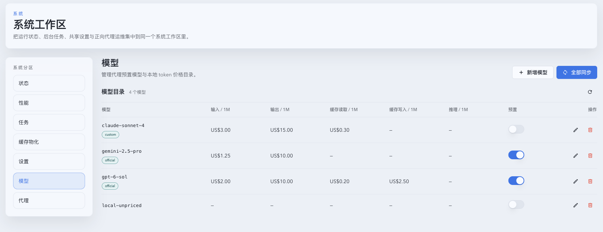

- source_type: storybook_canvas
  target_program: mock-only
  capture_scope: element
  requested_viewport: 1660x960
  viewport_strategy: storybook-viewport
  margin_policy: trim_only
  evidence_surface: page
  sensitive_exclusion: N/A
  submission_gate: approved
  story_id_or_title: System/SystemWorkspace/ModelsDark
  state: dark desktop
  evidence_note: verifies the model catalog and controls in the dark theme
  image:
  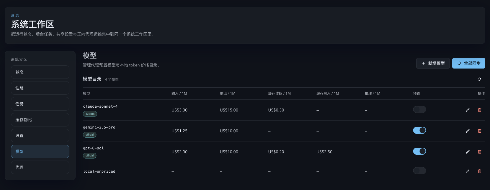

- source_type: storybook_canvas
  target_program: mock-only
  capture_scope: element
  requested_viewport: 393x852
  viewport_strategy: storybook-viewport
  margin_policy: trim_only
  evidence_surface: page
  sensitive_exclusion: N/A
  submission_gate: approved
  story_id_or_title: System/SystemWorkspace/ModelsMobile
  state: light mobile
  evidence_note: verifies the responsive model list and row actions at the mobile viewport
  image:
  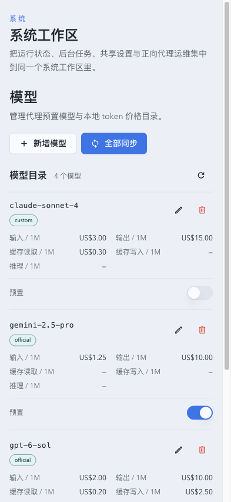

- source_type: storybook_canvas
  target_program: mock-only
  capture_scope: element
  requested_viewport: 393x852
  viewport_strategy: storybook-viewport
  margin_policy: trim_only
  evidence_surface: page
  sensitive_exclusion: N/A
  submission_gate: approved
  story_id_or_title: System/SystemWorkspace/ModelsMobileDark
  state: dark mobile
  evidence_note: verifies the responsive model list in the dark theme
  image:
  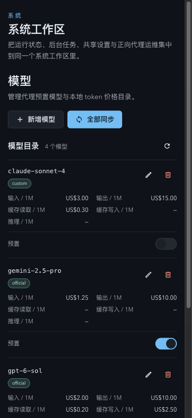

- source_type: storybook_canvas
  target_program: mock-only
  capture_scope: element
  requested_viewport: 1660x960
  viewport_strategy: storybook-viewport
  margin_policy: trim_only
  evidence_surface: page
  sensitive_exclusion: N/A
  submission_gate: approved
  story_id_or_title: System/SystemWorkspace/ModelsSyncReview
  state: desktop provider price review
  evidence_note: verifies the single-row batch toolbar, provider search and groups, current-versus-source prices, conflict selection, default checkboxes, unsupported dimensions, and apply controls in the light theme
  image:
  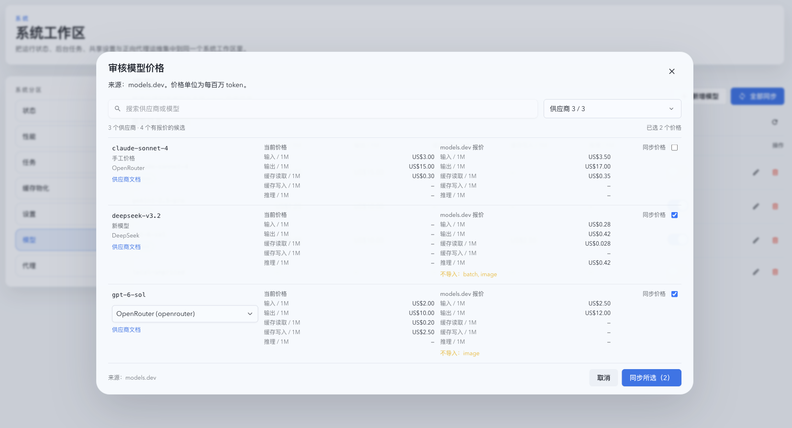

- source_type: storybook_canvas
  target_program: mock-only
  capture_scope: element
  requested_viewport: 1660x960
  viewport_strategy: storybook-viewport
  margin_policy: trim_only
  evidence_surface: page
  sensitive_exclusion: N/A
  submission_gate: approved
  story_id_or_title: System/SystemWorkspace/ModelsSyncReviewDark
  state: dark desktop provider price review
  evidence_note: verifies the single-row batch toolbar and price review hierarchy in the dark theme
  image:
  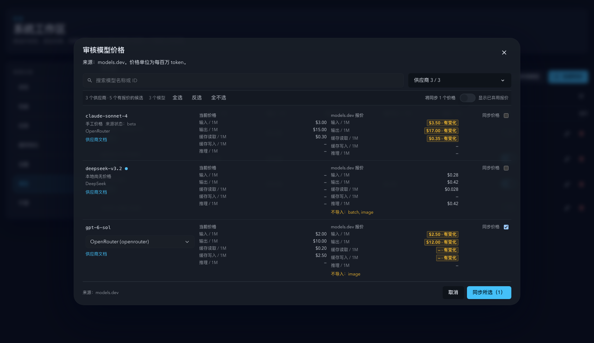

- source_type: storybook_canvas
  target_program: mock-only
  capture_scope: element
  requested_viewport: 393x852
  viewport_strategy: storybook-viewport
  margin_policy: trim_only
  evidence_surface: page
  sensitive_exclusion: N/A
  submission_gate: approved
  story_id_or_title: System/SystemWorkspace/ModelsSyncReviewMobile
  state: mobile provider price review
  evidence_note: verifies the compact two-row toolbar, responsive review dialog, independently scrollable candidates, provider selection, and fixed apply footer in the light theme
  image:
  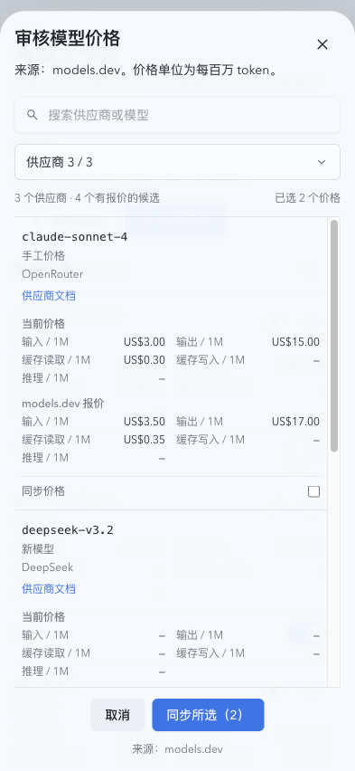

- source_type: storybook_canvas
  target_program: mock-only
  capture_scope: element
  requested_viewport: 393x852
  viewport_strategy: storybook-viewport
  margin_policy: trim_only
  evidence_surface: page
  sensitive_exclusion: N/A
  submission_gate: approved
  story_id_or_title: System/SystemWorkspace/ModelsSyncReviewMobileDark
  state: dark mobile provider price review
  evidence_note: verifies the compact two-row toolbar and responsive review dialog in the dark theme
  image:
  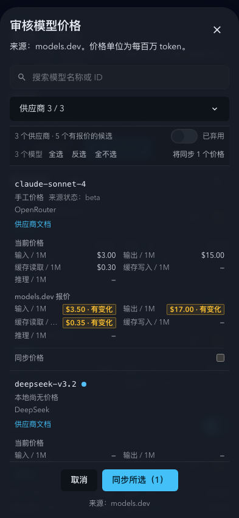

- source_type: storybook_canvas
  target_program: mock-only
  capture_scope: element
  requested_viewport: 1280x500
  viewport_strategy: storybook-viewport
  margin_policy: trim_only
  evidence_surface: page
  sensitive_exclusion: N/A
  submission_gate: approved
  story_id_or_title: System/SystemWorkspace/ModelsSyncReviewShort
  state: short desktop light provider price review
  evidence_note: verifies the one-row toolbar and reachable dialog footer under a constrained viewport height
  image:
  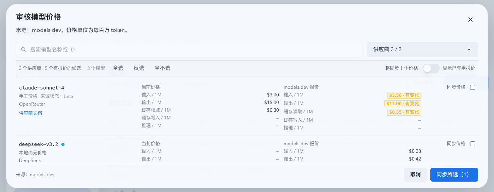

- source_type: storybook_canvas
  target_program: mock-only
  capture_scope: element
  requested_viewport: 1280x500
  viewport_strategy: storybook-viewport
  margin_policy: trim_only
  evidence_surface: page
  sensitive_exclusion: N/A
  submission_gate: approved
  story_id_or_title: System/SystemWorkspace/ModelsSyncReviewShortDark
  state: short desktop dark provider price review
  evidence_note: verifies the one-row toolbar and reachable dialog footer under a constrained viewport height in the dark theme
  image:
  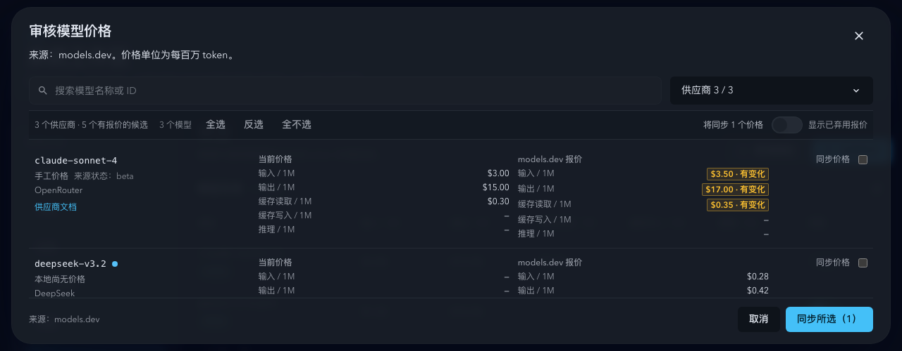

- source_type: storybook_canvas
  target_program: mock-only
  capture_scope: element
  requested_viewport: 1660x960
  viewport_strategy: storybook-viewport
  margin_policy: trim_only
  evidence_surface: page
  sensitive_exclusion: N/A
  submission_gate: approved
  story_id_or_title: System/SystemWorkspace/ModelsSyncZeroResults
  state: desktop filtered zero visible results
  evidence_note: verifies the stable empty candidate region, filter summary, toolbar, and apply footer when no model rows match
  image:
  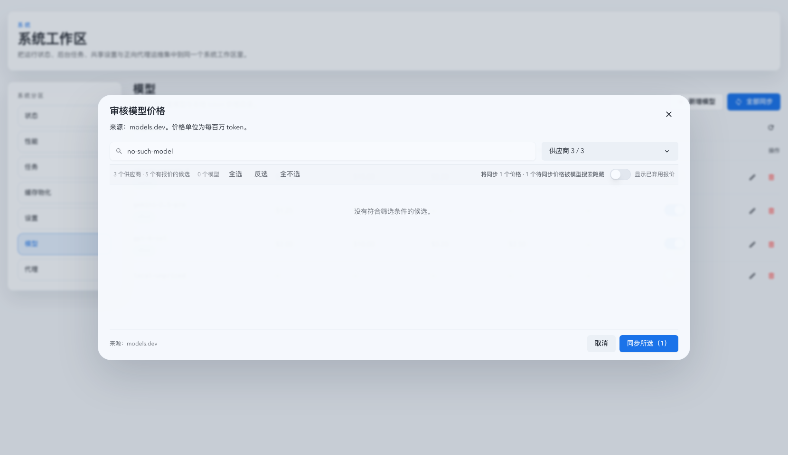

## References

- [models.dev API documentation](https://github.com/anomalyco/models.dev/blob/dev/README.md#api)
- [models.dev provider-model lifecycle schema](https://github.com/anomalyco/models.dev/blob/dev/packages/core/src/schema.ts)
- `./IMPLEMENTATION.md`
- `./HISTORY.md`
