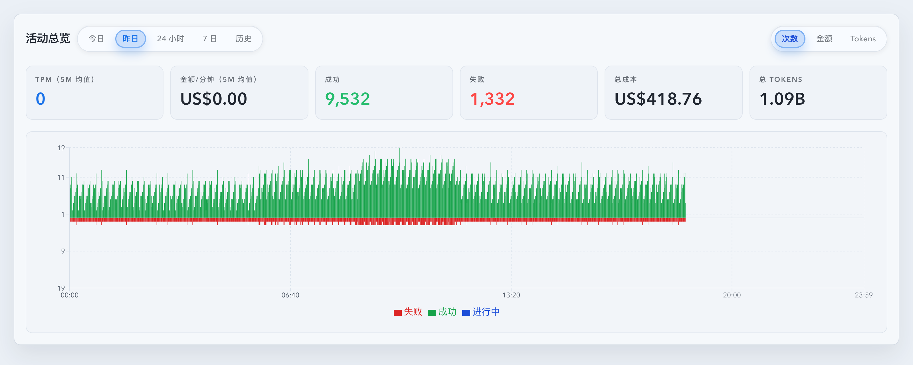
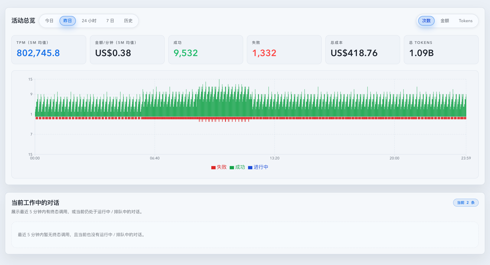

# Dashboard 活动总览增加“昨日”页签（#mpgea）

## 状态

- Status: 已实现，待截图提交授权 / PR 收敛
- Created: 2026-04-11
- Last: 2026-04-11

## 背景 / 问题陈述

- `#r99mz` 已把“今日”并入 `活动总览`，当前总览切换为 `今日 / 24 小时 / 7 日 / 历史` 四段，但主人需要继续补齐“上一自然日”的固定回看入口。
- 现有 `24 小时` 是滚动窗口，无法稳定回答“昨天整天从 00:00 到 24:00 的情况”；当跨午夜查看时，滚动 24h 与自然日语义会混淆。
- today 面板已经具备 `KPI + 分钟图` 的完整结构，因此“昨日”更适合复用同一视觉形态，只更换数据窗口，而不是再引入新的布局分支。

## 目标 / 非目标

### Goals

- 在 `DashboardActivityOverview` 的范围切换中新增 `昨日`，顺序固定为 `今日 / 昨日 / 24 小时 / 7 日 / 历史`。
- `昨日` 复用 `今日` 的 `KPI + 分钟图` 组合，但 summary / timeseries 口径严格改为“请求时区下上一自然日”。
- 后端只扩展既有 `/api/stats/summary` 与 `/api/stats/timeseries` 输入值：允许 `window=yesterday` 与 `range=yesterday`。
- `昨日` 必须是固定闭合自然日，不得退化成滚动 `24h`，也不得继承 today-only live seed / 跨午夜 rollover 语义。
- 补齐 Storybook、Vitest、Rust 回归与 mock-only 视觉证据，并按 fast-track 收敛到 latest PR merge-ready。

### Non-goals

- 不新增 API endpoint、数据库 schema、SSE 字段或新的统计聚合表。
- 不改变 `24 小时 / 7 日 / 历史` 既有视觉结构、metric 记忆规则与交互语义。
- 不自动 merge 或执行 post-merge cleanup。

## 范围（Scope）

### In scope

- `src/stats/mod.rs`、`src/api/slices/invocations_and_summary.rs`、`src/api/slices/prompt_cache_and_timeseries.rs`：扩展 `yesterday` named range 与 summary range 查询。
- `web/src/components/DashboardActivityOverview.tsx`、`web/src/hooks/useStats.ts`、`web/src/hooks/useTimeseries.ts`：新增昨日页签、localStorage whitelist、固定自然日边界与 today-only 例外保护。
- `web/src/components/*.stories.tsx`、`web/src/components/*.test.tsx`、`web/src/pages/Dashboard.test.tsx`、`src/tests/slices/*.rs`：补齐 yesterday 场景与回归。
- 本 spec 与 `docs/specs/README.md`：登记本 follow-up，并承载最终 `## Visual Evidence`。

### Out of scope

- 新的 Dashboard 卡片、额外 KPI、更多时间范围页签或 URL 参数持久化。
- 对 `today` / `1d` / `7d` / `usage` 之外的其它页面做视觉重排。

## 需求（Requirements）

### MUST

- `yesterday` 语义固定为“请求时区上一自然日 `[00:00, 24:00)`”，不是滚动前 24 小时。
- `DashboardActivityOverview` 必须保持 per-range metric memory；`yesterday` 也要拥有独立 metric 状态。
- `dashboard.activityOverview.activeRange.v1` 继续沿用，仅扩展合法值到 `yesterday`；非法缓存值继续回退 `today`。
- `yesterday` summary / timeseries 必须同时过滤掉今日数据，不能只靠 `start >= yesterdayStart` 的 since 查询。
- `yesterday` timeseries 的本地 live patch 只能接受昨日窗口内的 record，不得把今天 record 补进昨天图表。
- Storybook 必须提供稳定 yesterday 视图与页面级 tab 切换场景，最终视觉证据来自 mock-only Storybook。

### SHOULD

- `yesterday` 相关 helper / named-range 逻辑保持与 `today`、`thisWeek`、`thisMonth` 共用一套时区边界实现。
- Rust 回归同时覆盖 helper 级边界与 API 级 summary/timeseries 过滤行为。

## 功能与行为规格（Functional / Behavior Spec）

### Core flows

- Dashboard 默认仍进入 `今日`；点击 `昨日` 后，头部 KPI 与下方分钟图一起切到上一自然日数据。
- `昨日 / 次数` 使用 success / failure / in-flight 同构分钟图；`昨日 / 金额`、`昨日 / Tokens` 使用同一累计面积图形态。
- 页面刷新后若 localStorage 缓存为 `yesterday`，总览应直接恢复到 `昨日` 页签。

### Edge cases / errors

- 如果当前时间刚过午夜，`昨日` 仍应完整显示上一整天，不允许因为 clamp 到 now 而把窗口缩短成空窗。
- `today` 专属的跨午夜重拉 / current-day live seed 逻辑不能意外作用到 `yesterday`。
- summary 或 timeseries 任一失败时，`昨日` 面板沿用 today 面板现有 loading / error 降级语义。

## 验收标准（Acceptance Criteria）

- Given 打开 Dashboard，When 查看活动总览切换，Then 显示 `今日 / 昨日 / 24 小时 / 7 日 / 历史` 五段，且 `昨日` 位于 `今日` 与 `24 小时` 之间。
- Given localStorage 中缓存 `dashboard.activityOverview.activeRange.v1=yesterday`，When 刷新页面，Then 总览恢复到 `昨日`；Given 缓存非法值，Then 回退到 `今日`。
- Given `window=yesterday` 与 `range=yesterday` 且 `timeZone=Asia/Shanghai`，When 后端返回 summary / timeseries，Then 结果只包含上海时区昨天 `[00:00, 24:00)` 内的数据，不包含今天记录。
- Given `昨日` 视图收到今天的 live record，When 执行本地 patch，Then 该 record 不会污染昨天的分钟图窗口。
- Given 运行定向验证，When 执行 `cargo test`、`cargo check`、`cd web && bun run test -- <targeted files>`、`cd web && bun run build` 与 `cd web && bun run build-storybook`，Then 命令通过。
- Given Storybook `YesterdayView` 与页面级切换场景，When 生成视觉证据，Then 本 spec 的 `## Visual Evidence` 记录最终 mock-only 截图与说明。

## 非功能性验收 / 质量门槛（Quality Gates）

### Testing

- Rust：named range / summary-window helper 回归 + 至少一个 yesterday summary/timeseries API 级过滤回归。
- Frontend：`DashboardActivityOverview` / `Dashboard` / `useStats` / `useTimeseries` / `DashboardTodayActivityChart` 定向 Vitest。
- Storybook：新增 / 更新 yesterday 场景并通过 `build-storybook`。

### Visual / UX

- `昨日` 页签在视觉上必须与 `今日` 同构，不得引入新的 panel 层级或重复 header。
- 视觉证据统一使用 Storybook canvas / mock 数据，不截真实生产数据页面。

## 文档更新（Docs to Update）

- `docs/specs/README.md`
- `docs/specs/mpgea-dashboard-yesterday-activity-overview/SPEC.md`

## 实现里程碑（Milestones / Delivery checklist）

- [x] M1: 新建 follow-up spec、登记 README，并冻结 yesterday 自然日语义。
- [x] M2: 后端新增 `yesterday` named range，并修复 summary 使用精确 `[start, end)` 过滤。
- [x] M3: 前端新增 `昨日` 页签、hook 边界保护与 localStorage / metric 记忆接入。
- [x] M4: 补齐 Storybook、Vitest 与 Rust 回归。
- [ ] M5: 生成 mock-only 视觉证据、写回 spec，并推进 fast-track 到 merge-ready。

## 参考（References）

- `docs/specs/r99mz-dashboard-today-activity-overview/SPEC.md`
- `docs/specs/2qsev-dashboard-tpm-cost-per-minute-kpi/SPEC.md`
- `docs/specs/7s4kw-dashboard-usage-activity-overview/SPEC.md`

## Visual Evidence

- Storybook覆盖=通过
- 视觉证据目标源=storybook_canvas（mock-only）
- 空白裁剪=已裁剪
- 聊天回图=待本轮回传
- 证据落盘=已落盘
- Validation:
  - `cargo check` ✅
  - `cargo test named_range_yesterday_end_respects_dst -- --nocapture` ✅
  - `cargo test parse_summary_window_accepts_yesterday_calendar_window -- --nocapture` ✅
  - `cargo test hourly_backed_summary_trims_crs_totals_to_effective_proxy_range -- --nocapture` ✅
  - `cargo test yesterday_summary_and_timeseries_only_include_previous_local_day -- --nocapture` ✅
  - `cd web && bun run test -- src/components/dashboardTodayRateSnapshot.test.ts src/components/DashboardActivityOverview.test.tsx src/pages/Dashboard.test.tsx src/hooks/useStats.test.ts src/hooks/useTimeseries.test.ts src/components/DashboardTodayActivityChart.test.tsx` ✅（Vitest 实际执行仓库 `src` 全量集，80 files / 763 tests green）
  - `cd web && bun run build` ✅
  - `cd web && bun run build-storybook` ✅
  - `cargo test` ❌：本轮修复后 `hourly_backed_summary_trims_crs_totals_to_effective_proxy_range` 已单独转绿；全量仍会命中既有 proxy 读 body 超时用例 `proxy_openai_v1_chunked_json_without_header_sticky_uses_live_first_attempt`，另外两个同批失败用例单独复跑已通过。

- source_type: storybook_canvas
  target_program: mock-only
  capture_scope: browser-viewport
  story_id_or_title: `dashboard-dashboardactivityoverview--yesterday-view`
  scenario: `活动总览 / 昨日` 固定自然日视图
  evidence_note: 证明页签顺序已扩展为 `今日 / 昨日 / 24 小时 / 7 日 / 历史`，且 `昨日` 复用 today 样式的 KPI + 分钟图。
  image:
  

- source_type: storybook_canvas
  target_program: mock-only
  capture_scope: browser-viewport
  story_id_or_title: `pages-dashboardpage--default`
  scenario: Dashboard 页面级切换到 `昨日`
  evidence_note: 证明页面级 Storybook play 已把 Dashboard 总览切到 `昨日`，并展示昨日 KPI / 分钟图与工作中对话区共存的真实布局。
  image:
  
