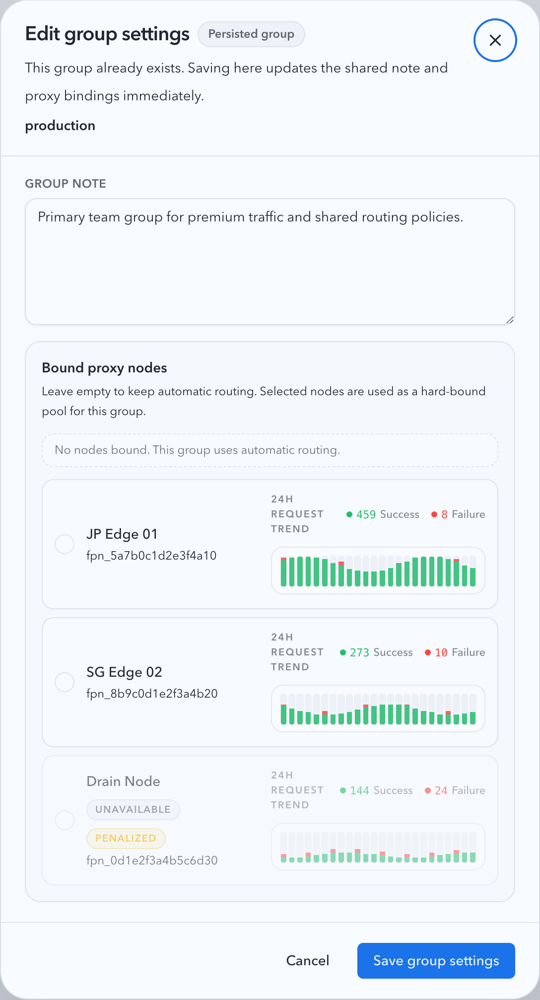
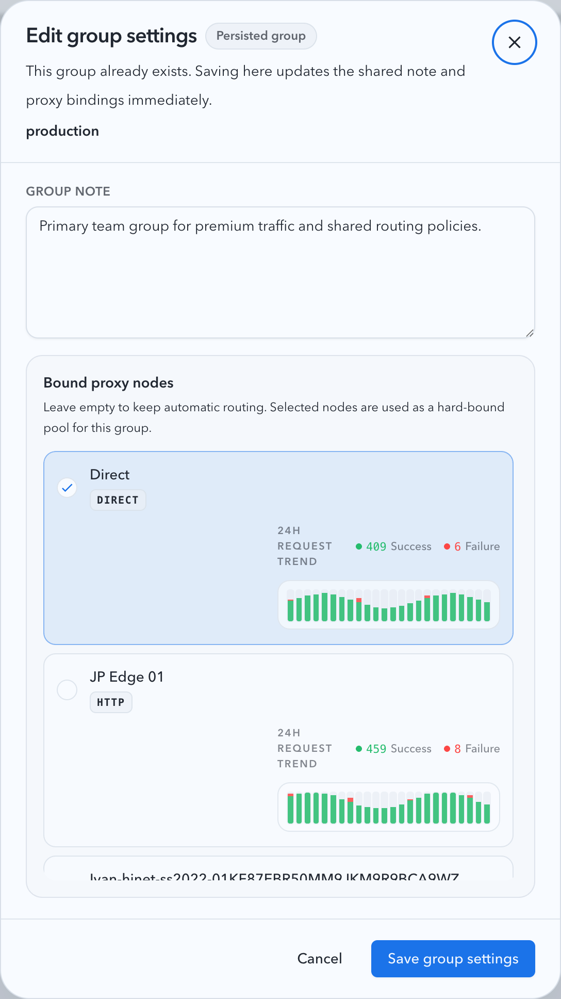
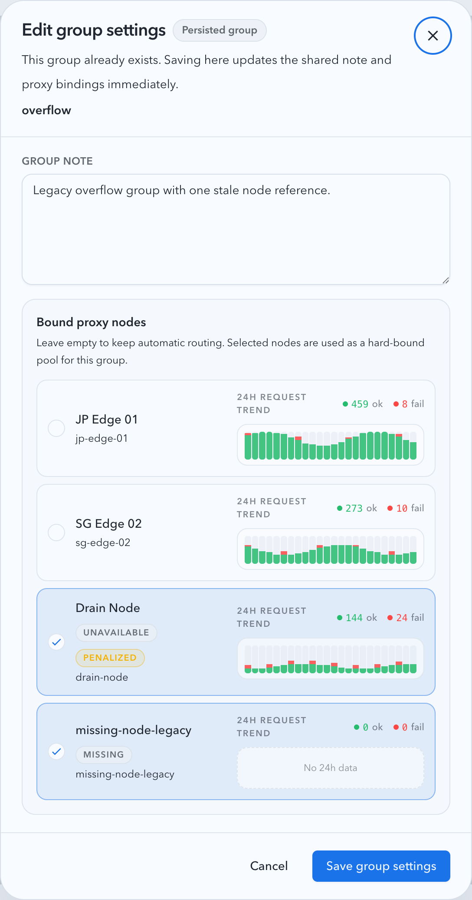
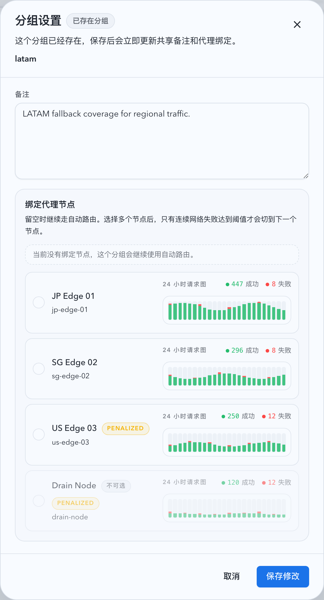
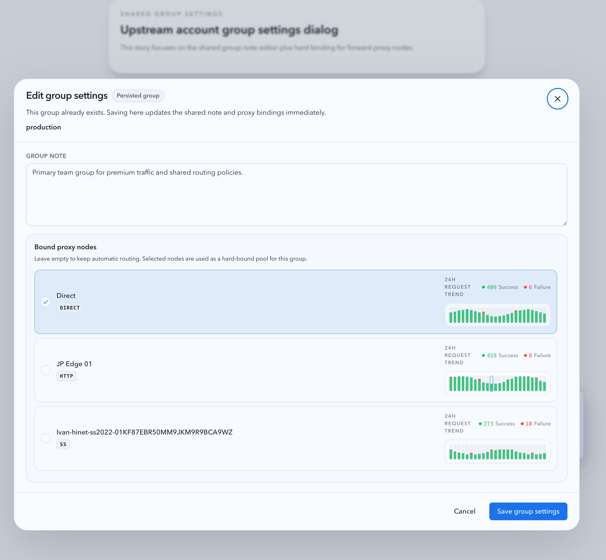

# 移除直连反向代理并为号池接入分组绑定正向代理（#mww8f）

## 状态

- Status: 已完成
- Created: 2026-03-26
- Last: 2026-03-27

## 背景

- 当前 `/v1/*` 同时承载“号池路由”与“直连反向代理”两条执行链，导致缺少号池路由 key 的请求仍会回退到全局 `OPENAI_UPSTREAM_BASE_URL`。
- forward proxy 当前仍保留 synthetic `direct` 节点，账号上下文请求并不保证一定经过真实代理节点。
- 分组元数据目前只有共享备注，缺少“按分组硬绑定代理节点”的运行时约束，无法让同组账号稳定共用一个代理节点并在连续网络失败后切换。

## 目标 / 非目标

### Goals

- 保留 `/v1/*` 入口，但移除非号池直连执行路径；未命中号池路由 key 时统一返回 `401` JSON 错误。
- 所有账号上下文上游请求都必须经过真实 forward proxy，默认使用全局自动路由。
- 为已存在账号分组增加 `boundProxyKeys` 元数据，并在分组设置中支持多选绑定代理节点。
- 分组绑定多个节点时，组内共享“当前节点 + 连续网络失败计数”；连续 `3` 次网络失败后随机切到另一个已绑定节点，不使用权重。
- 删除 legacy reverse-proxy 设置面与 `/api/settings` 中的 `proxy` 配置块，同时移除 `insertDirect` 前后端契约。

### Non-goals

- 不移除 `/v1/*` 入口本身，也不改动号池 sticky、tag、账号健康与 attempts 观测语义。
- 不把 `auth.openai.com` token exchange / refresh 或 `moemail` 请求纳入分组绑定代理范围。
- 不做 `proxy_model_settings`、legacy SQLite 行或历史调用记录的 destructive cleanup / 迁移。

## 范围

### In scope

- `src/main.rs`：移除 `/v1/*` 非号池直连分支，并把 pool live request / OAuth live bridge 接入分组感知的 forward-proxy 选路。
- `src/forward_proxy/mod.rs`：删除 synthetic `direct` 节点与 `insertDirect` 合约，新增“全局自动路由 + 分组硬绑定路由”双通道，以及组级连续网络失败切换状态。
- `src/upstream_accounts/mod.rs`：扩展分组 metadata 存储与接口，列表返回 `boundProxyKeys` 和可绑定节点清单，并把 usage/manual sync/import validation 接入代理感知发送层。
- `web/src/pages/Settings.tsx`、`web/src/hooks/useSettings.ts`、`web/src/lib/api.ts`：删除 reverse-proxy 设置契约，仅保留 forward proxy 与 pricing。
- `web/src/pages/account-pool/**`、`web/src/components/**`、`web/src/lib/upstreamAccountGroups.ts`：把“分组备注”升级为“分组设置（备注 + 代理节点多选）”。
- `docs/specs/README.md`：登记本工作项。

### Out of scope

- 新增独立的分组管理页面或分组重命名能力。
- 调整 `routeMode=forward_proxy` 历史展示或清理 legacy DB 字段。
- 为尚未落库的新分组草稿增加独立的代理绑定持久化协议。

## 功能规格

### `/v1/*` 新语义

- `request_matches_pool_route(...) == false` 时，`/v1/*` 统一返回 `401` JSON 错误，不再构建全局上游直连请求。
- `GET /v1/models` 仅允许号池执行链处理，不再使用 legacy hijack / merge-upstream 设置。
- `/v1/*` 相关 capture / invocation 记录不得再新增“非号池直连反代”调用。

### Forward proxy 运行时

- `ForwardProxySettings`、`ForwardProxySettingsResponse` 与前端 `ForwardProxySettings` 不再包含 `insertDirect`。
- 运行时 `nodes` 只返回真实代理节点；UI 和 API 中不再出现 synthetic `direct` 节点。
- 未分组或分组未绑定节点的账号，继续走现有全局自动路由。
- 已绑定分组的账号，只能在 `boundProxyKeys` 仍然存在且 `selectable=true` 的节点集合内路由；若可选集合为空，则本次账号尝试立即失败，不回退到全局池。
- 组内状态按 `group_name` 共享，维护：
  - 当前代理节点 key
  - 连续网络失败次数
- 任一成功到达上游的请求都会把该组当前节点的连续网络失败计数清零。
- 只有以下失败会累加连续失败计数：
  - send / connect error
  - handshake timeout
  - stream-before-success error
- HTTP `429/4xx/5xx` 不推进切换计数，也不改变组内当前节点；它们只沿用现有账号级 failover / cooldown 逻辑。
- 当组内当前节点连续 `3` 次网络失败且绑定集合存在其他可选节点时，运行时随机切到另一个绑定节点，并从 `0` 重新计数。

### 分组元数据与接口

- 继续复用 `pool_upstream_account_group_notes` 作为 group metadata 存储，新增 `bound_proxy_keys_json` 列，以 `group_name` 为主键。
- `GET /api/pool/upstream-accounts` 响应中的 `groups[]` 每项至少包含：
  - `groupName`
  - `note`
  - `boundProxyKeys`
- `GET /api/pool/upstream-accounts` 额外返回 `forwardProxyNodes[]`，每项至少包含：
  - `key`
  - `displayName`
  - `source`
  - `penalized`
  - `selectable`
- `PUT /api/pool/upstream-account-groups/:groupName` 支持更新 `note` 与 `boundProxyKeys`；若分组不存在实际账号，返回 `404`。
- 已保存但当前 inventory 已不存在的 `boundProxyKeys` 会继续保留在分组 metadata 中；前端需标记为失效，运行时只使用仍然 `selectable=true` 的 key。

### 账号上下文请求接入代理

- 以下请求必须按账号所属分组解析 forward-proxy scope，并使用真实代理节点发出：
  - pool live request（API Key）
  - pool live request（OAuth bridge）
  - usage snapshot
  - manual sync
  - imported OAuth validation
- `auth.openai.com` token exchange / refresh 与 `moemail` 保持现状，不接入分组绑定代理。

## 验收标准

- Given 请求未携带有效号池路由 key，When 访问 `/v1/*`，Then 服务返回 `401` JSON 错误，且不会再向全局上游发起直连反代请求。
- Given forward proxy inventory 为空，When 号池账号请求尝试连上游，Then 请求失败且不会回退到 `direct`。
- Given 账号未分组或所属分组未绑定节点，When 发起上游请求，Then 继续使用全局自动路由。
- Given 分组绑定了多个代理节点，When 当前节点连续发生 `3` 次 send/connect/handshake/stream-before-success 网络失败，Then 组内当前节点随机切换到另一个已绑定节点。
- Given 分组绑定节点返回 `429/4xx/5xx`，When 请求完成，Then 组内当前节点不切换，连续网络失败计数被清零。
- Given 分组保存了不存在或不可选的节点 key，When 运行时解析绑定集合，Then 仅使用仍然 `selectable=true` 的 key；若一个也没有，则本次账号尝试立即失败。
- Given 打开号池分组设置，When 用户多选绑定代理节点并保存，Then 刷新后 `boundProxyKeys` 稳定回显，且 Storybook 至少覆盖：
  - 无绑定自动路由
  - 硬绑定多节点
  - 绑定节点缺失/不可用

## 质量门槛

- `cargo fmt`
- `cargo check`
- `cargo test`
- `cd web && bun run test`
- `cd web && bun run build`
- `cd web && bun run storybook:build`

## Visual Evidence

- source_type: storybook_canvas
  target_program: mock-only
  capture_scope: element
  sensitive_exclusion: N/A
  submission_gate: approved
  story_id_or_title: Account Pool/Components/Upstream Account Group Settings Dialog/Automatic Routing
  state: existing-group-auto-routing
  evidence_note: 验证已存在分组在未绑定代理节点时保持自动路由文案，并在每个候选节点右侧展示 24 小时成功/失败趋势供参考。
  image:
  

- source_type: storybook_canvas
  target_program: mock-only
  capture_scope: element
  sensitive_exclusion: N/A
  submission_gate: approved
  story_id_or_title: Account Pool/Components/Upstream Account Group Settings Dialog/Hard Bound Multiple Nodes
  state: bound-multiple-nodes
  evidence_note: 验证分组设置支持多选绑定代理节点，并清晰展示当前硬绑定集合与右侧 24 小时请求趋势对比。
  PR: include
  image:
  

- source_type: storybook_canvas
  target_program: mock-only
  capture_scope: element
  sensitive_exclusion: N/A
  submission_gate: approved
  story_id_or_title: Account Pool/Components/Upstream Account Group Settings Dialog/Missing Or Unavailable Bindings
  state: missing-bound-nodes
  evidence_note: 验证已保存但当前 inventory 缺失的绑定节点会被标记为失效，并在无历史桶数据时展示明确的空态图表提示。
  image:
  

- source_type: storybook_canvas
  target_program: mock-only
  capture_scope: viewport
  sensitive_exclusion: N/A
  submission_gate: approved
  story_id_or_title: Account Pool/Pages/Upstream Account Create/Batch OAuth/Ready
  state: existing-group-settings-from-create-page
  evidence_note: 验证创建页里的真实分组设置入口已经和列表页使用同一套组件与数据契约，选中现有分组后会展示绑定代理节点与 24 小时趋势。
  PR: include
  image:
  

- source_type: storybook_canvas
  target_program: mock-only
  capture_scope: viewport
  sensitive_exclusion: N/A
  submission_gate: approved
  story_id_or_title: Account Pool/Components/Upstream Account Group Settings Dialog/Hard Bound Multiple Nodes
  state: request-trend-tooltip-details
  evidence_note: 验证分组绑定节点右侧的 24 小时请求图已复用参考界面的共享 inline chart tooltip，悬浮柱状图时会显示时间桶、Success、Failure 和 Total requests 详情。
  PR: include
  image:
  

## 变更记录

- 2026-03-26: 创建 spec，冻结 `/v1/*` 新语义、分组绑定 forward proxy 的运行时规则、接口契约与视觉证据目标。
- 2026-03-27: 视觉证据完成主人确认，spec 状态切换为已完成，并标记 PR 可复用截图。
