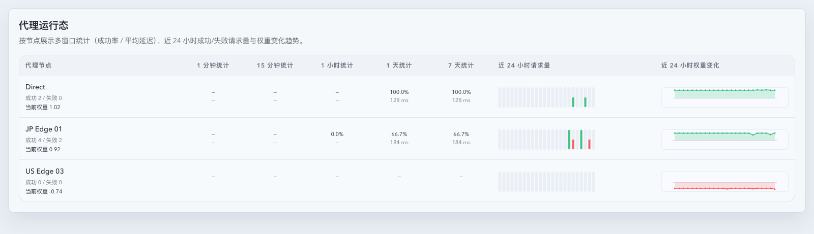
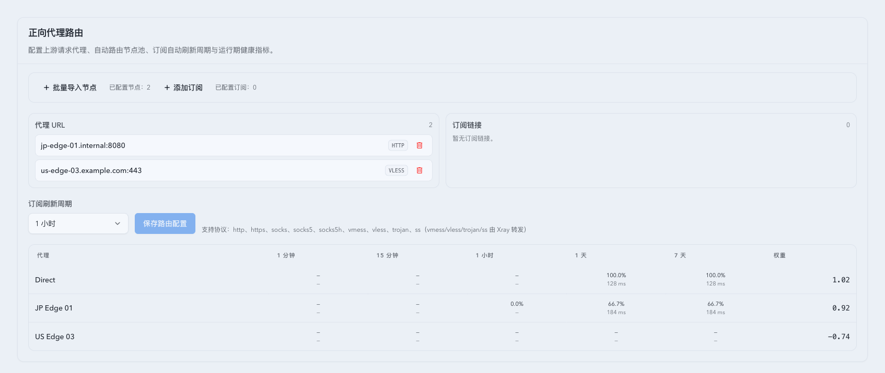
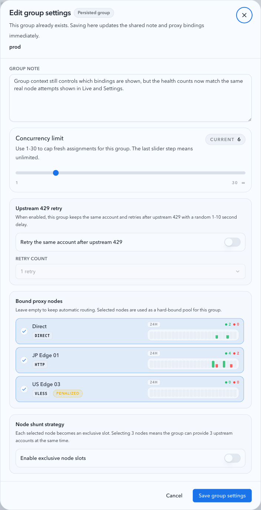

# Owner-facing 节点健康统一为真实节点尝试口径（#ngwdu）

## 状态

- Status: active
- Created: 2026-04-24
- Last: 2026-04-24

## 背景 / 问题陈述

- `Live` 代理运行态、`Settings` 正向代理节点统计、`/api/stats/forward-proxy/timeseries`，以及分组/绑定节点弹窗的 `24H` 节点成功/失败此前并未统一到同一后端口径。
- 历史实现混用了 `forward_proxy_attempts` / `forward_proxy_attempt_hourly` 与 `pool_upstream_request_attempts`，导致 owner-facing 节点健康会被 probe / validation / health-check 等内部 telemetry 污染，且不同页面对同一节点、同一时间窗给出不同计数。
- `#3np57` 曾把分组绑定节点弹窗切到“本组真实流量统计”，但这个 owner-facing 语义已经不再成立；主人现在要求所有节点健康面都统一回“真实节点尝试口径”，并且与其他地方表达“下游调用上游”的节点计数保持同一语义。

## 目标 / 非目标

### Goals

- 所有 owner-facing 节点健康统计统一只读真实 `pool_upstream_request_attempts` 终态节点尝试。
- 同一节点、同一时间窗下，`Live`、`Settings`、binding-node dialogs、forward-proxy timeseries 必须返回同一成功/失败计数。
- 统计规则采用节点尝试口径：一次 failover 中 A 失败、B 成功，要分别记到 A/B。
- 显式排除 `budget_exhausted_final` 与所有 `forward_proxy_attempts` 健康检查 / probe / validation / sync 流量。
- `groupName` 继续保留给 binding-node API 的目录/上下文语义，但不再改变 owner-facing 节点健康计数范围。
- 权重趋势继续使用 `forward_proxy_weight_hourly`，并保留 `#t7m4h` 规定的“无样本时补平线”行为。

### Non-goals

- 不修改 forward proxy 选路 / 权重算法。
- 不修改总览 summary 卡的 invocation 总数语义，也不强行让节点尝试数与总请求数一一相等。
- 不删除 `forward_proxy_attempts` / `forward_proxy_attempt_hourly` 内部 telemetry 表。
- 不为修复前历史数据做模糊回填。

## 范围（Scope）

### In scope

- `src/forward_proxy/slices/storage_and_hourly_stats.rs`
- `src/schema.rs`
- `src/maintenance/archive/hourly_rollups.rs`
- `src/maintenance/archive/cleanup.rs`
- `src/maintenance/hourly_rollups.rs`
- `src/maintenance/retention.rs`
- `src/maintenance/archive/writers.rs`
- owner-facing 节点健康相关 Rust 回归
- 对应 Storybook 场景、视觉证据与 spec 同步

### Out of scope

- owner-facing 以外的 forward-proxy 探测 / 健康检查面板重构
- 新增节点健康字段或新的公开 API 形状
- 节点目录集合本身的改版

## 统一统计契约

### 数据源

- 只统计 `pool_upstream_request_attempts`
- 仅纳入同时满足以下条件的记录：
  - `finished_at IS NOT NULL`
  - `proxy_binding_key_snapshot IS NOT NULL`
  - `status != budget_exhausted_final`

### 节点归属

- 节点归属以 canonical `proxy_binding_key_snapshot` 为准。
- runtime endpoint key、binding key、alias key 必须先做 canonical 映射，再与 owner-facing 节点目录对齐。
- `Direct` 的 canonical key 仍为 `__direct__`。

### 成功 / 失败归类

- `status == success` => success
- 其余终态 => failure
- 一次 failover 中每个实际尝试节点都单独计数。

### 时间窗 / 聚合

- `Live` 与 `Settings` 的窗口统计统一从真实节点尝试聚合得出。
- `forward-proxy/timeseries` 的请求桶统一从真实节点尝试小时桶得出。
- long-range timeseries 不能依赖会过期的 raw archive 文件；归档后必须把真实节点尝试小时桶物化到可长期保留的 owner-facing 历史表，并在 raw archive cleanup 后继续可查询。
- 当窗口统计只能从 long-lived 小时桶补回成功/失败计数，而对应 raw detail 已经清理时，owner-facing 页面必须继续返回真实 success/failure；`avg_latency_ms` 不得凭小时桶反推出伪值，应保持为空。
- 当 retention 只是向已存在的月归档文件 append 新节点尝试时，只有在该文件原本就已完整 owner-facing materialized，或该文件本身就是本次新建时，才允许把它标记为 fully replayed；否则必须继续保持 pending，等待完整 backfill 覆盖旧行。
- 绑定节点弹窗 / 创建入口里的 `24H` 节点成功失败桶也统一复用同一聚合 helper。
- live retention 与 archive 覆盖窗口必须给出同一口径结果。

### 明确排除项

- `forward_proxy_attempts`
- `forward_proxy_attempt_hourly`
- probe / penalized probe
- validation / health-check
- 其他正向代理模块内部自检遥测

## API / 页面语义

### `/api/stats/forward-proxy`

- 继续返回当前运行时节点目录。
- 节点 `stats` 与 `last24h` 改为真实节点尝试口径。
- `weight24h` 继续遵循 `#t7m4h` 的权重历史与补平线语义。

### `/api/settings`

- Settings 中 forward proxy 节点统计改为真实节点尝试口径。
- 节点目录仍只反映运行时 forward-proxy 节点。

### `/api/stats/forward-proxy/timeseries`

- 节点请求桶改为真实节点尝试小时桶。
- retired / alias / runtime key 与 binding key 的映射必须保持稳定，避免同一节点出现重复行或空统计。
- `Direct` 在运行时被关闭后，若窗口内仍存在历史 `__direct__` 节点尝试，timeseries 仍必须保留该 retired Direct 节点的历史桶。

### `/api/pool/forward-proxy-binding-nodes`

- `groupName` 继续保留。
- `groupName` 仅用于目录/上下文语义（如 includeCurrent、额外 binding keys、Direct 展示），不再缩小健康计数范围。
- 对重叠节点来说，传 `groupName` 与不传时，owner-facing 健康计数必须一致。

## 与历史 spec 的关系

- 本 spec supersedes `#3np57` 的 owner-facing 语义：绑定节点弹窗不再展示“本组真实流量统计”，而是展示与 Live / Settings 一致的全局真实节点尝试健康计数。
- `#3np57` 引入的 `group_name_snapshot` / `proxy_binding_key_snapshot` 快照字段仍保留并继续服务于真实节点尝试归档与历史追踪。
- `#t7m4h` 的 `weight24h` fallback 语义保持不变：无样本时允许补当前权重平线。

## 验收标准（Acceptance Criteria）

- Given 同一节点在 `Live`、`Settings`、binding-node dialogs、forward-proxy timeseries 同时可见，When 查看同一时间窗，Then 成功/失败计数一致。
- Given 写入 `forward_proxy_attempts` 的 probe / validation / health-check 记录，When 查看 owner-facing 节点健康页面，Then 这些记录不影响显示结果。
- Given 一次请求先命中节点 A 失败，再命中节点 B 成功，When 查看 owner-facing 节点健康，Then A 增加 1 次失败、B 增加 1 次成功。
- Given binding-node endpoint 传 `groupName` 与不传都包含某个重叠节点，When 查看该节点健康计数，Then 两者一致。
- Given 历史节点尝试已经被 retention 归档，When 查询 long-range timeseries，Then archived buckets 仍与 live 口径一致。
- Given 某节点在查询窗口内没有真实节点尝试，When 查看 owner-facing 节点健康，Then 显示 0 / 空桶，而不是 probe 噪音或伪造请求量。

## 质量门槛（Quality Gates）

- `cargo test forward_proxy_live_stats_ -- --nocapture`
- `cargo test forward_proxy_binding_nodes_ -- --nocapture`
- `cargo test list_forward_proxy_binding_nodes_ -- --nocapture`
- `cargo test forward_proxy_timeseries_ -- --nocapture`
- `cargo check`
- `cd web && bun run test`
- `cd web && bun run build`
- `cd web && bun run build-storybook`

## 文档更新（Docs to Update）

- `docs/specs/README.md`
- `docs/specs/3np57-group-bound-proxy-real-traffic-stats/SPEC.md`

## Visual Evidence

- source_type: storybook_canvas
  story_id_or_title: Monitoring/ForwardProxyLiveTable/RealNodeHealthParity
  state: live parity table
  evidence_note: `Live` 代理运行态展示真实节点尝试口径；Direct 为 `2/0`，JP Edge 01 为 `4/2`，penalized 备用节点仍为 `0/0`。
  image:
  

- source_type: storybook_canvas
  story_id_or_title: Settings/SettingsPage/RealNodeHealthParity
  state: settings forward-proxy parity
  evidence_note: `Settings` 正向代理节点统计与 `Live` 保持同一节点成功/失败口径，且目录仍只展示当前 forward-proxy 节点集合。
  image:
  

- source_type: storybook_canvas
  story_id_or_title: Account Pool/Components/Upstream Account Group Settings Dialog/GlobalNodeHealthParity
  state: binding dialog parity
  evidence_note: binding-node dialog 继续保留 group 上下文，但健康计数不再按 group 缩窄；对重叠节点返回与 `Live` / `Settings` 一致的真实节点尝试计数。
  image:
  
