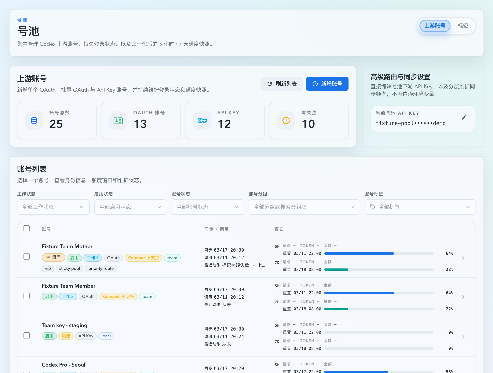
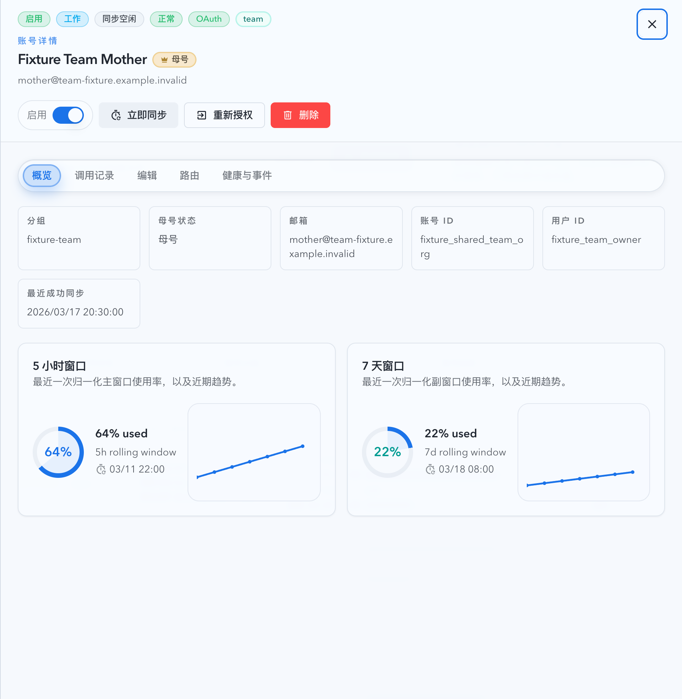

# 共享 Team 组织账号去重修正与自动母号识别（#p4y7m）

## Context

- 现网号池会把同一 `groupName` 下、同一 Team 组织 (`chatgptAccountId`) 的成员账号误标成“重复账号”，即使这些账号实际属于同一个 Team，而不是重复导入的同一凭据。
- 运营目前只能手动设置母号来辅助辨认，但重复账号 warning 仍然存在，语义冲突。
- `0414-3` 这类分组里，同一 Team 组织下的多个成员账号已经具备稳定特征：`planType=team`、共享 `chatgptAccountId`、共享 `groupName`，但 `chatgptUserId` 不同。

## Goals

- 同组、同 Team 组织、不同成员用户的 OAuth 账号不再返回 `duplicateInfo`。
- 当上述 Team 组织簇没有手动母号时，系统自动选出一个稳定母号用于 roster / detail 展示。
- 若已有手动母号，自动识别必须尊重手动结果。

## Non-Goals

- 不改动 mixed-plan duplicate 语义。
- 不新增新的 duplicate reason 或新的持久化字段。
- 不对跨组共享 Team 组织账号做自动消歧。

## Decision

- 对 `sharedChatgptAccountId` 簇新增“共享 Team 组织成员”识别：
  - `planType=team`
  - `groupName` 非空且一致
  - `chatgptUserId` 非空且成员之间不同
- 命中上述条件的账号对不再视为重复账号。
- 母号展示规则：
  - 优先使用已持久化的 `isMother=true`
  - 若没有手动母号，则选该 Team 组织簇里最早创建的账号作为稳定母号

## Acceptance Criteria

- Given 两个 OAuth 账号位于同一分组，且共享 `chatgptAccountId`、`planType=team`、`chatgptUserId` 不同，When 读取 roster / detail，Then 两边都不显示“重复账号”。
- Given 同一 Team 组织簇没有手动母号，When 读取 roster / detail，Then 只有最早创建的账号显示“母号”。
- Given 同一 Team 组织簇已有手动母号，When 读取 roster / detail，Then 继续显示手动母号，不被自动规则覆盖。

## Validation

- `cargo test same_group_team_shared_org_accounts_are_not_flagged_as_duplicates -- --test-threads=1`
- `cargo test same_group_team_shared_org_accounts_auto_select_oldest_member_as_mother -- --test-threads=1`
- `cargo test manual_team_shared_org_mother_assignment_overrides_auto_detection -- --test-threads=1`
- `cd web && bun run test -- UpstreamAccountsPage.list.stories UpstreamAccountsTable.test`
- `cd web && bun run build-storybook`

## Visual Evidence

- source_type: storybook_canvas
  story_id_or_title: Account Pool/Pages/Upstream Accounts/List/Team Shared Org Coexistence
  state: roster
  evidence_note: 验证共享 Team 组织场景下，列表仅保留母号 badge，不再显示“重复账号”。
  

- source_type: storybook_canvas
  story_id_or_title: Account Pool/Pages/Upstream Accounts/List/Team Shared Org Coexistence
  state: detail drawer
  evidence_note: 验证详情抽屉保留 Team 与母号语义，但不再出现 duplicate warning / matched reasons。
  
