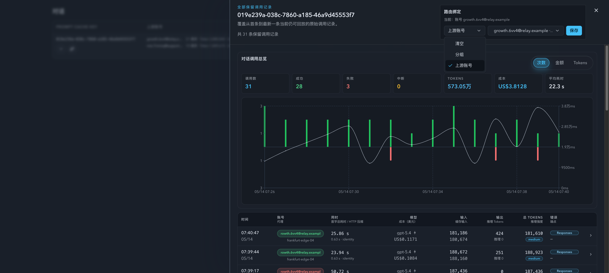

# Prompt Cache Conversation Bindings

Spec ID: pbgwc

## Background

Prompt Cache conversation detail currently explains retained invocations for a prompt cache key, but it cannot pin future requests for that same key to a specific upstream account group or upstream account. Operators need a reversible per-conversation override for routing triage without changing global account-pool policy.

## Goals

- Add a per-`promptCacheKey` binding contract for group binding, upstream account binding, and clearing the binding.
- Expose the binding on the Prompt Cache conversation detail drawer.
- Apply the binding when the proxy can observe the same `promptCacheKey` before account-pool selection.
- Keep group binding and upstream account binding mutually exclusive at both API and UI layers.

## Non-goals

- Do not change Prompt Cache conversation aggregation, historical invocation records, rollups, or SSE payload semantics.
- Do not migrate existing sticky routes into conversation bindings.
- Do not add tag-based, policy-based, or bulk binding workflows.
- Do not change account-pool group, tag, forward-proxy, or policy inheritance semantics.

## Requirements

- Bindings are keyed by the exact normalized `promptCacheKey` string.
- Supported binding kinds are `group`, `upstream_account`, and `none`.
- `none` clears the binding by deleting the persisted row.
- `group` requires a non-empty existing group with at least one upstream account.
- `upstream_account` requires an existing account that can participate in account-pool routing.
- API payloads that try to set both `groupName` and `upstreamAccountId` are rejected.
- Runtime routing treats an observed binding as a hard constraint; if the bound target is unavailable, routing must fail through the existing no-selectable-account error path rather than falling back to the global pool.
- Binding lookup does not change the existing live-first request-body streaming strategy; large or chunked requests whose body key is not visible before account selection keep the normal account-pool routing behavior.
- Binding changes affect future requests only; in-flight requests are not rerouted.

## Interface Contract

### Storage

`prompt_cache_conversation_bindings` stores one row per `prompt_cache_key`.

- `prompt_cache_key TEXT PRIMARY KEY`
- `binding_kind TEXT NOT NULL CHECK(binding_kind IN ('group', 'upstream_account'))`
- `group_name TEXT NULL`
- `upstream_account_id INTEGER NULL`
- `created_at TEXT NOT NULL`
- `updated_at TEXT NOT NULL`

Rows with `binding_kind='group'` must have `group_name` and no `upstream_account_id`; rows with `binding_kind='upstream_account'` must have `upstream_account_id` and no `group_name`.

### HTTP API

- `GET /api/stats/prompt-cache-conversation-bindings/{encodedPromptCacheKey}`
  - Returns `{ promptCacheKey, bindingKind, groupName, upstreamAccountId, upstreamAccountName, updatedAt }`.
  - `bindingKind` is `none`, `group`, or `upstreamAccount`.
- `PATCH /api/stats/prompt-cache-conversation-bindings/{encodedPromptCacheKey}`
  - `{ "bindingKind": "none" }` clears.
  - `{ "bindingKind": "group", "groupName": "prod" }` binds a group.
  - `{ "bindingKind": "upstreamAccount", "upstreamAccountId": 123 }` binds an account.

The key segment is URL-encoded with normal component encoding; the server accepts encoded keys that decode to values containing `/`, trims the decoded key, and validates the result before use.

## Runtime Behavior

- Proxy hot path extracts `promptCacheKey` using the existing header, prebuffered-body, and early live-body probe rules available before account-pool selection.
- Before account-pool candidate selection, routing loads the current binding for the observed key.
- Group binding filters candidates to matching `group_name`.
- Upstream account binding filters candidates to the bound account id and is treated as an operator-forced account assignment.
- Existing sticky reuse is still allowed only when the sticky account satisfies the binding constraint.
- Manual bindings are the only supported operator override for a sticky source whose effective policy forbids cut-out. Both upstream-account and group bindings may move the conversation out of that sticky source.
- For forced upstream account binding, an existing sticky route cannot block the selected target through sticky cut-out policy, and the selected target's cut-in policy cannot reject the operator-forced transfer.
- Existing account eligibility, health, quota, guard, concurrency, retry, route-key, and forward-proxy readiness checks remain authoritative inside the constrained candidate set.
- Saving an upstream account binding immediately updates `pool_sticky_routes` for that `promptCacheKey` to the bound account so future requests and operator views agree on the effective assignment.
- Clearing a binding removes only the binding row; any existing sticky route remains ordinary sticky-routing state and is governed by the normal sticky reuse and cut-out policy.
- Group binding remains a hard target filter; it does not bypass target cut-in policy or target account eligibility.

## Acceptance Criteria

- Given a key bound to group `prod` and visible before selection, the request selects only accounts in `prod`.
- Given a key bound to account `123` and visible before selection, the request selects only account `123`.
- Given a key with an old sticky route to account `A` and a forced upstream account binding to account `B`, account `B` can be selected even when sticky policy would normally forbid cutting out of `A` or cutting into `B`.
- Given a key with an old sticky route to account `A` whose source policy forbids cut-out and a group binding to group `prod`, routing may select an eligible account in `prod` instead of failing on `A`.
- Given a key bound to account `123` and account `123` is unavailable due to health, quota, concurrency, route-key, or forward-proxy readiness, routing fails without falling back to a different account.
- Given a key bound to a group, target accounts in that group still honor normal cut-in policy.
- Given an upstream account binding is saved, the key's sticky route is updated to the bound account.
- Given a cleared binding, requests use normal account-pool routing behavior, including any sticky route that already exists for that key.
- Given a PATCH payload containing both `groupName` and `upstreamAccountId`, the API rejects it.
- Given a bound target that is disabled or unavailable, the request fails through the existing no-selectable-account path without fallback.
- Given the conversation detail drawer is open, the operator can see the current binding, change it, and clear it.

## Visual Evidence

The Storybook `DrawerBindingControls` scenario renders the Prompt Cache conversation detail drawer with the binding panel preloaded in upstream-account mode. The evidence image is a readable browser screenshot of the mock-only Storybook iframe viewport with the route binding panel and opened UI-library Select/Radix options (`Clear`, `Group`, `Account`) visible in business context. The unit coverage also asserts that the binding panel no longer renders native `<select>` elements and instead exposes `combobox` controls.
