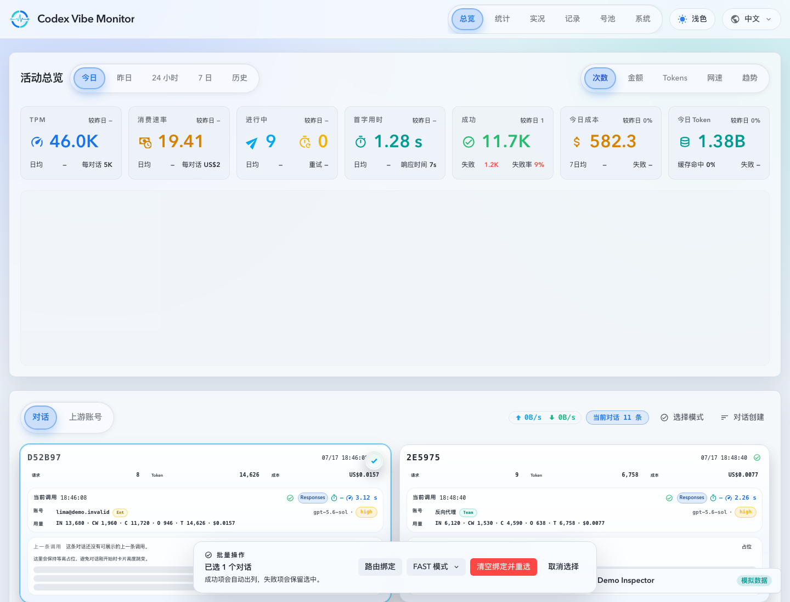
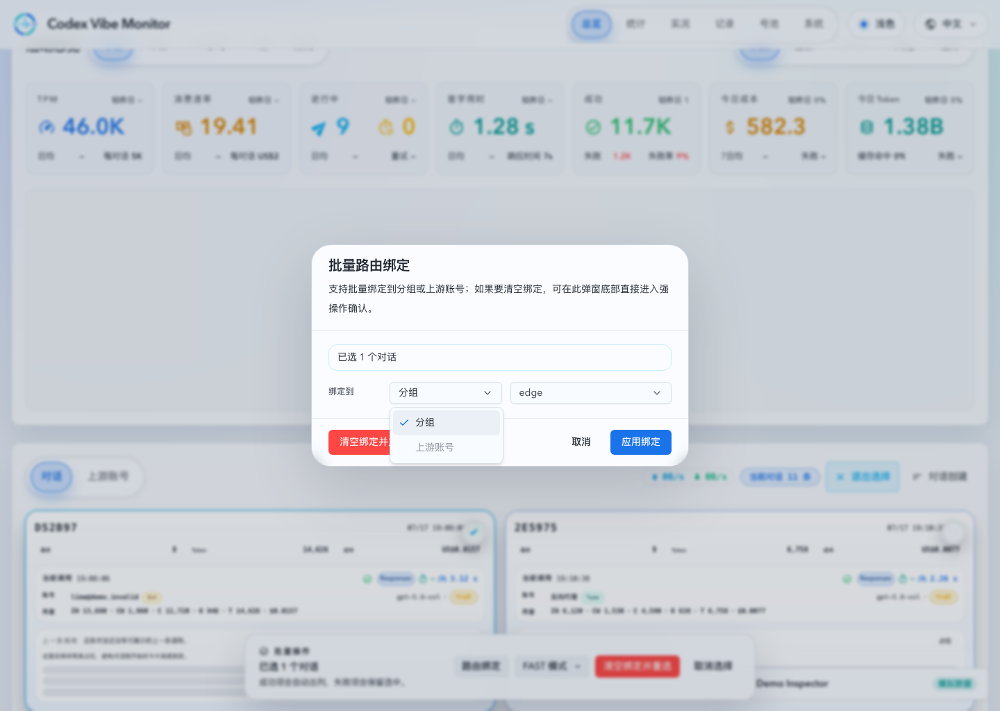
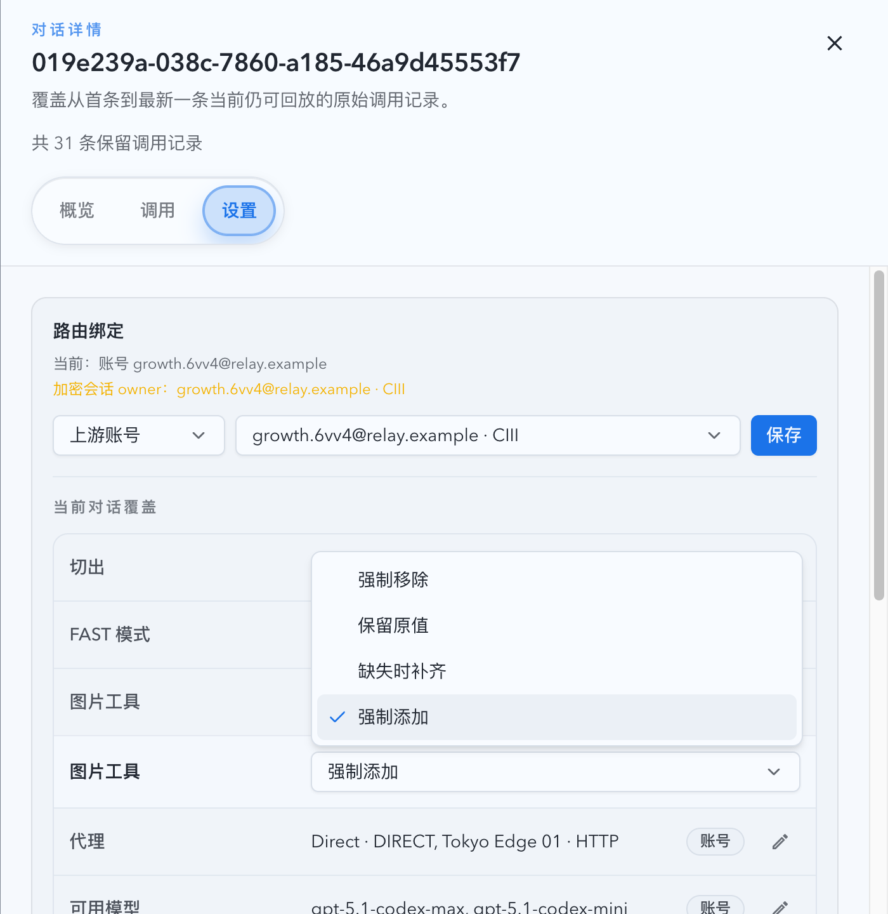
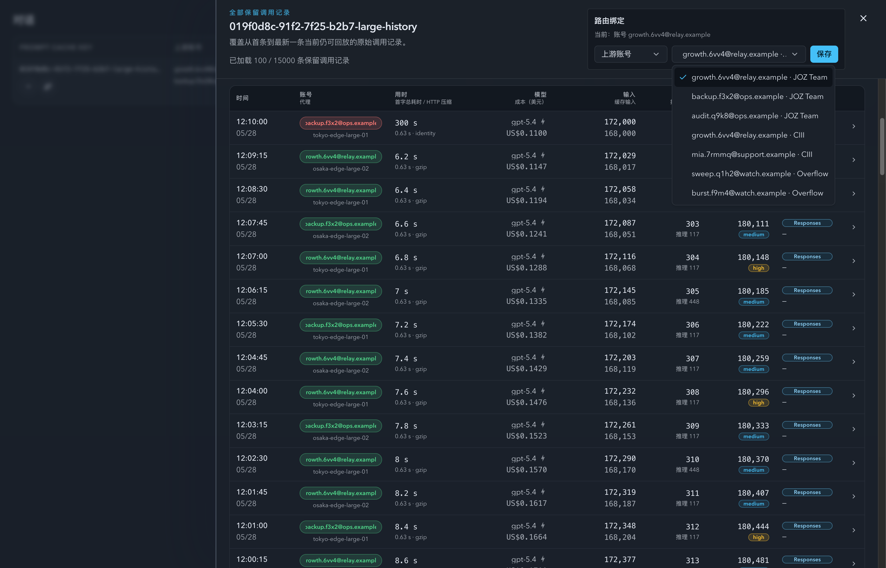
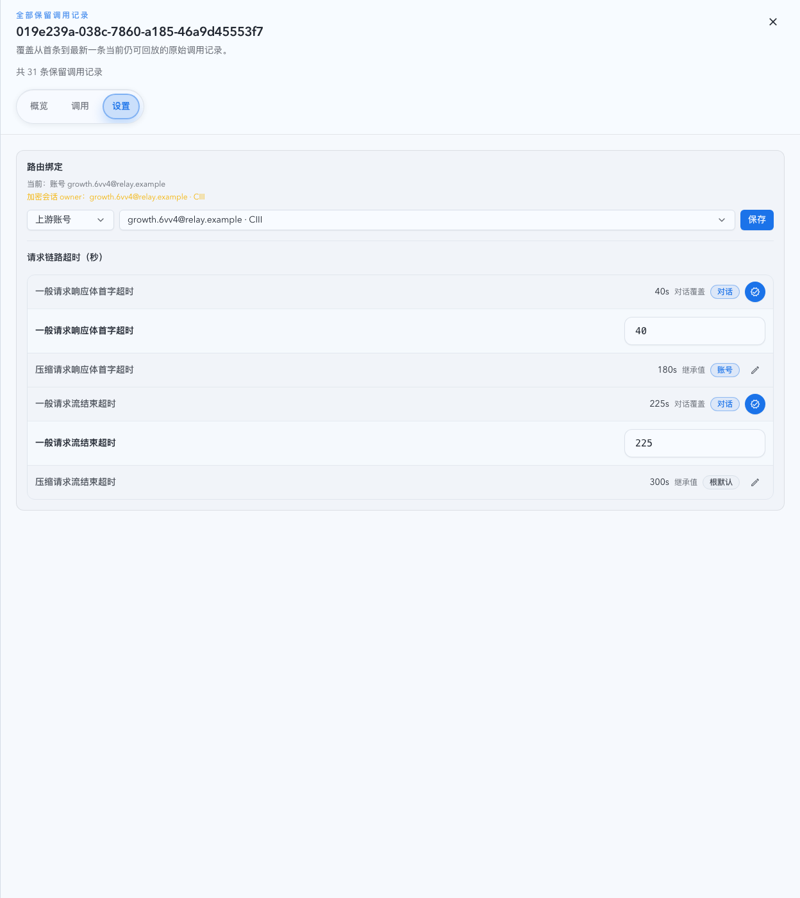
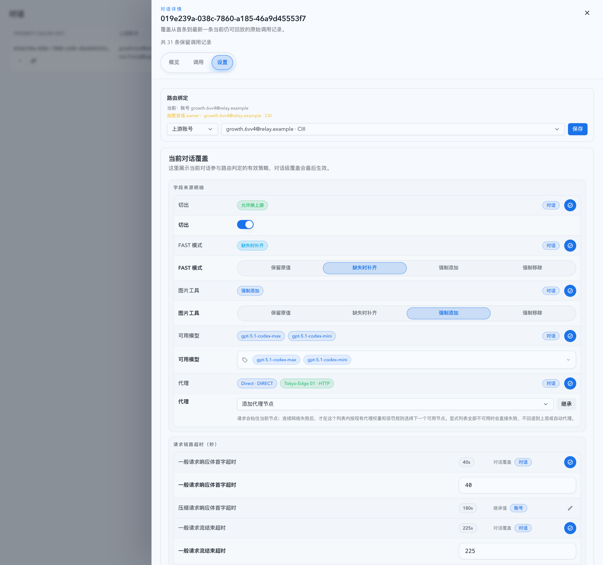
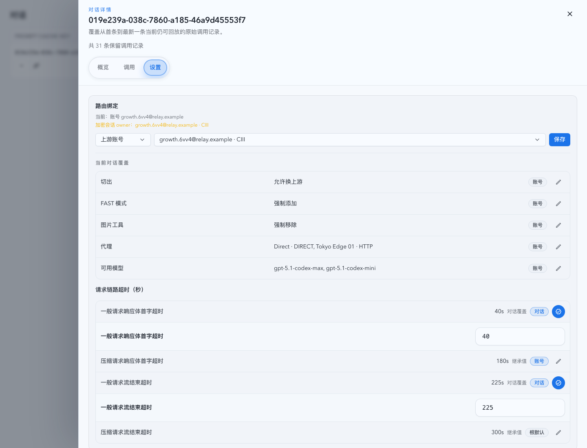

# Prompt Cache Conversation Bindings

Spec ID: pbgwc

## Background

Prompt Cache conversation detail explains retained invocations for a prompt cache key and exposes reversible per-conversation runtime overrides for routing triage without changing global account-pool policy.

## Goals

- Add a per-`promptCacheKey` binding contract for group binding, upstream account binding, and clearing the binding.
- Add per-conversation request-path timeout overrides that can exist with or without a manual binding target.
- Add per-conversation runtime policy overrides for upstream switching, FAST mode rewrite, image tool rewrite, available models, and a hard list of forward-proxy binding nodes.
- Expose the binding on the Prompt Cache conversation detail drawer.
- Add a Dashboard-scoped bulk workflow for route binding, affinity reset, and FAST mode rewrites across multiple Prompt Cache conversations.
- Add conversation-card selection affordances on the Dashboard grid, including temporary modifier-key selection without entering persistent selection mode.
- Apply the binding when the proxy can observe the same `promptCacheKey` before account-pool selection.
- Keep group binding and upstream account binding mutually exclusive at both API and UI layers.

## Non-goals

- Do not change Prompt Cache conversation aggregation, historical invocation records, rollups, or SSE payload semantics.
- Do not migrate existing sticky routes into conversation bindings.
- Do not add cross-page, cross-filter, or long-lived bulk-binding state beyond the current Dashboard conversation grid.
- Do not change account-pool group, tag, or policy inheritance semantics.
- Do not make tags participate in timeout inheritance or timeout source display.
- Do not add arbitrary proxy URL input; conversation proxy override selects existing forward-proxy binding nodes, including direct.
- Do not copy account-level `allowCutIn` semantics into the conversation layer.

## Requirements

- Bindings are keyed by the exact normalized `promptCacheKey` string.
- Supported binding kinds are `group`, `upstream_account`, and `none`.
- `none` clears only the manual binding target; timeout-only rows may still persist.
- `group` requires a non-empty existing group with at least one upstream account.
- `upstream_account` requires an existing account that can participate in account-pool routing.
- API payloads that try to set both `groupName` and `upstreamAccountId` are rejected.
- The Dashboard conversations header exposes a conversations-only `选择模式` toggle in the existing action area.
- When selection mode is on, conversation cards use `promptCacheKey` as the stable selection key, and card click, `Enter`, and `Space` toggle selection instead of opening drawers or following nested navigation affordances.
- A `Cmd`/`Ctrl`-modified card click toggles only the clicked card's selection without switching the header into persistent selection mode.
- Any non-zero selection shows a fixed bottom-center floating bulk action bar with selected count, route binding, clear-and-reset affinity, FAST mode, and cancel-selection actions.
- Bulk route binding supports only `group` and `upstreamAccount` targets; clearing remains a separate destructive action.
- Bulk clear-and-reset affinity removes the manual conversation binding, `pool_sticky_routes`, and `prompt_cache_encrypted_session_owners` rows for each selected key so the next request reselects an upstream account from normal routing.
- Bulk FAST mode writes one of the four concrete rewrite modes per selected key and preserves the key's current binding kind.
- Conversation timeout overrides reuse only the existing request-path timeout fields:
  - `responsesFirstByteTimeoutSecs`
  - `compactFirstByteTimeoutSecs`
  - `responsesStreamTimeoutSecs`
  - `compactStreamTimeoutSecs`
- Timeout fields accept only positive integers when set.
- Timeout inheritance for a conversation field is `global/root -> group -> account -> conversation`.
- Conversation policy overrides are nullable per field. `NULL` means inherit the selected account/group/root policy; a non-`NULL` value applies only to the current `promptCacheKey`.
- Conversation `allowSwitchUpstream` is the setting labelled “切出”. It means the current conversation may switch away from the original/sticky upstream account when routing evaluates future requests.
- Conversation FAST mode and image tool overrides use the existing rewrite modes: `force_remove`, `keep_original`, `fill_missing`, and `force_add`.
- The conversation Settings editors for FAST mode and image tool offer only those four concrete rewrite modes; clearing a local override remains an explicit field action, not a Select option.
- After a concrete FAST mode or image tool choice saves, its field editor remains expanded so the operator retains the editing context.
- Conversation available-model override must contain at least one model. An empty list is rejected; clearing the override uses `null`.
- Conversation proxy override stores one or more existing selectable forward-proxy binding keys. The list may include `__direct__`; it may not contain custom proxy URLs.
- Runtime routing treats an observed binding as a hard constraint; if the bound target is unavailable, routing must fail through the existing no-selectable-account error path rather than falling back to the global pool.
- Runtime routing treats an observed conversation proxy override as a hard bound forward-proxy scope. The current node remains sticky for the prompt cache key, and runtime switches within the explicit list only after the existing consecutive network-failure threshold. If every node in that list is unavailable, routing fails through the existing proxy/account readiness path rather than silently choosing another proxy or falling back to the account/group scope.
- Binding lookup does not change the existing live-first request-body streaming strategy; large or chunked requests whose body key is not visible before account selection keep the normal account-pool routing behavior.
- Binding changes affect future requests only; in-flight requests are not rerouted.
- Conversation detail history is loaded incrementally: the drawer requests an initial 50 retained invocation records and fetches later 50-record pages only when the drawer body scrolls near the bottom.
- Conversation detail history tables must stay virtualized so the retained-record `total` does not linearly increase mounted DOM rows or block the binding controls.

## Interface Contract

### Storage

`prompt_cache_conversation_bindings` stores one row per `prompt_cache_key`.

- `prompt_cache_key TEXT PRIMARY KEY`
- `binding_kind TEXT NOT NULL CHECK(binding_kind IN ('group', 'upstream_account', 'none'))`
- `group_name TEXT NULL`
- `upstream_account_id INTEGER NULL`
- `responses_first_byte_timeout_secs INTEGER NULL`
- `compact_first_byte_timeout_secs INTEGER NULL`
- `responses_stream_timeout_secs INTEGER NULL`
- `compact_stream_timeout_secs INTEGER NULL`
- `allow_switch_upstream INTEGER NULL`
- `fast_mode_rewrite_mode TEXT NULL`
- `image_tool_rewrite_mode TEXT NULL`
- `available_models_json TEXT NULL`
- `forward_proxy_key TEXT NULL`
- `forward_proxy_keys_json TEXT NULL`
- `created_at TEXT NOT NULL`
- `updated_at TEXT NOT NULL`

Rows with `binding_kind='group'` must have `group_name` and no `upstream_account_id`; rows with `binding_kind='upstream_account'` must have `upstream_account_id` and no `group_name`; rows with `binding_kind='none'` must have neither target field.

The row is deleted only when there is no binding target, all four timeout override columns are `NULL`, and all runtime policy override columns are `NULL`.

### HTTP API

- `GET /api/stats/prompt-cache-conversation-bindings/{encodedPromptCacheKey}`
  - Returns `{ promptCacheKey, bindingKind, groupName, upstreamAccountId, upstreamAccountName, timeouts, timeoutFieldSources, allowSwitchUpstream, fastModeRewriteMode, imageToolRewriteMode, availableModels, forwardProxyKey, forwardProxyKeys, policyFieldSources, updatedAt }`.
  - `bindingKind` is `none`, `group`, or `upstreamAccount`.
  - `policyFieldSources` uses the same source vocabulary as effective routing rules and marks each conversation policy field as `conversation` when set locally or inherited from `account`/upstream policy otherwise.
- `PATCH /api/stats/prompt-cache-conversation-bindings/{encodedPromptCacheKey}`
  - `{ "bindingKind": "none" }` clears only the manual binding target when no timeout patch is present.
  - `{ "bindingKind": "group", "groupName": "prod" }` binds a group.
  - `{ "bindingKind": "upstreamAccount", "upstreamAccountId": 123 }` binds an account.
  - All variants may also include `timeouts`, `allowSwitchUpstream`, `fastModeRewriteMode`, `imageToolRewriteMode`, `availableModels`, `forwardProxyKey`, and `forwardProxyKeys`.
- `POST /api/stats/prompt-cache-conversation-bindings/bulk-actions`
  - Accepts `{ promptCacheKeys, action }` where `action` is one of:
    - `{ "action": "bind", "bindingKind": "group", "groupName": "prod" }`
    - `{ "action": "bind", "bindingKind": "upstreamAccount", "upstreamAccountId": 123 }`
    - `{ "action": "clearAndResetAffinity" }`
    - `{ "action": "setFastModeRewriteMode", "fastModeRewriteMode": "fill_missing" }`
  - `bind` rejects `bindingKind: "none"` and rejects invalid or missing targets before any per-key writes begin.
  - Returns `{ action, totalRequested, totalSucceeded, totalFailed, items }`, and each `items[]` entry includes `promptCacheKey`, `ok`, `error`, and the post-write binding snapshot when that key succeeds.

Timeout patch semantics are field-local:

- omitted field: preserve that field's current conversation override
- `null`: clear that field's conversation override
- positive integer: store that field's conversation override

Legacy binding-only PATCH payloads remain valid.

Policy patch semantics are field-local:

- omitted field: preserve that field's current conversation override
- `null`: clear that field's conversation override
- concrete value: store that field's conversation override
- `availableModels: []`: rejected because an explicit available-model override cannot be empty
- `forwardProxyKey`: legacy single-node write surface; must reference a selectable existing binding node, including `__direct__`
- `forwardProxyKeys`: must contain at least one selectable existing binding node, including `__direct__`; `null` clears the override and an empty list is treated as clear

The key segment is URL-encoded with normal component encoding; the server accepts encoded keys that decode to values containing `/`, trims the decoded key, and validates the result before use.

## Runtime Behavior

- Proxy hot path extracts `promptCacheKey` using the existing header, prebuffered-body, and early live-body probe rules available before account-pool selection.
- Before account-pool candidate selection, routing loads the current binding for the observed key.
- After the target account is selected, runtime resolves request-path timeouts by starting from global defaults, applying the selected target's group/account overrides, and then applying any conversation override.
- Group binding filters candidates to matching `group_name`.
- Upstream account binding filters candidates to the bound account id and is treated as an operator-forced account assignment.
- Existing sticky reuse is still allowed only when the sticky account satisfies the binding constraint.
- For non-explicit routing paths, repeated transport/decode-shaped `upstream_stream_error` failures on the same upstream account can invalidate sticky reuse and suppress that account from new automatic selection until a healthier candidate is chosen.
- Manual bindings are the only supported operator override for a sticky source whose effective policy forbids cut-out. Both upstream-account and group bindings may move the conversation out of that sticky source.
- For forced upstream account binding, an existing sticky route cannot block the selected target through sticky cut-out policy, and the selected target's cut-in policy cannot reject the operator-forced transfer.
- Existing account eligibility, health, quota, guard, concurrency, retry, route-key, and forward-proxy readiness checks remain authoritative inside the constrained candidate set.
- FAST mode, image tool, and available-model conversation overrides are applied to the effective routing rule before candidate compatibility checks.
- A conversation proxy override replaces the selected account/group/node-shunt forward-proxy dispatch scope with a prompt-cache-key scoped hard binding list. Account-level proxy lists still override group lists when no conversation proxy override is set.
- A conversation “切出” override allows routing to move the conversation away from the original/sticky upstream account. It is not a cut-in override and does not force another account to accept otherwise invalid traffic.
- Saving an upstream account binding immediately updates `pool_sticky_routes` for that `promptCacheKey` to the bound account so future requests and operator views agree on the effective assignment.
- Clearing a binding removes only the binding row; any existing sticky route remains ordinary sticky-routing state and is governed by the normal sticky reuse and cut-out policy.
- Bulk bind reuses the single-key save path per selected `promptCacheKey`; successful upstream-account bulk binds also align each selected key's sticky route to the chosen account.
- Bulk clear-and-reset affinity removes the manual binding row, sticky route, and encrypted owner lock for each selected key, so later routing starts from an unconstrained conversation state.
- Bulk FAST mode writes only the conversation-level FAST rewrite field for each selected key and leaves the current manual binding target, or `bindingKind='none'`, intact.
- `binding_kind='none'` timeout-only rows do not count as manual binding overrides for sticky cut-out or encrypted-session owner guard logic.
- Group binding remains a hard target filter; it does not bypass target cut-in policy or target account eligibility.
- `binding_kind='group'` is a group-scoped operator constraint, not a hard binding to one concrete account. If the current sticky account accumulates the configured transport/decode-shaped stream-failure threshold, routing may reselect another eligible account inside the same group.
- `binding_kind='upstream_account'` remains an operator-forced hard account override even when the bound account has accumulated automatic stream-failure escape signals. Automatic escape applies only to non-explicit routing paths.

## Acceptance Criteria

- Given a key bound to group `prod` and visible before selection, the request selects only accounts in `prod`.
- Given a key bound to account `123` and visible before selection, the request selects only account `123`.
- Given a key with an old sticky route to account `A` and a forced upstream account binding to account `B`, account `B` can be selected even when sticky policy would normally forbid cutting out of `A` or cutting into `B`.
- Given a key with an old sticky route to account `A` whose source policy forbids cut-out and a group binding to group `prod`, routing may select an eligible account in `prod` instead of failing on `A`.
- Given non-explicit routing has observed the configured consecutive transport/decode-shaped `upstream_stream_error` threshold on account `A`, later requests for other sticky keys do not automatically select `A` while another eligible account exists.
- Given a key bound to account `123` and account `123` is unavailable due to health, quota, concurrency, route-key, or forward-proxy readiness, routing fails without falling back to a different account.
- Given a key bound to a group, target accounts in that group still honor normal cut-in policy.
- Given a key bound to a group and the current sticky account reaches the configured consecutive transport/decode-shaped `upstream_stream_error` threshold, routing may reselect another eligible account in that same group.
- Given an upstream account binding is saved, the key's sticky route is updated to the bound account.
- Given a cleared binding, requests use normal account-pool routing behavior, including any sticky route that already exists for that key.
- Given a timeout-only row with `bindingKind='none'`, requests still use the conversation timeout overrides while leaving target selection unconstrained.
- Given a policy-only row with `bindingKind='none'`, requests still use the conversation runtime policy overrides while leaving target selection unconstrained.
- Given `allowSwitchUpstream=true`, routing may move the current conversation away from the original/sticky upstream account; clearing the field restores inherited sticky cut-out behavior.
- Given a key bound to an explicit upstream account and that account reaches the configured consecutive transport/decode-shaped `upstream_stream_error` threshold, routing still keeps the explicit operator-selected account instead of auto-unbinding or silently falling back.
- Given FAST mode or image tool is overridden, later requests for the same `promptCacheKey` use that rewrite mode in account compatibility and request rewrite decisions.
- Given available models are overridden, later requests for the same `promptCacheKey` select only accounts compatible with that explicit non-empty list; `availableModels: []` is rejected.
- Given `forwardProxyKeys` is overridden to multiple selectable nodes, later requests for the same `promptCacheKey` reuse the current selected node, switch only within that list after consecutive network failures, and fail if the explicit list has no selectable nodes.
- Given failover from one target account to another, the request recomputes effective timeouts against the new target's group/account chain before applying conversation overrides.
- Given a PATCH payload containing both `groupName` and `upstreamAccountId`, the API rejects it.
- Given a bound target that is disabled or unavailable, the request fails through the existing no-selectable-account path without fallback.
- Given the conversation detail drawer is open, the operator can see the current binding, change it, and clear it.
- Given the conversation detail drawer is open, the operator can override or clear one timeout field without rewriting untouched timeout fields.
- Given the conversation detail drawer is open on the Settings tab, the operator can see effective values plus source badges for 切出, FAST mode, image tool, available models, and one proxy node, then override or clear each field independently.
- Given a conversation has thousands of retained records, opening the detail drawer loads only the first 50 records, keeps the binding controls interactive, and loads the next 50 records only after drawer scrolling reaches the load threshold.
- Given the Dashboard conversations grid is not in persistent selection mode, when the operator `Cmd`/`Ctrl`-clicks a card, then only that card toggles selection and the header toggle remains in its default non-selection state.
- Given Dashboard selection mode is on, when the operator clicks a card body or presses `Enter`/`Space` on it, then the card toggles selection instead of opening the conversation or invocation drawers.
- Given selected Dashboard conversations and a bulk bind payload to an upstream account, when the request succeeds, then every successful item returns an `upstreamAccount` binding snapshot and the selected keys' sticky routes align to that account.
- Given a selected conversation has a manual binding, sticky route, and encrypted owner lock, when the operator runs bulk clear-and-reset affinity, then all three affinity rows are removed and the next routing constraint resolves as unconstrained.
- Given selected conversations with mixed existing binding kinds, when the operator applies bulk FAST mode, then each selected key stores the requested FAST rewrite mode and keeps its previous binding kind.
- Given a bulk bind request references an invalid group or account target, when the server rejects the shared target validation, then the response is `400` and no selected key is partially written.

## Visual Evidence

Recommended PR subset for this Dashboard bulk-actions change: the two web-demo captures in the first section below.

### Dashboard Bulk Actions (Web Demo)

- source_type: web_demo
- target_program: mock-only
- capture_scope: page
- requested_viewport: desktop1440
- viewport_strategy: fixed demo route
- sensitive_exclusion: N/A
- submission_gate: approved
- demo_route: `/dashboard?demoScene=attention&demoTheme=light`
- state: one conversation selected via `Cmd`/`Ctrl`-modified click while persistent selection mode remains off
- evidence_note: verifies the selected-card affordance, fixed bottom-center floating bulk action bar, and temporary modifier-key selection path without flipping the header into selection mode.

- source_type: web_demo
- target_program: mock-only
- capture_scope: dialog
- requested_viewport: desktop1440
- viewport_strategy: fixed demo route
- sensitive_exclusion: N/A
- submission_gate: approved
- demo_route: `/dashboard?demoScene=attention&demoTheme=light`
- state: route-bind kind selector opened with `分组` and `上游账号` options while the dialog still keeps the single-row `绑定到 / kind / target` layout
- evidence_note: verifies the dialog no longer uses the earlier segmented switch, keeps the compact one-line binding row, and exposes the kind chooser as a dropdown instead of a persistent tabbed control.

### Conversation Drawer Controls (Storybook)

- source_type: storybook_canvas
- target_program: mock-only
- capture_scope: element
- requested_viewport: desktop1280
- viewport_strategy: storybook-viewport
- sensitive_exclusion: N/A
- submission_gate: approved
- story_id_or_title: `Monitoring/PromptCacheConversationTable/DrawerBindingAndTimeouts`
- state: image tool policy saved as `force_add`, field editor remains expanded
- evidence_note: verifies that a concrete image-tool rewrite choice updates the summary and leaves the field-local editor open; the story's Chromium play test separately verifies that FAST mode and image tool menus expose only the four concrete rewrite modes and omit inheritance.

The Storybook `DrawerBindingControls` scenario renders the Prompt Cache conversation detail drawer with the binding panel preloaded in upstream-account mode. The evidence image is a readable browser screenshot of the mock-only Storybook iframe viewport with the route binding panel and opened UI-library Select/Radix options (`Clear`, `Group`, `Account`) visible in business context. The unit coverage also asserts that the binding panel no longer renders native `<select>` elements and instead exposes `combobox` controls.

The Storybook `LargeHistoryVirtualizedDrawer` scenario renders a 15,000-record retained-history drawer. The evidence image shows the binding controls, summary chart, opened account binding target listbox, and virtualized invocation table after loading the second 50-record page (`已加载 100 / 15000 条保留调用记录`). Browser verification observed 28 mounted table rows and 4,248 total DOM elements, rather than mounting rows proportional to the 15,000-record total.

The Storybook `DrawerBindingAndTimeouts` scenario renders the conversation drawer with an upstream-account binding plus mixed conversation/account/root timeout sources. The timeout subpanel now follows the same summary-row + field-local expansion contract as the effective routing rule card: inherited rows stay collapsed, conversation-owned timeout rows expand when edited, and timeout-only persistence remains visible even when `bindingKind='none'`.

The Storybook `DrawerBindingAndTimeouts` scenario now also renders the widened conversation detail drawer on the Settings tab with the same summary-row and field-local editing skeleton used by account routing: the separate route-binding block remains intact, conversation-owned rows and timeouts are expanded by default, account-only routing rows stay hidden, available models and proxy bindings render as the shared chip-based controls, and the drawer width remains fixed while the account-style routing form grows vertically.

The Storybook `DrawerBindingAndTimeouts` scenario also shows a multi-node conversation proxy list so the drawer contract remains reviewable alongside the Dashboard bulk-entry points.
