# Prompt Cache Conversation Bindings

Spec ID: pbgwc

## Background

Prompt Cache conversation detail explains retained invocations for a prompt cache key and exposes reversible per-conversation runtime overrides for routing triage without changing global account-pool policy.

## Goals

- Add a per-`promptCacheKey` binding contract for group binding, upstream account binding, and clearing the binding.
- Add per-conversation request-path timeout overrides that can exist with or without a manual binding target.
- Add per-conversation runtime policy overrides for upstream switching, FAST mode rewrite, hosted image-tool rewrite, Codex imagegen rewrite, available models, and a hard list of forward-proxy binding nodes.
- Expose the binding on the Prompt Cache conversation detail drawer.
- Add a Dashboard-scoped bulk workflow for route binding, affinity reset, and FAST mode rewrites across multiple Prompt Cache conversations.
- Add a categorized event record surface on the Prompt Cache conversation detail drawer so manual and automatic routing changes stay traceable per conversation.
- Isolate automatic Sticky affinity by the pair of `promptCacheKey` and normalized request model while retaining conversation-level manual controls.
- Add conversation-card selection affordances on the Dashboard grid, including temporary modifier-key selection without entering persistent selection mode.
- Apply the binding when the proxy can observe the same `promptCacheKey` before account-pool selection.
- Keep group binding and upstream account binding mutually exclusive at both API and UI layers.

## Non-goals

- Do not change Prompt Cache conversation aggregation, historical invocation records, rollups, or SSE payload semantics.
- Do not migrate existing sticky routes into conversation bindings.
- Do not add cross-page, cross-filter, or long-lived bulk-binding state beyond the current Dashboard conversation grid.
- Do not change account-pool group, tag, or policy inheritance semantics.
- Do not make tags participate in timeout inheritance or timeout source display.
- Do not add arbitrary proxy URL input; conversation proxy override selects existing forward-proxy binding nodes, including direct.
- Do not copy account-level `allowCutIn` semantics into the conversation layer.
- Do not add a separate global event page, actor-identity audit trail, or historical backfill for pre-existing bindings/sticky state.

## Requirements

- Bindings are keyed by the exact normalized `promptCacheKey` string.
- Supported binding kinds are `group`, `upstream_account`, and `none`.
- `none` clears only the manual binding target; timeout-only rows may still persist.
- `group` requires a non-empty existing group with at least one upstream account.
- `upstream_account` requires an existing account that can participate in account-pool routing.
- API payloads that try to set both `groupName` and `upstreamAccountId` are rejected.
- The Dashboard conversations header exposes a conversations-only `选择模式` toggle in the existing action area.
- When selection mode is on, conversation cards use `promptCacheKey` as the stable selection key, and card click, `Enter`, and `Space` toggle selection instead of opening drawers or following nested navigation affordances.
- A `Cmd`/`Ctrl`-modified card click toggles only the clicked card's selection without switching the header into persistent selection mode.
- Any non-zero selection shows a fixed bottom-center floating bulk action bar with selected count, route binding, clear-and-reselect affinity, FAST mode, and cancel-selection actions.
- The bulk route-bind dialog supports `group` and `upstreamAccount` targets, and its destructive footer action submits `bindingKind='none'` to clear only the manual binding target without reading the current dropdown selection.
- The Dashboard bulk route-bind dialog keeps a browser-local MRU list of the last successful `group` or `upstreamAccount` binding targets under one shared localStorage key; it does not persist clear actions, transient dropdown edits, or cancelled dialog state.
- When the bulk route-bind dialog opens and binding targets are loaded, it restores the newest still-valid MRU target by switching both kind and target selection together. Invalid or stale MRU entries are silently dropped from localStorage before the dialog renders recent chips.
- The Dashboard bulk route-bind dialog renders up to five recent MRU targets below the `绑定到 / kind / target` row using variable-width group/account chips under one unified order. The visible strip stays within two rows; when all recent targets cannot fit, the dialog omits the extra tail items instead of introducing any alternate selector or placeholder chip. Picking any recent target only refills the current selection and never submits the bulk bind action by itself.
- The Dashboard bulk clear confirmation dialog resolves its header/footer chrome and destructive callout surfaces from the active themed ancestor so dark-theme or nested-theme renders cannot inherit light-theme mixed surfaces from `:root`.
- The separate `clearAndResetAffinity` API action removes the manual conversation binding, all-model fallback, every model-specific Sticky route, and `prompt_cache_encrypted_session_owners` row for each selected key so the next request reselects an upstream account from normal routing.
- Bulk FAST mode writes one of the four concrete rewrite modes per selected key and preserves the key's current binding kind.
- Conversation timeout overrides reuse only the existing request-path timeout fields:
  - `responsesFirstByteTimeoutSecs`
  - `compactFirstByteTimeoutSecs`
  - `responsesStreamTimeoutSecs`
  - `compactStreamTimeoutSecs`
- Timeout fields accept only positive integers when set.
- Timeout inheritance for a conversation field is `global/root -> group -> account -> conversation`.
- Conversation policy overrides are nullable per field. `NULL` means inherit the selected account/group/root policy; a non-`NULL` value applies only to the current `promptCacheKey`.
- Conversation `allowSwitchUpstream` is the setting labelled “切出”. It means the current conversation may switch away from the original/sticky upstream account when routing evaluates future requests.
- Conversation FAST mode, hosted image-tool, and Codex imagegen overrides use the four rewrite modes: `force_remove`, `keep_original`, `fill_missing`, and `force_add`.
- The conversation Settings editors for FAST mode, hosted image-tool, and Codex imagegen offer only those four concrete modes; clearing a local override remains an explicit field action, not a Select option.
- `codexImagegenRewriteMode` applies only after explicit Codex Full/Lite recognition and outranks the hosted image-tool policy for that request.
- After a concrete FAST mode, hosted image-tool, or Codex imagegen choice saves, its field editor remains expanded so the operator retains the editing context.
- Conversation available-model override must contain at least one model. An empty list is rejected; clearing the override uses `null`.
- Conversation proxy override stores one or more existing selectable forward-proxy binding keys. The list may include `__direct__`; it may not contain custom proxy URLs.
- Prompt Cache conversation detail tabs are ordered `概览 / 调用 / 路由 / 设置 / 事件记录`. The 路由 tab owns manual binding, encrypted-owner, fallback, and model-bucket views; 设置 retains policy, rewrite, proxy, and timeout editors.
- Each current-route upstream-account value with a valid account ID opens that account's shared detail view. Values without an ID remain non-interactive text.
- At narrow viewports, current routing renders each route as wrapped field/value rows instead of a horizontally scrollable table. The route region and conversation drawer must not overflow horizontally.
- Owner-facing copy uses `事件记录` because the stream contains manual writes plus automatic runtime/system events; internal compatibility keeps `promptCacheConversationTab=operations` and `prompt_cache_conversation_operation_events`.
- The events tab keeps one event stream and one lightweight filter row; it does not split into nested subtabs.
- The filter options are `全部`, `路由相关`, `正向代理相关`, and `请求改写相关`.
- Conversation event records are append-only per `promptCacheKey`.
- Each operation record includes `action`, `origin`, `infoTypes[]`, `occurredAt`, `headline`, `changedFields[]`, and optional `bindingBefore/After`, `stickyBefore/After`, `invokeId`, and `routingContext`.
- New automatic routing contexts contain only a safe reason code, selection source, HTTP status, public attempt references, and an optional immutable fresh-selection audit. The audit records the selected account, eligible-candidate count, decisive comparator, and a bounded list of safely normalized exclusions; raw upstream messages remain available only through existing attempt detail access.
- `origin` is normalized to `detailDrawer`, `dashboardBulk`, or `systemAuto`.
- `infoTypes[]` may contain multiple entries so one policy PATCH can simultaneously describe routing, proxy, and request-rewrite changes.
- Routing events carry an explicit scope: `{ kind: "all" }` for conversation-wide changes or `{ kind: "model", modelKey, requestModel }` for a normalized request-model bucket. `requestModel` is shown only when it differs from `modelKey`.
- A failed automatic clear records its public cause in the same all-model or normalized-model generation bucket that was cleared. Only the next fresh assignment in that same bucket may report `freshAssignmentAfterFailure`; a successful replacement consumes the stored cause.
- A conversation-level operation that changes multiple Sticky buckets records one event with expandable per-bucket before/after transitions rather than fallback-only duplicate events.
- Sticky keepalive renewals to the same target, no-diff PATCH requests, and pure reads do not emit event records.
- Sticky model keys trim whitespace, fold case, and collapse a dated `-YYYY-MM-DD` alias into its base model. Exact model buckets win over the all-model fallback; a first successful request for a model materializes its exact bucket.
- Automatic Sticky create, replacement, and removal fence writes with both a conversation epoch and per-model generation. Different model buckets may establish independently, while concurrent writes in one bucket remain first-success-wins. Manual account changes and full affinity resets advance the conversation epoch so old requests cannot restore stale routes.
- Manual account binding rewrites the all-model fallback and every materialized model bucket atomically. Manual group binding remains a conversation-wide candidate constraint. Clearing the manual binding preserves Sticky state; full affinity reset clears manual binding, encrypted owner, fallback, and every model bucket.
- The destructive affinity-reset confirmation keeps its title and explanation inside a padded content group and its actions inside a separated safe-area footer on both the mobile sheet and desktop dialog.
- Runtime routing treats an observed binding as a hard constraint; if the bound target is unavailable, routing must fail through the existing no-selectable-account error path rather than falling back to the global pool.
- Runtime routing treats an observed conversation proxy override as a hard bound forward-proxy scope. The current node remains sticky for the prompt cache key, and runtime switches within the explicit list only after the existing consecutive network-failure threshold. If every node in that list is unavailable, routing fails through the existing proxy/account readiness path rather than silently choosing another proxy or falling back to the account/group scope.
- Binding lookup does not change buffered replayable request-body routing; large or chunked requests whose body key is not visible before account selection wait for a complete snapshot before normal account-pool routing.
- Binding changes affect future requests only; in-flight requests are not rerouted.
- Conversation detail history is loaded incrementally: the drawer requests an initial 50 retained invocation records and fetches later 50-record pages only when the drawer body scrolls near the bottom.
- Conversation detail history tables must stay virtualized so the retained-record `total` does not linearly increase mounted DOM rows or block the binding controls.
- Detail drawers subscribe only for their active tab, using `promptCacheKey` or the pair `stickyKey + upstreamAccountId` as the authoritative scope.
- `invocation-history.window` supplies the current 50-row head window with `total` and `snapshotId`; after deep pagination starts, the entire captured HTTP snapshot, including page 1, remains frozen and is deduplicated against the live head by invocation stable key.
- `invocation-history.overview` supplies the current summary and at most 1,000 chart samples; one topic build executes summary and every chart page through one SQLite read transaction plus one captured runtime overlay, and uses one fixed accepted page width so a non-divisor server limit cannot duplicate or skip samples. It may coalesce matching record changes for up to two seconds and retains last-good data on a refresh failure. When SSE is unavailable, an unpinned first HTTP page captures the snapshot and a pinned re-read of that first page supplies the summary, every bounded sample page, and the oldest boundary page used to retain the chart's full-history range.
- `prompt-cache.conversation-binding.current` supplies the current binding/policy snapshot, while `prompt-cache.conversation-operations.window` supplies the newest 20 events for the selected filter. A local Settings draft is never overwritten by an external snapshot: the operator explicitly adopts it or saves the draft as last-write-wins. A cached binding payload captured when SSE fails is a fallback baseline only for that exact detail scope; changing scope resets the baseline.
- When the Calls view is within 96px of its top edge, a newly keyed invocation is inserted immediately. Otherwise, the existing scroll anchor is preserved and a `Show N new` action reveals deferred rows; updates to an existing stable key never increase `N`.
- Shared Calls consumers render the current invocation window as compact three-segment cards rather than a table. Cards keep the invocation ID and diagnostic fields but do not repeat the conversation ID, prompt-cache key, sticky key, or conversation short ID.
- A card's first segment exposes status/phase, transport, endpoint, TTFT, and upstream response duration. While a record is `queued`, `requesting`, or `responding`, missing authoritative timing values are presentation-only elapsed values from `occurredAt` and advance once per second. `firstTokenMs` and `tUpstreamStreamMs` replace those values as soon as they arrive; terminal missing fields remain `—` and never fall back to `tTotalMs`.
- The entire card, including `Enter` and `Space`, toggles the existing workflow detail panel. Account controls stop propagation and continue opening account detail. The card keeps the existing stable-key replacement, deep-link focus, new-data anchor, frozen history snapshot, and dynamic virtual measurement contracts. The standalone Records search table is unchanged.

## Interface Contract

### Storage

`prompt_cache_conversation_bindings` stores one row per `prompt_cache_key`.

- `prompt_cache_key TEXT PRIMARY KEY`
- `binding_kind TEXT NOT NULL CHECK(binding_kind IN ('group', 'upstream_account', 'none'))`
- `group_name TEXT NULL`
- `upstream_account_id INTEGER NULL`
- `responses_first_byte_timeout_secs INTEGER NULL`
- `compact_first_byte_timeout_secs INTEGER NULL`
- `responses_stream_timeout_secs INTEGER NULL`
- `compact_stream_timeout_secs INTEGER NULL`
- `allow_switch_upstream INTEGER NULL`
- `fast_mode_rewrite_mode TEXT NULL`
- `image_tool_rewrite_mode TEXT NULL`
- `available_models_json TEXT NULL`
- `forward_proxy_key TEXT NULL`
- `forward_proxy_keys_json TEXT NULL`
- `created_at TEXT NOT NULL`
- `updated_at TEXT NOT NULL`

Rows with `binding_kind='group'` must have `group_name` and no `upstream_account_id`; rows with `binding_kind='upstream_account'` must have `upstream_account_id` and no `group_name`; rows with `binding_kind='none'` must have neither target field.

The row is deleted only when there is no binding target, all four timeout override columns are `NULL`, and all runtime policy override columns are `NULL`.

`prompt_cache_conversation_operation_events` stores append-only per-conversation event records.

- `id INTEGER PRIMARY KEY AUTOINCREMENT`
- `prompt_cache_key TEXT NOT NULL`
- `action TEXT NOT NULL`
- `origin TEXT NOT NULL`
- `info_types_json TEXT NOT NULL`
- `occurred_at TEXT NOT NULL`
- `headline TEXT NOT NULL`
- `changed_fields_json TEXT NULL`
- `binding_before_json TEXT NULL`
- `binding_after_json TEXT NULL`
- `sticky_before_json TEXT NULL`
- `sticky_after_json TEXT NULL`
- `routing_context_json TEXT NULL`
- `routing_scope_json TEXT NULL`
- `sticky_transitions_json TEXT NULL`

`pool_sticky_routes` remains the all-model fallback. `pool_sticky_model_routes` stores exact model buckets with `(sticky_key, model_key)` as its primary key; `pool_sticky_model_route_generations` stores their independent generations plus nullable `last_clear_cause_attempt_public_id` and `last_clear_cause_http_status`. Existing `pool_sticky_routes` rows migrate as all-model fallbacks.

- `invoke_id TEXT NULL`

### HTTP API

- `GET /api/stats/prompt-cache-conversation-bindings/{encodedPromptCacheKey}`
  - Returns `{ promptCacheKey, bindingKind, groupName, upstreamAccountId, upstreamAccountName, stickyRoutes, timeouts, timeoutFieldSources, allowSwitchUpstream, fastModeRewriteMode, imageToolRewriteMode, availableModels, forwardProxyKey, forwardProxyKeys, policyFieldSources, updatedAt }`.
  - `stickyRoutes[]` includes the all-model fallback (`modelKey: null`) and every materialized normalized-model route with account, created, updated, and last-used timestamps.
  - `bindingKind` is `none`, `group`, or `upstreamAccount`.
  - `policyFieldSources` uses the same source vocabulary as effective routing rules and marks each conversation policy field as `conversation` when set locally or inherited from `account`/upstream policy otherwise.
- `PATCH /api/stats/prompt-cache-conversation-bindings/{encodedPromptCacheKey}`
  - `{ "bindingKind": "none" }` clears only the manual binding target when no timeout patch is present.
  - `{ "bindingKind": "group", "groupName": "prod" }` binds a group.
  - `{ "bindingKind": "upstreamAccount", "upstreamAccountId": 123 }` binds an account.
  - All variants may also include `timeouts`, `allowSwitchUpstream`, `fastModeRewriteMode`, `imageToolRewriteMode`, `availableModels`, `forwardProxyKey`, and `forwardProxyKeys`.
- `POST /api/stats/prompt-cache-conversation-bindings/bulk-actions`
  - Accepts `{ promptCacheKeys, action }` where `action` is one of:
    - `{ "action": "bind", "bindingKind": "none" }`
    - `{ "action": "bind", "bindingKind": "group", "groupName": "prod" }`
    - `{ "action": "bind", "bindingKind": "upstreamAccount", "upstreamAccountId": 123 }`
    - `{ "action": "clearAndResetAffinity" }`
    - `{ "action": "setFastModeRewriteMode", "fastModeRewriteMode": "fill_missing" }`
  - `bind` accepts `bindingKind: "none"` to clear only the manual binding target; invalid, missing, or stale targets are rejected before any per-key writes begin.
  - Returns `{ action, totalRequested, totalSucceeded, totalFailed, items }`, and each `items[]` entry includes `promptCacheKey`, `ok`, `error`, and the post-write binding snapshot when that key succeeds.
- `POST /api/stats/prompt-cache-conversation-bindings/reset-affinity/{encodedPromptCacheKey}` clears all conversation affinity state after the confirmation in the 路由 tab.
- `GET /api/stats/prompt-cache-conversation-binding-events/{encodedPromptCacheKey}?page=1&pageSize=20&infoType=routing|forwardProxy|requestRewrite&routingScope=all|model&routingModel=<model>`
  - Returns `{ items, total, page, pageSize, routingModelFacets }`. `routingModelFacets` derives from all retained events, not just the active page or filter. Routing-model filters are single-select and reset to unrestricted when the category changes away from routing. Returning to unrestricted replaces the model-filtered HTTP subset with the unfiltered live-topic head.
  - Each `items[]` entry includes `{ id, promptCacheKey, action, origin, infoTypes, occurredAt, headline, changedFields, bindingBefore, bindingAfter, stickyBefore, stickyAfter, invokeId, routingContext?, routingScope?, stickyTransitions[] }`.
  - `routingContext` contains `{ reasonCode, routingSource?, routingSelectionAudit?, httpStatus?, triggerAttemptId?, causingAttemptId?, causingHttpStatus? }`. `routingSelectionAudit` is present only for a new fresh assignment and contains `{ selectedAccountId, selectedAccountName, eligibleCandidateCount, winnerReasonCode, comparedAccountId?, comparedAccountName?, selectedScore?, comparedScore?, excludedCandidates[] }`. Each score snapshot preserves the routing-time comparator inputs (`eligibility`, route-binding-failure penalty, model-route penalty plus code, priority rank, capacity lane, dispatch state, reset proximity, scarcity score, effective load, and last-selected timestamp). Missing context or score data on existing rows is rendered as historical reason unavailable and is never reconstructed from current account state.
  - A routing attempt link includes both the public attempt ID and its invoke ID when available. Records uses that pair as an exact target and does not apply the default date window, so the linked attempt and its immutable selection audit are the first result and expanded detail.
  - Results are ordered by `occurredAt DESC, id DESC`.
  - `infoType` filters by any matching entry inside `infoTypes[]`.

### Detail-drawer topic subscriptions

- `invocation-history.window` accepts exactly one detail scope and returns `{ records, total, snapshotId }` for the newest 50 retained calls.
- `invocation-history.overview` accepts the same scope and returns `{ summary, records, chartTotal, chartIsSampled }`, where `records` contains at most 1,000 chart samples from one SQLite snapshot and one captured runtime overlay. Internal pagination keeps the server-accepted page width constant for every page. Its HTTP fallback first establishes a snapshot and reuses it for summary, samples, and the oldest page that supplies full-history chart bounds.
- `prompt-cache.conversation-binding.current` and `prompt-cache.conversation-operations.window` accept the same scope; the operations topic also accepts the current `infoType` filter and returns the newest 20 rows.
- A `Records` broadcast refreshes only the matching calls and overview topics. A committed conversation binding/policy change refreshes only the matching binding and operations topics.
- Topic recovery follows the shared `snapshot/replay` contract. When replay is unavailable, the new snapshot replaces the live head while the entire captured HTTP snapshot, including page 1, remains frozen at its original snapshot.

Timeout patch semantics are field-local:

- omitted field: preserve that field's current conversation override
- `null`: clear that field's conversation override
- positive integer: store that field's conversation override

Legacy binding-only PATCH payloads remain valid.

Policy patch semantics are field-local:

- omitted field: preserve that field's current conversation override
- `null`: clear that field's conversation override
- concrete value: store that field's conversation override
- `availableModels: []`: rejected because an explicit available-model override cannot be empty
- `forwardProxyKey`: legacy single-node write surface; must reference a selectable existing binding node, including `__direct__`
- `forwardProxyKeys`: must contain at least one selectable existing binding node, including `__direct__`; `null` clears the override and an empty list is treated as clear

The key segment is URL-encoded with normal component encoding; the server accepts encoded keys that decode to values containing `/`, trims the decoded key, and validates the result before use.

## Runtime Behavior

- Proxy hot path extracts `promptCacheKey` using the existing header, prebuffered-body, and early live-body probe rules available before account-pool selection.
- Before account-pool candidate selection, routing loads the current binding for the observed key.
- After the target account is selected, runtime resolves request-path timeouts by starting from global defaults, applying the selected target's group/account overrides, and then applying any conversation override.
- Group binding filters candidates to matching `group_name`.
- Upstream account binding filters candidates to the bound account id and is treated as an operator-forced account assignment.
- Existing sticky reuse is still allowed only when the sticky account satisfies the binding constraint.
- For non-explicit routing paths, automatic sticky escape is bounded: the latest two terminal pool `/v1/responses` attempts for the same upstream account must both be `upstream_stream_error` and both must be within the latest 300 seconds. An active escape lasts until `latest_failure_occurred_at + 300 seconds`, with the exact boundary (`now == until`) treated as expired; after expiry the account returns to ordinary candidate ordering without manual intervention. A successful or other terminal outcome breaks the consecutive-error signal.
- Account list and detail responses expose an optional RFC3339 UTC `routingBlockUntil` together with `routingBlockReasonCode` / `routingBlockReasonMessage`. An active recent-stream-error escape uses reason code `recent_upstream_stream_errors`, reports `workStatus='degraded'` and `healthStatus='normal'`, and exposes the same expiry timestamp in list and detail. A node-shunt-unassigned hard block takes precedence over this expiring escape and does not expose an expiry.
- Manual bindings are the only supported operator override for a sticky source whose effective policy forbids cut-out. Both upstream-account and group bindings may move the conversation out of that sticky source.
- For forced upstream account binding, an existing sticky route cannot block the selected target through sticky cut-out policy, and the selected target's cut-in policy cannot reject the operator-forced transfer.
- Existing account eligibility, health, quota, guard, concurrency, retry, route-key, and forward-proxy readiness checks remain authoritative inside the constrained candidate set.
- FAST mode, image tool, and available-model conversation overrides are applied to the effective routing rule before candidate compatibility checks.
- A conversation proxy override replaces the selected account/group/node-shunt forward-proxy dispatch scope with a prompt-cache-key scoped hard binding list. Account-level proxy lists still override group lists when no conversation proxy override is set.
- A conversation “切出” override allows routing to move the conversation away from the original/sticky upstream account. It is not a cut-in override and does not force another account to accept otherwise invalid traffic.
- Saving an upstream account binding atomically updates the all-model fallback plus every materialized model route for that `promptCacheKey` to the bound account so future requests and operator views agree on the effective assignment.
- Every successful detail save, bulk binding action, affinity reset, automatic sticky mutation, and group promotion publishes a scope-specific conversation-configuration change after commit.
- Clearing a binding removes only the binding row; any existing sticky route remains ordinary sticky-routing state and is governed by the normal sticky reuse and cut-out policy.
- Bulk bind reuses the single-key save path per selected `promptCacheKey`; successful upstream-account bulk binds also align each selected key's fallback and materialized model routes to the chosen account.
- Bulk clear-and-reset affinity removes the manual binding row, all Sticky buckets, and encrypted owner lock for each selected key, so later routing starts from an unconstrained conversation state.
- Bulk FAST mode writes only the conversation-level FAST rewrite field for each selected key and leaves the current manual binding target, or `bindingKind='none'`, intact.
- Single-conversation detail PATCH writes `origin='detailDrawer'`.
- Dashboard bulk bind, manual binding clear, clear/reset affinity, and FAST mode writes `origin='dashboardBulk'`.
- Automatic group-to-account promotion after routing success writes `origin='systemAuto'`.
- `manualBindingUpdated`, `bindingCleared`, `affinityReset`, `stickyTargetChanged`, `stickyTargetCleared`, `stickyMutationSuppressed`, and `groupBindingPromoted` always carry `infoTypes=['routing']`.
- `conversationPolicyUpdated` derives `infoTypes[]` from the actual changed fields:
  - `allowSwitchUpstream` plus all timeout fields map to `routing`
  - `forwardProxyKey` / `forwardProxyKeys` map to `forwardProxy`
  - `fastModeRewriteMode`, `imageToolRewriteMode`, and `availableModels` map to `requestRewrite`
- `binding_kind='none'` timeout-only rows do not count as manual binding overrides for sticky cut-out or encrypted-session owner guard logic.
- Group binding remains a hard target filter; it does not bypass target cut-in policy or target account eligibility.
- `binding_kind='group'` is a group-scoped operator constraint, not a hard binding to one concrete account. If the current sticky account accumulates the configured transport/decode-shaped stream-failure threshold, routing may reselect another eligible account inside the same group.
- `binding_kind='upstream_account'` remains an operator-forced hard account override even when the bound account has accumulated automatic stream-failure escape signals. Automatic escape applies only to non-explicit routing paths.

## Acceptance Criteria

- Given a key bound to group `prod` and visible before selection, the request selects only accounts in `prod`.
- Given a key bound to account `123` and visible before selection, the request selects only account `123`.
- Given a key with an old sticky route to account `A` and a forced upstream account binding to account `B`, account `B` can be selected even when sticky policy would normally forbid cutting out of `A` or cutting into `B`.
- Given a key with an old sticky route to account `A` whose source policy forbids cut-out and a group binding to group `prod`, routing may select an eligible account in `prod` instead of failing on `A`.
- Given non-explicit routing has observed the configured consecutive transport/decode-shaped `upstream_stream_error` threshold on account `A`, later requests for other sticky keys do not automatically select `A` while another eligible account exists.
- Given the latest two terminal attempts for account `A` are `upstream_stream_error` and both occurred within 300 seconds, automatic routing excludes `A` until `latest_failure_occurred_at + 300 seconds`; once the window expires, `A` is eligible again without an operator action.
- Given account `A` has only one stream error, a non-stream terminal outcome, a successful outcome, or two stream errors outside the 300-second window, automatic routing does not apply the expiring escape to `A`.
- Given `now` is exactly equal to an account's `routingBlockUntil`, the escape is expired and the account is eligible for ordinary automatic selection.
- Given an active escape, account list and detail return the same non-null `routingBlockUntil`, reason code `recent_upstream_stream_errors`, `workStatus='degraded'`, and `healthStatus='normal'`; the UI shows a localized reason and a live `mm:ss` countdown, then refreshes once when the countdown reaches zero.
- Given a node-shunt-unassigned hard block and an active stream-error escape coexist, the node-shunt block is shown as the higher-priority non-expiring block and the stream-error expiry is suppressed.
- Given a key bound to account `123` and account `123` is unavailable due to health, quota, concurrency, route-key, or forward-proxy readiness, routing fails without falling back to a different account.
- Given a key bound to a group, target accounts in that group still honor normal cut-in policy.
- Given a key bound to a group and the current sticky account reaches the configured consecutive transport/decode-shaped `upstream_stream_error` threshold, routing may reselect another eligible account in that same group.
- Given an upstream account binding is saved, the key's all-model fallback and every materialized model route are updated to the bound account.
- Given a cleared binding, requests use normal account-pool routing behavior, including any sticky route that already exists for that key.
- Given a timeout-only row with `bindingKind='none'`, requests still use the conversation timeout overrides while leaving target selection unconstrained.
- Given a policy-only row with `bindingKind='none'`, requests still use the conversation runtime policy overrides while leaving target selection unconstrained.
- Given `allowSwitchUpstream=true`, routing may move the current conversation away from the original/sticky upstream account; clearing the field restores inherited sticky cut-out behavior.
- Given a key bound to an explicit upstream account and that account reaches the configured consecutive transport/decode-shaped `upstream_stream_error` threshold, routing still keeps the explicit operator-selected account instead of auto-unbinding or silently falling back.
- Given FAST mode or image tool is overridden, later requests for the same `promptCacheKey` use that rewrite mode in account compatibility and request rewrite decisions.
- Given available models are overridden, later requests for the same `promptCacheKey` select only accounts compatible with that explicit non-empty list; `availableModels: []` is rejected.
- Given `forwardProxyKeys` is overridden to multiple selectable nodes, later requests for the same `promptCacheKey` reuse the current selected node, switch only within that list after consecutive network failures, and fail if the explicit list has no selectable nodes.
- Given failover from one target account to another, the request recomputes effective timeouts against the new target's group/account chain before applying conversation overrides.
- Given a PATCH payload containing both `groupName` and `upstreamAccountId`, the API rejects it.
- Given a bound target that is disabled or unavailable, the request fails through the existing no-selectable-account path without fallback.
- Given the conversation detail drawer is open, the operator can see the current binding, change it, and clear it.
- Given a current Sticky routing target has a valid upstream account ID, selecting its account value opens the shared upstream-account detail view.
- Given the conversation detail drawer is open, the operator can override or clear one timeout field without rewriting untouched timeout fields.
- Given the conversation detail drawer is open on the Settings tab, the operator can see effective values plus source badges for 切出, FAST mode, image tool, available models, and one proxy node, then override or clear each field independently.
- Given `?promptCacheConversationTab=routing`, both the overlay drawer and compact detail page open directly to the routing tab; existing `overview / calls / settings / operations` deep links remain compatible.
- Given the events tab is open, the default filter shows all event records; selecting one category shows only events whose `infoTypes[]` contain that category.
- Given a manual bind changes from `none/group/account` to another target, one `manualBindingUpdated` event records every affected Sticky bucket in `stickyTransitions`.
- Given bulk `{ "action": "bind", "bindingKind": "none" }` succeeds, a `bindingCleared` event is recorded with `origin='dashboardBulk'`; sticky route and encrypted owner lock rows are not removed.
- Given bulk `clearAndResetAffinity` succeeds, one `affinityReset` event is recorded with `origin='dashboardBulk'`, all-model scope, and a `stickyTransitions` entry for every cleared fallback or model bucket.
- Given only `forwardProxyKey(s)` change, one `conversationPolicyUpdated` event is recorded with `infoTypes=['forwardProxy']`.
- Given only FAST mode, image tool, or available models change, one `conversationPolicyUpdated` event is recorded with `infoTypes=['requestRewrite']`.
- Given one PATCH changes both proxy and rewrite fields, the same `conversationPolicyUpdated` event records multiple info-type badges.
- Given only `allowSwitchUpstream` or timeout fields change, one `conversationPolicyUpdated` event is recorded with `infoTypes=['routing']`.
- Given automatic group promotion succeeds, one `groupBindingPromoted` event is recorded with `origin='systemAuto'`; if sticky target also changes, a separate `stickyTargetChanged` event is recorded.
- Given sticky keepalive refreshes the same target or a PATCH produces no actual state difference, the events stream does not add noise events.
- Given two fresh selections share the same affinity generation and different accounts succeed out of order, the first success remains the Sticky target and the later success emits `stickyMutationSuppressed` without changing the client response.
- Given an automatic scope-permission or single-account 429 clear completes after the Sticky target has changed, it requires both the captured generation and failed account to still match, and does not remove the newer target.
- Given a new automatic Sticky event, the events tab shows its localized safe reason, routing source, and available cause/trigger attempt links; historical rows without context state that the reason was not recorded.
- Given a fresh assignment establishes or attempts to establish a Sticky target, the selected attempt persists its immutable candidate-selection audit before dispatch; the event repeats that audit and its Records link opens the same snapshot, including the decisive winner rule and bounded excluded-account reasons.
- Given a conversation has thousands of retained records, opening the detail drawer loads only the first 50 records, keeps the binding controls interactive, and loads the next 50 records only after drawer scrolling reaches the load threshold.
- Given a matching new invocation arrives while the Calls view is at its top edge, the current 50-row topic window updates within about one second and a running row becomes terminal in place without being counted as a new row.
- Given the Calls view is away from its top edge, a newly keyed row leaves the current scroll anchor unchanged, increments `Show N new`, and is merged only after the operator requests the newest rows; existing-row updates do not increment that count.
- Given a detail topic replay misses after reconnect, the active tab adopts its fresh snapshot, retains last-good data during a refresh failure, and keeps the entire captured HTTP snapshot, including page 1, frozen and deduplicated.
- Given the overview has more than one chart page and the configured server list limit is not a divisor of the sample cap, its snapshot contains every eligible sample at most once; an SSE-unavailable HTTP fallback follows the returned page width and first-page snapshot until the same bounded window is loaded, then reads the matching oldest page to retain the full-history chart range.
- Given SSE is unavailable and the operator switches to a different conversation with a cached binding payload, the new conversation's fresh HTTP binding remains authoritative; the prior conversation's cached payload cannot invalidate that response.
- Given the drawer opens directly on Calls with a cached topic payload, the current head remains visible after the open/scope reset without requiring a second topic event.
- Given the reader is more than 96px from the Calls top and a fresh topic head no longer contains an existing visible row, that row remains in place until the reader reveals newly keyed records; only new stable keys contribute to the reveal count.
- Given an external binding change arrives while Settings has a dirty draft, the inputs remain unchanged until the operator adopts the latest binding or explicitly saves the draft as last-write-wins.
- Given the Dashboard conversations grid is not in persistent selection mode, when the operator `Cmd`/`Ctrl`-clicks a card, then only that card toggles selection and the header toggle remains in its default non-selection state.
- Given Dashboard selection mode is on, when the operator clicks a card body or presses `Enter`/`Space` on it, then the card toggles selection instead of opening the conversation or invocation drawers.
- Given selected Dashboard conversations and a bulk bind payload to an upstream account, when the request succeeds, then every successful item returns an `upstreamAccount` binding snapshot and the selected keys' fallback plus materialized model routes align to that account.
- Given the bulk route-bind dialog opens and localStorage contains a newest valid account or group MRU target, when binding targets finish loading, then the dialog restores that target's kind and selected value before the operator clicks `应用绑定`.
- Given the bulk route-bind dialog opens and localStorage contains stale MRU targets, when those groups or accounts are no longer selectable, then the dialog drops only the stale entries, keeps the remaining valid MRU order, and falls back to the existing default target-selection behavior without throwing.
- Given recent route-bind chips are rendered, when the operator clicks a group or upstream-account chip, then the dialog switches to that chip's kind and target but does not submit any bulk bind API request until the operator explicitly clicks `应用绑定`.
- Given the bulk route-bind dialog renders on a compact-width viewport, when recent MRU targets are available, then the dialog still uses recent chips in the main strip and omits any chips that cannot fit within the two-row budget; selecting any visible recent chip still only refills the current kind and target.
- Given more than five valid MRU targets exist in localStorage, when the dialog renders its recent chips, then only the five newest unified MRU targets are shown and persisted.
- Given a selected conversation has a manual binding, sticky route, and encrypted owner lock, when the operator uses the route-bind dialog footer bulk clear binding shortcut, then only the manual binding is removed and sticky / owner affinity remains available to routing.
- Given a selected conversation has a manual binding, fallback/model Sticky routes, and encrypted owner lock, when the operator uses the floating bulk bar clear-and-reselect action, then all affinity rows are removed and the next routing constraint resolves as unconstrained.
- Given a selected conversation has a manual binding, fallback/model Sticky routes, and encrypted owner lock, when a client calls bulk `clearAndResetAffinity`, then all affinity rows are removed and the next routing constraint resolves as unconstrained.
- Given `gpt-5.4` and `gpt-5.4-2026-05-01` route for the same conversation, they share one `gpt-5.4` Sticky bucket; a different normalized model may retain a different account.
- Given a normalized model has an exact Sticky bucket and the conversation fallback points elsewhere, the exact bucket wins. A first successful fallback-routed request materializes its own exact bucket for later requests.
- Given concurrent successful routes for distinct model buckets, both may commit. Given concurrent successes for one model bucket, only the first valid generation write commits.
- Given a manual account change or full reset completes while an earlier model request is in flight, the earlier request cannot restore its obsolete model bucket.
- Given an automatic clear for `gpt-5.4` is followed by a first assignment for a different normalized model, the latter event is `firstSuccessfulAssignment` and has no cause reference from `gpt-5.4`.
- Given a conversation has multiple model buckets, account capacity, active-Sticky conversation counts, and account detail aggregation count that conversation at most once per account.
- Given the Events tab switches from a concrete routing model back to unrestricted while SSE is available, its visible rows are the unfiltered live-topic head and do not retain model-filtered HTTP rows.
- Given the bulk clear confirmation dialog renders inside a `data-theme='vibe-dark'` subtree or another non-root themed surface, when the dialog opens, then its chrome and destructive callout surfaces use the active dark-theme semantic colors instead of inheriting light-theme mixed values.
- Given selected conversations with mixed existing binding kinds, when the operator applies bulk FAST mode, then each selected key stores the requested FAST rewrite mode and keeps its previous binding kind.
- Given a bulk bind request references an invalid group or account target, when the server rejects the shared target validation, then the response is `400` and no selected key is partially written.

## Visual Evidence

### Model-Scoped Routing (Storybook)

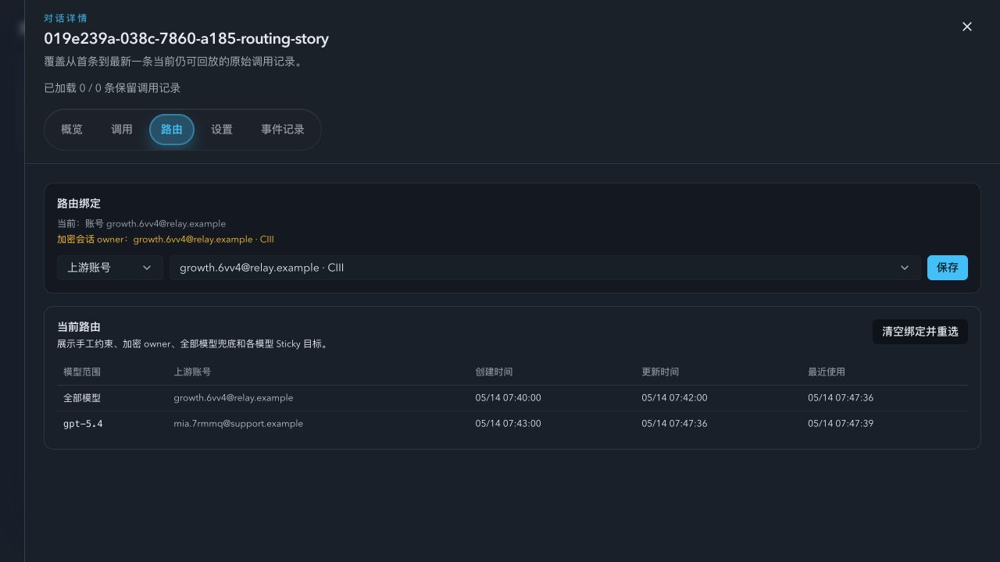
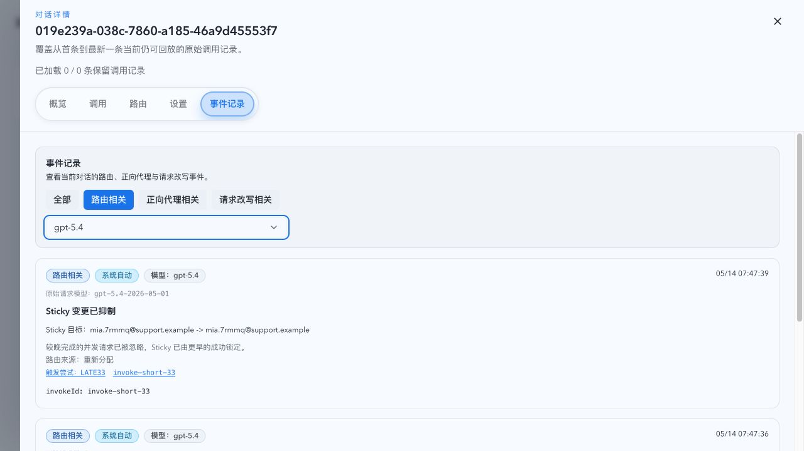
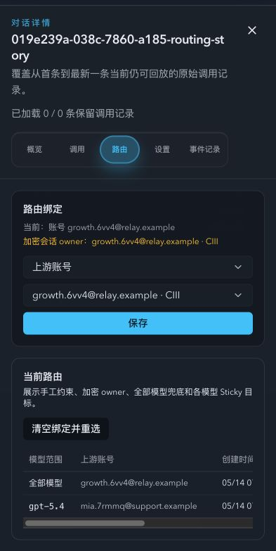

- source_type: storybook_canvas
- target_program: mock-only
- capture_scope: Storybook canvas iframe
- requested_viewports: `desktop1280`, `393x852`
- viewport_strategy: Storybook desktop preset plus explicit responsive browser viewport
- margin_policy: trim_only
- evidence_surface: page
- sensitive_exclusion: fixture-only conversation and account identifiers
- submission_gate: approved
- story_id_or_title: `Monitoring/PromptCacheConversationTable / DrawerRouting`, `DrawerRoutingMobile`, `DrawerOperations`
- state: manual route binding, encrypted owner constraint, all-model fallback, and normalized model route are visible; a routing-only filter selects `gpt-5.4` and shows model-scope plus original-model audit context; the 393px tab strip fits all five tabs and the confirmed reset explains its conversation-wide scope.

### Affinity Reset Confirmation (Storybook)

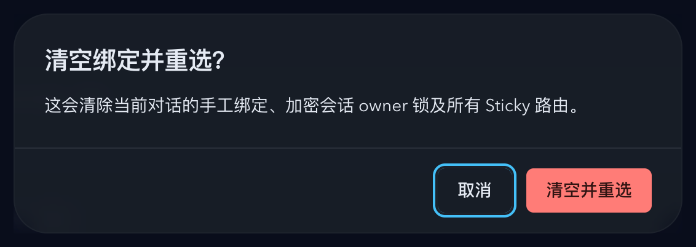

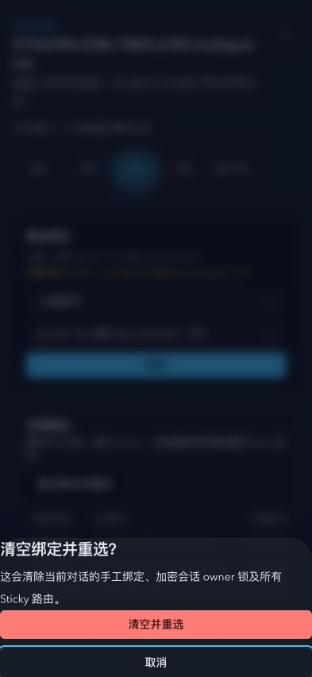

- source_type: storybook_canvas
- target_program: mock-only
- capture_scope: element
- requested_viewports: `desktop1280`, `393x852`
- viewport_strategy: Storybook viewport presets
- margin_policy: require_margin
- evidence_surface: component
- sensitive_exclusion: fixture-only conversation and account identifiers
- submission_gate: approved
- story_id_or_title: `Monitoring/PromptCacheConversationTable / DrawerRoutingResetConfirm`, `DrawerRoutingResetConfirmMobile`
- state: the conversation-wide reset is open; the title and explanation have a dedicated padded content group, while destructive and cancel actions sit in a separated safe-area footer.

### Sticky Causality (UI Demo)

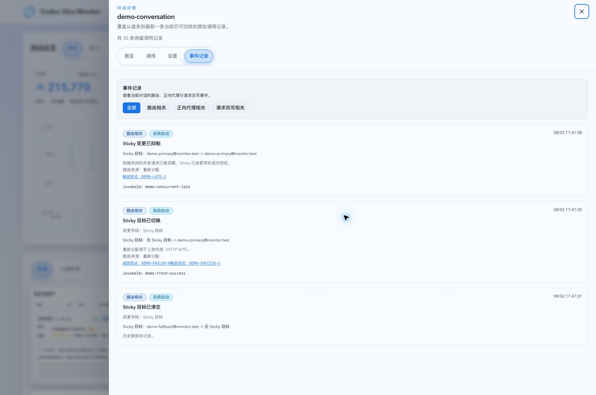

- source_type: ui_demo
- target_program: mock-only
- capture_scope: browser-viewport
- requested_viewport: desktop default
- viewport_strategy: ui-demo-source
- margin_policy: trim_only
- evidence_surface: page
- sensitive_exclusion: fixture-only conversation and attempt identifiers
- submission_gate: approved
- state: a failed 429 attempt leads to fresh assignment; a later concurrent success is visibly suppressed and links to its attempt.
- evidence_note: the third historical event intentionally has no context and displays `历史原因未记录`.

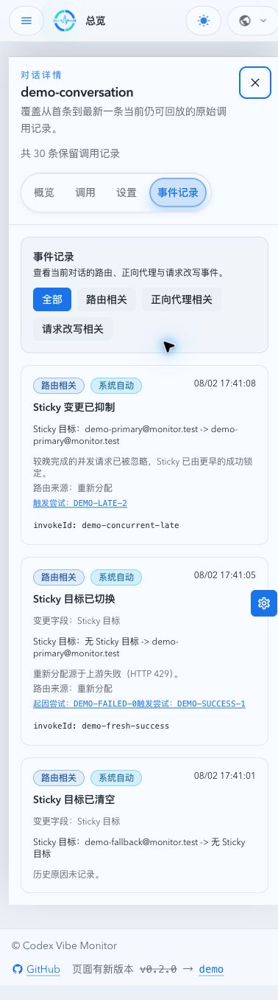

- source_type: ui_demo
- target_program: mock-only
- capture_scope: browser-viewport
- requested_viewport: 393x852
- viewport_strategy: devtools-emulate
- margin_policy: trim_only
- evidence_surface: page
- sensitive_exclusion: fixture-only conversation and attempt identifiers
- submission_gate: approved
- state: the same causal chain is readable at the required mobile viewport without overlap or truncation.

### Selection Audit (UI Demo)

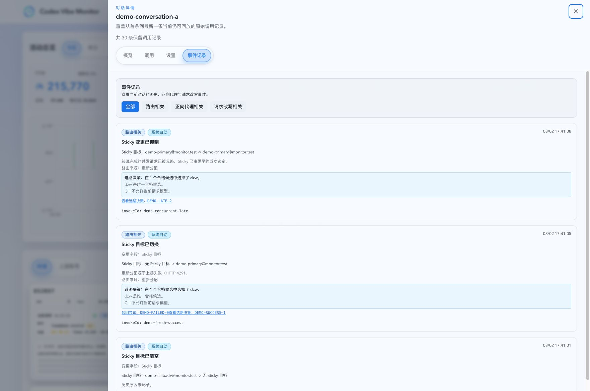

- source_type: ui_demo
- target_program: mock-only
- capture_scope: browser-viewport
- requested_viewport: desktop default
- viewport_strategy: Chrome default viewport
- margin_policy: trim_only (no trim applied: ambiguous border)
- evidence_surface: page
- sensitive_exclusion: fixture-only conversation and attempt identifiers
- submission_gate: approved
- state: the Sticky event names the selected account, decisive rule, bounded rejected candidate, cause attempt, and selected attempt whose Records detail contains the same immutable audit.

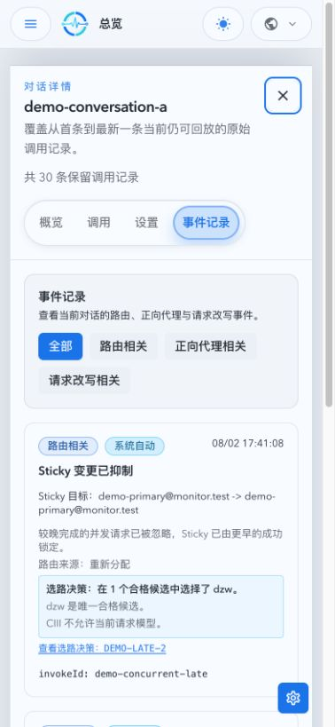

- source_type: ui_demo
- target_program: mock-only
- capture_scope: browser-viewport
- requested_viewport: 393x852
- viewport_strategy: Chrome viewport override
- margin_policy: trim_only (no trim applied: ambiguous border)
- evidence_surface: page
- sensitive_exclusion: fixture-only conversation and attempt identifiers
- submission_gate: approved
- state: the audit summary and Records deep link remain readable without overlap or truncation.

### Routing Decision Score Snapshot (Storybook)

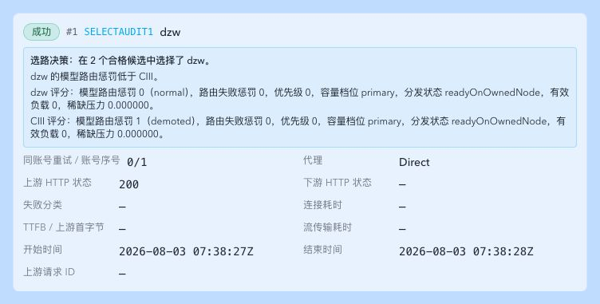

- source_type: storybook_canvas
- target_program: mock-only
- capture_scope: element
- requested_viewport: none
- viewport_strategy: storybook-viewport
- margin_policy: require_margin
- evidence_surface: component
- sensitive_exclusion: N/A
- submission_gate: approved
- story_id_or_title: `Invocations/PoolAttemptRecordCard/FreshAssignmentRoutingDecision`
- state: a fresh assignment shows dzw with model-route penalty `0 (normal)` and CIII with `1 (demoted)`, alongside the other routing comparator fields.
- evidence_note: proves the winner label is backed by persisted numeric values rather than an unexplained assertion.

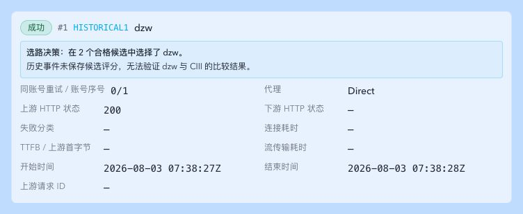

- source_type: storybook_canvas
- target_program: mock-only
- capture_scope: element
- requested_viewport: none
- viewport_strategy: storybook-viewport
- margin_policy: require_margin
- evidence_surface: component
- sensitive_exclusion: N/A
- submission_gate: approved
- story_id_or_title: `Invocations/PoolAttemptRecordCard/HistoricalDecisionWithoutScore`
- state: a legacy event explicitly says candidate scores were not recorded and the comparison cannot be verified.
- evidence_note: proves historical data is not retroactively reconstructed from current account health.

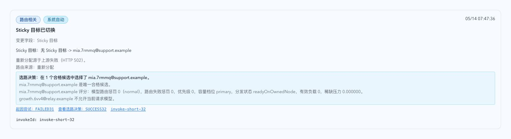

- source_type: storybook_canvas
- target_program: mock-only
- capture_scope: element
- requested_viewport: none
- viewport_strategy: storybook-viewport
- margin_policy: require_margin
- evidence_surface: component
- sensitive_exclusion: N/A
- submission_gate: approved
- story_id_or_title: `PromptCacheConversationTable/DrawerOperations`
- state: the routing event exposes a separate corresponding-invocation link carrying the exact attempt and invoke IDs.
- evidence_note: proves the operator can distinguish the routing-decision link from the exact Records invocation target.

### Dashboard Bulk Actions (Web Demo)

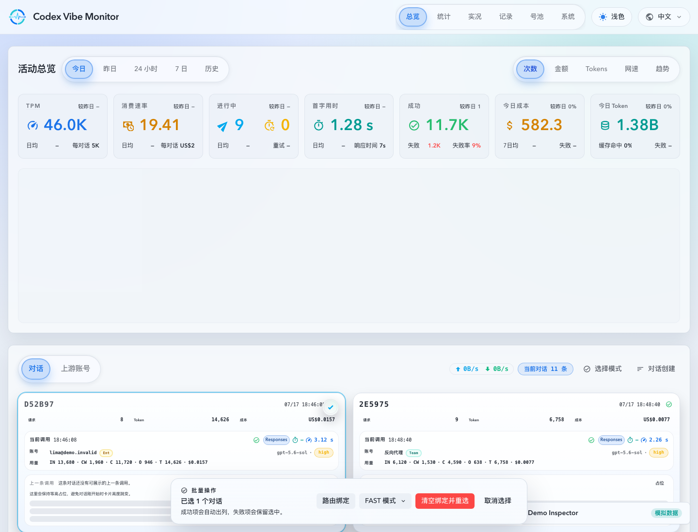

- source_type: ui_demo
- target_program: mock-only
- capture_scope: page
- requested_viewport: desktop1440
- viewport_strategy: fixed demo route
- sensitive_exclusion: N/A
- submission_gate: approved
- demo_route: `/dashboard?demoScene=attention&demoTheme=light`
- state: one conversation selected via `Cmd`/`Ctrl`-modified click while persistent selection mode remains off
- evidence_note: verifies the selected-card affordance, fixed bottom-center floating bulk action bar, and temporary modifier-key selection path without flipping the header into selection mode.

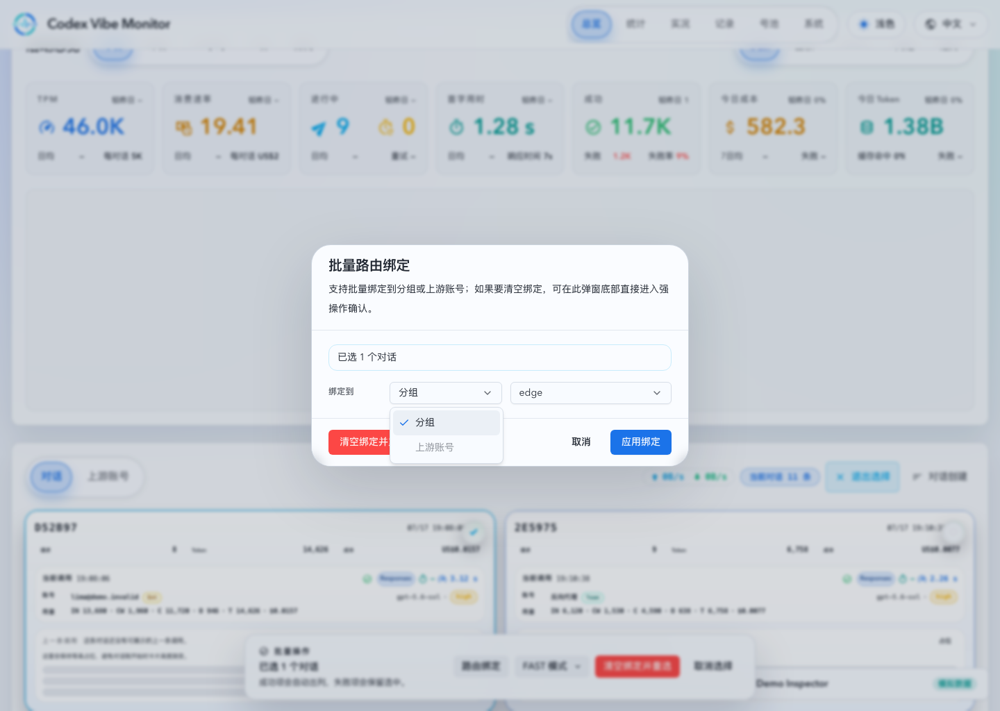

- source_type: web_demo
- target_program: mock-only
- capture_scope: dialog
- requested_viewport: desktop1440
- viewport_strategy: fixed demo route
- sensitive_exclusion: N/A
- submission_gate: approved
- demo_route: `/dashboard?demoScene=attention&demoTheme=light`
- state: route-bind kind selector opened with `分组` and `上游账号` options while the dialog still keeps the single-row `绑定到 / kind / target` layout
- evidence_note: verifies the dialog no longer uses the earlier segmented switch, keeps the compact one-line binding row, and exposes the kind chooser as a dropdown instead of a persistent tabbed control.

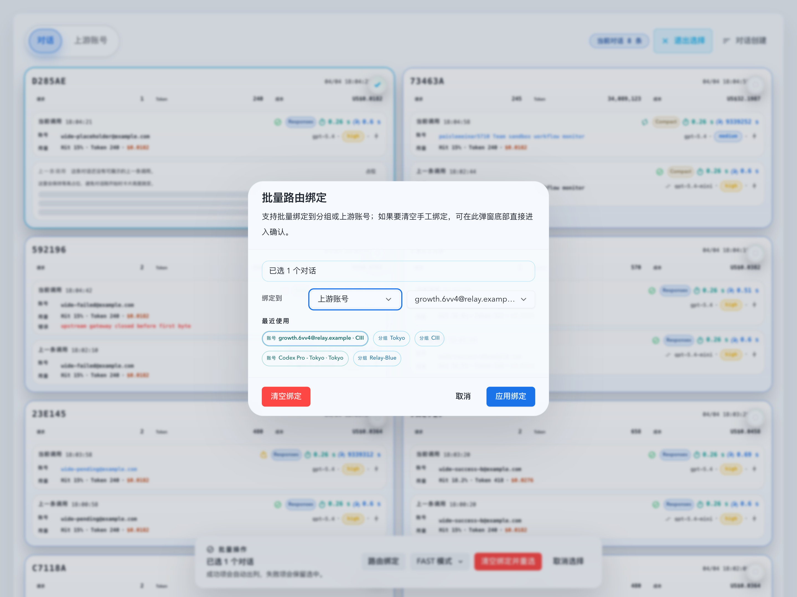

- source_type: storybook_canvas
- target_program: mock-only
- capture_scope: browser-viewport
- requested_viewport: desktop1440
- viewport_strategy: devtools-emulate
- sensitive_exclusion: N/A
- submission_gate: owner-requested desktop screenshot
- story_id_or_title: `Dashboard/WorkingConversationsSection/ConversationBulkRouteBindDialogRecentTargets`
- state: selected Dashboard conversation with the route-bind dialog open in the desktop layout, the restored upstream-account MRU target selected, and the full recent-chip strip visible below the binding row
- evidence_note: captured from the Google Chrome Storybook iframe at a desktop viewport; verifies browser-local MRU restoration, unified variable-width recent chips, and the absence of any overflow placeholder chip in the desktop layout.

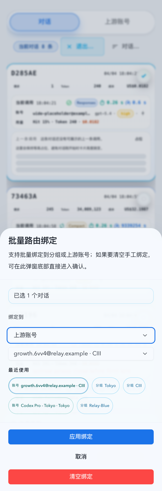

- source_type: storybook_canvas
- target_program: mock-only
- capture_scope: browser-viewport
- requested_viewport: mobile390
- viewport_strategy: devtools-emulate
- sensitive_exclusion: N/A
- submission_gate: owner-requested mobile screenshot
- story_id_or_title: `Dashboard/WorkingConversationsSection/ConversationBulkRouteBindDialogRecentTargetsMobile`
- state: selected Dashboard conversation with the route-bind dialog open in the compact mobile layout, the restored upstream-account MRU target selected, and only the recent chips that fit within the two-row budget rendered below the binding row
- evidence_note: captured from the Google Chrome Storybook iframe at a mobile viewport; verifies the same variable-width chip language on mobile and confirms the extra tail items are omitted instead of rendering any `+N 更多` chip or alternate selector.

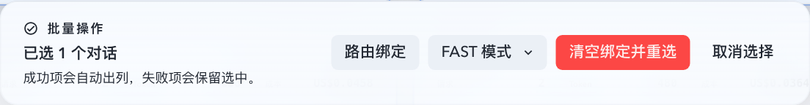

- source_type: storybook_canvas
- target_program: mock-only
- capture_scope: component
- requested_viewport: desktop1660
- viewport_strategy: storybook-viewport
- sensitive_exclusion: N/A
- submission_gate: approved
- story_id_or_title: `Monitoring/DashboardWorkingConversationsSection/ConversationBulkPanelOpen`
- state: one Dashboard conversation selected while the floating bulk bar shows the restored standalone destructive `清空绑定并重选` action
- evidence_note: verifies the bottom bulk bar keeps the independent clear-and-reselect entry point, rather than repurposing that red button into the pure manual-binding clear flow owned by the route-bind dialog footer.

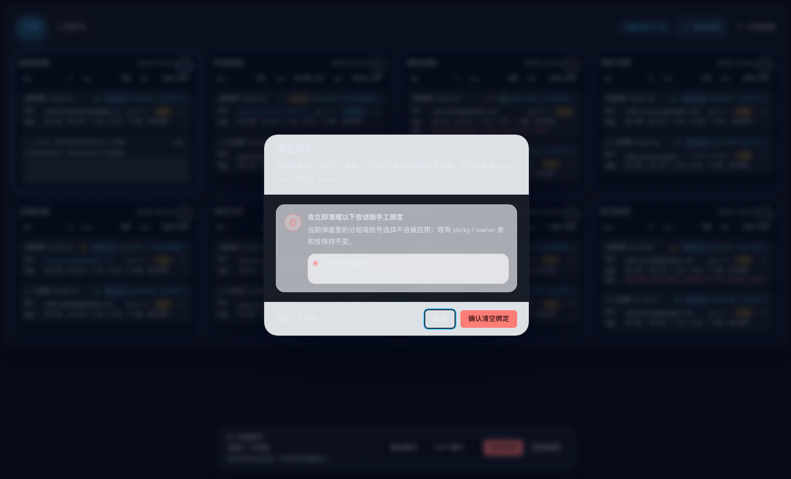

- source_type: storybook_canvas
- target_program: mock-only
- capture_scope: page
- requested_viewport: desktop1440
- viewport_strategy: storybook-viewport
- sensitive_exclusion: N/A
- submission_gate: approved
- story_id_or_title: `Monitoring/DashboardWorkingConversationsSection/ConversationBulkClearConfirm`
- state: selected Dashboard conversations with the destructive manual-binding clear confirmation dialog open
- evidence_note: verifies the owner-facing copy says `清空绑定` / `确认清空绑定`, omits the prior `重选` wording, states that sticky route plus encrypted owner lock rows are not cleared by this Dashboard action, and keeps the dialog chrome plus destructive callout on the active dark-theme surfaces instead of mixing in light-theme header/footer colors.

### Conversation Drawer Controls (Storybook)

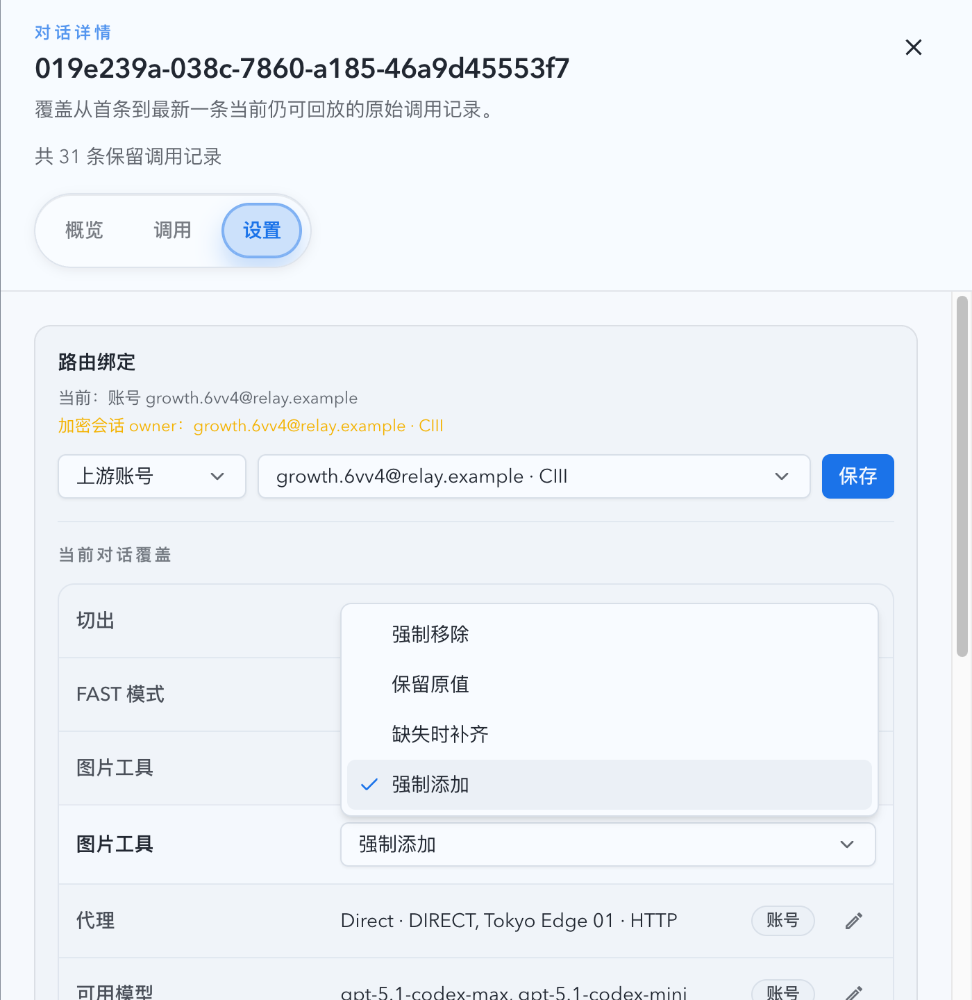

- source_type: storybook_canvas
- target_program: mock-only
- capture_scope: element
- requested_viewport: desktop1280
- viewport_strategy: storybook-viewport
- sensitive_exclusion: N/A
- submission_gate: approved
- story_id_or_title: `Monitoring/PromptCacheConversationTable/DrawerBindingAndTimeouts`
- state: image tool policy saved as `force_add`, field editor remains expanded
- evidence_note: verifies that a concrete image-tool rewrite choice updates the summary and leaves the field-local editor open; the story's Chromium play test separately verifies that FAST mode and image tool menus expose only the four concrete rewrite modes and omit inheritance.

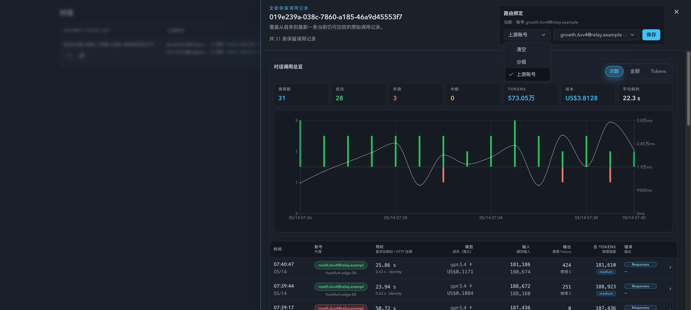

The Storybook `DrawerBindingControls` scenario renders the Prompt Cache conversation detail drawer with the binding panel preloaded in upstream-account mode. The evidence image is a readable browser screenshot of the mock-only Storybook iframe viewport with the route binding panel and opened UI-library Select/Radix options (`Clear`, `Group`, `Account`) visible in business context. The unit coverage also asserts that the binding panel no longer renders native `<select>` elements and instead exposes `combobox` controls.

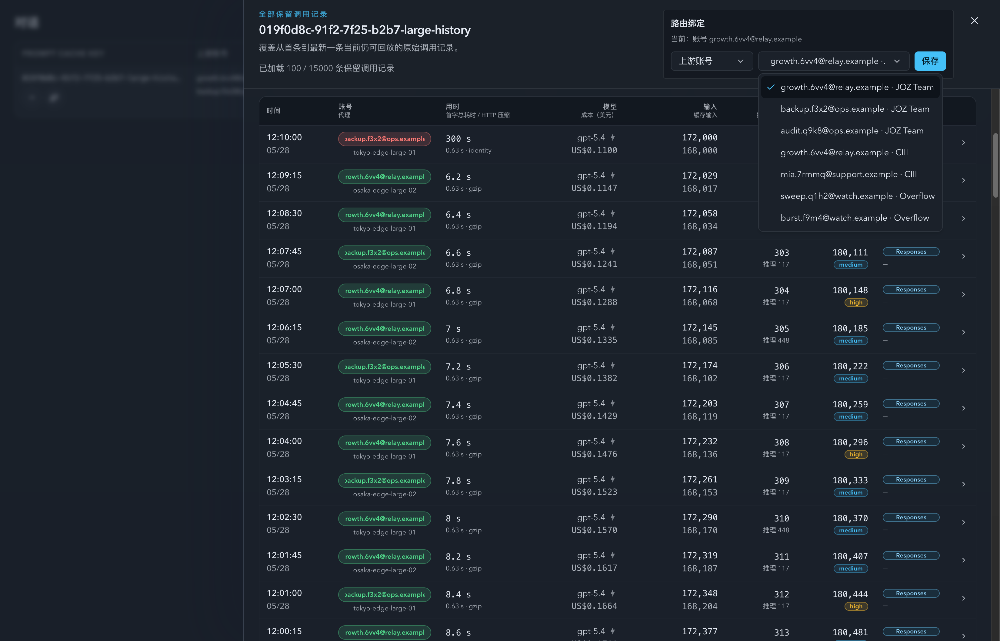

The Storybook `LargeHistoryVirtualizedDrawer` scenario renders a 15,000-record retained-history drawer. The evidence image shows the binding controls, summary chart, opened account binding target listbox, and virtualized invocation table after loading the second 50-record page (`已加载 100 / 15000 条保留调用记录`). Browser verification observed 28 mounted table rows and 4,248 total DOM elements, rather than mounting rows proportional to the 15,000-record total.

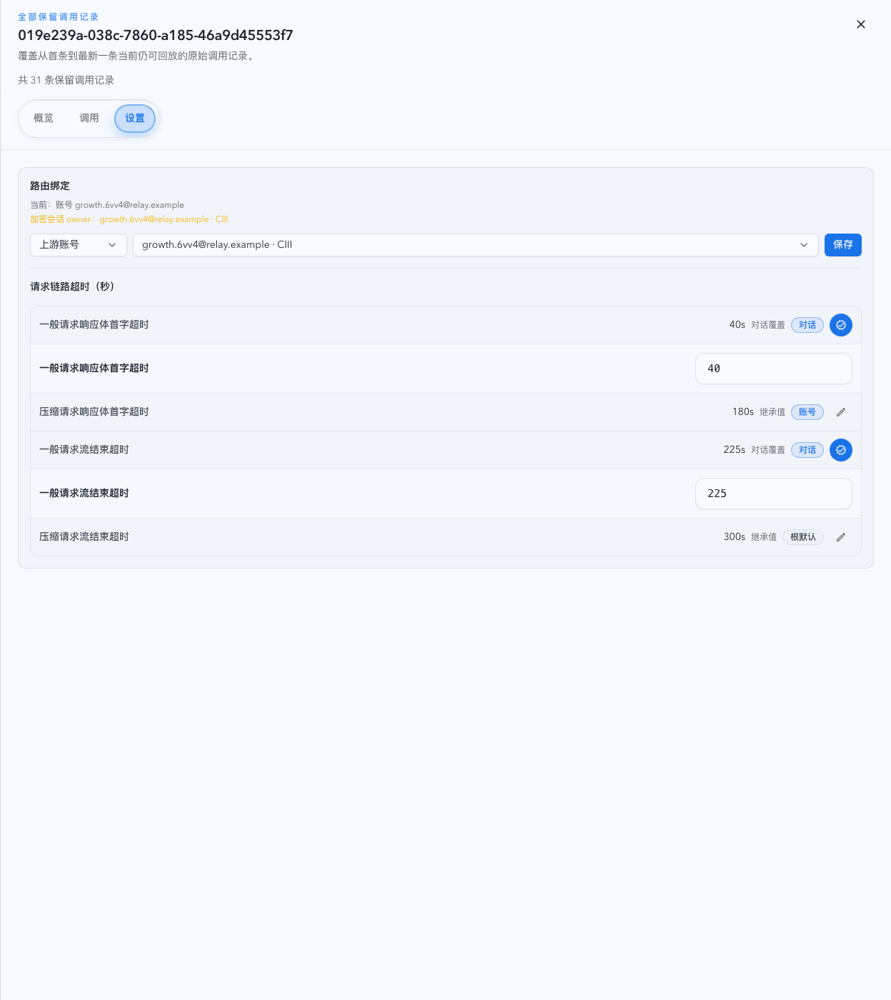

The Storybook `DrawerBindingAndTimeouts` scenario renders the conversation drawer with an upstream-account binding plus mixed conversation/account/root timeout sources. The timeout subpanel now follows the same summary-row + field-local expansion contract as the effective routing rule card: inherited rows stay collapsed, conversation-owned timeout rows expand when edited, and timeout-only persistence remains visible even when `bindingKind='none'`.

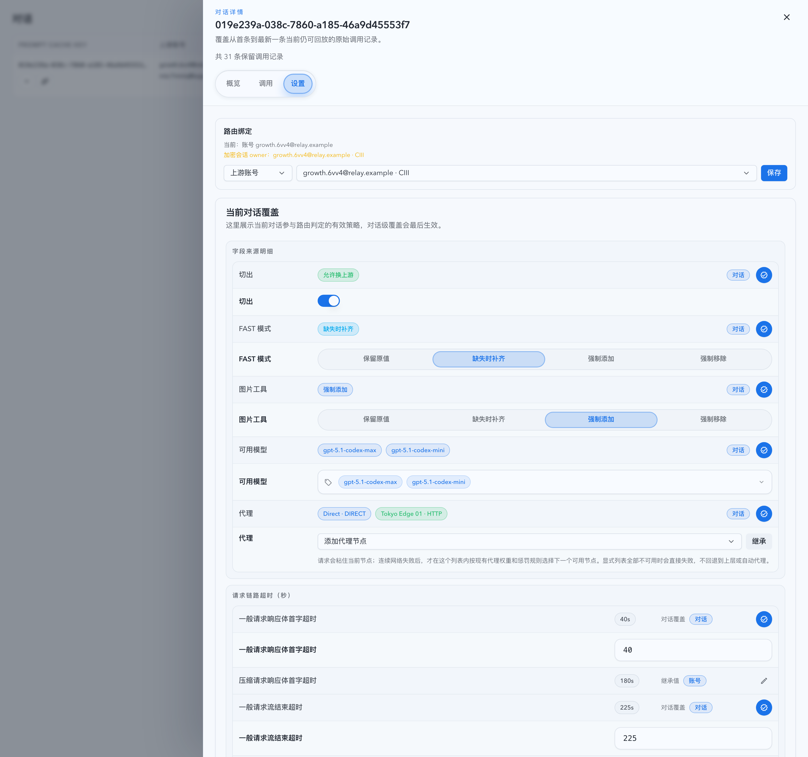

The Storybook `DrawerBindingAndTimeouts` scenario now also renders the widened conversation detail drawer on the Settings tab with the same summary-row and field-local editing skeleton used by account routing: the separate route-binding block remains intact, conversation-owned rows and timeouts are expanded by default, account-only routing rows stay hidden, available models and proxy bindings render as the shared chip-based controls, and the drawer width remains fixed while the account-style routing form grows vertically.

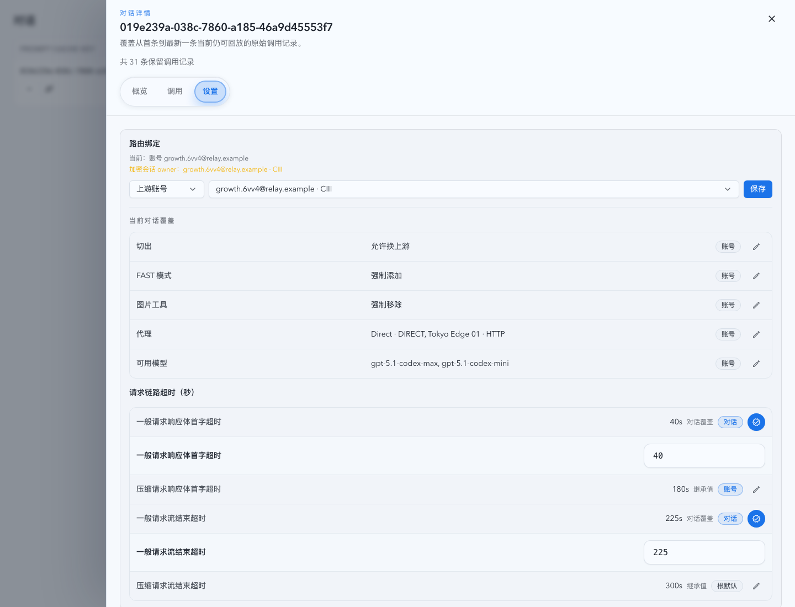

The Storybook `DrawerBindingAndTimeouts` scenario also shows a multi-node conversation proxy list so the drawer contract remains reviewable alongside the Dashboard bulk-entry points.

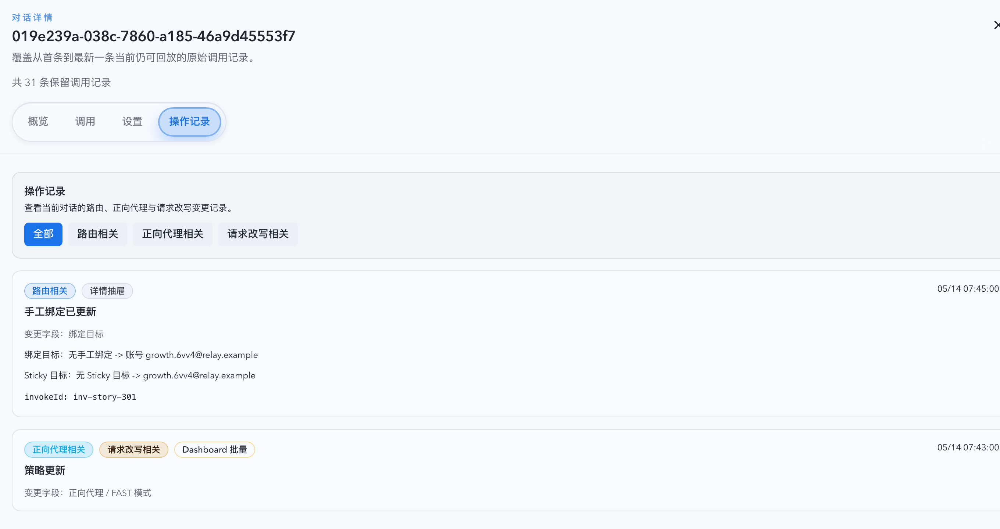

- source_type: storybook_canvas
- target_program: mock-only
- capture_scope: browser-viewport
- requested_viewport: desktop1280
- viewport_strategy: storybook-viewport
- margin_policy: trim_only
- evidence_surface: page
- sensitive_exclusion: N/A
- submission_gate: approved
- story_id_or_title: `Monitoring/PromptCacheConversationTable/DrawerOperations`
- state: events tab shows the historical affinity-reset recovery sequence and a later `systemAuto stickyTargetChanged` event with `invokeId`; legacy `stickyTargetCleared` remains readable as an all-model historical event.
- evidence_note: verifies compatibility for pre-model-scope event data. New reset events instead aggregate all cleared buckets into `affinityReset.stickyTransitions`.

- source_type: storybook_canvas
  story_id_or_title: `Monitoring/PromptCacheConversationTable / Drawer Binding And Timeouts`
  state: conversation settings image-tool help open
  requested_viewport: none
  viewport_strategy: storybook-viewport
  margin_policy: trim_only
  evidence_surface: page
  evidence_note: verifies the actual conversation settings drawer retains the four inherited policy values while explaining that Lite client-owned tools remain unchanged.
  target_program: mock-only
  capture_scope: browser-viewport
  sensitive_exclusion: fixture-only conversation data
  submission_gate: approved
  image:
  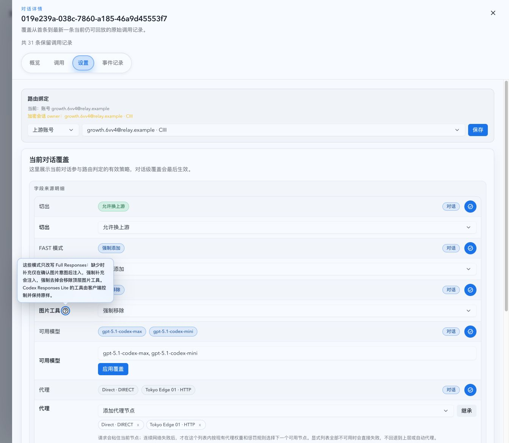

### Routing Escape Recovery (Storybook)

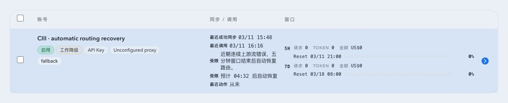

- source_type: storybook_canvas
- target_program: mock-only
- capture_scope: element
- requested_viewport: desktop1440
- viewport_strategy: devtools-emulate
- margin_policy: trim_only
- evidence_surface: component
- sensitive_exclusion: N/A
- submission_gate: approved
- story_id_or_title: `Account Pool/Components/Upstream Accounts Table/RecentStreamErrorsDegraded`
- state: CIII is healthy but work-degraded, with a localized recent stream-error reason and a live `mm:ss` recovery countdown.
- evidence_note: element capture after the reason layout was changed to wrap instead of truncating; the countdown remains on its own row.

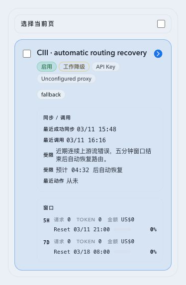

- source_type: storybook_canvas
- target_program: mock-only
- capture_scope: element
- requested_viewport: narrow390
- viewport_strategy: devtools-emulate
- margin_policy: trim_only
- evidence_surface: component
- sensitive_exclusion: N/A
- submission_gate: approved
- story_id_or_title: `Account Pool/Components/Upstream Accounts Table/RecentStreamErrorsDegradedNarrow`
- state: narrow account card shows the full localized reason on wrapped lines, normal health, degraded work status, and the recovery countdown.
- evidence_note: narrow element capture confirms the localized reason and countdown fit without overlap or clipping.

### Conversation Detail Realtime (Web Demo)

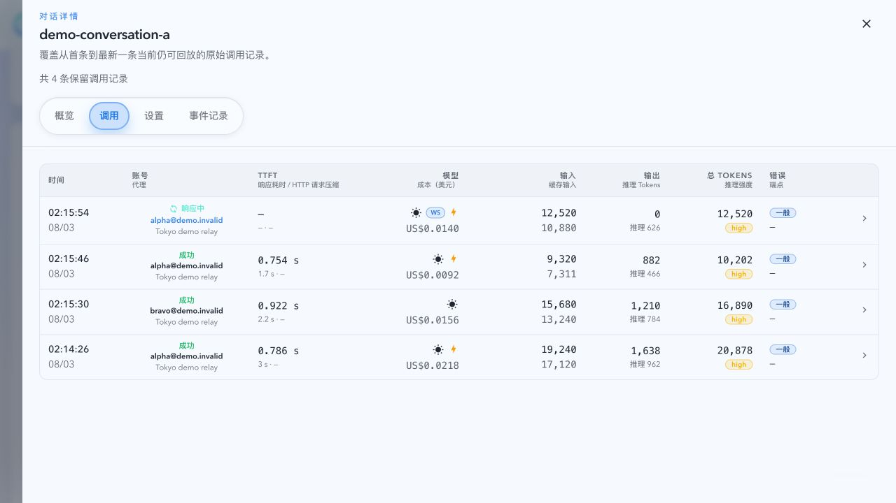

- source_type: web_demo
- target_program: mock-only
- capture_scope: page
- requested_viewport: desktop
- viewport_strategy: default browser viewport
- margin_policy: trim_only
- evidence_surface: page
- sensitive_exclusion: fixture-only conversation data
- submission_gate: approved
- demo_route: `/#/live`
- state: `demo-conversation-a` drawer open on Calls, showing a live responding row and terminal rows from the current topic window
- evidence_note: verifies that the detail drawer hydrates its Calls tab from the realtime window without the historical list loading state.

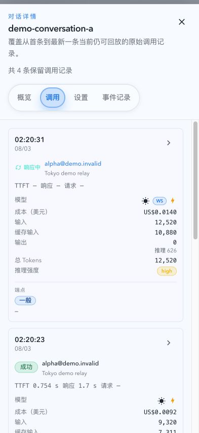

- source_type: ui_demo
- target_program: mock-only
- capture_scope: page
- requested_viewport: 393x852
- viewport_strategy: browser viewport override
- margin_policy: trim_only
- evidence_surface: page
- sensitive_exclusion: fixture-only conversation data
- submission_gate: approved
- demo_route: `/#/live?demoEmbed=1`
- state: `demo-conversation-a` drawer open on Calls in the compact single-column record layout
- evidence_note: verifies that the responding row and terminal cards remain readable without clipping at the required mobile viewport.

### Shared Invocation Cards (UI Demo)

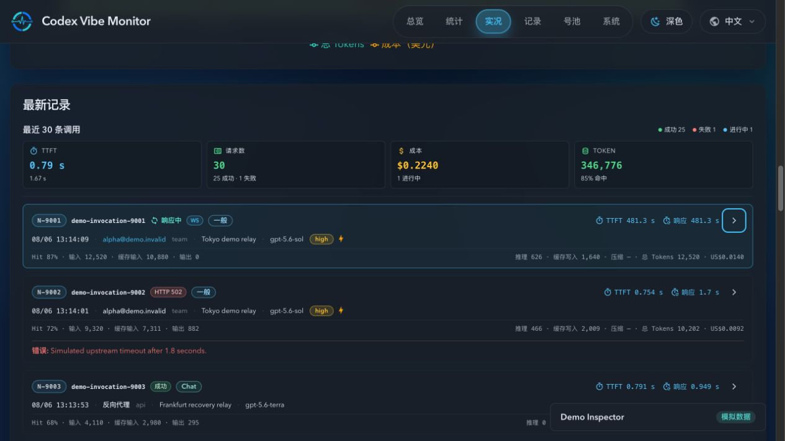

- source_type: ui_demo
- target_program: mock-only
- capture_scope: page
- evidence_bound_sha: 11a047d6e41de8d6f17c889fb0bc1272345b42d9
- requested_viewport: desktop
- viewport_strategy: ui-demo-source
- margin_policy: trim_only
- evidence_surface: page
- sensitive_exclusion: fixture-only invocation and conversation data
- submission_gate: approved
- demo_routes: `/#/live?demoScene=attention&demoTheme=dark`, shared conversation Calls drawer
- state: Live and conversation Calls consumers render the same three-segment invocation cards, retain the invocation ID and diagnostics without repeating the conversation ID, and show elapsed TTFT/response values on the in-flight row.
- evidence_note: desktop evidence verifies the compact summary strip, dense three-line card projection, full diagnostic fields, and the existing whole-card detail affordance.

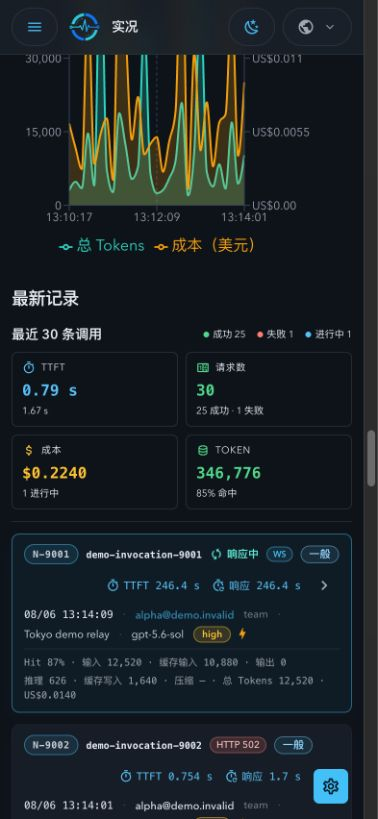

- source_type: ui_demo
- target_program: mock-only
- capture_scope: page
- evidence_bound_sha: 11a047d6e41de8d6f17c889fb0bc1272345b42d9
- requested_viewport: 393x852
- viewport_strategy: ui-demo-source
- margin_policy: trim_only
- evidence_surface: page
- sensitive_exclusion: fixture-only invocation and conversation data
- submission_gate: approved
- demo_route: `/#/live?demoScene=attention&demoTheme=dark`
- state: the same card list wraps by semantic groups at 393px without clipping or repeating the surrounding conversation ID.
- evidence_note: mobile evidence verifies stable touch targets, readable metadata, and no horizontal overflow.

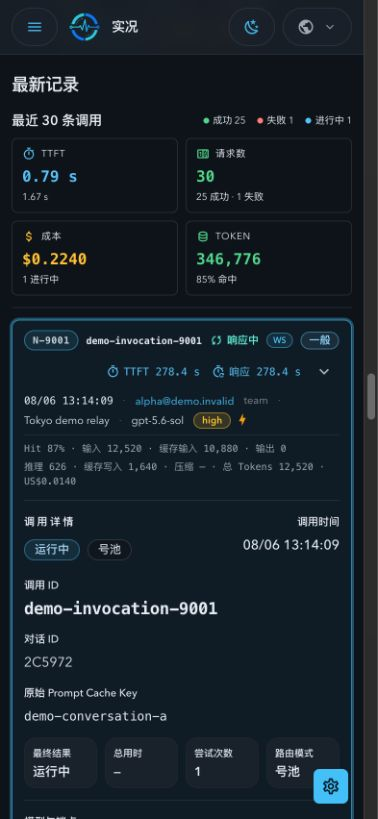

- source_type: ui_demo
- target_program: mock-only
- capture_scope: page
- evidence_bound_sha: 11a047d6e41de8d6f17c889fb0bc1272345b42d9
- requested_viewport: 393x852
- viewport_strategy: ui-demo-source
- margin_policy: trim_only
- evidence_surface: page
- sensitive_exclusion: fixture-only invocation and conversation data
- submission_gate: approved
- demo_route: `/#/live?demoScene=attention&demoTheme=dark`
- state: the first invocation card is expanded and keeps the existing InvocationWorkflowDetailPanel inside the same card boundary.
- evidence_note: expanded evidence verifies the unchanged detail content and card-level expansion entry point on the narrow layout.

## Image Tool Override Boundary

Conversation `imageToolRewriteMode` remains a four-value inherited policy. Its help affordance must state that the modes rewrite Full Responses only; a Codex Responses Lite request retains client-owned tools unchanged, including `force_remove`.
