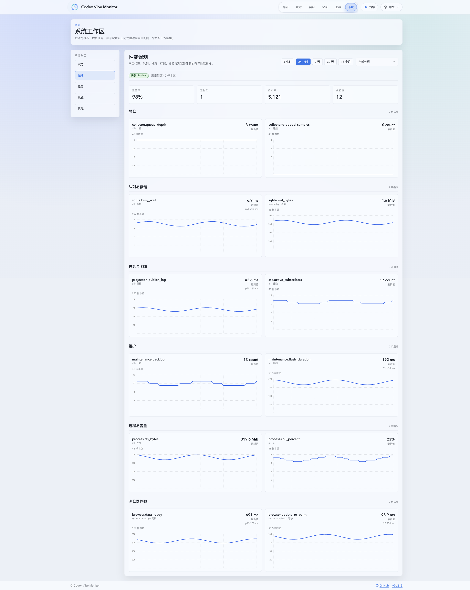
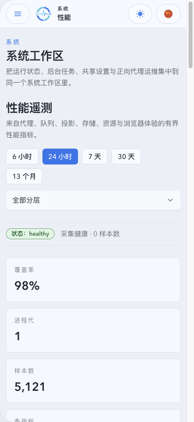

# 独立性能遥测

## 状态

- Status: active
- Owner-facing surface: system performance workspace

## 背景

SQLite 写协调器、读模型、SSE、维护任务、进程资源和浏览器渲染拥有不同的等待与积压边界。代理请求的阶段耗时、结果和重试已经由业务主库调用明细记录；现有调用明细适合定位单次请求，System Status 适合查看当前快照，但两者不能提供低成本的跨层系统趋势。本主题定义一个与业务主库隔离、可丢弃、固定低基数的性能趋势存储。

## Requirements

- REQ-001: 性能遥测必须写入与业务主库不同的 SQLite 文件；遥测文件路径可通过 `PERFORMANCE_DATABASE_PATH` 覆盖，默认位于主库同目录，路径相同必须拒绝启用遥测。 covers: [ADR 0019](../../adr/0019-isolated-bounded-performance-telemetry.md)
- REQ-002: 遥测库一次创建最终 schema；初始化、schema 标记无法识别、写入、滚动和查询失败不得阻断主库启动、代理响应、P1 terminal ACK 或 `/health`。标记无法识别只将遥测标为 `unavailable`，不得执行在线结构转换、删桶或填充伪造的零值。 covers: [ADR 0019](../../adr/0019-isolated-bounded-performance-telemetry.md)
- REQ-003: 指标只能来自代码内固定注册表和固定离散维度；不得持久化 account、model、URL、SQL、IP、invocation、conversation 或任意请求身份维度。 covers: [性能指标设计](../../research/performance-telemetry-design.md)
- REQ-003A: 固定注册表最多允许 160 条近期序列和 32 条长期序列；当前范围收窄后为 104 条近期序列和 22 条长期序列。超过 30 天的查询只返回长期序列，未发生过观测的序列保留元数据但不生成伪造样本点。 covers: [性能指标设计](../../research/performance-telemetry-design.md)
- REQ-004: 遥测必须支持事件计数、可合并耗时直方图、时间加权存量、lag/进度和覆盖质量；缺测、丢弃、重启间隔、deferred 和真实零值必须可区分。 covers: [性能指标设计](../../research/performance-telemetry-design.md)
- REQ-005: 留存层必须是最近 7 天 1 分钟、随后至第 30 天 5 分钟、随后至第 13 个月 1 小时；升层先合并分布和存量再删除源桶，操作可重入。 covers: [ADR 0019](../../adr/0019-isolated-bounded-performance-telemetry.md)
- REQ-006: 采集热路径只能更新有界内存状态或执行非阻塞入队；独立 writer 使用短事务、WAL、有限批量和有界退避，队列满时丢弃低优先级样本并记录丢弃量。 covers: [性能指标设计](../../research/performance-telemetry-design.md)
- REQ-007: 系统必须提供独立性能查询和采集健康 API；查询只接受固定时间范围和分层枚举，单次响应最多 720 个点，并能在 `/api/system/status` 不可用时工作。 covers: [性能指标设计](../../research/performance-telemetry-design.md)
- REQ-008: 浏览器体验只按固定页面族、设备档、可见性和结果类低频汇总上报；请求体必须有大小、枚举、数值和速率限制，不包含 URL 参数、页面内容或用户身份。 covers: [性能指标设计](../../research/performance-telemetry-design.md)
- REQ-009: 系统工作区必须展示队列/SQLite、投影/SSE、维护、资源和浏览器体验趋势，并显式显示覆盖率、缺测、重启和遥测降级状态；代理请求阶段和历史 API 明细继续以业务主库为准。 covers: [性能指标设计](../../research/performance-telemetry-design.md)

## API Contract

完整指标 ID、类型、维度、单位、留存和采集含义见[指标目录](METRICS.md)。

- `GET /api/system/performance?range=6h|24h|7d|30d|13mo&section=overview|storage|projection|maintenance|process|browser` 返回 `from`、`to`、`stepSeconds`、`coverage`、`epochs` 和固定注册表中的 `series`；耗时点带可合并的固定桶 `histogram`，存量点保留时间加权平均、末值和范围，缺测点的 `sampleCount` 为零且不伪造观测值。指标页必须展示所选分层的全部序列，并提供样本数、未知桶和耗时 p95 摘要。代理请求阶段、状态和历史 API 请求量不进入该接口。
- `GET /api/system/performance/health` 只读遥测运行状态、最后成功写入、队列占用、丢弃数、失败次数和路径，不依赖 System Status 缓存。
- `POST /api/system/performance/browser` 只接受固定页面族和聚合观测，服务端执行同源/Fetch Metadata 检查与全局/IP 限频。

## Non-goals

- 不提供逐请求 trace、原始性能事件或高基数长期维度。
- 不回扫主库、raw 文件或 archive 来制造遥测数据。
- 不让遥测成为业务一致性或请求完成条件。

## Acceptance Criteria

- 主库可用而遥测库损坏、只读、磁盘满或路径冲突时，代理和 `/health` 仍能工作，健康 API 返回明确的不可用状态。
- 分钟到五分钟、五分钟到小时的边界滚动在重试后不重不漏，直方图合并后可重新计算分位数。
- 性能页在无数据、部分覆盖、状态 API 503 和浏览器不支持 long task 时显示未知/缺测而不是零。
- 代表性代理与 SSE 负载下的采集开销 A/B 保留为发布后诊断证据；共享测试机无法提供稳定的禁用遥测基线时，不得将其作为合并门禁，也不得把主库维护争用归因于遥测。遥测文件体积、故障隔离和容量查询仍须满足 A7 门槛。
- 遥测开关对照使用未饱和的 `overhead` 场景：固定 16 条 SSE，并使用基线探测确认的可持续请求速率；50 req/s 的 `sustained` 场景单独记录业务容量压力，不把主库饱和造成的 P95 差异归因于遥测。

## Related ADRs

- [ADR 0019: Isolated and Bounded Performance Telemetry](../../adr/0019-isolated-bounded-performance-telemetry.md)

## Visual Evidence

- 视觉证据：已完成
- 视觉证据目标源：真实 Web Demo，`/system/performance`
- source_type：`ui_demo`
- target_program：`vite_web_demo`
- capture_scope：性能页完整渲染面
- requested_viewport：桌面默认视口、`393x852`
- evidence_surface：Web Demo 页面
- 页面级证据不使用 Storybook
- 视觉比较：需确认；当前仓库没有可用的历史基线

