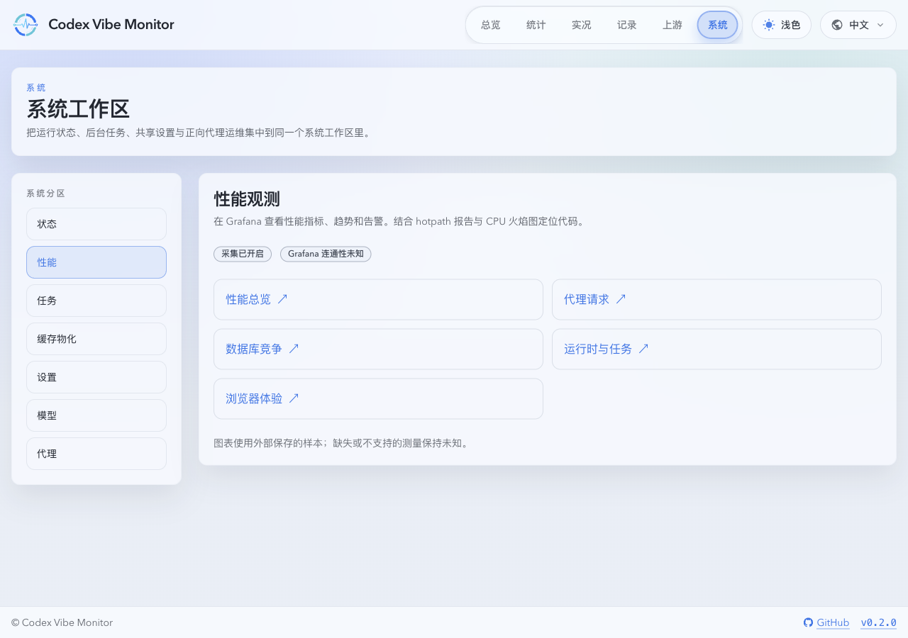
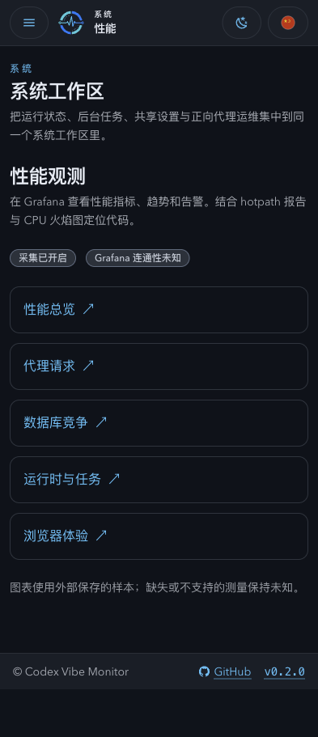
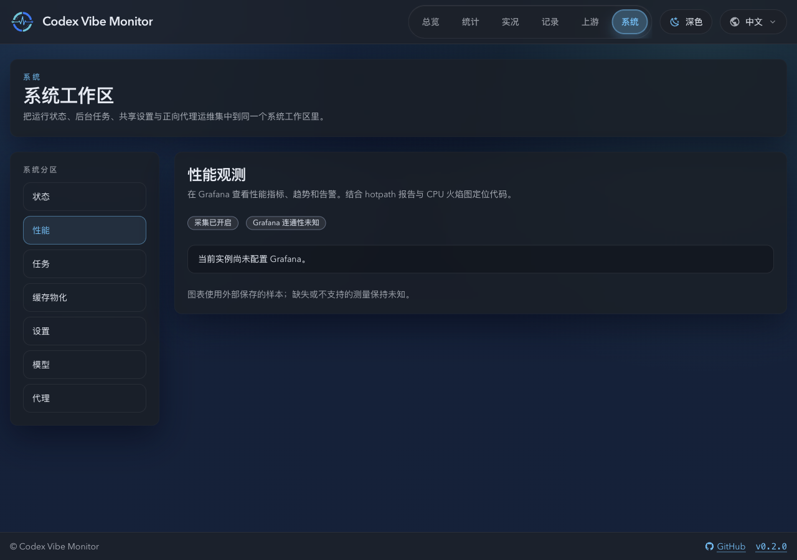
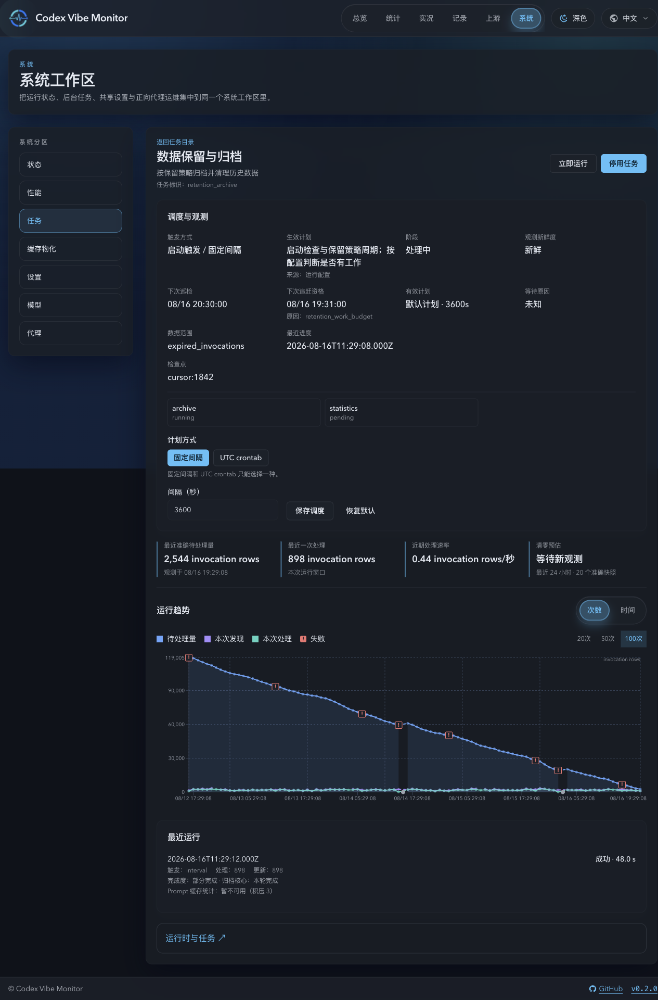

# 外部性能观测与旧性能库退役

## 状态

- Status: active
- Owner-facing surface: Grafana dashboards and application observability entry

## Context and Scope

数据库竞争、CPU 异常与响应慢需要跨层指标、代码归因和按需 CPU 调用栈。Prometheus 独占聚合指标历史，Grafana 负责图表与告警，hotpath-rs 提供进程内诊断；应用只维护有界内存累计和入口。业务主库、任务库、TerminalJournal、raw/archive 与调用明细仍是原有业务事实源。

## Requirements

- REQ-001: 应用不得创建、打开或写入旧性能 SQLite；旧 collector、writer、time bucket、rollup 和历史查询全部退役。 covers: [ADR 0025](../../adr/0025-external-performance-observability.md)
- REQ-002: 合法配置下采样器、exporter、hotpath、Prometheus 或 Grafana 故障只使观测降级，不阻断代理、终态 ACK、任务与业务健康。测试实例必须使用独立 recorder。 covers: [锁定架构](../../design/performance-observability.md#应用模块与真实接入点)
- REQ-003: 仅导出固定指标和白名单标签，不含账号、模型、用户、IP、原始 URL、请求身份、payload、SQL 参数或 raw SQL logs。规范化 SQL 和函数诊断条目必须有运行时上限。 covers: [指标合同](../../design/performance-observability.md#指标合同)
- REQ-003A: 单实例初始系列预算为 5000，hotpath 动态条目上限为 100；溢出归并或收窄导出，不自动放宽。 covers: [指标合同](../../design/performance-observability.md#指标合同)
- REQ-004: Counter 为进程累计，Gauge 为当前读数，时间统一秒、容量统一字节。SDK 使用显式 classic Histogram buckets，hotpath 使用 native Histogram；缺测、重启、真实零与低样本须可区分。 covers: [指标迁移](METRICS.md)
- REQ-005: 私网抓取间隔为 15 秒，在线保留默认 30 天且受容量清理约束；旧历史只离线归档 90 天，不转换或回填。 covers: [ADR 0025](../../adr/0025-external-performance-observability.md)
- REQ-006: 热路径只累计有界内存；CPU 每 5 秒、内存和已知文件 metadata 每 30 秒采样，不扫描主库或遍历 raw/archive。 covers: [指标合同](../../design/performance-observability.md#指标合同)
- REQ-007: 应用能力接口不查询外部历史或暴露凭据；私网 scrape 与独立只读诊断使用不同凭据。hotpath API 限定三个固定报告、100 行、1 MiB、2 秒与全局每分钟 30 次，禁止任意 URL、路径、PID 或控制操作。 covers: [接口合同](../../design/performance-observability.md#hotpath-与应用-api)
- REQ-008: 浏览器仅固定页面族和设备档，最多 8 样本/2 KiB、每页约 60 秒一批；服务端全局 120 次/分钟、客户端 30 次/分钟。同源校验与有界拒绝生效，上报失败不持久重试；实际 data-ready/paint/API/SSE 来源和采集质量不得伪造零。 covers: [浏览器合同](../../design/performance-observability.md#浏览器与应用页面)
- REQ-009: 应用仅提供 Grafana 入口及固定 UID/变量/UTC 窗口深链接，不 iframe 或复制图表。旧 API 一个迁移 major 内仅返回 410；任务旧 performance 字段移除，业务 ModelPerformanceDetails 保留。 covers: [退役合同](../../design/performance-observability.md#旧系统一次性退役与恢复)
- REQ-010: 请求头与完整 body 生命周期分开；一次 invocation 在规范去重边界计一次，upstream attempt 和重试独立；coordinator、pool、queue、SQL execution、ACK 与 enqueue-to-commit 为真实来源窗口，不把均值当样本。 covers: [指标迁移](METRICS.md)
- REQ-011: SQLx tracing 不受全局日志过滤，最终 router 仅安装一次 hotpath layer；函数默认 10% 抽样并显示样本数，SQL/锁及关键 SDK 指标完整观测。 covers: [hotpath 合同](../../design/performance-observability.md#hotpath-与应用-api)
- REQ-012: 正式 Grafana dashboard、datasource UID、变量、规则和告警从版本控制 provision；无样本分位数为空，平台不支持和外部连通性未检查保持 unknown。 covers: [仪表盘合同](../../design/performance-observability.md#仪表盘告警和留存)
- REQ-013: 人类通过公网 HTTPS 与交互认证访问 Grafana，Agent 用独立 Viewer Token 经 HTTPS 查询，无需 SSH 或直连 Prometheus；入口只为必要机器路径跳过交互挑战且仍验证 Token，拒绝缺失/错误 Token 与写请求。 covers: [访问合同](../../design/performance-observability.md#101-服务访问和权限)
- REQ-014: SSH 仅用于本项目 hotpath 与 CPU 诊断；CPU 对运行实例 attach，默认 100 Hz/30 秒、上限 60 秒、单实例单并发，符号必须匹配 build ID，产物保留 7 天/512 MiB，不新增 daemon 或任意 PID/root shell。 covers: [CPU 合同](../../design/performance-observability.md#cpu-采样与-ssh-运维合同)
- REQ-015: 退役须精确核验文件身份与 schema，停旧 writer 后含 WAL 一致归档并校验，再移出应用挂载；未知归属或备份失败保留源。阶段清单可重入，中断用前向恢复，恢复备份是独立灾难恢复操作。 covers: [退役合同](../../design/performance-observability.md#旧系统一次性退役与恢复)
- REQ-016: 同一候选版本默认观测开/关、相同非饱和负载与重复稳定窗口下，CPU 每完成请求及 p95 增幅均不得超过 5%；环境干扰不能记为通过。 covers: [验收合同](../../design/performance-observability.md#验收与实施交接)

## API Contract

- `GET /api/system/observability`: 本地能力、状态、Grafana public URL、固定 dashboard UID 与变量；无凭据与外部历史。
- `POST /api/system/observability/browser`: 固定有界浏览器样本；沿用用户与同源写入校验。
- `GET /api/system/observability/hotpath/{server,sql,functions}`: 独立 read Token 与固定白名单报告，不可用返回 `503 profiler_unavailable`。
- 旧 `/api/system/performance`、`/health` 与 `/browser` 仅静态 `410 Gone`，不读取旧库。
- 移除 `PERFORMANCE_DATABASE_PATH`、`PERFORMANCE_TELEMETRY_ENABLED` 与 task detail 的旧 `performance` 字段。

## Non-goals

- 本主题不定义业务数据库迁移，不保存第二份性能历史或自研性能图表。
- 不提供旧桶回填或长期双写，不公开 Prometheus，不新增常驻 profiler 服务。

## Verification

- VER-001: 77 项映射具有唯一动作，9 项退役、1 项合并，单位、标签、buckets、reset、采样与缺测符合合同。 covers: REQ-003, REQ-003A, REQ-004
- VER-002: 竞争、池超时、队列积压、慢 SQL、重试、重复终态、SSE/WS/body 取消可区分且不重复计数。 covers: REQ-010, REQ-011
- VER-003: 监控组件停机不改变业务与 ACK，采样不扫描数据，独立测试 recorder 不串数据；SQL 归一化缓存有界、保持原始脱敏与完整执行计数。 covers: REQ-002, REQ-006
- VER-004: 浏览器来源、限额、同源拒绝、丢弃与 unsupported 正确；入口与任务深链接正确且旧图表移除。 covers: REQ-008, REQ-009
- VER-005: HTTPS 机器查询、只读权限、凭据隔离、报告限额与降级可观察；报告适配使用依赖的实际序列化模型并覆盖应用实际的组合长启动 SQL，SQL 文本保持整份报告的 1 MiB 边界；hotpath SQL 标签包含 UTF-8 与截断唯一性后缀后符合 Prometheus 标签值上限，抓取不因长启动 SQL 失败；故障只记录报告类型与错误类别，图表和规则可重建。 covers: REQ-007, REQ-012, REQ-013
- VER-006: 原运行实例 CPU 热点可用匹配符号解析；固定一次性镜像读取原映射路径，应用镜像保留 profiler 的第三方许可，采样目标、并发、时限与产物容量受限。 covers: REQ-014
- VER-007: WAL、自定义路径、symlink、absent、损坏、未知归属、中断、重复及备份恢复有证据；新进程无旧库依赖，业务状态保留。 covers: REQ-001, REQ-005, REQ-015
- VER-008: 默认观测实际 A/B 使用相同非饱和负载与重复稳定窗口，完成窗口无积压，CPU 每完成请求与 p95 增幅各不超 5%；共享环境干扰不得作为通过证据。 covers: REQ-016

## Related ADRs

- [ADR 0025: External Performance Observability](../../adr/0025-external-performance-observability.md)

## Visual Evidence

Mock-only `ui_demo` evidence uses the current implementation. The owner confirmed these four images; the desktop viewport is 1280×900 and the source-managed mobile viewport is 393×852. New evidence paths are current-only against the implementation baseline. Page whitespace normalization kept all images unchanged.

