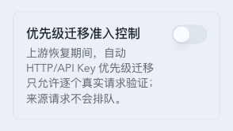

# API Key 优先级迁移准入控制

> 当前有效规范以本文为准；实现覆盖与当前状态见 `./IMPLEMENTATION.md`，主题局部演进见 `./HISTORY.md`，持久决策的完整取舍见关联 ADR。

## 背景 / 问题陈述

现有 sticky 路由会让可复用的 `Fallback` 来源在每次请求时与更高优先级候选比较。目标在恢复、提升优先级或新近变为可用时，多个对话模型路由可以同时开始向同一目标尝试。sticky 写入虽只在成功后提交，却不限制这些并发尝试；一个不可靠而缓慢的目标因此可能在健康状态收敛前承接大量长请求。

优先级驱动的迁移与故障切换不同：前者发生时原来源仍然可用。因此，不能为等待迁移而阻塞客户端请求，也不能把数据库锁、持久队列或后台探测作为正确性前提。

## 目标 / 非目标

### Goals

- 对 API Key 目标的自动优先级迁移和新分配实行按目标账号与精确请求模型隔离的、无排队的准入控制。
- 让每个恢复中的目标组合逐个验证真实请求，并在失败后立即停止吸引更多新路由。
- 保持既有 `Fallback` 来源的优先级迁移范围、sticky 成功提交语义、人工绑定优先级和普通故障切换语义。
- 在数据库不可用时继续维持本进程的许可、冷却和恢复验证行为。
- 通过现有设置、路由审计和记录界面提供可解释且不泄露原始上游错误的运维证据。

### Non-goals

- 不把自动迁移扩大到 `normal` 或 `primary` sticky 来源。
- 不改变 OAuth 或其他非 API Key 账号的路由行为。
- 不改变 WebSocket 的选择、重试或会话完成语义。
- 不把闸门做成目标的绝对总请求限流器；已成功迁移的 sticky 路由继续正常发送。
- 不增加后台探针、持久 FIFO、跨进程租约恢复或数据库热路径读取。
- 不引入新的迁移请求时长阈值，也不改变既有 HTTP 请求超时合同。

## 范围（Scope）

### In scope

- HTTP 池路由中的 API Key `Fallback` sticky 优先级迁移。
- API Key 目标账号与精确请求模型组合的本地许可、冷却和三次成功恢复验证状态机。
- 受闸门影响的新分配绕行、单次迁移尝试、成功绑定、失败冷却和安全回放。
- 全局 Settings 开关、其本地运行时镜像，以及切换时的状态代际处理。
- 现有路由审计、模型路由事件、调用记录和设置 UI 的安全可观测性扩展。
- 后端并发、取消、重启、数据库故障隔离和前端设置/记录回归测试。

### Out of scope

- WebSocket 迁移准入、WebSocket 重试策略或长会话并发管理。
- OAuth 或非 API Key 的模型级闸门与冷却状态。
- 目标账号级全局许可证、跨实例分布式协调或持久化许可恢复。
- 将普通故障切换、人工强制绑定或既有 sticky 复用改为等待闸门。
- 修改已有模型映射、静态 `availableModels`、账号硬故障分类或常规超时设置。

## Related ADRs

- [ADR 0002: Stage automatic priority handoffs through local permits](../../adr/0002-stage-automatic-priority-handoffs.md)

## 需求（Requirements）

### MUST

- 自动优先级迁移的单位为一个对话模型路由：同一 sticky conversation key 与精确请求模型的组合。不同模型互不共享迁移结果或许可。
- 仅当非强制 sticky 来源仍可复用、有效优先级为 `Fallback`、允许自动 cut-out，且解析器已经选出严格更高优先级的首选 API Key HTTP 目标时，才可进入该目标的迁移闸门。
- 闸门键必须复用现有模型路由健康所使用的规范化请求模型键，键空间为“目标账号 + 精确请求模型”。账号模型映射在候选选定后处理，不得另建映射后模型的闸门键或别名聚合规则。
- 每个处于优先级吸引周期的目标键在同一进程内最多有一个在途闸门许可。许可不可等待、不可排队、不可依赖数据库、不可由后台任务预占。
- 严格高于当前 `Fallback` 来源的 API Key HTTP 目标，如果仅因既有临时模型路由故障证据被降权，且仍满足账号、绑定、模型、路由策略与传输等硬资格约束，必须成为恢复吸引候选。缓存命中保护、模型或能力不支持、账号级硬不可用和客户端取消不得创建该资格。
- 每个请求只能将按有效优先级及既有同级规则排在最前的一个恢复吸引候选视为恢复首选目标。该目标许可忙或冷却时，sticky 请求必须保留权威来源，真正新分配必须转向普通健康候选或结束；同一请求不得继续试探次优恢复候选。
- 恢复吸引候选必须在普通模型降权排序返回健康低优先级胜者之前进入请求驱动恢复准入。该例外只能让目标到达既有单槽闸门，不得改变常规候选比较器或直接将目标视为健康胜者。
- `degraded` 恢复吸引候选的下一个合格真实请求必须可以立即尝试获取许可；处于未到期 `cooling_down` 的目标仍必须排除，只能在冷却到期后由下一个合格真实请求尝试。两者都不得产生后台探针。
- 目标因恢复、优先级提升或新近可用而开始吸引流量时，必须从恢复验证期开始；恢复验证期仅在三个连续的、闸门准入的自动迁移或新分配获得完整终态成功后开放普通优先级准入。
- 首次请求驱动恢复准入获得完整终态成功时，必须恢复该账号模型路由的普通健康并计为当前恢复代际连续成功的第 `1/3` 次；仅当 Sticky 所有权栅栏仍匹配时，才将目标提交为本次对话模型路由的 sticky 来源。不得要求额外的第四次成功，也不得覆盖较新的 sticky 绑定。
- 闸门准入的优先级迁移必须只发起一次目标请求，禁止同账号重试、429 重试、自动故障切换和对其他目标的重试。既有 HTTP 首字节与完整流超时保持不变。
- 只有目标请求的完整终态成功才可产生目标账号模型成功证据，并在 Sticky 所有权栅栏仍匹配时提交目标绑定。无论绑定提交是否被栅栏拒绝，许可都必须释放；首字节、部分流、请求已发送或经过的时间都不得确认任一结果。
- 目标未完整成功时，来源 sticky 绑定必须保持原样。只有能确定目标未收到请求时，才允许向仍可用的来源安全回放一次；交付不确定时必须返回目标错误，不得自动回放或改绑。
- 闸门许可被占用、目标处于冷却，或全局闸门状态不允许迁移时，当前 sticky 请求必须立即继续其可用来源，不得等待，也不得转向解析器首选目标之后的次优高优先级候选。
- 受闸门限制的新分配必须立即选择其他健康合法候选；没有替代候选时直接按现有无候选路径结束，不得等待许可。
- 已完整成功迁移的对话模型路由立刻将目标视为 sticky 来源；该路由后续请求不重新占用恢复许可。闸门限制新增目标准入，而非目标的绝对总流量。
- 同一对话模型路由的另一请求在首次迁移仍在途时必须继续原来源，不得等待、合并或启动第二次迁移。
- 客户端取消必须立即释放本地许可，不得写入迁移失败、不得安全回放、不得修改 sticky 绑定。
- 迁移中的既有临时模型级失败类别必须使本地闸门立即进入现有模型路由冷却阶梯的第一档；后续这类迁移失败按同一阶梯推进。完整终态成功重置该组合的迁移失败证据。客户端取消和调用方校验错误不得改变此状态；模型特定及账号级硬错误继续执行既有健康行为。
- 每个通过既有时间栅栏并被接受的更新临时模型路由故障，必须创建新的本地恢复验证代际并清零成功进度。旧代际在途许可在终态前仍保持独占，但其结果不得计入新代际；被既有 stale/reset fence 拒绝的故障证据不得创建新代际。
- 重叠成功与故障证据必须按既有请求开始时间、reset fence 和恢复代际判定，不得按完成顺序覆盖。开始时间不晚于更新已接受故障的旧成功只能释放旧许可，不得恢复健康或推进验证。
- 本地闸门状态必须独立执行冷却和恢复验证。持久化模型路由健康与诊断事件可以最佳努力写入；写入失败不能阻塞许可获取、释放、延期迁移或来源继续发送。既有普通路由的数据库行为不因本功能改变。
- 冷却到期后的下一次准入必须来自真实请求并按既有候选资格处理；不得发送后台探针。人工模型健康 reset 同样只能重新进入串行恢复验证，不能直接全面开放。
- 普通故障切换不获取迁移许可，也不等待迁移许可，包括故障切换独立选中一个已有恢复请求在途的相同目标时；它仍必须遵守既有账号模型健康资格。人工强制绑定始终在迁移闸门之外。
- 进程重启必须丢弃许可与本地恢复计数，不恢复持久租约，并从 `0/3 verifying` 开始。持久化模型健康只能决定目标在重启后是立即恢复候选、仍等待冷却，还是普通优先级候选；不得由 `available` 推断本地闸门已 `open`。
- 全局 `priorityHandoffAdmissionEnabled` 设置默认开启。它通过既有 Settings UI 与 `GET/PUT /api/pool/routing-settings` 管理；持久化只保存期望值，路由热路径只读取本地运行时镜像。设置写入失败时保留最后已生效镜像，现有请求不受影响。
- 全局开关关闭时必须回退到当前旧的自动 `Fallback` 迁移和新分配行为，不得取消已向上游发送的在途恢复请求。该请求的有效终态可以按时间栅栏更新模型健康，并按 Sticky 所有权栅栏提交本对话绑定，但不得贡献到关闭后或重新开启的代际。重新开启时必须从 `0/3 verifying` 开始。
- 路由审计和模型路由事件必须以最佳努力方式记录安全的迁移准入、延期、恢复进度、成功和冷却原因。审计必须将“为何考虑准入”的 trigger 与“闸门做出什么决定”的 decision 分离；不得把原始上游响应体、凭据或未规范化错误文本写入新字段。

### SHOULD

- 新的运行时状态应集中在一个小而显式的进程本地模块，并通过 RAII 或等价的取消安全清理保证许可释放。
- 候选选择应先遵守现有账号、模型、绑定、路由策略与传输硬资格；常规候选继续使用原比较器，恢复吸引候选则通过显式的请求驱动恢复通道到达同一准入闸门，不应改写常规比较器的排序规则。
- 设置界面应明确显示这是全局 HTTP/API Key 的优先级迁移控制，不暗示它会关闭 WebSocket、人工绑定或所有目标流量。
- 审计应使用已有账号显示名与安全原因码，避免把内部数值标识当作运维界面的账号名称。

### COULD

- 在既有实况路由视图中显示受限组合的恢复进度摘要，只要它复用现有数据投影且不增加独立轮询。
- 为运行时日志补充低基数的阶段/决策字段，辅助没有持久化审计时的诊断。

## 功能与行为规格（Functional/Behavior Spec）

### Core flows

1. 解析器按既有硬资格规则得到一个可复用 `Fallback` sticky 来源和一个严格更高优先级的 API Key HTTP 目标，并识别该目标是普通健康候选还是仅因既有临时模型路由故障而降权的恢复吸引候选。
2. 若全局开关开启，普通健康候选沿用既有排序；恢复吸引候选在 `degraded` 或冷却到期时由当前真实请求尝试获取唯一许可。许可空闲时发送一次目标请求；许可忙或目标仍在冷却时不发送且不等待。
3. 目标完整终态成功时，现有 generation-guarded sticky 成功写入将绑定改为目标。系统释放许可，记录成功，并将该闸门准入的成功计入连续验证数。
4. 三次连续的合格成功后，目标键在当前吸引周期对新增迁移和新分配开放。已迁移路由的后续请求从第一次成功起就一直正常发送。
5. 目标发生可归属的临时失败时，本地状态立即进入模型路由冷却；当前来源绑定不变。下一次候选仅在冷却过期并通过普通资格检查后才能成为真实验证请求。
6. 当目标不能准入时，sticky 请求直接保留来源；新分配转向其他健康候选或直接结束。两条路径均不创建 HTTP 等待队列。

### Edge cases / errors

- 首选目标许可被占用时，sticky 路由不会扫描到较次的高优先级目标，因为一旦成功迁到次优目标，该路由将不再符合自动 `Fallback` 迁移范围。
- 存在多个恢复吸引候选时，同一请求只处理恢复首选目标。它的许可忙或冷却不会让次优恢复候选在该请求中升格；只有首选目标失去硬资格或进入有效冷却后，后续请求才可以重新计算恢复首选。
- 更新临时故障创建新恢复代际时，旧代际在途请求不被取消。它仍持有排他许可，但终态结果只可释放许可，不得修改新代际验证进度。
- 恢复请求完成前如果该对话模型路由的 Sticky 所有权已更新，目标成功不得覆盖较新绑定；当时间栅栏和恢复代际仍有效时，它仍可恢复目标模型健康并计入当前验证进度。
- 旧恢复请求在更新故障被接受后才完成时，不得因完成更晚而恢复健康、推进验证或改写新代际。
- 权威来源在恢复请求在途期间实际失败时，另一请求可以独立进入 Fault Failover。如果普通健康资格使其选中相同目标，它不等待恢复许可；两次发送必须使用不同的路由来源与审计原因。
- 目标已经收到请求但在终态前断开、超时或返回失败时，交付不确定；来源不重放，sticky 不变，临时失败则进入冷却。
- 全局开关关闭或重新开启不会取消已向目标发送的请求。旧在途结果仍可按各自栅栏更新健康与本对话绑定，但切换代际必须阻止它改变新一代的恢复计数。
- 数据库或审计写入不可用时，本地许可、冷却、取消释放、来源继续发送和全局镜像保持可用；仅持久化诊断或健康同步可能延后。
- 多实例未来可分别持有本地许可；本主题不承诺跨实例串行。当前正确性不依赖跨实例数据库锁。

## 接口契约（Interfaces & Contracts）

### 接口清单（Inventory）

| 接口（Name）                     | 类型（Kind）            | 范围（Scope） | 变更（Change） | 契约文档（Contract Doc） | 负责人（Owner）          | 使用方（Consumers）         | 备注（Notes）                          |
| -------------------------------- | ----------------------- | ------------- | -------------- | ------------------------ | ------------------------ | --------------------------- | -------------------------------------- |
| `GET /api/pool/routing-settings` | HTTP JSON               | external      | Modify         | 本节                     | backend routing settings | Settings UI                 | 返回全局开关的当前有效值               |
| `PUT /api/pool/routing-settings` | HTTP JSON               | external      | Modify         | 本节                     | backend routing settings | Settings UI                 | 更新持久配置与本地镜像；失败不部分应用 |
| `routingSelectionAudit`          | persisted/read API JSON | external      | Modify         | 本节                     | routing/records          | Records、对话事件、实况路由 | 增加可选的安全迁移准入快照             |
| 模型路由事件 reason code         | persisted/read API JSON | external      | Modify         | 本节                     | model routing            | Records、实况路由           | 记录迁移成功、冷却和恢复结果           |

### 契约文档（按 Kind 拆分）

- `GET /api/pool/routing-settings` 与 `PUT /api/pool/routing-settings` 增加 `priorityHandoffAdmissionEnabled: boolean`。缺失的历史值按 `true` 解释；`PUT` 按既有局部设置更新语义处理该字段。
- 成功的 `PUT` 先完成持久化，再原子更新本地镜像。失败响应不得改变运行时镜像；运行中的请求继续使用其开始时读取的代际。
- `routingSelectionAudit` 可选增加 `handoffAdmission`：`trigger` 可选为 `priorityAttraction` 或 `modelRouteRecovery`，表示为何考虑准入；`decision` 为 `admitted`、`deferredPermitBusy`、`deferredCooldown` 或 `bypassedDisabled`，表示闸门结果；`phase` 为 `verifying`、`open` 或 `coolingDown`；`verificationSuccessCount` 为 `0..=3`；准入记录可带 `generation` 以隔离新故障或开关重新开启前后的在途结果。历史记录可省略 `trigger` 或整个对象。
- 请求驱动恢复准入选中目标时，`routingSelectionAudit.winnerReasonCode` 必须为 `requestDrivenRecoveryAdmission`；普通优先级迁移继续使用既有胜出原因。
- 现有模型路由事件新增安全 reason code，以表达 `priorityHandoffSucceeded`、`priorityHandoffFailureCooldown` 与 `priorityHandoffRecoveryProgress`。事件仅携带既有安全上下文和模型范围，不携带原始上游错误。

## 验收标准（Acceptance Criteria）

- Given 多个可用 `Fallback` 对话模型路由同时将同一 API Key 目标视为首选，When 目标处于恢复验证期，Then 同一进程最多一个请求向该目标发送，其他 sticky 请求立即在各自来源继续，没有迁移 FIFO 或 HTTP 等待。

- Given 严格更高优先级的 API Key 目标因既有临时模型路由故障处于 `degraded/demoted`，When 下一个合格真实请求解析路由，Then 目标必须能在普通模型降权排序返回健康 `Fallback` 胜者之前尝试获取单槽许可。

- Given 目标的模型路由冷却未到期，When 新请求解析路由，Then 不得向目标发送恢复请求；Given 冷却已到期，Then 下一个合格真实请求可以竞争单槽许可，且始终不得创建后台探针。

- Given 首次闸门准入的迁移请求完整终态成功，When 另一个来源路由随后请求，Then 该成功才会提交第一个 sticky 绑定，并且下一次真实请求才可获得下一个恢复许可。

- Given 首次请求驱动恢复准入完整终态成功，When 恢复结果被记录，Then 模型路由恢复为普通健康、本对话模型路由提交到目标，并且验证进度为 `1/3`；其他尚未迁移路由仍需逐一获得许可。

- Given 目标返回可归属的临时失败或发生传输失败，When 迁移尝试结束，Then 目标组合立即进入既有模型路由冷却阶梯，来源绑定保持不变，且本次不执行任何自动重试。

- Given 目标请求的交付状态不确定，When 请求失败或超时，Then 系统把目标错误返回客户端且不向来源回放；Given 已证明目标未收到请求，Then 最多安全回放一次到原来源。

- Given 恢复期已有成功迁移的路由，When 它发出后续请求，Then 该请求直接使用新 sticky 目标而不等待许可；三次验证只限制新的迁移和新分配准入。

- Given 首选目标许可被占用但存在较次的高优先级目标，When 一个 `Fallback` sticky 路由请求，Then 它继续原来源而不迁移到较次目标。

- Given 同一请求存在多个恢复吸引候选，When 恢复首选目标许可忙或冷却，Then 不得在该请求中尝试次优恢复候选；sticky 请求保留权威来源，真正新分配仅可选择普通健康替代。

- Given 一个较新的临时模型路由故障在旧恢复请求在途时被接受，When 旧请求随后完整成功，Then 该成功不得计入新代际，但必须释放旧许可；Given 故障证据被 stale/reset fence 拒绝，Then 不得重启恢复验证。

- Given 恢复请求在途时本对话模型路由的 Sticky 所有权已被较新的人工绑定或 Fault Failover 改变，When 旧恢复请求完整成功，Then 不得覆盖较新绑定；Given 其时间栅栏和恢复代际仍有效，Then 该成功仍恢复目标健康并计入当前进度。

- Given 恢复成功请求的开始时间不晚于后续被接受的更新故障，When 该旧请求最后完成，Then 它只释放许可，不恢复健康、不计入验证且不改写新代际。

- Given 恢复请求正向一个目标发送，When 另一请求的权威来源真正失败且 Fault Failover 依普通健康资格独立选中同一目标，Then 故障切换不得等待恢复许可，且必须与恢复准入分别审计。

- Given 新分配的首选目标不能准入，When 仍存在健康合法候选，Then 选择替代候选；When 不存在替代候选，Then 直接走无候选结果而不等待。

- Given 客户端在迁移尝试中取消，When drop/cancellation 发生，Then 许可立即释放，来源绑定和健康证据均不因取消改变。

- Given 数据库写入或审计持久化失败，When 迁移许可、冷却或恢复验证需要转换，Then 本地状态照常转换、请求不等待数据库；只有持久化诊断可能缺失。

- Given 全局开关关闭，When 新请求解析路由，Then 使用升级前的自动 `Fallback` 迁移与新分配语义；Given 重新开启，Then 新代际从恢复验证开始，旧代际的在途结果不污染新代际。

- Given 进程重启，When 第一个新的优先级目标机会到达，Then 本地许可与计数必须从 `0/3 verifying` 开始；持久化 `degraded`、`cooling_down` 或 `available` 只能决定候选时机，不得恢复旧许可、旧计数或 `open` 状态。

- Given 恢复请求已发送后全局开关被关闭，When 请求随后完整成功，Then 它可按时间与 Sticky 所有权栅栏更新健康和本对话绑定，但不得计入关闭后或重新开启的代际；Given 重新开启，Then 从 `0/3 verifying` 开始。

- Given WebSocket 或非 API Key 账号请求，When 解析路由，Then 它们维持升级前的路由、重试和完成语义。

## 验收清单（Acceptance checklist）

- [ ] 核心路径的长期行为已被明确描述。
- [ ] 关键边界、取消、交付不确定、数据库不可用与进程重启场景已被覆盖。
- [ ] Settings 与审计接口契约已写清楚。
- [ ] 相关验收条件可以用于实现与 review 对齐。

## 非功能性验收 / 质量门槛（Quality Gates）

### Testing

- Rust unit tests：本地闸门状态机、状态代际、冷却推进/重置、取消释放与安全回放判定。
- Stateful SQLite tests：`Fallback` 首选迁移、同目标并发、次优目标不迁移、新分配绕行、sticky generation 防陈旧覆盖、既有模型路由健康兼容和数据库故障隔离。
- HTTP integration coverage：单次迁移尝试禁止各类自动重试、完整终态才绑定、交付不确定不回放、标准超时不被重写。
- Compatibility tests：WebSocket、OAuth、人工绑定、普通故障切换和全局开关关闭时保持既有行为。

### UI / Storybook

- 在既有 Pool Routing Settings 卡片增加全局开关的 enabled/disabled、保存失败和窄屏状态。
- 更新 Settings API Vitest 覆盖、翻译文案和 Records/路由审计的迁移准入显示状态。
- 为修改过的设置卡与记录卡补充 Storybook `play` 覆盖和受控桌面/移动端视觉证据。

### Quality checks

- `cargo fmt --all -- --check`
- `cargo check --locked --all-targets --all-features`
- 相关 Rust 目标测试，必要时使用仓库约定的 `stateful-sqlite` profile。
- `cd web && bun run test`
- `bun run typecheck:web`
- `bun run lint:web`
- `cd web && bun run build`
- 文档与 spec drift 检查。

## Visual Evidence

实现已落在既有 Pool Routing Settings 卡片；视觉证据来自 Storybook mock canvas，覆盖已通过。

桌面证据：

- `source=storybook_canvas`
- `story=settings-components-pool-routing-settings-card--priority-handoff-admission-disabled`
- `requested_viewport=1280x900`
- `viewport_strategy=storybook-viewport`
- `capture_scope=focused priority-handoff section`
- `margin_policy=require_margin`
- `normalization=unchanged; outer margin already satisfied`
- `target_program=Storybook mock canvas`
- `PR: none`

移动证据：

- `source=storybook_canvas`
- `story=settings-components-pool-routing-settings-card--priority-handoff-admission-mobile`
- `requested_viewport=393x852`
- `viewport_strategy=storybook-viewport`
- `capture_scope=focused priority-handoff section`
- `margin_policy=require_margin`
- `normalization=unchanged; outer margin already satisfied`
- `target_program=Storybook mock canvas`
- `PR: none`

视觉确认：主人已确认当前截图准确反映本次改动；截图已通过不可变聊天快照展示并落盘为 Spec 资产。历史基线不存在，因此本次视觉比较记录为“需确认”，不宣称与历史版本一致。

## Related PRs

- None

## 风险 / 开放问题 / 假设（Risks, Open Questions, Assumptions）

- 风险：本地许可不跨多实例；当前部署为单进程，未来横向扩展前必须另行设计跨实例协调或接受每实例一个验证请求的边界。
- 风险：成功迁移的单一高频对话可继续向目标发送，请求闸门不试图把它变成总流量限额。
- 假设：现有模型路由健康键与候选缓存继续提供稳定的规范化请求模型身份；模型映射不改变此身份。
- 假设：全局设置持久化失败时，保留的运行时镜像足以让已启动进程继续服务；设置修改本身可以返回既有错误。

## 参考（References）

- `../../adr/0002-stage-automatic-priority-handoffs.md`
- `../zr9jd-api-key-model-routing-health/SPEC.md`
- `../r4p9x-upstream-account-policy-inheritance/SPEC.md`
- `../../../CONTEXT.md`
