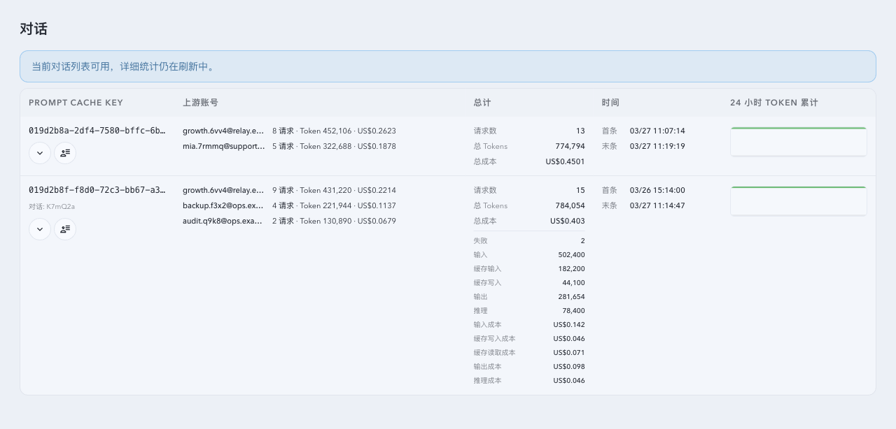
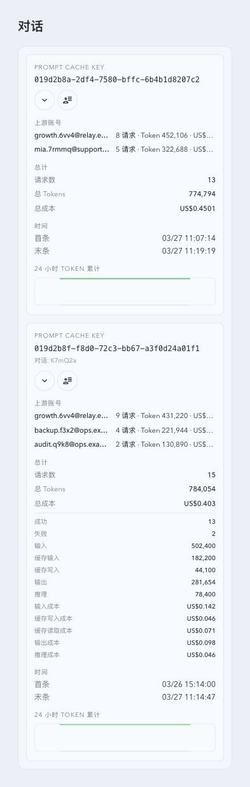
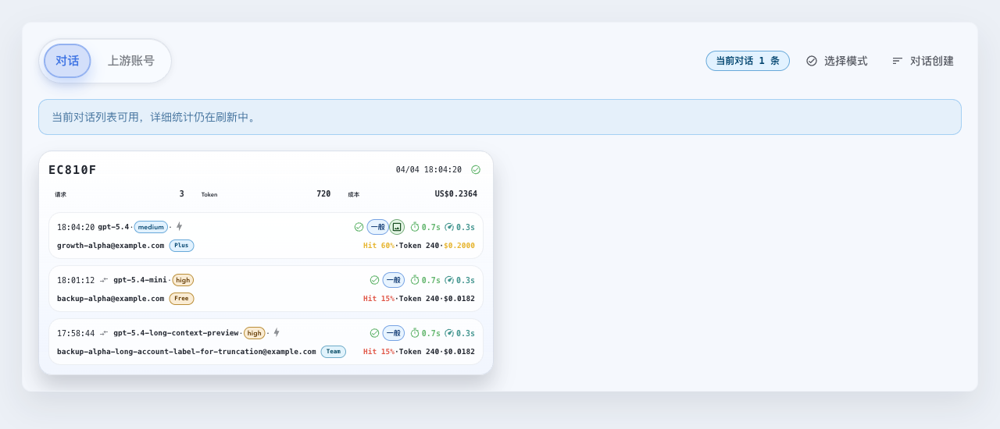

# Proxy Invocation Identity

> This file is the durable topic requirements contract. Current implementation facts belong in `IMPLEMENTATION.md`; lifecycle and change references belong in `HISTORY.md`.

## Context and Scope

- Context: Proxy request identifiers must remain compact while preserving conversation-level ordering and recoverability across process restarts.
- In scope: Backend HTTP proxy allocation, historical WebSocket invocation identity reads, the prompt-cache conversation master, SQLite migration/backfill, delayed statistics, retention, diagnostics, and the additive prompt-cache conversation read contract with its frontend consumers.
- Out of scope: Reworking the allocator or materialization ownership, changing the existing selection/snapshot contracts, and production deployment or acceptance.

## Terms and Interfaces

- `conversation_id`: A six-character NanoID generated from the existing 31-character proxy alphabet.
- `invoke_id`: A ten-character identifier consisting of a six-character prefix and a four-character ordered sequence.
- `prompt-cache conversation master`: The durable `prompt_cache_conversations` row keyed by one normalized `prompt_cache_key`.
- Interface: `src/prompt_cache_conversations.rs` and the proxy capture/runtime persistence paths.

The public follow-up read surface is `GET /api/stats/prompt-cache-conversations`. It keeps the
existing selection, snapshot, and compatibility fields while adding the durable master identity
and delayed statistics when they are available: `conversationId`, `successCount`,
`failureCount`, `inputTokens`, `outputTokens`, `cacheInputTokens`,
`reportedCacheWriteTokens`, `reasoningTokens`, `costInput`, `costCacheWrite`,
`costCacheRead`, `costOutput`, `costReasoning`, `firstInvocationAt`, and
`lastInvocationAt`. The Live prompt-cache table and working-conversation consumers use these
fields for presentation and stable count-mode history ordering. Until materialization makes the
statistics trustworthy, the fields remain absent; snapshot reads fail closed for statistics newer
than their snapshot boundary while retaining the stable conversation identity.

## Requirements

### REQ-PII-001

- The system MUST generate exactly ten-character proxy invocation IDs from the existing custom alphabet.
- A prompt-cache invocation MUST use its master `conversation_id` as the first six characters and an ordered four-character base-31 sequence as the suffix.
- An invocation without a prompt-cache key MUST use a generated six-character prefix scoped to the current UTC hour and an ordered four-character suffix.

### REQ-PII-002

- The system MUST persist one prompt-cache conversation master per normalized prompt-cache key, including its conversation ID, aggregate invocation counts, token totals, cost totals, and first/last invocation timestamps.
- The master conversation ID MUST be checked against existing master IDs before insertion, with bounded candidate retries and an explicit failure after exhaustion.
- Conversation ID creation MUST serialize candidate generation, collision checks, and insertion within the instance. It MUST use NanoID with the existing alphabet and at most five candidate attempts.
- A newly generated prefix MUST exclude existing conversation masters, unreleased hourly prefix rows, retained invocation prefixes, and known active or pending invocation identities. Released prefixes MUST NOT remain in a permanent process-issued blacklist.

### REQ-PII-003

- The allocator MUST keep normal next-sequence state in memory and recover it from the appropriate durable owner and known retained or pending invocation IDs after a cache miss. Issuance from committed ranges, including unbound issuance, MUST perform no database reads, writes, or database write-admission waits; durable range reservation follows `REQ-PII-008` and `REQ-PII-010`.
- A concurrent prompt-key creation race MUST recover the already persisted master row instead of creating a duplicate identity.
- Issuance MUST serialize the normalized prompt-cache key being allocated, while prefix creation has its own serial namespace. Unrelated keys MUST NOT wait on the global identity cache while identity or sequence SQL is in flight. Active prompt-cache references MUST be registered before an allocation wait and released on failure or cancellation.
- Conversation and unbound prefix creation MUST share one process-local serialized namespace. Hot suffix allocation MUST use only short-lived owner memory serialization and MUST NOT wait for unrelated prefix-creation SQL.

### REQ-PII-004

- Schema creation and legacy prompt-cache-key backfill MUST be idempotent and separately observable from aggregate statistics refresh.
- Terminal and derived batch writes MUST persist the invocation, enqueue affected prompt-cache keys, and invalidate aggregate freshness without synchronously scanning retained history. The ordered background materialization task MUST refresh identities and aggregate statistics from the durable queue and advance its cursor only after each committed transaction.
- A 400-key logical materialization page MAY be split into adaptive 32..400-key micro-batches. Prompt-cache pressure MUST yield only between committed micro-batches; a started micro-batch runs to commit or explicit failure.
- Identity discovery MUST commit its identity rows, key cursor, and identity-key count together without scanning statistics. Statistics rebuild and queue drain MUST own resumable statistics pages. A statistics rebuild MUST commit each completed conversation's aggregate, generation-bound queue/staging cleanup, and continuous outer key cursor in the same transaction. An unfinished conversation MUST NOT advance that cursor. Queue drain MUST use generation-bound queue removal as its completion checkpoint.
- During statistics rebuild, pages with unchanged sources MUST continue within the existing run and query budgets, checking interactive pressure between committed pages. Automatic control is checked at bounded-round admission; an admitted round finishes after automatic triggering is paused. Repeated pages of one conversation MUST consume only one visited-key allowance per run. A completed continuous prefix MUST NOT restart when a later conversation yields; source changes after publication MUST enqueue only the affected conversation.
- Queue drain MUST rotate through pending keys with a durable admission cursor and a bounded one-source-page quantum per selected key per round. It MUST seek after the cursor and wrap without dropping queued work. Stable pending keys MUST continue in later rounds within the remaining run budget, after their selected peers receive service, and count only once as visited keys. Changed-generation keys MUST yield for the rest of that run. Admission MUST commit before attempting a source page, so generation changes, source-page failures, and exhausted work budgets cannot permanently pin selection to one hot key. A failed admission MUST start no source page. Pending or changed-generation keys MUST retain their generation-fenced staging and queue entry while other selected keys receive service. Queue admission is independent of aggregate completion and MUST NOT change the continuous statistics-rebuild cursor contract.
- Explicit historical snapshot reads MUST use the existing unavailable contract until identity coverage, aggregate freshness, complete migration phase, and an empty durable refresh queue are all satisfied. Current/live reads MUST serve the durable working set plus runtime overlay while delayed statistics settle, as defined by REQ-PII-011. Retention MUST release masters whose retained invocation rows have been removed without maintaining a permanent released-ID blacklist.

### REQ-PII-005

- Allocation, cache recovery, migration/backfill, delayed statistics refresh, retention release, sequence exhaustion, and bounded allocation errors MUST emit diagnostic logs without logging raw prompt-cache keys. Materialization logs MUST include phase, cursor, scanned/updated counts, batch size and duration, and pressure defer/failure state.
- Queue diagnostics MUST expose a bounded backlog sample/lower bound, oldest selected generation enqueue age, fingerprinted rotation position, quantum outcomes, generation restarts and discarded work, bounded continuation/retry reason and deadline, and eventual empty-queue freshness publication. Diagnostics MUST NOT add retained-history scans or raw prompt-cache keys to the invocation hot path. The existing status queue count remains the exact backlog observation.
- Range diagnostics MUST distinguish reservation, committed publication, recovery, return, skipped or unconfirmed ranges, refill failure, and exhaustion. Fields MUST identify the owner type, conversation or hourly prefix, UTC hour where applicable, cache generation, range bounds, attempted return count, elapsed time, and outcome without raw prompt-cache keys. Hourly diagnostics MUST distinguish rollover, pending-reference protection, and release. Capacity diagnostics MUST distinguish asynchronous database seed, memory-only resizing, capped activity estimates, target versus occupancy, saturation, and admission timeout. Hot allocation diagnostics MUST NOT require synchronous persistence.

### REQ-PII-006

- The prompt-cache materialization task MUST use its `managed_tasks` row in the maintenance database as the sole enablement authority. Its scheduler checkpoint MUST be updated in the same maintenance-database transaction. The legacy business-database `startup_backfill_progress.enabled` value MUST NOT control execution after migration or be mirrored by the task; it may seed a managed control once only when no corresponding maintenance task row existed before registry seeding.
- The dedicated materialization PATCH and managed-task PATCH MUST publish the same committed control state. A changed enablement value advances an in-process control generation; a repeated value does not. Enablement MUST govern automatic bounded-round admission only. An admitted round MUST finish using its fixed control snapshot, including later pages within that round, while retaining statistics source-generation and publication fences. Explicit manual requests MUST remain admissible while automatic triggering is paused and MUST NOT arrange automatic continuation.
- Statistics pages MUST distinguish pending continuation, source-generation change, budget exhaustion, actual disablement, priority yield, and unavailable maintenance control. Only a complete page may advance the statistics-rebuild outer key cursor or publish complete statistics. The queue-drain admission cursor records scheduling only. Incomplete pages MUST preserve committed staging progress and MUST NOT be reported as `operator_disabled` or returned as a complete aggregate.
- A committed pending page MAY continue within the same run's remaining budget. Continuation deferred by a generation change or exhausted bounded work budget MUST use the existing 15-second follow-up. A new prompt-cache statistics queue event MUST preempt an unexpired ordinary idle, continuation, or coordinator-priority retry deadline and coalesce into one pending task wake, while an active database-pressure defer MUST retain its qualification/deadline path. Same-generation wakes and stale run results MUST preserve the durable delay unless the wake carries a new queue event; a final checkpoint from a run that overlapped a queue event MUST recheck the durable wake generation and retain immediate eligibility. Actual disablement clears pending scheduler entries; only a new enablement generation may wake that task. Maintenance control failure MUST preserve the last committed in-memory state and report unavailable when no trusted state exists.
- Existing status and control response fields remain compatible. The existing `deferReason` string distinguishes `stats_page_pending`, `stats_generation_changed`, `stats_budget_exhausted`, `coordinator_priority`, `operator_disabled`, and `maintenance_database_unavailable`.
- Run `scanned` MUST count actually visited conversation keys, and `updated` MUST count committed identity creation or complete aggregate publication. Identity progress counters MUST retain their existing meaning. ETA MUST be unavailable while statistics rebuild or queue drain is incomplete and zero only after materialization is complete.

### REQ-PII-007

- The synchronous live Prompt working-set update trigger MUST run only for source columns that can affect its key, scope, displayed status, activity timestamps, counts, tokens, or cost. A terminal write that updates only persistence timing MUST NOT recompute this projection.
- Inserts, deletes, and relevant source updates MUST retain the existing live-window and old/new-key reconciliation semantics, including updates assigning an unchanged value.
- Existing databases MUST receive the corrected trigger definitions through a transaction that also records a durable completion marker. Interrupted installation MUST roll back and remain retryable; repeated startup MUST preserve projection rows, historical data, control state, and materialization checkpoints without rebuilding rows solely to update trigger dependencies.

### REQ-PII-008

- The conversation master MUST persist the Reserved Invocation Ceiling in `last_invoke_sequence`. The range manager MUST own its updates; aggregate statistics MUST NOT overwrite it from stale snapshots. Upgrade and recovery MUST preserve a floor covering previously issued sequences. Invocation counts and usage MUST remain independent of reservations and skipped sequences.
- Each reservation MUST grant 64 consecutive sequences, except a smaller final range at the existing suffix limit. No range may be issued before its durable reservation commits. Restart MUST begin above the durable ceiling and skip unused reservations that were not returned; issued sequences MUST NOT be reused or returned on cancellation.
- A single manager MUST coordinate refill across conversations. With no standby range or in-flight refill, fewer than 32 remaining current-range sequences MUST trigger refill; other conversations with fewer than 48 remaining MUST be eligible to join. Exactly 32 MUST NOT actively trigger, and exactly 48 MUST NOT join. Each conversation MUST hold at most one standby range and have at most one refill in flight.
- Empty-range allocation MAY wait for its shared refill batch for a total of at most 100 ms. Timeout or failure MUST return HTTP 503 without a per-invocation database reservation; a request timeout MUST NOT cancel the shared batch. Sequence exhaustion MUST fail without wrapping or increasing ID length.
- Before evicting an idle entry, the manager MUST attempt to return only its never-issued contiguous reservation tail, including an unused standby range, within a total 100 ms budget covering coordination, database admission, connection acquisition, execution, and commit. It MUST freeze the entry's allocation and refill, then conditionally lower the matching master's expected ceiling to the entry's allocation floor. A floor with no locally issued sequence MUST remain at the boundary before that entry's first reservation.
- Busy, timeout, update-condition mismatch, or failure MUST emit a warning and discard the entry's memory reservations without return retries. Unconfirmed ranges MUST NOT be reused from memory; subsequent recovery MUST use committed database state. Cancellation or rollback MUST be verified before allowing an old return operation to race a replacement entry, and stale callbacks MUST NOT mutate a new cache generation.
- Eviction and retention MUST protect active invocations, allocations, and refills. Successful return and lifecycle release MUST preserve the existing ID-release semantics without a permanent blacklist or per-conversation files.

### REQ-PII-009

- Allocation cache capacity MUST start at 128 immediately. A single asynchronous seed MUST read at most the 4096 most recent conversation identities and activity timestamps within the preceding 48 hours using the existing covering time index. It MUST NOT block readiness, perform a full-table count, or fall back to a full-table scan if the index is unavailable.
- Capacity target MUST be `min(4096, max(128, N))`, where `N` is the recent-activity estimate. A separate in-memory activity index MUST retain at most the 4096 most recently active identities and their last activity times. Live invocations MUST update it in memory, and seed merging MUST preserve newer live timestamps. Allocation-cache eviction MUST NOT erase that activity history; activity history MUST NOT reserve prefixes or prevent retention release.
- Hourly resizing MUST use only the memory activity index and the rolling 48-hour cutoff. It MUST NOT query SQLite or retry the startup seed. Failed seed reads MUST warn and retain the current memory-derived target, initially 128. Capacity estimation MUST NOT wait for delayed statistics materialization or pre-reserve ranges for seeded identities.
- Shrink MUST retire only eligible idle entries through the bounded return policy. When all entries at the target are protected, temporary growth MAY continue up to 4096. At 4096, uncached-conversation admission MUST wait at most 100 ms for a slot, then return HTTP 503 if none is available. Slot admission MUST be atomic before identity loading or range reservation, and existing cached conversations MUST retain their memory allocation path without a SQL fallback.

### REQ-PII-010

- The business SQLite database MUST persist unbound hourly reservation authority in `hourly_invoke_prefixes`, with `utc_hour` as the Unix-hour primary key, a unique six-character NanoID `prefix`, `last_invoke_sequence` as the reserved ceiling from -1 through 923520, and creation/update timestamps. Conversation reservation authority MUST remain in the existing master table; no conversation mapping table or fragmented reservation files may be introduced.
- Current-hour initialization MUST create or recover one row on demand under the shared prefix namespace. A same-hour restart MUST recover the same prefix and reserve above its durable ceiling. A single manager MUST coordinate both owner types using the 64-sequence policy, thresholds, standby/refill limits, committed publication, and bounded empty-range wait in `REQ-PII-008`. Hourly owners MUST NOT consume conversation-cache admission slots.
- New unbound invocations after a UTC hour boundary MUST use the new hour's owner; already allocated invocations MUST retain their IDs. Ended-hour cleanup MUST wait until active invocations, pending terminal or journal persistence, range operations, and invocation rows retained by the existing lifecycle are gone. Release MUST remove the hourly row and memory namespace reservation without a permanent blacklist. Stale operations MUST NOT mutate a replacement owner.
- The additive schema operation MUST be idempotent, have an immutable completion marker, and remain separately observable from on-demand recovery and historical statistics materialization. Conversation recovery MUST preserve the maximum durable or known retained/pending issued-sequence floor before new reservations. Journal recovery MUST register pending identities before namespace creation or release can race them. Historical invocation IDs MUST NOT be rewritten or used to infer unreliable legacy hour ownership.
- Supported upgrade recovery MUST handle interruption before schema completion, after range commit but before publication, and during lifecycle release. Program rollback MUST NOT automatically down-migrate reservation state; recovery MUST use a forward-repair program that respects committed ceilings and hourly ownership. Earlier writers unaware of this reservation contract are outside the migrated state's supported writer range.

### REQ-PII-011

- The prompt-cache conversation read API MUST expose the durable conversation identity and
  materialized aggregate breakdowns as additive optional fields without changing the existing
  response fields, selection modes, pagination, or snapshot cursor semantics.
- Frontend consumers MUST preserve delayed-statistics absence, use the durable first invocation
  timestamp for count-mode history ordering when present, and retain the existing live activity
  anchor for working-conversation selection.
- Current/live HTTP reads and dashboard working-conversation SSE baselines MUST remain available while identity or statistics materialization is incomplete, using the durable working set and existing runtime overlay; delayed aggregate fields MAY be absent or stale. Explicit historical snapshot reads MUST retain the existing fail-closed materialization gate.
- A snapshot MUST NOT publish durable aggregate fields whose last materialized invocation is newer
  than the snapshot boundary. The stable conversation identity MAY remain visible independently.

## Verification

### VER-PII-001

- Method: Rust unit and stateful SQLite allocator tests.
- covers: `REQ-PII-001`
- Pass condition: Conversation-bound IDs are six-plus-four characters with ordered suffixes, unbound IDs share the current hourly prefix, and sequence overflow returns an error.

### VER-PII-002

- Method: Stateful SQLite schema migration and statistics tests.
- covers: `REQ-PII-002`, `REQ-PII-004`
- Pass condition: Backfill creates valid master rows, materializes aggregate fields through resumable 400-key logical pages and adaptive 32..400-key transactions, reruns without duplication, and retention removes released orphan masters.

### VER-PII-003

- Method: Source inspection, allocator recovery after clearing the process cache, closed-pool/held-admission hot issuance, and concurrent entrypoint wait-budget regressions.
- covers: `REQ-PII-003`
- Pass condition: Cache recovery preserves the issued-sequence floor, and issuance from a committed range performs no database read, write, or database write-admission wait, including under unrelated SQLite contention. Prefix creation and cold recovery remain serialized without holding the global cache mutex across SQL.

### VER-PII-004

- Method: Structured tracing call-site inspection and focused proxy compilation.
- covers: `REQ-PII-005`
- Pass condition: Diagnostic fields contain fingerprints or generated IDs, materialization progress exposes the required batch/defer fields, and raw prompt-cache keys are excluded from allocator and migration logs.

### VER-PII-005

- Method: Independent business/maintenance SQLite regression tests, scheduler-generation tests, upgrade compatibility checks, and a non-test Linux service-process replay.
- covers: `REQ-PII-006`
- Pass condition: Both contradictory legacy business enablement values follow only the maintenance control; pause/resume transactions publish atomically; multiple large conversations in one batch continue within the run budget and retain per-conversation checkpoints across yield/restart; completed prefixes are not rescanned; a final-page failure rolls back aggregate, queue/staging cleanup and outer cursor together; a new queue event wakes past a future idle or coordinator-priority retry deadline, including when it overlaps an in-flight run, and coalesces repeated or concurrent events without duplicate task dispatch; repeated same-generation wakes do not advance an unexpired database-pressure deadline; priority yield resumes after the foreground writer completes; actual disablement waits for a new control generation; existing HTTP fields remain compatible; incomplete statistics ETA is null; and prompt-cache pages converge to exact complete statistics with an empty queue and no pure-wait run record.

### VER-PII-006

- Method: Production terminal-write regression, incremental-versus-rebuild projection comparison, interrupted legacy-trigger upgrade/reentry regression, older-reader compatibility, and the same three-round Linux service replay used by `VER-PII-005`.
- covers: `REQ-PII-007`
- Pass condition: The actual terminal timing follow-up performs no projection update; relevant mutations, key moves and removal match a source rebuild; failed marker installation rolls back the trigger DDL; successful and repeated startup preserve business rows; existing readers accept the upgraded database; and all probe and steady calls remain included in the unchanged online latency and completion gates.

### VER-PII-007

- Method: Stateful SQLite multi-key checkpoint, budget, failure, pause/restart, source-generation, queue-drain, and nullable-ETA regressions, plus a SHA-bound three-round Linux service replay with synthetic history and per-page event evidence.
- covers: `REQ-PII-004`, `REQ-PII-006`
- Pass condition: The candidate publishes each completed rebuild key exactly once, resumes the first unfinished key from committed staging, advances only a continuous prefix in the final-page transaction, services a changed key behind the prefix through queue drain without rescanning other completed keys, preserves queue-drain cursor independence, reports actual visited/published work and null/zero ETA at the correct phases, reaches an exact empty-queue/empty-staging complete state, and stays within the existing online p99 bounds.

### VER-PII-012

- Method: Focused stateful SQLite fair-queue regressions, scheduler retry/event-wake regressions, and real file-backed SQLite lock/restart tests in the archive/file-I/O resource profile.
- covers: `REQ-PII-004`, `REQ-PII-005`, `REQ-PII-006`
- Pass condition: A continuously changing lexicographically first key cannot starve later selected or queued keys, including with a one-key scan limit; pending pages rotate and survive restart; admission/page failures lose no queued work and publish no partial counts; generation changes reset obsolete staging and preserve publication fencing; priority and database lock pressure stop work at their existing boundaries; continuation retains the 15-second retry/event-wake contract; after source changes stop, exact totals publish once and queue/staging drain before completion/freshness publication; diagnostics contain only fingerprints and bounded scheduling metadata.

### VER-PII-008

- Method: Concurrent allocator and stateful SQLite upgrade, reservation, interrupted-commit, restart, cancellation, and conditional-return regressions, with tracing and database-operation observation.
- covers: `REQ-PII-001`, `REQ-PII-002`, `REQ-PII-003`, `REQ-PII-005`, `REQ-PII-008`
- Pass condition: Issued IDs remain unique and ordered within each conversation; thresholds distinguish 31/32 and 47/48; eligible conversations share refill commits with only one standby and refill per conversation; failed commits never publish ranges; interruption and restart never reuse an issued sequence; successful eviction returns only the unused tail; busy, timeout, mismatch, and stale-generation paths preserve issuance safety and emit diagnostics; cancellation leaves issued sequences spent; final partial ranges never wrap; and aggregate refresh cannot overwrite reservation authority.

### VER-PII-009

- Method: Controlled-clock activity/cache regressions, delayed startup-seed merging, SQLite query-plan and bounded-row checks, concurrent admission and saturation tests, and allocator latency checks under database contention.
- covers: `REQ-PII-003`, `REQ-PII-005`, `REQ-PII-009`
- Pass condition: Readiness begins at 128; the indexed seed reads at most 4096 rows and preserves newer live activity; hourly resizing performs no database operation; 48-hour expiry and capped estimates produce bounded targets without losing activity on cache eviction; protected entries survive shrink; temporary growth never exceeds 4096; a saturated uncached request waits at most 100 ms then fails explicitly; and existing cached issuance remains unaffected by saturation or a busy database.

### VER-PII-010

- Method: Stateful SQLite migration/reentry, mixed-owner concurrent allocation, collision, crash/restart, hour-boundary and retained/pending-reference regressions, plus database-operation observation and a Linux service-process replay.
- covers: `REQ-PII-001`, `REQ-PII-002`, `REQ-PII-003`, `REQ-PII-005`, `REQ-PII-008`, `REQ-PII-010`
- Pass condition: Hourly and conversation owners share batched committed ranges; both hot paths issue without database work; same-hour restart preserves the prefix and skips outstanding reservations; prefix candidates exclude both durable owner types and retained/pending IDs; rollover preserves active IDs; cleanup cannot release pending owners and eventually releases eligible ones; upgrade/reentry preserves known sequence floors and historical IDs; interruption or stale operations cannot reuse issued IDs; and the final range remains bounded without wrapping.

### VER-PII-011

- Method: Focused stateful SQLite API regression, frontend normalization/live-consumer/table tests,
  TypeScript build, and Storybook canvas inspection at desktop and mobile widths.
- covers: `REQ-PII-011`
- Pass condition: Materialized identity and aggregate fields serialize in the public response, delayed
  fields remain optional, count-mode ordering uses the durable first timestamp, the table renders
  the breakdown on desktop and mobile, and snapshot boundaries do not publish newer statistics.

## Related ADRs

- [`../../adr/0020-proxy-invocation-identity.md`](../../adr/0020-proxy-invocation-identity.md)
- [`../../adr/0021-prompt-cache-background-materialization.md`](../../adr/0021-prompt-cache-background-materialization.md)
- [`../../adr/0022-prompt-cache-adaptive-materialization.md`](../../adr/0022-prompt-cache-adaptive-materialization.md)
- [`../../adr/0023-task-operations-state-outside-main-database.md`](../../adr/0023-task-operations-state-outside-main-database.md)
- [`../../adr/0027-prompt-cache-materialization-step-boundaries.md`](../../adr/0027-prompt-cache-materialization-step-boundaries.md)
- [`../../adr/0028-prompt-cache-continuous-statistics-checkpoints.md`](../../adr/0028-prompt-cache-continuous-statistics-checkpoints.md)
- [`../../adr/0029-conversation-invocation-range-reservations.md`](../../adr/0029-conversation-invocation-range-reservations.md)
- [`../../adr/0030-durable-hourly-invocation-prefixes.md`](../../adr/0030-durable-hourly-invocation-prefixes.md)
- [`../../adr/0031-prompt-cache-event-wake-priority.md`](../../adr/0031-prompt-cache-event-wake-priority.md)
- [`../../adr/0033-prompt-cache-live-read-materialization-overlay.md`](../../adr/0033-prompt-cache-live-read-materialization-overlay.md)

## Visual Evidence

- Source: `storybook_canvas`, mock-only stories `monitoring-promptcacheconversationtable--delayed-statistics`, `monitoring-promptcacheconversationtable--delayed-statistics-mobile`, and `dashboard-workingconversationssection--delayed-statistics`.
- `pr2-prompt-cache-conversations-desktop-1280.png`: `capture_scope=element`, `requested_viewport=1280x900`, `viewport_strategy=browser-resize-fallback`, `margin_policy=require_margin`, `evidence_surface=component`, `surface_selector=[data-visual-evidence-surface]`, `target_selector=[data-visual-evidence-target]`, `sensitive_exclusion=N/A`, `submission_gate=approved`; proves the live table remains visible with delayed-statistics freshness messaging.
- `pr2-prompt-cache-conversations-mobile-393.png`: `capture_scope=element`, `requested_viewport=393x852`, `viewport_strategy=browser-resize-fallback`, `margin_policy=require_margin`, `evidence_surface=component`, `surface_selector=[data-visual-evidence-surface]`, `target_selector=[data-visual-evidence-target]`, `sensitive_exclusion=N/A`, `submission_gate=approved`; proves the responsive single-column list and wrapped breakdown remain readable.
- `pr2-dashboard-working-conversations-delayed-desktop-1280.png`: `capture_scope=element`, `requested_viewport=1280x900`, `viewport_strategy=browser-resize-fallback`, `margin_policy=require_margin`, `evidence_surface=component`, `surface_selector=[data-visual-evidence-surface="dashboard-working-conversations"]`, `target_selector=[data-visual-evidence-target="dashboard-working-conversations-target"]`, `sensitive_exclusion=N/A`, `submission_gate=approved`; proves the dashboard current list and non-blocking freshness notice coexist.
- Preflight: all source-managed surfaces contain their targets, use opaque natural theme backgrounds, satisfy the computed margin contract after lossless DOM-geometry tightening, and have no horizontal overflow. Browser-resize fallback was used only because ego-browser cannot capture a full-height Storybook iframe surface directly; device metrics and scrollbar state were restored after each capture.
- 
- 
- 

## References

- `./IMPLEMENTATION.md`
- `./HISTORY.md`
