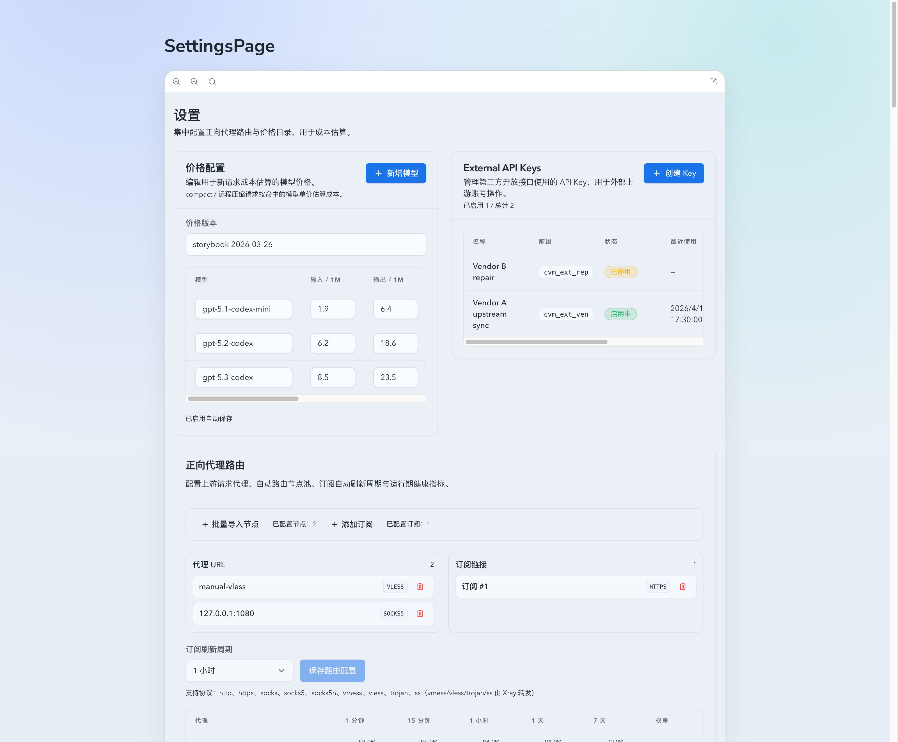
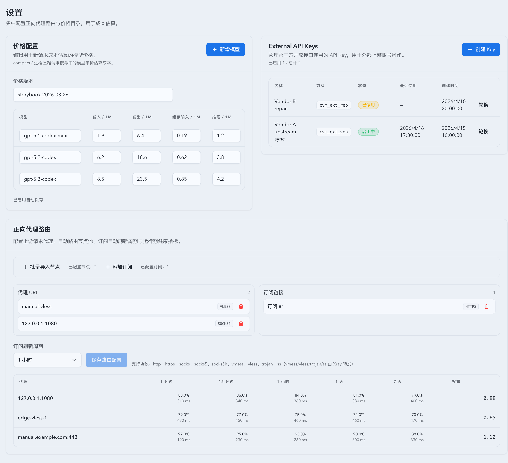

# 第三方上游账号开放 API 与 APIKey 管理（#q6mys）

## 状态

- Status: 待实现
- Created: 2026-04-17
- Last: 2026-04-17

## 背景 / 问题陈述

- 当前上游账号管理接口只面向站内 same-origin 写入，第三方号源无法稳定地批量填充、更新或修复 OAuth 上游账号。
- 运营需要为第三方发放可轮换、可停用的 APIKey，并在内部设置页里完成查看与管理。
- 现有 OAuth 导入、凭据加密、usage snapshot、账号同步与分组路由逻辑已经具备，需要在其外侧补一层第三方开放契约，而不是复制一套新运行时。

## 目标 / 非目标

### Goals

- 新增 `/api/external/v1` 命名空间，使用 `Authorization: Bearer <secret>` 做第三方鉴权。
- 新增 `external_api_keys` 数据模型与内部管理接口，支持创建、轮换、停用与最近使用时间记录。
- 为 `pool_upstream_accounts` 增加第三方来源映射，按 `external_client_id + external_source_account_id` 做账号归属与幂等 upsert。
- 开放三类 OAuth 账号能力：JSON upsert、metadata patch、上传新凭据修复 relogin。
- 在 Settings 页面增加 External API Keys 管理区块，并补齐 Storybook / Vitest / 视觉证据。

### Non-goals

- 不开放当前内部全部号池接口给第三方。
- 不做 APIKey 细粒度 scopes、IP 白名单、限流、webhook、批量文件导入协议。
- 不新增第三方 OAuth authUrl 会话式 relogin；重新登录固定为“上传新 OAuth 凭据修复”。
- 不扩展到 API Key 上游账号或其它非账号池模块。

## 范围（Scope）

### In scope

- 后端 external APIKey schema、鉴权、内部管理接口与 Web 管理页。
- `/api/external/v1/upstream-accounts/oauth/{sourceAccountId}` 的 `PUT / PATCH / POST relogin`。
- `pool_upstream_accounts` 第三方映射字段与唯一约束。
- Rust / Vitest / Storybook / 浏览器视觉证据与 PR-ready 文档收口。

### Out of scope

- 第三方批量 upsert 协议。
- 第三方可管理 API Key 上游账号。
- 第三方 scope 分权与审计报表。

## 需求（Requirements）

### MUST

- APIKey 明文只允许在创建/轮换响应里一次性回显，数据库只保存 hash 与 prefix。
- 旧 key 在轮换后立即失效，disabled / rotated key 不能继续调用外部接口。
- OAuth upsert 必须复用现有凭据规范化、加密、usage snapshot 与 sync 运行时。
- PATCH 仅更新 metadata，不覆盖未提供字段，不清空 OAuth 凭据。
- relogin 成功后必须更新加密凭据并触发一次修复同步。

### SHOULD

- 外部 key 轮换后保留稳定 `client_id`，确保 `external_client_id + sourceAccountId` 绑定不因轮换断链。
- External API 错误模型统一为 plain-text `401/403/404/409/422/5xx`，与现有 Axum 路由风格一致。

### COULD

- 后续在同一表上扩展 scopes、配额或 owner 标签。

## 功能与行为规格（Functional/Behavior Spec）

### Core flows

- 运营在 Settings -> External API Keys 创建 key，拿到一次性 secret 并发给第三方。
- 第三方使用 `PUT /api/external/v1/upstream-accounts/oauth/{sourceAccountId}` 上传结构化 OAuth JSON；首次创建账号，重复调用更新同一账号凭据与指定 metadata。
- 第三方使用 `PATCH` 更新 display name、group、note、enabled、tagIds、isMother 与组级设置，不影响既有 OAuth 密文。
- 第三方使用 `POST .../relogin` 上传新凭据修复 `needs_reauth` / manual recovery 账号，并触发同步。
- 内部可以随时轮换或停用 key；轮换保持同一 external client 身份，历史 secret 立即失效。

### Edge cases / errors

- 缺失 `Authorization`、非 Bearer、未知 key => `401`。
- 命中 disabled / rotated key => `403`。
- sourceAccountId 为空、OAuth JSON 缺字段或 `id_token` 无法解析出 account id => `400/422`。
- 第三方尝试操作未绑定到自身 `external_client_id` 的账号 => `404`。
- display name 冲突仍按现有唯一规则返回 `409`；若未显式提供 display name，则服务端使用 deterministic fallback 避免常见导入冲突。

## 接口契约（Interfaces & Contracts）

### 接口清单（Inventory）

| 接口（Name） | 类型（Kind） | 范围（Scope） | 变更（Change） | 契约文档（Contract Doc） | 负责人（Owner） | 使用方（Consumers） | 备注（Notes） |
| --- | --- | --- | --- | --- | --- | --- | --- |
| External API keys management | HTTP API | internal | New | ./contracts/http-apis.md | backend / web | settings | `/api/settings/external-api-keys` |
| External OAuth upstream accounts | HTTP API | external | New | ./contracts/http-apis.md | backend | third-party source provider | `/api/external/v1/upstream-accounts/oauth/*` |
| External API keys + upstream mapping schema | DB | internal | New / Modify | ./contracts/db.md | backend | sqlite runtime | 新表 + 账号映射列 |

### 契约文档（按 Kind 拆分）

- [contracts/README.md](./contracts/README.md)
- [contracts/http-apis.md](./contracts/http-apis.md)
- [contracts/db.md](./contracts/db.md)

## 验收标准（Acceptance Criteria）

- Given 外部请求未带 key、带未知 key、带 disabled/rotated key，When 访问 `/api/external/v1/...`，Then 分别返回一致的 `401` 或 `403`，且内部 same-origin 设置接口行为不变。
- Given 创建 external API key，When 查看数据库，Then 只存在 `secret_hash` 与 `secret_prefix`，不会落明文 secret。
- Given 同一 `external_client_id + sourceAccountId` 连续调用 `PUT`，When 第二次请求完成，Then 不会重复建号，而是更新同一账号。
- Given 两个不同 external client 使用相同 `sourceAccountId`，When 各自调用 `PUT`，Then 它们会绑定到不同账号，不会串号。
- Given 第三方调用 `PATCH` 只提交 metadata，When 请求成功，Then OAuth 凭据与未提供字段保持不变。
- Given 账号处于 `needs_reauth` 或 manual recovery，When 第三方调用 `POST .../relogin` 上传有效新凭据，Then 账号凭据被更新，且后续同步成功恢复。
- Given Settings 页面打开，When 运营创建、轮换、停用 key，Then 列表、确认对话框与一次性 secret 展示都可在 Storybook 与 Vitest 中复现。

## 实现前置条件（Definition of Ready / Preconditions）

- 对外路由命名空间、鉴权头、权限边界与 relogin 语义已锁定。
- `external_client_id + sourceAccountId` 作为第三方幂等主键已确认。
- 允许在 `external_api_keys` 中新增稳定 `client_id` 以承载 key 轮换后的归属连续性。

## 非功能性验收 / 质量门槛（Quality Gates）

### Testing

- Unit tests: external API key create / rotate / disable / auth；external OAuth upsert / patch / relogin helper。
- Integration tests: route-level 401/403/404/409 映射、同 client 幂等、跨 client 隔离、relogin 同步恢复。
- E2E tests (if applicable): none。

### UI / Storybook (if applicable)

- Stories to add/update: `web/src/components/SettingsPage.stories.tsx`
- Docs pages / state galleries to add/update: Settings page autodocs gallery for external API keys states
- `play` / interaction coverage to add/update: create secret reveal、rotate confirm、disable confirm
- Visual regression baseline changes (if any): none

### Quality checks

- `cargo fmt`
- `cargo check`
- `cargo test`
- `cd web && bun run test`
- `cd web && bun run build`
- `cd web && bun run build-storybook`

## 文档更新（Docs to Update）

- `docs/specs/README.md`: 增加 spec 索引行
- `docs/specs/q6mys-external-upstream-api-keys/contracts/http-apis.md`: 记录开放接口与内部管理接口
- `docs/specs/q6mys-external-upstream-api-keys/contracts/db.md`: 记录 schema 变更与 rollout

## 计划资产（Plan assets）

- Directory: `docs/specs/q6mys-external-upstream-api-keys/assets/`
- In-plan references: ``
- Visual evidence source: maintain `## Visual Evidence` in this spec when owner-facing or PR-facing screenshots are needed.

## Visual Evidence

PR: include

## 资产晋升（Asset promotion）

None

## 实现里程碑（Milestones / Delivery checklist）

- [ ] M1: 新增 external APIKey schema、鉴权与内部管理接口。
- [ ] M2: 完成 external OAuth upsert / patch / relogin 与账号映射持久化。
- [ ] M3: 完成 Settings 管理页、API client、hook、i18n 与 Storybook 覆盖。
- [ ] M4: 完成 Rust / Vitest / Storybook / 浏览器验证与视觉证据归档。

## 方案概述（Approach, high-level）

- 复用现有 OAuth 导入标准化与 probe 逻辑，把结构化 JSON 请求转换成现有 imported-oauth 规范化输入。
- external APIKey 与账号映射只补充外层“身份与归属”，不复制内部账号同步逻辑。
- Web 端采用单独 `/api/settings/external-api-keys` hook，避免把现有 `/api/settings` payload 再次膨胀。

## 风险 / 开放问题 / 假设（Risks, Open Questions, Assumptions）

- 风险：display name 仍受全局唯一约束；若第三方未显式提供名称，服务端需要 deterministic fallback 才能减少冲突。
- 风险：node-shunt 分组导入要复用现有 provisioning scope 逻辑，否则可能打破同组节点隔离。
- 假设：当前 third-party source 只需要 OAuth 账号，不需要 API Key 账号与批量协议。

## 变更记录（Change log）

- 2026-04-17: 建立 external upstream accounts + API keys 的实现规格与 HTTP/DB contract。

## 参考（References）

- `docs/specs/cgz7s-oauth-token-json-import/SPEC.md`
- `docs/specs/v6epa-api-key-upstream-base-url/SPEC.md`
