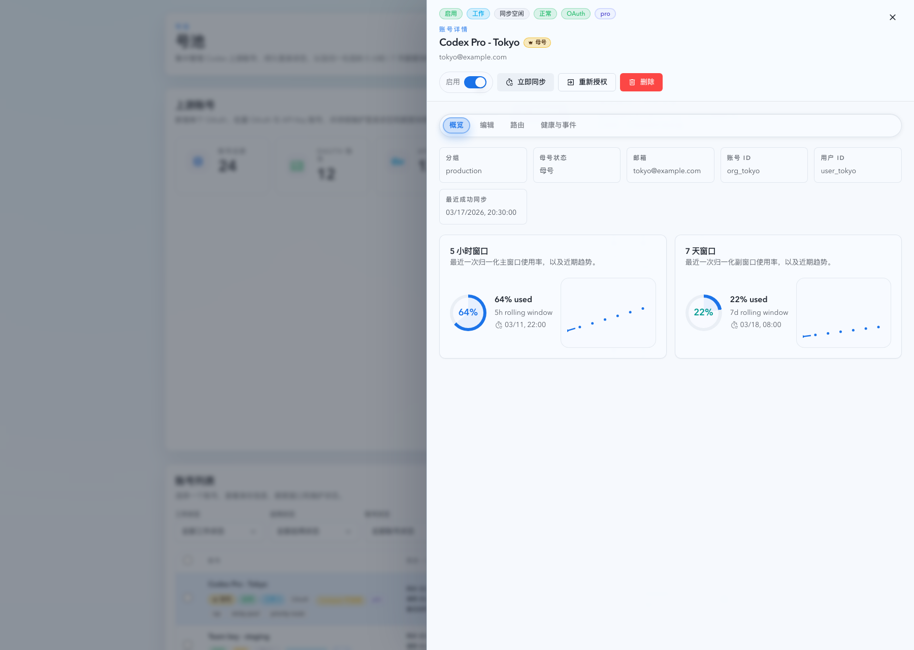
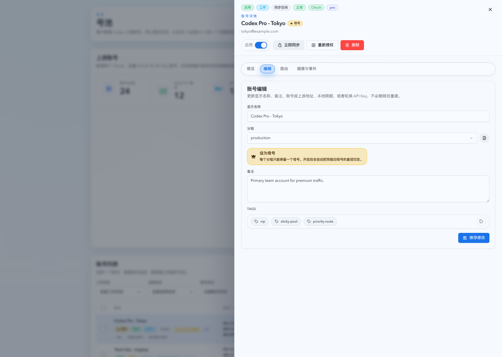
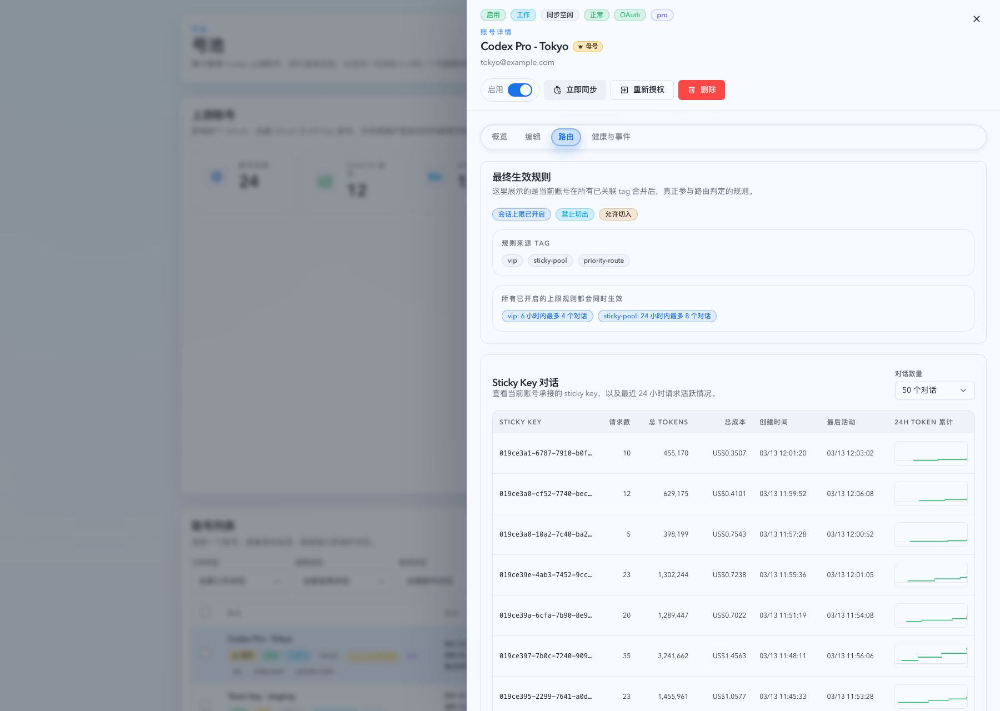
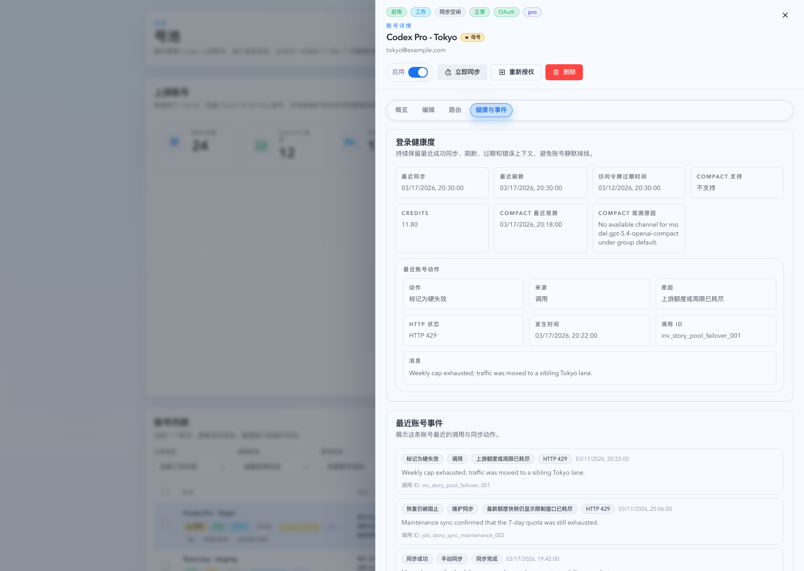
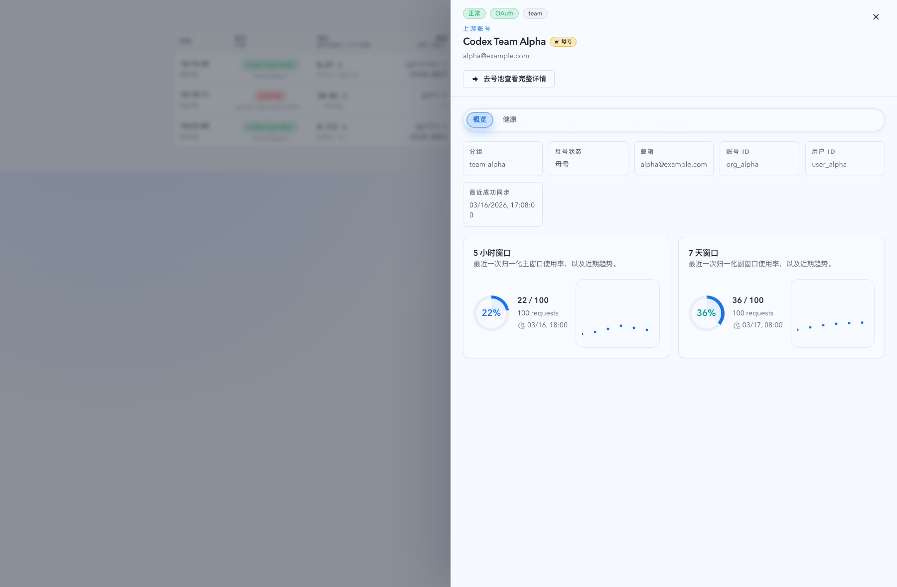
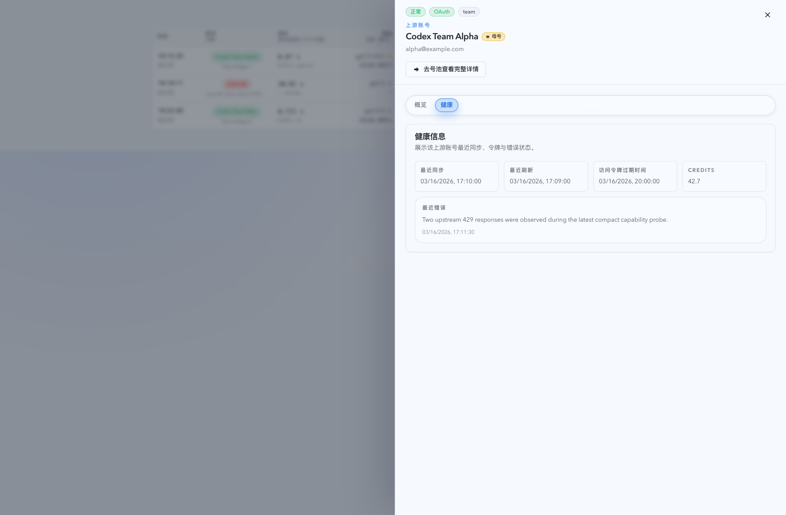

# 账号详情抽屉统一关闭语义与 Tabs 分组（#qdyfv）

## 状态

- Status: 已实现，待截图提交授权
- Created: 2026-03-25
- Last: 2026-03-25

## 背景 / 问题陈述

- 当前号池页 `UpstreamAccounts` 与监控页 `InvocationAccountDetailDrawer` 的账号详情抽屉拥有两套不同的壳层交互：前者只依赖遮罩点击关闭，后者同时支持外层 gutter 点击关闭，用户在两个页面之间切换时关闭语义不一致。
- 号池详情抽屉把概览、编辑、配额、路由、健康与事件全部堆在一个长滚动面板中，信息密度过高，定位某一类内容的成本很高。
- Invocation 只读抽屉虽然内容更少，但同样把概览、额度和健康信息一次性铺开，不利于和号池页形成统一的账号详情阅读模型。

## 目标 / 非目标

### Goals

- 统一两套账号详情抽屉的关闭语义：点击遮罩或抽屉外部 gutter 关闭，点击抽屉内部不关闭。
- 为号池详情抽屉引入固定摘要头与 tabs 内容区，默认使用 `概览` 页签，并在账号切换或抽屉重新打开后复位。
- 为 Invocation 只读账号抽屉引入同样的 tabs 心智模型，同时保持“只读 + 跳号池页”边界不变。
- 把这一轮 UX 收敛记录为新的独立 spec，并在本 spec 下维护最终的视觉证据。

### Non-goals

- 不改动任何后端 API、SQLite schema、hook 返回字段或状态机语义。
- 不把 Invocation 抽屉扩展成可编辑版本。
- 不修改号池创建页、其它非账号详情抽屉、或引入新的 tabs 依赖库。

## 范围（Scope）

### In scope

- 提取共享账号详情抽屉壳层，承接 `open/title/subtitle/closeDisabled/onClose/onPortalContainerChange` 与 drawer subtree overlay host 语义。
- 号池页详情抽屉固定保留顶部 badges、账号名、身份副标题与操作按钮，并将正文拆成 `概览` / `编辑` / `路由` / `健康与事件` 四个 tab panel，其中额度卡并入 `概览`。
- Invocation 只读详情抽屉固定保留顶部 badges、账号名、身份副标题与“去号池查看完整详情”入口，并将正文拆成 `概览` / `健康` 两个 tab panel，其中额度卡并入 `概览`。
- 更新相关 i18n、Storybook stories、Vitest 覆盖与视觉证据。

### Out of scope

- 把共享抽屉壳迁移到 Radix `Dialog` 或引入新的 `Tabs` primitive。
- 新增视觉设计主题、重排号池列表、或改变既有 delete/tag/group-note overlay 的业务行为。
- 修改已完成 spec `g4ek6-account-pool-upstream-accounts` 与 `7n2ex-invocation-account-latency-drawer` 的主体叙述，只在本 spec 中引用它们作为背景来源。

## 需求（Requirements）

### MUST

- 两套账号详情抽屉都必须支持：点击遮罩关闭、点击外层 gutter 关闭、点击抽屉内部不关闭、按 `Escape` 关闭。
- 号池详情抽屉只有在现有 `delete` 提交中的 `closeDisabled` 场景下，才允许暂时锁住关闭；其它 busy 状态仍必须可关闭。
- 两套抽屉都必须使用现有 `SegmentedControl` family 渲染 tabs，并补齐 `role="tablist" / "tab" / "tabpanel"` 与 `aria-selected` / `aria-controls` / `aria-labelledby`。
- 号池抽屉默认打开 `概览`，切换账号或关闭后重新打开时都必须复位到 `概览`。
- Invocation 抽屉默认打开 `概览`，切换账号或关闭后重新打开时都必须复位到 `概览`。
- 号池抽屉内容分组必须满足：
  - `概览`：duplicate warning + metric grid + 5h/7d usage
  - `编辑`：editable profile card
  - `路由`：effective routing rule + sticky conversations
  - `健康与事件`：health card + latest action + recent actions
- Invocation 抽屉内容分组必须满足：
  - `概览`：duplicate warning + metric grid + 5h/7d usage
  - `健康`：health card + last error
- delete confirm、tag picker 与 group-note dialog 仍必须挂载在抽屉 dialog subtree 内，不得因共享壳层提取而掉回 `document.body` 顶层。

### SHOULD

- 共享抽屉壳层应尽量复用既有 header/body 样式 class，避免引入第二套 drawer token。
- 两套抽屉的 tabs 标题与内容节奏应尽量保持一致的阅读顺序，降低跨页面认知切换成本。

### COULD

- 若实现时发现公用摘要头可再抽轻量 helper，可在不扩大业务边界的前提下顺手共用。

## 功能与行为规格（Functional/Behavior Spec）

### Core flows

- 用户在号池页打开号池账号详情时，顶部摘要头保持固定，正文区域通过 tabs 在不同内容分区之间切换。
- 用户在 Dashboard / Live / Records 中打开只读账号详情时，抽屉沿用相同的关闭手势与 tabs 阅读模型，但不出现编辑/删除/启停入口。
- 用户点击抽屉外部空白 gutter 时，交互效果与点击遮罩一致，抽屉立即关闭。
- 用户切到另一个账号后，即使抽屉未关闭，当前激活 tab 也会复位到 `概览`，确保新的账号详情从摘要开始阅读。

### Edge cases / errors

- 号池页删除确认打开时，点击确认气泡内部、tag picker、group-note dialog 或其它 drawer-subtree overlay 不得触发外层关闭。
- Invocation 抽屉详情加载失败时，tabs 仍保留只读分组结构；错误内容继续只显示在抽屉内部，不污染页面公共错误区。
- 没有 history 或 recent actions 时，对应 tab panel 继续显示既有 empty state，不新增新的降级分支。

## 接口契约（Interfaces & Contracts）

### 接口清单（Inventory）

| 接口（Name） | 类型（Kind） | 范围（Scope） | 变更（Change） | 契约文档（Contract Doc） | 负责人（Owner） | 使用方（Consumers） | 备注（Notes） |
| --- | --- | --- | --- | --- | --- | --- | --- |
| `/api/pool/upstream-accounts/:id` | HTTP API | internal | Reuse | None | backend | account pool + invocation drawers | 只调整前端展示分组 |
| `UpstreamAccountDetail` | TS type | internal | Reuse | None | backend + web | account detail drawers | 不改字段形状 |

### 契约文档（按 Kind 拆分）

- None

## 验收标准（Acceptance Criteria）

- Given 号池详情抽屉已打开，When 用户点击遮罩或抽屉外部 gutter，Then 抽屉立即关闭。
- Given 号池详情抽屉已打开且用户点击 tab、表单字段、tag picker、group-note dialog 或删除确认气泡，When 交互发生，Then 抽屉保持打开。
- Given 号池详情抽屉处于 `save/sync/toggle/relogin` busy 状态，When 用户点击遮罩、gutter 或按下 `Escape`，Then 抽屉仍允许关闭。
- Given 号池详情抽屉处于 `delete` 提交中的 `closeDisabled` 状态，When 用户点击遮罩、gutter 或按下 `Escape`，Then 抽屉保持打开。
- Given 号池详情抽屉打开后切到 `健康与事件`，When 用户切换到另一个账号或关闭后重新打开，Then 激活 tab 复位到 `概览`。
- Given Invocation 只读抽屉打开后切到 `健康`，When 用户切换到另一条记录的账号或关闭后重新打开，Then 激活 tab 复位到 `概览`。
- Given Invocation 只读抽屉已打开，When 用户点击“去号池查看完整详情”，Then 仍能进入号池页并打开对应账号详情。
- Given Storybook `Account Pool / Pages / Upstream Accounts / Overlays / Detail Drawer` 与 `Monitoring / InvocationTable / AccountDrawer`，When 查看 docs/canvas，Then 能明确看到 tabs 分组后的稳定状态并可作为视觉证据。

## 实现前置条件（Definition of Ready / Preconditions）

- 目标、范围、交互边界与 tab taxonomy 已冻结
- 共享抽屉壳层仍需保留 overlay host subtree 语义，已在本 spec 中明确
- 接口契约保持 `Reuse / None`，实现不需要等待后端变更
- Storybook 作为主要视觉证据来源的路径已明确

## 非功能性验收 / 质量门槛（Quality Gates）

### Testing

- Unit tests: 账号详情抽屉关闭语义、tabs 复位语义、overlay subtree 挂载回归
- Integration tests: `UpstreamAccounts.test.tsx`、相关 invocation drawer tests
- E2E tests (if applicable): 无新增专属 E2E，沿用现有 smoke 范围

### UI / Storybook (if applicable)

- Stories to add/update: `web/src/components/UpstreamAccountsPage.overlays.stories.tsx`、`web/src/components/InvocationTable.stories.tsx`
- Docs pages / state galleries to add/update: 复用现有 autodocs/canvas，不新增独立 MDX
- `play` / interaction coverage to add/update: 抽屉打开、tab 切换、目的页跳转
- Visual regression baseline changes (if any): 号池详情抽屉 tabs 状态、Invocation 只读抽屉 tabs 状态

### Quality checks

- `cd web && bun run test -- src/pages/account-pool/UpstreamAccounts.test.tsx`
- `cd web && bun run test -- src/components/InvocationTable.test.tsx`
- `cd web && bun run build`

## 文档更新（Docs to Update）

- `docs/specs/README.md`: 新增本 spec 索引
- `docs/specs/qdyfv-account-detail-drawer-tabs/SPEC.md`: 维护范围、验收与视觉证据

## 计划资产（Plan assets）

- Directory: `docs/specs/qdyfv-account-detail-drawer-tabs/assets/`
- In-plan references: ``
- PR visual evidence source: maintain `## Visual Evidence (PR)` in this spec when PR screenshots are needed.

## Visual Evidence (PR)

- source_type: `storybook_canvas`
- target_program: `mock-only`
- capture_scope: `browser-viewport`
- sensitive_exclusion: `N/A`
- submission_gate: `pending-owner-approval`
- story_id_or_title: `Account Pool/Pages/Upstream Accounts/Overlays/Detail Drawer`
- state: `overview tab / shared shell + fixed summary header`
- evidence_note: `验证号池账号详情抽屉在共享 shell 下保留固定摘要头，并把身份摘要与 5 小时 / 7 天额度卡一起收敛到“概览” tab。`

- source_type: `storybook_canvas`
- target_program: `mock-only`
- capture_scope: `browser-viewport`
- sensitive_exclusion: `N/A`
- submission_gate: `pending-owner-approval`
- story_id_or_title: `Account Pool/Pages/Upstream Accounts/Overlays/Detail Drawer`
- state: `edit tab / editable profile + tags`
- evidence_note: `验证号池账号详情抽屉把可编辑资料、备注与 tags 集中放入“编辑” tab，固定头部与操作区不会随着正文切换而丢失。`

- source_type: `storybook_canvas`
- target_program: `mock-only`
- capture_scope: `browser-viewport`
- sensitive_exclusion: `N/A`
- submission_gate: `pending-owner-approval`
- story_id_or_title: `Account Pool/Pages/Upstream Accounts/Overlays/Detail Drawer`
- state: `routing tab / effective rule + sticky conversations`
- evidence_note: `验证号池账号详情抽屉把最终生效规则与 sticky conversation 路由结果迁入“路由” tab，并使用充足 mock 数据展示非空状态。`

- source_type: `storybook_canvas`
- target_program: `mock-only`
- capture_scope: `browser-viewport`
- sensitive_exclusion: `N/A`
- submission_gate: `pending-owner-approval`
- story_id_or_title: `Account Pool/Pages/Upstream Accounts/Overlays/Detail Drawer`
- state: `health & events tab / grouped long-form maintenance content`
- evidence_note: `验证号池账号详情抽屉把登录健康度、最近动作与最近账号事件迁入“健康与事件” tab，避免单页超长滚动。`

- source_type: `storybook_canvas`
- target_program: `mock-only`
- capture_scope: `browser-viewport`
- sensitive_exclusion: `N/A`
- submission_gate: `pending-owner-approval`
- story_id_or_title: `Monitoring/InvocationTable/AccountDrawer`
- state: `overview tab / read-only drawer grouped with account-pool deep-link CTA`
- evidence_note: `验证 Invocation 只读账号抽屉复用同一关闭语义与 tabs 框架，同时把 5 小时 / 7 天窗口并入“概览” tab。`

- source_type: `storybook_canvas`
- target_program: `mock-only`
- capture_scope: `browser-viewport`
- sensitive_exclusion: `N/A`
- submission_gate: `pending-owner-approval`
- story_id_or_title: `Monitoring/InvocationTable/AccountDrawer`
- state: `health tab / read-only health + last error`
- evidence_note: `验证 Invocation 只读账号抽屉把健康度、最近错误与额度摘要集中到“健康” tab，并使用非空 mock 数据呈现稳定状态。`

## 资产晋升（Asset promotion）

None

## 实现里程碑（Milestones / Delivery checklist）

- [x] M1: 新建 spec、索引与视觉证据落点
- [x] M2: 提取共享账号详情抽屉壳层并完成两套抽屉 tabs 重构
- [x] M3: 补齐 Vitest 与 Storybook 覆盖
- [ ] M4: 完成视觉证据提交授权、PR 收敛与 merge-ready 交付

## 方案概述（Approach, high-level）

- 以共享 drawer shell 统一关闭手势、scroll lock 与 overlay host 容器，不改变具体业务按钮与卡片内容。
- tabs 只做展示分组与 a11y 语义补强，不引入新的状态源；默认 tab 由抽屉内部局部状态维护，并在关键切换点复位。
- Storybook 继续作为稳定视觉基线，使用 mock-only 渲染完成验收截图。

## 风险 / 开放问题 / 假设（Risks, Open Questions, Assumptions）

- 风险：若共享壳层提取处理不当，可能破坏 delete confirm 或 tag picker 的 portal container 归属。
- 风险：号池抽屉内容块重排后，现有测试选择器可能需要同步更新。
- 需要决策的问题：None
- 假设（需主人确认）：None

## 变更记录（Change log）

- 2026-03-25: 创建 spec，冻结共享抽屉壳层、tabs taxonomy、视觉证据与 fast-track merge-ready 收口标准。
- 2026-03-25: 完成共享 drawer shell、号池详情 tabs、Invocation 只读详情 tabs、i18n、Vitest 与 Storybook 覆盖；本地定向 `vitest` 与 `web build` 已通过，并根据最新反馈把配额卡并回概览页签，等待重新抓取 mock-only 视觉证据。
- 2026-03-25: 已按最新反馈重拍 mock-only 视觉证据，当前等待截图提交授权后再继续 push / PR 收敛。

## 参考（References）

- `docs/specs/g4ek6-account-pool-upstream-accounts/SPEC.md`
- `docs/specs/7n2ex-invocation-account-latency-drawer/SPEC.md`
- `docs/specs/h5k2r-segmented-control-family/SPEC.md`
