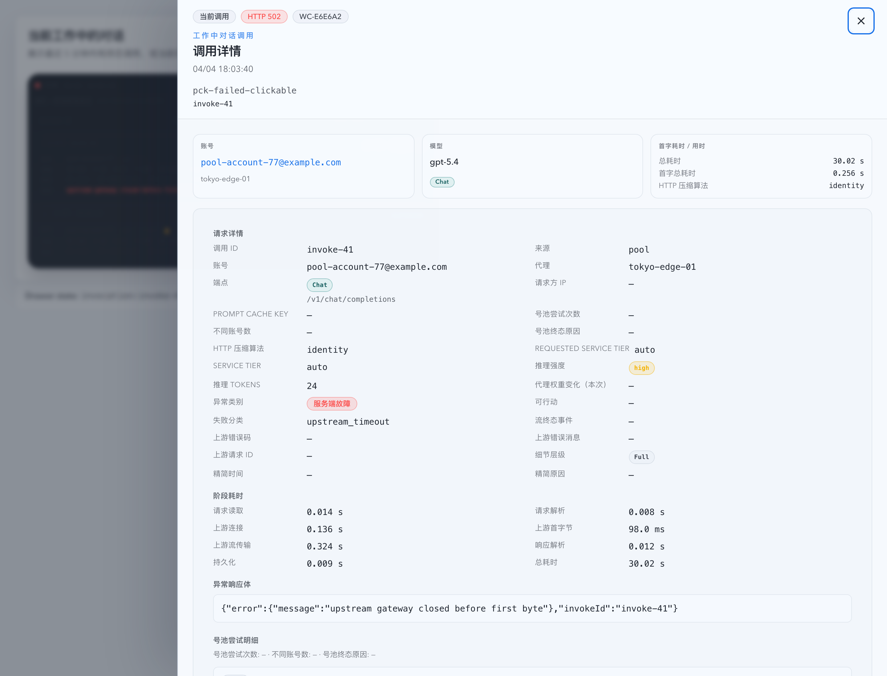
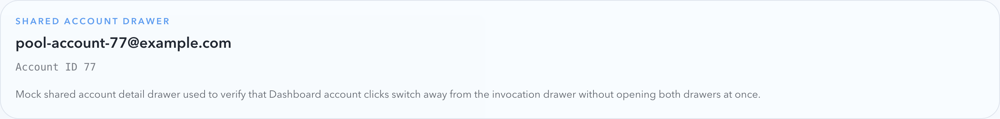

# Dashboard 工作中对话调用详情抽屉（#r4m6v）

## 状态

- Status: 已完成（4/4）
- Created: 2026-04-06
- Last: 2026-04-06

## 背景 / 问题陈述

- Dashboard 的“当前工作中的对话”卡片已经把当前调用和上一条调用压缩成双槽位摘要，但用户仍然只能看到有限字段，无法在当前页直接深入查看调用细节。
- 现有共享上游账号抽屉已经覆盖账号详情阅读模型，不过工作中对话卡片里的调用槽本身还不能点击，导致用户需要跳去其它页面才能查看同一条调用的完整诊断信息。
- 账号文本已经是高频入口；本轮需要保证它继续作为独立优先级更高的交互，不能因为新增“调用槽可点”而丢失“直接看账号详情”的能力。

## 目标 / 非目标

### Goals

- 让 Dashboard 工作中对话卡片的“当前调用 / 上一条调用”真实槽位都可点击，并在当前页右侧打开调用详情抽屉。
- 调用详情抽屉使用现有 `/api/invocations?requestId=<invokeId>` 精确查 full record，再复用既有 invocation detail、异常 response body 与 pool attempts 语义。
- 保持账号点击的高优先级：如果槽位内账号有值，点击账号时不打开调用抽屉，而是直接切换到共享上游账号抽屉。
- Dashboard 页同一时刻只允许存在一个右侧抽屉；账号抽屉与调用抽屉之间采用单抽屉交替语义。
- 补齐 Storybook、Vitest、spec `## Visual Evidence`，并按 fast-track 收敛到 PR ready。

### Non-goals

- 不改 Live 页 Prompt Cache 对话表与既有调用历史抽屉交互。
- 不改 `/records` 页现有完整详情抽屉或其 URL / query 结构。
- 不新增后端接口、数据库 schema 或新的路由级详情页。
- 不把调用详情抽屉状态持久化到 URL。

## 范围（Scope）

### In scope

- `web/src/pages/Dashboard.tsx`：持有页面级 `selectedInvocation` 状态，并与共享账号抽屉实现单右抽屉交替。
- `web/src/components/DashboardWorkingConversationsSection.tsx`：为当前 / 上一条真实调用槽增加点击与键盘打开能力，同时保持账号按钮阻断冒泡。
- `web/src/components/DashboardInvocationDetailDrawer.tsx`：新增 Dashboard 专用调用详情抽屉，复用现有 invocation detail shared 语义。
- `web/src/lib/dashboardWorkingConversations.ts`：补充 Dashboard 选择态数据结构，承接调用槽打开抽屉所需的完整 payload。
- `web/src/i18n/translations.ts`、相关 Vitest、Storybook stories：补齐抽屉文案、回归与可截图入口。
- `docs/specs/README.md` 与本 spec：登记需求、验证与视觉证据。

### Out of scope

- `web/src/pages/Live.tsx`、`web/src/components/PromptCacheConversationTable.tsx` 与 `web/src/components/InvocationRecordsTable.tsx` 的既有交互。
- 共享上游账号抽屉本身的字段、Tabs 结构或 API 契约。
- Dashboard 其它卡片、热力图或统计概览的视觉重排。

## 需求（Requirements）

### MUST

- 真实调用槽位必须可点击，并支持键盘 `Enter / Space` 打开调用详情抽屉。
- 占位槽必须保持不可点击，也不得拥有伪按钮语义。
- 点击槽位内账号文本时，必须阻断槽位打开逻辑，直接打开共享上游账号抽屉。
- Dashboard 调用详情抽屉必须先按 `requestId=invokeId` 精确加载 full record；若查不到记录或请求失败，错误 / 空态只显示在抽屉内部。
- 调用详情抽屉正文必须复用既有 invocation detail shared 语义：账号 / 代理 / 接口 / 时延 / HTTP 压缩 / 阶段耗时 / pool attempts 口径保持一致。
- 对异常记录，调用详情抽屉必须继续按需拉 `detail` 与 `response-body`，显示异常响应体。
- 页面同一时刻只允许一个右侧抽屉；打开账号抽屉时关闭调用抽屉，打开调用抽屉时关闭账号抽屉。

### SHOULD

- 抽屉 header 应稳定标识槽位来源、状态、对话序列号、发生时间、Prompt Cache Key 与 `invokeId`。
- Dashboard 页层协调应尽量复用现有共享账号抽屉关闭 / 替换语义，不额外引入新的全局状态源。
- Storybook 入口应使用 mock-only 请求拦截，避免依赖真实服务。

### COULD

- 后续可复用同一抽屉实现到其它 summary card surface（本轮不做）。

## 功能与行为规格（Functional/Behavior Spec）

### Core flows

- 用户点击 Dashboard 卡片中的“当前调用”或“上一条调用”槽位时，当前页右侧打开调用详情抽屉，并显示该调用的完整详情。
- 用户点击卡片槽位内的账号文本时，当前页直接打开共享上游账号抽屉；如果调用抽屉已打开，则先关闭调用抽屉再切换到账号抽屉。
- 用户在调用详情抽屉内点击账号入口时，交互语义与卡片内账号点击一致：调用抽屉关闭，共享账号抽屉打开。
- 用户关闭任一抽屉后，Dashboard 主体状态、排序和卡片布局保持不变。

### Edge cases / errors

- 若 `requestId` 精确查询返回 0 条记录，抽屉显示空态而不是页面公共错误。
- 若 full record 请求失败，抽屉显示错误态，但 Dashboard 卡片区继续保持原样。
- 若调用是成功 / 进行中记录，则调用详情抽屉不额外拉异常响应体接口。
- 若调用是 pool route，则调用详情抽屉继续惰性加载该 `invokeId` 的 pool attempts。

## 接口契约（Interfaces & Contracts）

### 接口清单（Inventory）

| 接口（Name） | 类型（Kind） | 范围（Scope） | 变更（Change） | 契约文档（Contract Doc） | 负责人（Owner） | 使用方（Consumers） | 备注（Notes） |
| --- | --- | --- | --- | --- | --- | --- | --- |
| `GET /api/invocations?requestId=<invokeId>` | HTTP API | internal | Reuse | None | backend | dashboard invocation drawer | 精确回查 full record |
| `GET /api/invocations/:id/detail` | HTTP API | internal | Reuse | None | backend | dashboard invocation drawer | 仅异常记录按需读取 |
| `GET /api/invocations/:id/response-body` | HTTP API | internal | Reuse | None | backend | dashboard invocation drawer | 仅异常记录按需读取 |
| `GET /api/invocations/:invokeId/pool-attempts` | HTTP API | internal | Reuse | None | backend | dashboard invocation drawer | 复用 shared pool attempts |
| `/api/pool/upstream-accounts/:id` | HTTP API | internal | Reuse | None | backend | shared account drawer | 账号点击继续走共享抽屉 |

### 契约文档（按 Kind 拆分）

- None

## 验收标准（Acceptance Criteria）

- Given Dashboard 工作中对话卡片存在真实调用槽位，When 用户点击“当前调用”或“上一条调用”，Then 当前页右侧打开调用详情抽屉，且 header 能稳定显示槽位来源、状态、对话序列号、时间、Prompt Cache Key 与 `invokeId`。
- Given 某个槽位中账号有值，When 用户点击账号文本，Then 不会先闪开调用抽屉，而是直接切到共享账号抽屉，并保持页面同一时刻只有一个右侧抽屉。
- Given 调用详情抽屉打开，When 当前调用是异常记录，Then 抽屉继续显示异常响应体与结构化诊断信息；When 当前调用不是异常记录，Then 不会额外请求异常正文。
- Given `requestId` 查不到 full record 或请求失败，When 调用详情抽屉渲染，Then 错误 / 空态只留在抽屉内部，不污染 Dashboard 主体区。
- Given 某张卡片只有当前调用，When 渲染上一条占位槽，Then 该占位槽不可点击、不可键盘打开，且卡片高度保持稳定。

## 实现前置条件（Definition of Ready / Preconditions）

- `w3t3w` 已经把 Dashboard 工作中对话收敛为稳定卡片与双槽调用摘要。
- `3gvtt` 已经证明 `requestId=invokeId` 精确查询和异常响应体抽屉链路可复用。
- `qdyfv` / `t9wwm` 已经冻结共享账号抽屉语义，Dashboard 页可以直接复用现有 route-driven 账号详情抽屉。

## 非功能性验收 / 质量门槛（Quality Gates）

### Testing

- `cd web && bunx vitest run src/components/DashboardWorkingConversationsSection.test.tsx src/components/DashboardInvocationDetailDrawer.test.tsx src/pages/Dashboard.test.tsx`
- `cd web && bun run build`
- `cd web && bun run storybook:build`

### UI / Storybook (if applicable)

- Stories to add/update: `web/src/components/DashboardWorkingConversationsSection.stories.tsx`
- `play` / interaction coverage to add/update: 调用槽打开抽屉、账号点击切换账号抽屉、调用抽屉内账号再切换
- Visual regression baseline changes (if any): Dashboard 调用详情抽屉打开态、账号点击优先切换语义

### Quality checks

- `cd web && bunx vitest run`
- `cd web && bun run build`
- `cd web && bun run storybook:build`

## 文档更新（Docs to Update）

- `docs/specs/README.md`
- `docs/specs/r4m6v-dashboard-working-conversations-invocation-drawer/SPEC.md`

## 计划资产（Plan assets）

- Directory: `docs/specs/r4m6v-dashboard-working-conversations-invocation-drawer/assets/`
- In-plan references: ``

## Visual Evidence

- Storybook Canvas `dashboard-workingconversationssection--invocation-drawer-open`，视口 `1440x1100`，验证 Dashboard 工作中对话卡片的调用槽会打开调用详情抽屉，并显示槽位来源、状态、序列号、Prompt Cache Key、`invokeId` 与完整详情内容。

  

- Storybook Canvas `dashboard-workingconversationssection--failed-with-clickable-account`，元素级截图，验证点击账号后会切换到共享账号抽屉语义，而不是与调用抽屉并存。

  

## 实现里程碑（Milestones / Delivery checklist）

- [x] M1: 新建增量 spec 并登记 `docs/specs/README.md`。
- [x] M2: Dashboard 页接入 `selectedInvocation` 与单抽屉交替语义。
- [x] M3: 新增 Dashboard 调用详情抽屉，并补齐 Vitest / Storybook 覆盖。
- [x] M4: 生成视觉证据并按 fast-track 收敛到 PR ready。

## 方案概述（Approach, high-level）

- Dashboard 页层持有调用抽屉选择态，与现有 `upstreamAccountId` 共同组成单抽屉交替协调层。
- 调用槽位使用 `role="button"` + 键盘事件而不是原生 `<button>`，从而允许槽位内部账号按钮保持合法、可聚焦且可阻断冒泡。
- Dashboard 调用详情抽屉只负责“按 `invokeId` 回查 full record + 复用 shared detail renderer”，避免复制 records 页的完整实现或新增后端契约。
- Storybook 使用 mock-only fetch 拦截稳定复现调用抽屉和账号切换，不依赖真实后端或真实账号数据。

## 风险 / 开放问题 / 假设（Risks, Open Questions, Assumptions）

- 风险：若 Dashboard 页层没有统一协调抽屉状态，账号点击与调用槽点击容易出现两个右侧抽屉同时存在的冲突。
- 风险：调用详情抽屉若直接依赖 preview record 而不回查 full record，会缺失异常正文、pool attempts 或完整 timing 字段。
- 假设：`invokeId` 继续是 Dashboard 工作中对话卡片里单次调用的稳定主键，足以驱动抽屉精确回查。
- 假设：共享账号抽屉的现有只读体验已经满足 Dashboard 入口的需求，本轮不需要新增 Dashboard 专用账号详情变体。

## 变更记录（Change log）

- 2026-04-06: 创建增量 spec，冻结 Dashboard 工作中对话卡片的调用详情抽屉、账号点击优先级与单抽屉交替边界。
- 2026-04-06: 完成 Dashboard 页层抽屉协调、调用详情抽屉、Vitest、Storybook 入口与视觉证据落盘；截图提交已获授权，交付收敛到 PR ready。

## 参考（References）

- `docs/specs/w3t3w-dashboard-working-conversations-cards/SPEC.md`
- `docs/specs/3gvtt-records-request-id-response-details/SPEC.md`
- `docs/specs/qdyfv-account-detail-drawer-tabs/SPEC.md`
- `docs/specs/t9wwm-upstream-account-detail-url-state/SPEC.md`
- `web/src/pages/Dashboard.tsx`
- `web/src/components/DashboardWorkingConversationsSection.tsx`
- `web/src/components/DashboardInvocationDetailDrawer.tsx`
